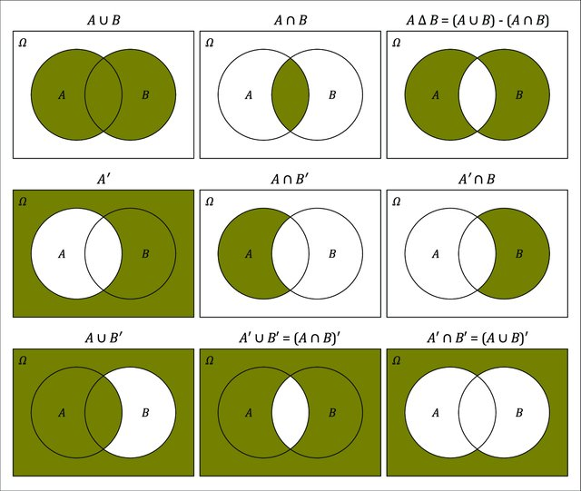
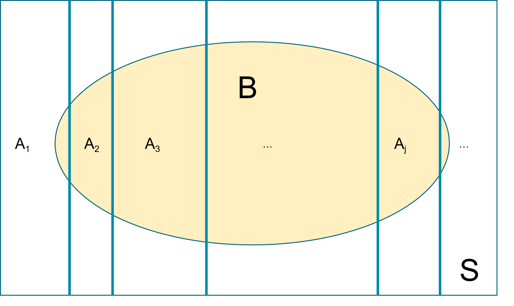
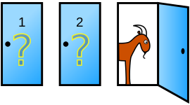

# Probability, random variables and distributions {#prob}

::: {.chapterintro data-latex=""}

- Review of probability terminologies, probability rules, and Venn Diagrams
- Review conditional probability, independence, and Bayes' theorem. 
- Review on random variables and common probability distributions
Probability Terminology
:::

<script src="hideOutput.js"></script>

```{r, echo = FALSE, message=FALSE, warning=FALSE}
# Every chapter, we will load all the library we will use at the beginning
# of the chapter. 
library(tidyverse)
library(VennDiagram)
library(gganimate)
library(tweenr)
library(ggpubr)
options(scipen = 999)
```


</br>


## Probability

**Probability has a central place in Bayesian analysis**

- we put a prior probability distribution on the unknowns (parameters),
- we model the observed data with a probability distribution (likelihood),
- and we combine the two into a posterior probability distribution


::: {.important data-latex=""}
**Probability Terminology**[@evans2004probability]

- **Sample space** This set of all possible
outcomes of an experiment/trial is known as the sample space of the experiment/trial and is denoted by $S$ or $\Omega$.

- **Experiment/Trial**: each occasion we observe a random phenomenon that we know what outcomes can occur, but we do not know which outcome will occur

- **Event**: Any subset of the sample space $S$ is known as an event, denoted by $A$. Note that, $A$ is also a collection of one or more outcomes. 

- **Probability defined on events**: For each event $A$ of the sample space $S$, $P(A)$, the probability of the event $A$, satisfies the following three conditions:
    a. $0 \leq P(A) \leq 1$
    b. $P(S) = 1$ and $P(\emptyset) = 0$; $\emptyset$ denotes the empty set
    c. $P$ is (countably) additive, meaning that if $A_1, A_2, \ldots$ is a finite or countable sequence of disjoint (also known as mutually exclusive events), then
    \[P(A_1 \cup A_2 \cup \ldots ) = P(A_1)+P(A_2)+\ldots \]
    
- **Union:** Denote the event that either $A$ or $B$ occurs as $A\cup B$.

- **Intersection:** Denote the event that **both** $A$ and $B$ occur as $A\cap B$

- **Complement:** Denote the event that $A$ does not occur as $\bar{A}$ or $A^{C}$ or $A^\prime$ (different people use different notations)

- **Disjoint** (or **mutually exclusive**): Two events $A$ and $B$ are said to be **disjoint** if the occurrence of one event precludes the occurrence of the other. *If two events are mutually exclusive, then* $P(A\cup B)=P(A)+P(B)$


:::

::: {.workedexample data-latex=""}

**Sample Space**

1. If the experiment consists of the flipping of a coin, then \[ S = \{H, T\}\]
2. If the experiment consists of rolling a die, then the sample space is \[ S = \{1, 2, 3, 4, 5, 6\}\]
3. If the experiments consists of flipping two coins, then the sample space consists of the following four points:
\[ S = \{(H,H), (H,T), (T,H), (T,T)\}\]

**Event**

1. In Example (1), if E = {H}, then E is the event that a head appears on the flip of the coin. Similarly, if $E = \{T \}$, then $E$ would be the event that a tail appears
2. In Example (2), if $E = \{1\}$, then $E$ is the event that one appears on the roll of the die. If $E = \{2, 4, 6\}$, then $E$ would be the event that an even number appears on the roll.
3. In Example (3), if $E = \{(H, H), (H, T )\}$, then $E$ is the event that a head appears on the first coin.


**Probability of an event**. Let $R$ be the sum of two standard dice. Suppose we are interested in $P(R \le 4)$. Notice that the pair of dice can fall 36 different ways (6 ways for the first die and six for the second results in 6x6 possible outcomes, and each way has equal probability $1/36$. 
$$\begin{aligned} P(R \le 4 )	
  &=	P(R=2)+P(R=3)+P(R=4) \\
	&=	P(\left\{ 1,1\right\} )+P(\left\{ 1,2\right\} \mathrm{\textrm{ or }}\left\{ 2,1\right\} )+P(\{1,3\}\textrm{ or }\{2,2\}\textrm{ or }\{3,1\}) \\
	&=	\frac{1}{36}+\frac{2}{36}+\frac{3}{36} \\
	&=	\frac{6}{36} \\
	&=	\frac{1}{6} \end{aligned}$$
	
:::

### Venn Diagrams

**Venn diagrams provide a very useful graphical method for depicting the sample space S and subsets of it.** 

Figure taken from [@cardinal2019sets].

```{r echo=FALSE, fig.cap="Venn Diagram for two events", fig.align='center', out.width = '75%'}

```


::: {.guidedexercise data-latex=""}

1. **Venn Diagram for two disjoint events** How would you draw this venn diagram?

2. **Label sub-regions in a Venn Diagram for three events** Using set theory, how would you write out areas *a*, *d*, and *f* ?
:::

<div class="fold s">
```{r, echo=T, fig.height=4, fig.width=4, fig.align = 'center', eval=TRUE}
A <- c("a","b", "d","e")
B <- c("b","c", "d","f")
C <- c("d","e","f","g")
x <- list(A=A , B=B , C=C)
v0 <- venn.diagram( x, filename=NULL, fill = c("red", "blue", "green"),
                    alpha = 0.50, col = "transparent")

overlaps <- calculate.overlap(x)
# extract indexes of overlaps from list names
indx <- as.numeric(substr(names(overlaps),2,2))
# labels start at position 7 in the list for Venn's with 3 circles
for (i in 1:length(overlaps)){
  v0[[6 + indx[i] ]]$label <- paste(overlaps[[i]], collapse = "\n") 
}

grid.draw(v0)
```
<div>

### Probability Rules


**General Addition Rule:** $P(A\cup B)=P(A)+P(B)-P(A\cap B)$

The reason behind this fact is that if there is if $A$ and $B$ are not disjoint, then some area is added twice when we calculate $P\left(A\right)+P\left(B\right)$. To account for this, we simply subtract off the area that was double counted. If $A$ and $B$ are disjoint, $P(A\cup B)=P(A)+P(B)$.


**Complement Rule:** $P(A)+P(A^c)=1$

This rule follows from the partitioning of the set of all events ($S$) into two disjoint sets, $A$ and $A^c$.  We learned above that $A \cup A^c = S$ and that $P(S) = 1$.  Combining those statements, we obtain the complement rule.


**Completeness Rule:** $P(A)=P(A\cap B)+P(A\cap B^c)$

This identity is just breaking the event $A$ into two disjoint pieces.

**Law of total probability (unconditioned version):**  Let $A_1, A_2, \ldots$ be events that form a partition of the sample space $S$, Let $B$ be any event. Then,
\[P(B) = P(A_1 \cap B) + P(A_2 \cap B) + \ldots. \]

This law is key in deriving the marginal event probability in Bayes' rule. Recall the HIV example from session 1, we have $P(T^+) = P(T^+ \cap D^+)+P(T^+ \cap D^-)$.

```{r echo=FALSE, fig.cap="Demonstrate Law of total probabiliy using Venn Diagram", fig.align='center', out.width = '60%'}

```


::: {.workedexample data-latex=""}
**Law of Total Probability** suppose I know that whenever it rains there is 10% chance of being late at work, while the chance is only 1% if it does not rain. Suppose that there is 30% chance of raining tomorrow; what is the chance of
being late at work?

Denote with event $A$ as "I will be late to work tomorrow" and event $B$ as "It is going
to rain tomorrow"

$$\begin{aligned}
P(A) &= P(A\mid B)P(B) + P(A \mid B^c) P(B^c) \\
	          &=	0.1\times 0.3+0.01\times 0.7=0.037
\end{aligned}$$

:::


**Conditional Probability**: The probability of even $A$ occurring under the restriction that $B$ is true is called the conditional probability of $A$ given $B$. Denoted as $P(A|B)$.

In general we define conditional probability (assuming $P(B) \ne 0$) as 
$$P(A|B)=\frac{P(A\cap B)}{P(B)}$$
which can also be rearranged to show 
$$\begin{aligned}
P(A\cap B)	&=	P(A\,|\,B)\,P(B) \\
	          &=	P(B\,|\,A)\,P(A)
\end{aligned}$$

- Because the order doesn't matter and $P\left(A\cap B\right)=P\left(B\cap A\right)$.
- $P(A|B) = 1$ means that the event $B$ implies the event $A$.
- $P(A|B) = 0$ means that the event $B$ excludes the possibility of event $A$.

**Independent:** Two events $A$ and $B$ are said to be **independent** if $P(A\cap B)=P(A)P(B)$.
 
What independence is saying that knowing the outcome of event $A$ doesn't give you any information about the outcome of event $B$. *If $A$ and $B$ are independent events, then $P(A|B)	=	P(A)$ and $P(B|A) = P(B)$.*

> In simple random sampling, we assume that any two samples are independent. In cluster sampling, we assume that samples within a cluster are not independent, but clusters are independent of each other.

- Assumptions of independence and non-independence in statistical modelling are
important.

- In linear regression, for example, correct standard error estimates rely on
independence amongst observations.

- In analysis of clustered data, non-independence means that standard regression
techniques are problematic.


**Bayes' Rule:** This arises naturally from the rule on conditional probability. Since the order does not matter in $A \cap B$, we can rewrite the equation: 

$$\begin{aligned} 
P(A \cap B) &=	P(B \cap A) \\
P(A\mid B)P(B) &=	P(B\mid A)P(A) \\
P(A\mid B) &=	\frac{P(B\mid A)P(A) }{P(B)}\\
&=	\frac{P(B\mid A)P(A) }{P(B\mid A)P(A) + P(B\mid A^C)P(A^C)}
\end{aligned}$$ 


 
### How to define and assign probabilities in general?

1. **Frequency-type (Empirical Probability)**: based on the idea of frequency or long-run frequency of an event.
    - Observe sequence of coin tosses (trials)  and the count number of times of event $A=\{H\}$. The relative frequency of $A$ is given as,
\[ P(A) = \frac{\text{Number of times A occurs}}{\text{Total number of trials}}. \]
    - Trials are independent. Relative frequency is unpredictable in short-term, but in long-run it's predicable. Let $n$ be the total number of trials and $m$ be number of heads, then we have \[ P(A) = \lim_{n \rightarrow \infty} \frac{m}{n}.\]
    - **Theoretical Probability**: Sometimes $P(A)$ can be deduced from mathematical model using uniform probability property on finite spaces.
        - If the sample space S is finite, then one possible probability measure on $S$ is the uniform probability measure, which assigns probability $1/|S|$, **equal probability to each outcome**. Here |S| is the number of elements in the sample space $S$. By additivity, it then follows that for any event $A$ we have,
   
    $$ P(A) = \frac{|A|}{|S|} = \frac{\text{Number of outcomes in S that satisfy A}}{\text{Total number of outcomes in S} } $$
    - **Long-term frequency** It is natural to think of large sequences of similar events defining frequency-type probability if we allow the number of trials to be indefinitely large. 


```{r echo=TRUE, fig.cap="Demonstrate law of large number with the coin tossing example", fig.height=4, fig.width=4, fig.align = 'center', eval=TRUE}
n = 1000
pHeads =0.5
set.seed(123)
flipSequence = sample( x=c(0,1),prob = c(1-pHeads,pHeads),size=n,replace=T)
 
r = cumsum(flipSequence)
n= 1:n
runProp = r/n
 
flip_data <- data.frame(run=1:1000,prop=runProp)

ggplot(flip_data,aes(x=run,y=prop,frame=run)) + 
  geom_path()+
  xlim(1,1000)+ylim(0.0,1.0)+
  geom_hline(yintercept = 0.5)+
  ylab("Proportion of Heads")+
  xlab("Number of Flips")+
  theme_bw()
```


2. **Belief-type (Subjective Probability)**: based on the idea of degree of belief (weight of evidence) about an event where the scale is anchored at certain (=1) and impossible (=0).

::: {.workedexample data-latex=""}
**Subjective Probability**
Consider these events

1. We will have more than 100cm of snow this winter.
2. An asteroid is responsible for the extinction of the dinosaurs
3. Mammography reduces the rate of death from breast cancer in women over 50 by more than 10%
4. The 70 year old man in your office, just diagnosed with lung cancer, will live at least 5 years

Can you think of them in terms of long-run frequencies?

- We cannot always think in terms of long-run frequencies
- Also, we may not care about long-run frequencies
- How are they relevant to this patient, this hypothesis?
- Even where long-run frequency could apply, often there is no such data available
- However, opinions are formed and beliefs exist

:::

3. **Which probability to use?**

- For inference, the Bayesian approach relies mainly on the belief interpretation of probability.

- The laws of probability can be derived from some basic axioms that do not rely on long-run frequencies.


::: {.workedexample data-latex=""}
**The Monty Hall Problem Revisit**

> Suppose you're on a game show, and you're given the choice of three doors: Behind one door is a car; behind the others, goats. You pick a door, say No. 1, and the host, who knows what's behind the doors, opens another door, say No. 3, which has a goat. He then says to you, "Do you want to pick door No. 2?" Is it to your advantage to switch your choice?



Before any door is picked, we assume all three doors are equal likely to have a car behind it (prior probability of 1/3). Without loss of generality, let assume we pick door 1 and Monty opens door 2 (goat behind).

- $P( \text{door 1 has car}) = P( \text{door 2 has car}) = P( \text{door 3 has car)} = \frac{1}{3}$

- $P( \text{Monty opens door 2} \mid \text{door 1 has car} ) = \frac{1}{2}$ 

- $P( \text{Monty opens door 2} \mid \text{door 2 has car} ) = 0$ 

- $P( \text{Monty opens door 2} \mid \text{door 3 has car} ) = 1$ 

We want to know these two probabilities: $P( \text{door 1 has car} \mid \text{Monty opens door 2} )$ and $P( \text{door 3 has car} \mid \text{Monty opens door 2} )$. Simplify notations, we have 

$$\begin{aligned} 
& P( D_1 = \text{car} \mid \text{open } D_2 ) \\
& = \frac{P( \text{open } D_2 \mid D_1 = \text{car} )P(D_1 = \text{car})}{P(\text{open } D_2)} \\
& = \frac{P( \text{open } D_2 \mid D_1 = \text{car} )P(D_1 = \text{car})}{P( \text{open } D_2 \mid D_1 = \text{car}  )P(D_1 = \text{car}) + P(\text{open } D_2 \mid D_3 = \text{car})P(D_3 = \text{car})} \\
& = \frac{\frac{1}{2} \times \frac{1}{3}}{\frac{1}{2} \times \frac{1}{3} + 1 \times \frac{1}{3}} = \frac{1}{3}
\end{aligned}$$ 

$$\begin{aligned} 
& P( D_3 = \text{car} \mid \text{open } D_2 ) \\
& = \frac{P( \text{open } D_2 \mid D_3 = \text{car} )P(D_3 = \text{car})}{P(\text{open } D_2)} \\
& = \frac{P( \text{open } D_2 \mid D_3 = \text{car} )P(D_3 = \text{car})}{P( \text{open } D_2 \mid D_3 = \text{car}  )P(D_3 = \text{car}) + P(\text{open } D_2 \mid D_1 = \text{car})P(D_1 = \text{car})} \\
& = \frac{ 1 \times \frac{1}{3}}{ 1 \times \frac{1}{3} + \frac{1}{2} \times \frac{1}{3}} = \frac{2}{3}
\end{aligned}$$ 

Given we pick door 1 and Monty opens door 2 (goat behind), the probability of the car behind door 1 is 1/3 while the probability of the car behind door 3 is 2/3. Therefore, we should switch to door 3 for a better chance of winning.
:::


::: {.guidedexercise data-latex=""}

**The ELISA test Problem Revisit** 
The ELISA test for HIV was widely used in the mid-1990s for screening blood donations. As with most medical diagnostic tests, the ELISA test is not perfect.

- If a person actually carries the HIV virus, experts estimate that this test gives a positive result 97.7% of the time.  (This number is called the *sensitivity* of the test.)
- If a person does not carry the HIV virus, ELISA gives a negative (correct) result 92.6% of the time (the *specificity* of the test).
- Assume the estimated HIV prevalence at the time was 0.5% of (the *prior base rate*). 

Suppose a randomly selected individual **tested positive**, please calculate $P(D^+ \mid T^+)$ and $P(D^- \mid T^-)$. 

$$\begin{aligned}
P(D^+ \mid T^+) & = \frac{P(D^+ \text{and } T^+)}{P(T^+)}\\
& =  \frac{\text{Chance of HIV positive and test positive}}{\text{Chance of test positive}}\\
& = \frac{P(T^+ \mid D^+)P(D^+)}{P(T^+)} \\
& =  \frac{P(T^+ \mid D^+)P(D^+)}{P(T^+ \mid D^+)P(D^+) + P(T^+ \mid D^-)P(D^-)} \\
& = \frac{0.977 \times 0.005}{0.977 \times 0.005 + 0.074 
\times 0.995} = \frac{0.0049}{0.0785} = 0.0622
\end{aligned}$$

:::

**Demonstrate calculation in R**

```{r, echo = T, message=FALSE}
hypothesis = c("Carries HIV", "Does not carry HIV")
prior = c(0.005, 1 - 0.005)
likelihood = c(0.977, 1 - 0.926) # given positive test
product = prior * likelihood
posterior = product / sum(product)
bayes_table = data.frame(hypothesis,
                         prior,
                         likelihood,
                         product,
                         posterior) %>%
  add_row(hypothesis = "Sum",
          prior = sum(prior),
          likelihood = NA,
          product = sum(product),
          posterior = sum(posterior))

knitr::kable(bayes_table, digits = 4, align = 'r')
```


<!-- **Why we should think like a Bayesian: [the Case of Sally Clark ](https://en.wikipedia.org/wiki/Sally_Clark)** [@mcgrayne2011theory] [@hill2004multiple] -->

<!-- Sally was convicted in 1999 for the lost of her two sons. However, the prosecution relied on a flawed statistics analysis. More details on this case can be found on [Wikipedia](https://en.wikipedia.org/wiki/Sally_Clark). -->

<!-- Suppose the chance/probability of one random infant die of sudden infant death syndrome (SIDS) at natural causes is about 1 in 2000 and the probability  of a second infant die of SIDS naturally in the same family was 1 in 500. We assume the shared household environment and genetic increases the chance of another SIDS incidence in the same family (the two events are treated as dependent). -->

<!-- Let $A$ denote the event that two children from the same family naturally died of SIDS. We have is \[ P(A) = \frac{1}{2000} \times \frac{1}{100} = \frac{1}{200,000}. \] This probability can be viewed as small and that $A$ is considered a rare event. A flawed conclusion can raise saying since this is a rare event, if we observe such event, we have to question whether the death is due to natural cause or by human. -->

<!-- Under Bayesian thinking, a rare event should be compared to other highly unlikely events. In this case, the question should be is the death more likely due to natural causes or a crime. Both events, death due to natural causes and death due to crime are rare, with the later even more unlikely. -->

<!-- Suppose the estimated probability of an individual SIDS death is 1 in 8500. The probability of two children dying from a family, treating two events as independent, is 1 in 73 million ($\frac{1}{8,500} \times \frac{1}{8,500} = \frac{1}{72,250,000}$). Giving this calculation, the chance of two SID death is considered extremely rare that can't happen by naturally and hence the month is responsible. -->


## Probability Distributions

**Random variables** are used to describe events and their probability. The formal definition just means that a random variable describes how numbers are attached to each possible elementary outcome. Random variables can be divided into two types:

- Continuous Random Variables: the variable takes on numerical values and could, 
in principle, take any of an uncountable number of values. These typically have values that cannot be counted, e.g. age, height, blood
pressure, etc.

- Discrete Random Variables: the variable takes on one of small set of values (or only a countable number of outcomes).

The value of a particular measurement can be thought of as being determined by chance, even though there may be no true randomness

- a patient's survival time after surgery for prostate cancer
- distance an elderly person walks in 6 minutes
    - known factors may give an expected value and variance
    - unknown (or unknowable factors) lead to uncertainty given this mean
- the component that appears random to the analyst is modelled as being random.

**Probability distributions** 

- The true distribution of most random variables (outcomes) is not known.
- It is convenient to approximate the distribution by a function (probability
distribution) with a small number of parameters.
- We focus our attention on these parameters, rather than the whole distribution.
- Statistical modelling that is based on estimating the parameters of distributions is
called 'parametric' modelling.
- All the Bayesian models we will look at are parametric models.

> "All models are wrong but some are useful."


<div class="fold s">
```{r, echo=T, fig.height=8, fig.width=4, fig.align = 'center', eval=TRUE}
Distance <- 0:600

makePlot <- function(frac=0.3){

  df <- data.frame(Distance=Distance,
                 f1 = dnorm(Distance,240,80),
                 f2 = dnorm(Distance,450,70),
                 p = rep(frac, length(Distance)))
  df$f <- df$p*df$f1 + (1-df$p)*df$f2
  maxH <- max(df$f)*1.05
  p0 <- ggplot(df, aes(Distance,f))+
         geom_line(col="red",lwd=1)+
         ylab("p(Distance)")+
         xlim(c(0,600))+
         theme_bw()
  
  p1 <- p0+annotate("text",
                    x=200,
                    y=maxH,
                    label="D ~ p(theta)",
                    col="red",
                    size=3.5)

  p2 <- p0 + geom_line(data=df, aes(Distance,p*f1),col="blue",lwd=1)+
     geom_line(data=df, aes(Distance,(1-p)*f2),col="orange")+
     annotate("text",x=50,y=maxH*1.05,hjust=0,
              label=paste0(round(100*frac),
                           "%: D | Hospitalized ~ N(mu1, V1)"),
              col="blue",size=3.5)+
    annotate("text",x=50,y=maxH*1.1,hjust=0,
         label=paste0(round(100-100*frac),
                      "%: D | Not Hospitalized ~ N(mu1+delta, V2)"),
                      col="orange",size=3.5)

    ggarrange(p1, p2,  ncol = 1, nrow = 2)

}

makePlot(frac = 0.3)
```
<div>

### Probability density functions

This is a function with two important properties

- The heights of the function at two different x-values indicate relatively how likely those x-values are.

- The area under the curve between any two x-values is the probability that a randomly sampled value will fall in that range

- The area under the whole curve is equal to the total probability, i.e. equal to 1

::: {.workedexample data-latex=""}
**From histograms to PDFs**
```{r, echo=F}
library(truncnorm)
set.seed(345)
x <- round(rtruncnorm(10000, a=50, b=220, mean = 125, sd = 25),0)
dist <- data.frame( x )
ggplot(dist, aes(x=x)) + 
  geom_histogram(color="black", fill="white", binwidth = 5)+
  scale_x_continuous(breaks = seq(50,200,10))+
  ggtitle('Histogram of 10000 blood pressures for health males aged 18-74 years \n (5mm binwidth)') +
  theme_bw()

ggplot(dist, aes(x=x)) + 
  geom_histogram(color="black", fill="white", binwidth = 2)+
  scale_x_continuous(breaks = seq(50,200,10))+
  ggtitle('Histogram of 10000 blood pressures for health males aged 18-74 years \n (2mm binwidth)') +
  theme_bw()

```

- With a large enough sample, and narrow enough intervals, histogram starts to look smooth.

- The relative heights of the histogram at each blood pressure value tell us how likely these values are.

- For example, near 120 mm Hg there are about 800 people in each 5 mm interval.

- As the width of the interval approaches zero, the probability of being in that interval approaches zero. e.g. The event that "BP is exactly 129" has zero probability, with \[P(BP = 129) \approx P(128.99999 < BP < 129.00001) \approx 0.\]

- For a continuous random variable, we describe the shape of the distribution with a smooth curve (pdf) instead of a histogram.

```{r, echo=F}
p<-ggplot(dist, aes(x=x)) + 
  geom_density(color="black")+
  scale_x_continuous(breaks = seq(50,200,10))+
  ggtitle('Density plot of 10000 blood pressures for health males aged 18-74 years') +
  theme_bw()

q5 <- quantile(x,.30)
q95 <- quantile(x,.80)
medx <- median(x)
x.dens <- density(x)
df.dens <- data.frame(x = x.dens$x, y = x.dens$y)
p + geom_area(data = subset(df.dens, x >= q5 & x <= q95), 
              aes(x=x,y=y), fill = 'red', alpha=0.5)

```

- The relative height of the curve at any two points indicates the relative likelihood of the two values. The height is not a probability.

- The area under the curve between any two points is the probability that a randomly sampled value will fall in that range. e.g., the shaded area represent = 0.5. In fact, the probability of a BP from this population being between 112 and 145 is 0.5.

:::


::: {.important data-latex=""}
**Useful Probability Distributions**

- **Discrete random variables and distributions** means that the random variable can take on only a countable number of values. We will describe these distributions using probability mass function. 
    - Binomial
    - Multinomial
    - Poisson
    - Negative binomial
    
- **Continuous random variables and distributions**: We will describe these distributions using probability density function.
    - Uniform
    - Normal
    - Beta
    - Gamma
    
- The expectation for discrete distributions
$$E[X]=	\sum_{x=0}^{n}x\,P(X=x) $$

- and the variance for discrete distributions
$$V[X]=\sum_{x=0}^{n}\left(x-E\left[X\right]\right)^{2}\,P(X=x) $$
- The expectation for continuous distributions
$$E[X]=	\int_{a}^{b}x\,f(x) dx$$

- and the variance for continuous distributions $$V[X]= E[(X-E(X))^2] = E(X^2) - E(X)^2$$ and $$E[X^2]=	\int_{a}^{b}x^2\,f(x) dx$$

:::


### Discrete Distributions

#### Bernoulli Distribution

- A single binary outcome Y can be represented as taking on the values 0 or 1.
- Of course, this could be success/failure, return/did not return, etc.
- There is a single parameter - the probability that the variable takes on the value 1 (probability of success), denoted as $p$.
- $P(Y=1) = p$ and $P(Y=0) = 1 - p$
- The probability mass function is \[P(Y=y) = p^y (1-p)^{1-y}, y \in \{0,1 \}\]

> Daniel Bernoulli FRS (1700-1782) was a Swiss mathematician and physicist and was one of the many prominent mathematicians in the Bernoulli family from Basel.


#### Binomial Distribution

 - One of the most important discrete distribution used in statistics is the *binomial distribution*.
 - This is the distribution which counts the number of heads in $n$ independent coin tosses where each individual coin toss has the probability $p$ of being a head.
  - The same distribution is useful when not just in tossing coins, for example, when taking random samples from a disease cohort and interested in the number of patients in this sample that received surgery.


**A binomial experiment is one that**:
  
1.  Experiment consists of $n$ identical trials.
2.  Each trial results in one of two outcomes (Heads/Tails, presence/absence). One 
will be labeled a success and the other a failure.
3.  The probability of success on a single trial is equal to $\p$ and remains the 
same from trial to trial. 
4.  The trials are independent (this is implied from property 3).
5.  The random variable $X$ is the number of successes observed during $n$ trials.

**The Binomial Probability Mass Function**

The probability mass function for the binomial distribution is
$$
P(X=x) = \binom{n}{x} p^x(1-p)^{n-x}, \ \text{for } x=0,\ldots,n
$$
where $n$ is a positive integer and $p$ is a probability between 0 and 1.

This probability mass function uses the expression $\binom{n}{x}$,
called a binomial coefficient
$$
\binom{n}{x} = \frac{n!}{x!(n-x)!}
$$
which counts the number of ways to choose $x$ things from $n$.

The mean of the binomial distribution is $E(X) = np$ and the variance is $Var(X) = np(1-p)$.

```{r}
dist <- data.frame( x=0:10 ) %>% 
  mutate(probability = dbinom(x, size=10, prob=0.5))
ggplot(dist, aes(x=x)) +
  geom_point(aes(y=probability)) +
  geom_linerange(aes(ymax=probability, ymin=0)) +
  scale_x_continuous(breaks=seq(0,10,1))+
  ggtitle('Binomial distribution: n=10, p=0.5') +
  theme_bw()
```


```{r echo=FALSE}
dist <- data.frame( x=0:10 ) %>% 
  mutate(probability = dbinom(x, size=10, prob=0.8))
ggplot(dist, aes(x=x)) +
  geom_point(aes(y=probability)) +
  geom_linerange(aes(ymax=probability, ymin=0)) +
  scale_x_continuous(breaks=seq(0,10,1))+
  ggtitle('Binomial distribution: n=10, p=0.8') +
  theme_bw()
```


```{r echo=FALSE}
dist <- data.frame( x=0:100 ) %>% 
  mutate(probability = dbinom(x, size=100, prob=0.8))
ggplot(dist, aes(x=x)) +
  geom_point(aes(y=probability)) +
  geom_linerange(aes(ymax=probability, ymin=0)) +
  scale_x_continuous(breaks=seq(0,100,10))+
  ggtitle('Binomial distribution: n=100, p=0.8') +
  theme_bw()
```

We can use R to calculate binomial probabilities. In general, for any distribution, 
the “d-function” gives the distribution function (pmf or pdf). $P( x = 5 | n=10, p=0.8 ) = 0.02642412$ from `dbinom(5, size=10, prob=0.8)` and $P( x = 8 | n=10, p=0.8 )=0.3019899$ from `dbinom(8, size=10, prob=0.8)`.

#### Multinomial Distribution

- If a random variable $Y$ can take on one of $K$ categories and the probability of each category $k$ is given by the set of probabilities $p_1, p_2, \ldots, p_K$ and $\sum_{k=1}^K p_k = 1$.
- The probability that the single observation $Y$ is in category $k$ is given by $P(Y=k) = p_k$.
- With $n$ observations, we are interested in the number that fall into each of the $k$ categories. The random variable $Y$, thus follows a multinomial distribution.

**The multinomial Probability Mass Function**

The probability mass function for the multinomial distribution is

\[P(y_1, y_2, \ldots, y_K) = \frac{n! }{y_1!, y_2!, \ldots, y_K!} p_1^{y_1} p_2^{y_2} \cdots p_K^{y_K} \]

- This is a useful distribution to use as a starting point for modelling categorical data with a relatively small number (> 2) of possible values.

**Example** Suppose our outcome (random variable) is severity level

- This can take on the values (1) none/mild ; (2) moderate; and (3) severe.
- Let the probabilities for the three categories be $p_1$,$p_2$, and $p_3$.
\[P(Y = 1) = p_1; \ P(Y = 2) = p_2;\ P(Y = 3) = p_3 = 1 - (p_1+p_2);\]
- if we observe 100 subjects, with 20, 65 and 15 in the three categories,

\[ P(20,65,15) = \frac{100! }{20! 65!15!} p_1^{20} p_2^{65} p_3^{16}\]

- if we assume $p_1=0.2$, $p_2 = 0.6$, $p_3 = 0.2$, the above probability is 0.004644407 from R with `dmultinom(x=c(20,65,15),prob=c(0.2,0.6,0.2))`.

#### Poisson Distribution

A commonly used distribution for count data is the Poisson. e.g., number of patients arriving at ER over a 12 hr interval.

The following conditions apply:
  
1.  Two or more events do not occur at precisely the same time or in the same space
2.  The occurrence of an event in a given period of time or region of space is independent of the occurrence of the event in a non overlapping period or region.
3.  The expected number of events during one period , $\lambda$, is the same in all periods or regions of the same size.

Assuming that these conditions hold for some count variable $Y$, the the 
probability mass function is given by
$$P(Y=y)=\frac{\lambda^{y}e^{-\lambda}}{y!}$$
  where $\lambda$ is the expected number of events over 1 unit of time or space 
and $e$ is the euler's number $2.718281828\dots$. 

$$E[Y]	=	\lambda$$
$$Var[Y]	=	\lambda$$
  
  
**Example:** Suppose we are interested in the population size of small mammals in 
a region. Let $Y$ be the number of small mammals caught in a large trap over a 12 
hour period. Finally, suppose that $Y\sim Poisson(\lambda=2.3)$. What is the 
probability of finding exactly 4 critters in our trap?
  $$P(Y=4)	=	\frac{2.3^{4}\,e^{-2.3}}{4!} =	0.1169$$
  What about the probability of finding at most 4?
  $$\begin{aligned} P(Y\le4)	
&=	P(Y=0)+P(Y=1)+P(Y=2)+P(Y=3)+P(Y=4) \\
&=	0.1003+0.2306+0.2652+0.2033+0.1169 \\
&=	0.9163 \end{aligned}$$
  
  What about the probability of finding 5 or more?
  $$P(Y\ge5)	=	1-P(Y\le4) =	1-0.9163 =	0.0837$$
  
These calculations can be done using the distribution function (d-function) for 
the Poisson and the cumulative distribution function (p-function). e.g. $P(Y=4\mid \lambda = 2.3$ can be obtained using `dpois(4, lambda=2.3)` and $P(Y \leq 4\mid \lambda = 2.3$ can be obtained using `ppois(4, lambda=2.3)`.

<!-- <div class="fold s"> -->
```{r echo=F}
dist <- data.frame( NumCaught = 0:10 ) %>%
  mutate( probability = dpois( NumCaught, lambda=2.3 ) )
ggplot(dist, aes(x=NumCaught)) +
  geom_point( aes(y=probability) ) +
  geom_linerange(aes( ymax=probability, ymin=0)) +
  ggtitle(expression(paste('Poisson Distribution with  ', lambda == 2.3))) +
  labs(x='Number Caught') +
  theme_bw()            
```
<!-- <div> -->

### Continous Distributions

#### Uniform Distributions

Suppose you wish to draw a random number number between 0 and 1 and any two 
intervals of equal size should have the same probability of the value being in 
them. This random variable is said to have a Uniform(0,1) distribution.


```{r, echo=F}
data <- data.frame(x = seq(-.2, 1.2, length=1000)) %>%
  mutate( y = dunif(x))
ggplot(data, aes(x=x, y=y)) +
  geom_line() +
  labs(x='X', y='density', title='PDF of Uniform(0,1)') +
  geom_text(x=.5, y=.5, label='Area = 1') +
  theme_bw() 
```


```{r, echo=FALSE, include=FALSE}
data <- data.frame(x = seq(-.2, 1.2, length=1000)) %>%
  mutate( y = dunif(x))
ggplot(data, aes(x=x, y=y)) +
  geom_line() +
  geom_area(data=data %>% filter(x < .4), fill='grey', alpha=.4) +
  labs(x='X', y='density', title='PDF of Uniform(0,1)') +
  geom_text(x=.2, y=.5, label='P(X<=0.4) == 0.4', parse=TRUE) +
  theme_bw() 
```


- The uniform distribution has two parameter, a lower bound (a) and an upper
bound (b)
- The pdf is a constant - no value is any more likely than any other
\[p(x \mid a, b) = \frac{1}{b-a}, b>a\]
- Mean = $\frac{a+b}{2}$ and variance = $\frac{(b-a)^2}{12}$

#### Normal Distributions

Undoubtedly the most important distribution in statistics is the normal 
distribution. Normal Distributions has two parameters: mean $\mu$ and standard 
deviation $\sigma$. Its probability density function is given by
$$f(x)=\frac{1}{\sqrt{2\pi}\sigma}\exp\left[-\frac{(x-\mu)^{2}}{2\sigma^{2}}\right]$$
where $\exp[y]$ is the exponential function $e^{y}$. We could slightly rearrange 
 the function to

$$f(x)=\frac{1}{\sqrt{2\pi}\sigma}\exp\left[-\frac{1}{2}\left(\frac{x-\mu}{\sigma}\right)^{2}\right]$$
 

and see this distribution is defined by its expectation $E[X]=\mu$ and its 
variance $Var[X]=\sigma^{2}$. 

<div class="fold s">
```{r, echo=F, warning=FALSE, message=FALSE}
data <- rbind(data.frame(x=seq(-5,8,length=2000), grp=1, mu=0, sigma=1),
              data.frame(x=seq(-5,8,length=2000), grp=2, mu=2, sigma=2),
              data.frame(x=seq(-5,8,length=2000), grp=3, mu=-3, sigma=0.6)) %>% mutate(y=dnorm(x, mean=mu, sd=sigma),
         mu = paste('mu == ', mu),
         sigma = paste('sigma ==', sigma))
label.df <- data.frame( grp=rep(1:3, each=2), label=c('mu == 0','sigma == 1', 'mu == 2','sigma == 2', 'mu==-3','sigma == 0.6'),
                        x = c(0,0, 4.8,4.8, -4.15,-4.15), y= c(.46,.43, .16,.13, .56,.53))
ggplot(data, aes(x=x, y=y, color=factor(grp))) +
  geom_line() +
  geom_text(data=label.df, aes(label=label), parse=TRUE) +
  labs(y='density') +
  theme_bw() +
  scale_color_discrete(guide="none")
```
<div>

**Example:**  It is known that the heights of adult males in the US is 
approximately normal with a mean of 5 feet 10 inches ($\mu=70$ inches) and a 
standard deviation of $\sigma=3$ inches. I am 5 feet 4 inches (64 inches). What proportion of the adult male population is shorter than me?

```{r, echo=FALSE}
distr <- data.frame(x=seq(57, 82, length=1000)) %>%
  mutate( density = dnorm(x, mean=70, sd=3),
          group = ifelse(x<=64, 'Shorter','Taller') )
ggplot(distr, aes(x=x, y=density, fill=group)) +
  geom_line() +
  geom_area() +
  theme_bw()
```

Using R you can easily find this probability is 0.02275013 using `pnorm(64, mean=70, sd=3)`.


#### Beta Distributions

- Beta distribution is denoted as $Beta(\alpha, \beta)$, with $\alpha>0$ (shape parameter 1) and $\beta>0$ (shape parameter 2)
- We can interpret $\alpha$ as the number of pseudo events and $\beta$ as the number of pseudo
non-events, so that $\alpha + \beta$ is the pseudo sample size
- If the random variable follows a beta distribution, its value is bounded between 0 and 1, making this distribution a candidate distribution to model proportion. e.g. proportion of patients received surgery. 
- mean = $\frac{\alpha}{\alpha+\beta} = \frac{\text(events)}{\text(sample size)} = p$
- variance = \[ \frac{\alpha\beta}{(\alpha+\beta)^2(\alpha+\beta+1)} = \frac{\alpha}{\alpha+\beta} \times \frac{\beta}{\alpha+\beta} \times \frac{1}{\alpha+\beta+1} = p(1-p)\frac{1}{\text(sample size)+1} \]


```{r echo=F, fig.height=8, fig.align = 'center'}
p1 <- data.frame(x = seq(0, 1, length=100) , prob = dbeta(x = seq(0, 1, length=100) , shape1 = 1, shape2 = 1)) %>%
    ggplot(aes(x = x, y = prob)) +
    geom_area(fill = "blue", alpha = 0.5)+
    labs(title = "X ~ Beta(alpha = 1, beta = 1)",
         x = "Interval (x)",
         y = "Probability Density Function") +
    theme_bw()

p2 <- data.frame(x = seq(0, 1, length=100) , prob = dbeta(x = seq(0, 1, length=100) , shape1 = 1, shape2 = 5)) %>%
    ggplot(aes(x = x, y = prob)) +
    geom_area(fill = "red", alpha = 0.5)+
    labs(title = "X ~ Beta(alpha = 1, beta = 5)",
         x = "Interval (x)",
         y = "Probability Density Function") +
    theme_bw()

p3 <- data.frame(x = seq(0, 1, length=100) , prob = dbeta(x = seq(0, 1, length=100) , shape1 = 5, shape2 = 1)) %>%
    ggplot(aes(x = x, y = prob)) +
    geom_area(fill = "green", alpha = 0.5)+
    labs(title = "X ~ Beta(alpha = 5, beta = 1)",
         x = "Interval (x)",
         y = "Probability Density Function") +
    theme_bw()

p4 <- data.frame(x =seq(0, 1, length=100), prob = dbeta(x = seq(0, 1, length=100), shape1 = 10, shape2 = 5)) %>%
    ggplot(aes(x = x, y = prob)) +
    geom_area(fill = "yellow", alpha = 0.5)+
    labs(title = "X ~ Beta(alpha = 10, beta = 5)",
         x = "Interval (x)",
         y = "Probability Density Function") +
    theme_bw()

p5 <- data.frame(x =seq(0, 1, length=100), prob = dbeta(x = seq(0, 1, length=100), shape1 = 10, shape2 = 10)) %>%
    ggplot(aes(x = x, y = prob)) +
    geom_area(fill = "grey", alpha = 0.5)+
    labs(title = "X ~ Beta(alpha = 10, beta = 10)",
         x = "Interval (x)",
         y = "Probability Density Function") +
    theme_bw()

```


```{r echo=F, fig.height=8, fig.align = 'center'}
ggarrange(p1, p5, p2, p3, p4, 
                  ncol = 2, nrow = 3)
```

#### Gamma Distributions

- Gamma distribution is denoted as $Gamma(\alpha, \beta)$, with $\alpha>0$ (shape parameter) and $\beta>0$ (rate parameter)
- If the random variable follows a Gamma distribution, it can have values larger than 0
- mean = $\frac{\alpha}{\beta}$ and variance = $\frac{\alpha}{\beta^2}$

<div class="fold s">
```{r echo=F, fig.align = 'center'}
p1 <- data.frame(x = 0:100, prob = dgamma(x = 0:100, shape = 10, rate = 0.25)) %>%
    ggplot(aes(x = x, y = prob)) +
    geom_area(fill = "blue", alpha = 0.5)+
    labs(title = "X ~ Gamma(alpha = 10, beta = .25)",
         x = "Interval (x)",
         y = "Probability Density Function") +
    theme_bw()

p2 <- data.frame(x = 0:100, prob = dgamma(x = 0:100, shape = 10, rate = 1)) %>%
    ggplot(aes(x = x, y = prob)) +
    geom_area(fill = "red", alpha = 0.5)+
    labs(title = "X ~ Gamma(alpha = 10, beta = 1)",
         x = "Interval (x)",
         y = "Probability Density Function") +
    theme_bw()

p3 <- data.frame(x = 0:100, prob = dgamma(x = 0:100, shape = 20, rate = 1)) %>%
    ggplot(aes(x = x, y = prob)) +
    geom_area(fill = "green", alpha = 0.5)+
    labs(title = "X ~ Gamma(alpha = 20, beta = 1)",
         x = "Interval (x)",
         y = "Probability Density Function") +
    theme_bw()

p4 <- data.frame(x = 0:100, prob = dgamma(x = 0:100, shape = 20, rate = 10)) %>%
    ggplot(aes(x = x, y = prob)) +
    geom_area(fill = "yellow", alpha = 0.5)+
    labs(title = "X ~ Gamma(alpha = 20, beta = 10)",
         x = "Interval (x)",
         y = "Probability Density Function") +
    theme_bw()

ggarrange(p1, p2, p3, p4,
                  ncol = 2, nrow = 2)

```
<div>


::: {.important data-latex=""}
**Role of these distributions**

- All of them are potentially distributions for observed outcomes. Similar choices as in non-Bayesian modelling

- A select group of continuous distributions are frequently used to represent prior
distributions for parameters
    - Normal - for regression parameters
    - Beta - for proportions, other bounded parameters
    - Uniform - for proportions, standard deviations
     - Gamma - for rates, variances

:::


### R Session information {-}


```{r echo=F}
getS3method("print","sessionInfo")(sessionInfo()[c(1:7)])
```


