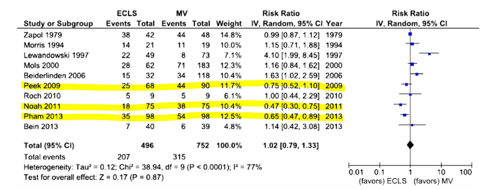

# Prior Distributions {#Prior}

::: {.chapterintro data-latex=""}

- Learn different ways of selecting and constructing priors
- Prior distributions used in clinical studies
- Introduction to hierarchical priors for random effects
- Introduction to sparsity promoting prior for Bayesian regression variable selection
:::

<script src="hideOutput.js"></script>

```{r, echo = FALSE, message=FALSE, warning=FALSE}
# Every chapter, we will load all the library we will use at the beginning
# of the chapter. 
library(tidyverse)
library(ggpubr)
library(SHELF)
library(MCMCpack)
library(extraDistr)

options(scipen = 999)
```

</br>

## Choosing priors

**Types of prior**

Generally speaking, there are two types of priors: informative and noninformative.

- Priors with information on values of parameters, informative priors

    - Priors that charaterize personal/expert opinion
    - Prior elicitation
    - Historical data or past evidence
    - Default priors in clincial studies
    - Informative priors used for computational efficiency and variable selection
    
- "objective" and non-informative priors

    - Flat prior, vague prior, and weakly-informative priors


**Important consideration before choosing a prior**

- Choice of prior does affect the posterior, however, prior is only one part of Bayesian modelling.
    - Prior is not unique and there is no one "correct" prior distribution!
    - In many situations with large sample sizes, the posterior distribution is not too sensitive to reasonable changes in prior.
    - When working with rare outcomes (e.g., small disease cohort), changes in prior distribution can influence posterior distribution

- One criticism of Bayesian inference is in its incorporation of priors, which is considered as a subjective modelling choice. 
    - However, any statistical analysis is inherently subjective, frequentist or Bayesian.
    - "Subjective" choice of prior can often be **beneficial**
        - Sensitivity analysis is crucial in assessing the impact of particular distributions on the conclusions.
        - when we are working with small samples, informative prior allows us to explicitly incorporate past evidence and expert knowledge
        - we can also use sparsity promoting prior (i.e., shrinkage prior) to reduce the number of parameters to be estimated to improve estimation efficiency and avoid over-fitting
        
### Eliciting priors from experts

Elicitation is the process of

- representing the knowledge of one or more experts - expert knowledge is useful!
- concerning an uncertain quantity as a probability distribution for that quantity (i.e. as a random variable with some distribution)
    
Good elicitation methods are formal, statistically rigorous, and use carefully considered probabilistic judgement techniques

- in practice, elicitation follows pre-developed elicitation protocol

- elicitation process often involve training and discussion between experts and statisticians to eliminate bias, mis-interpretation, over-optimistic thinking ...


**Aggregating expert judgement**

There are two general approaches to summarizing the estimates from the experts.

- Aggregate the distributions
    - Elicit a distribution from each expert separately
    - Combine these multiple distribution using mathematical aggregation, also called "pooling"
    
- Aggregate the experts
    - gather expert belief and elicit a single distribution, also called behavioural aggregation. 

       
        
**Three protocols**

- **Most popular.** Sheffield Elicitation Framework (SHELF). The SHELF protocol is a behavioral aggregation method that uses two rounds of judgments. [@o2006uncertain]
    - In the first round, individuals make private judgements
    - In the second round, those judgments are reviewed before the group agrees on consensus judgement. 

- Cooke protocol. A mathematical aggregation approach weights expert responses by their likely accuracy. [@cooke1991experts]
    - The likely accuracy is calculated using a "seed" value.
    - Expert who more accurately predict the seed value are weighted more.
    
- [Delphi Method](https://www.rand.org/topics/delphi-method.html) The Delphi is similar to SHELF as it is a behavioral aggregation method with two or more rounds except that anonymity is maintained in terms of who gave which answers. 
    - unlike SHELF, experts provide their judgments individually with no interaction and a pooling rule is required across expert final distributions.


Reference reading on expert elicitation: 

- [Methods to elicit beliefs for Bayesian priors: a systematic review (2010), by johnson et al.](https://www.sciencedirect.com/science/article/pii/S0895435609001759?casa_token=hejHbiF8uv4AAAAA:wfJlHvZYsIkhyGIrPooRQuO8Bz57fPoe_wYhUvW4xA02hio_LDCZF8KzGykdotVcPCQSVQchDSs#bib24) [@johnson2010methods] 
    - Reviewed on measurement properties including validity,
reliability, responsiveness, and feasibility (lacking in exisiting work).
    - A valid and reliable method [@johnson2010valid] 

- [Uncertain judgements: eliciting experts' probabilities (2006) by O'Hagan et al.](https://librarysearch.library.utoronto.ca/permalink/01UTORONTO_INST/fedca1/cdi_crossref_primary_10_1007_s11336_007_9036_x) [@o2006uncertain]
    - SHELF documentation and software: http://www.jeremy-oakley.staff.shef.ac.uk/shelf/software/
    - Dr. Anthony O'Hagan's talk on elicitation and SHELF: https://www.youtube.com/embed/cU4Cd8CGiaM


::: {.workedexample data-latex=""}
**Tutorial example on SHELF framework** - Elicitation workshop for Bronchiolitis in Infants Placebo Versus Epinephrine and Dexamethasone (BIPED) study (project manuscript under review)

Principal Investigator for the Elicitation Study: Dr. [Anna Heath](https://www.sickkids.ca/en/staff/h/anna-heath/), PhD, MMath, The Hospital for Sick Children, Toronto

Research Assistant and ShinyApp Developer: [Jingxian (Phebe) Lan](https://www.linkedin.com/in/phebelan/), M.Sc

:::


## Default clincial priors

Section 5.5 Default Priors of [@spiegelhalter2003]

### "Non-informative" or "reference" priors

- (Pros) It is attractive to seek a “noninformative”
prior to use as a baseline analysis
    - "such analyses have been suggested as a way of making probability statements about parameters without being explicitly Bayesian" [@spiegelhalter2004incorporating]
    
- (Cons) However, ninformative priors are nonsensical and can lead to inference problems, especially in smaller samples
    - can have a strong impact particularly when events are rare.
    
- Prior Choice Recommendations and Wiki developed by the stan team, https://github.com/stan-dev/stan/wiki/Prior-Choice-Recommendations
     - this guide is written by statisticians, thus, recommendations are primary for non-informative, vague, and weakly informative priors
     - General principle on this guide provides a start

::: {.workedexample data-latex=""}

**1. Noninformative Prior on Proportion**

Suppose you are estimating the 30-day mortality after elective non-cardiac surgery, what is an uninformative prior for the proportion dying?

- An "off the shelf" uninformative priors for binomial model are
    1. $\theta \sim U(0,1) \equiv Beta(1,1)$
    2. Jeffreys prior, $\theta \sim Beta(0.5,0.5)$

```{r echo=FALSE, fig.height=3}

plot.beta <- function(a, b){
  d <- tibble(theta=seq(0,1, length=1001),
              density=dbeta(theta, shape1 =a, shape2=b))
  p <- ggplot(data=d, aes(theta, density))+
      geom_line(col="black")+
      geom_segment(aes(x = qbeta(0.025,a,b), 
                       y = 0, 
                       xend = qbeta(0.025,a,b), 
                       yend = density[theta == round(qbeta(0.025,a,b),3)],colour = "segment"), data=d)+
      geom_segment(aes(x = qbeta(0.5,a,b), 
                       y = 0, 
                       xend = qbeta(0.5,a,b), 
                       yend = density[theta == round(qbeta(0.5,a,b),3)], colour = "segment"), data=d)+
      geom_segment(aes(x = qbeta(0.975,a,b), 
                       y = 0, 
                       xend = qbeta(0.975,a,b), 
                       yend = density[theta == round(qbeta(0.975,a,b),3)],colour = "segment"), data=d)+
      xlab(expression(theta))+
      ylab(expression(p(theta)))+
        ggtitle(paste0("Beta(",a,",",b,") density"))+
      expand_limits(y=0)+
      theme_bw()
p

}

ggarrange(plot.beta(1,1), 
          plot.beta(0.5,0.5), 
          nrow = 1, legend = "none")

cutoff <- c(0.25,0.5,0.75)

res <- c("Beta(1,1)",round(qbeta(c(0.5, 0.025, 0.975), 1, 1),3), round(pbeta(cutoff, 1, 1),3))
res <- rbind(res, c("Beta(0.5,0.5)", round(qbeta(c(0.5, 0.025, 0.975), 0.5, 0.5),3), round(pbeta(cutoff, 0.5, 0.5),3)))


knitr::kable(res, row.names = F,
             col.names = c("Prior","median","q2.5","q97.5",paste0("Pr(", "$\\theta$", "< ",cutoff,")")))
```


**2. Noninformative Prior on log-relative risk**

- Suppose you want to estimate the relative risk for death in a clinical trial
- Relative risk modelling works with the log-relative risk (as it has an approximately normal likelihood)
- An "off the shelf" uninformative prior with a large variance might be
\[\log(RR) = \theta \sim N(0, \sigma^2 = 10^2)\]

- Prior 95% Credible Interval for log(RR) is -19.6 to 19.6
- Prior 95% Credible Interval for RR is $3 \times 10^{-9}$ to $3 \times 10^{9}$
- A more sensible choice, $N(0,5^2)$, for log scale OR, RR, and HR.


```{r echo=FALSE, fig.height=7}

plot.norm <- function(mu, sd){
  d <- tibble(mu.plot=seq(-25,25, by=0.01),
              density=dnorm(mu.plot, mu,sd))
  p <- ggplot(data=d, aes(mu.plot, density))+
      geom_line(col="black")+
      geom_segment(aes(x = qnorm(0.025,mu,sd), 
                       y = 0, 
                       xend = qnorm(0.025,mu,sd), 
                       yend = dnorm(qnorm(0.025,mu,sd), mu,sd),colour = "segment"))+
      geom_segment(aes(x = qnorm(0.5,mu,sd), 
                       y = 0, 
                       xend = qnorm(0.5,mu,sd), 
                       yend = dnorm(qnorm(0.5,mu,sd), mu,sd),colour = "segment"))+
      geom_segment(aes(x = qnorm(0.975,mu,sd), 
                       y = 0, 
                       xend = qnorm(0.975,mu,sd), 
                       yend = dnorm(qnorm(0.975,mu,sd), mu,sd),colour = "segment"))+
      xlab(expression(mu))+
      ylab(expression(p(mu)))+
        ggtitle(paste0("N(",mu,",",sd^2,") density"))+
      expand_limits(y=c(0,0.15))+
      theme_bw()
p

}

ggarrange(plot.norm(0,10), 
          plot.norm(0,5),
          plot.norm(0,4),
          plot.norm(0,3),
          nrow = 2,ncol=2, legend = "none")

res <- c("N(0,100)",
         round(qnorm(c(0.5, 0.025, 0.975), 0, 10),3), 
         round(exp(qnorm(0.025, 0, 10)),10),
         round(exp(qnorm(0.975, 0, 10)),2))

res <- rbind(res, c("N(0,25)", 
                  round(qnorm(c(0.5, 0.025, 0.975), 0, 5),3), 
                  round(exp(qnorm(0.025, 0, 5)),10),
                  round(exp(qnorm(0.975, 0, 5)),2))
             )

res <- rbind(res, c("N(0,16)", 
                  round(qnorm(c(0.5, 0.025, 0.975), 0, 4),3), 
                  round(exp(qnorm(0.025, 0, 4)),10),
                  round(exp(qnorm(0.975, 0, 4)),2))
             )

res <- rbind(res, c("N(0,9)", 
                  round(qnorm(c(0.5, 0.025, 0.975), 0, 3),3), 
                  round(exp(qnorm(0.025, 0, 3)),10),
                  round(exp(qnorm(0.975, 0, 3)),2))
             )

res <- rbind(res, c("N(0,4)", 
                  round(qnorm(c(0.5, 0.025, 0.975), 0, 2),3), 
                  round(exp(qnorm(0.025, 0, 2)),10),
                  round(exp(qnorm(0.975, 0, 2)),2))
             )

res <- rbind(res, c("N(0,1)", 
                  round(qnorm(c(0.5, 0.025, 0.975), 0, 1),3), 
                  round(exp(qnorm(0.025, 0, 1)),10),
                  round(exp(qnorm(0.975, 0, 1)),2))
             )

knitr::kable(res, row.names = F,
             col.names = c("Prior log(RR)","median log(RR)","q2.5 log(RR)","q97.5 log(RR)","q2.5 RR","q97. RR"))
```

:::

**Quick Summary**

- Posterior could land on implausible values with small numbers of deaths in one group or other. 
- These issues resolve somewhat with larger data sets
- With a precise likelihood (e.g., large sample size or large number of events), data rescues you from allowing implausible values.

::: {.guidedexercise data-latex=""}

**1. ISSUE with Uniform Priors** uniform priors on one scale are not uniform on a transformed scale
  
Suppose we set prior $\theta \sim U(0,1)$ as an uninformative prior on the parameter quantifying risk of adverse event, probability $\theta$

- Prior distribution on log($\frac{\theta}{1-\theta}$), which is also called the logit of $\theta$ is no longer uniformly distributed

```{r echo=FALSE, fig.height=3}

d <- tibble(theta=rbeta(10000,1,1),
            logit.theta = log(theta/(1-theta)))

p1<- ggplot(data=d, aes(theta))+
      geom_histogram(col="black", fill="white", bins = 50)+
      xlab(expression(theta))+
        ggtitle("Distribution of theta")+
      ylab("Frequency")+
      expand_limits(y=c(0,1000))+
      theme_bw()

p2<- ggplot(data=d, aes(logit.theta))+
      geom_histogram(col="black", fill="white", bins = 50)+
      xlab(expression(logit(theta)))+
        ggtitle("Distribution of log-odds")+
      expand_limits(y=c(0,1000))+
      ylab("Frequency")+
      theme_bw()

ggarrange(p1,p2,nrow=1)

```


**2. Using large variance normal distribution as non-informative prior**

- How is a normal distribution N(0,$100^2$), with its bell-shape, uninformative?
- It does not put equal density on all points, as the density drops off from zero in each direction
- The key is that it is locally uniform
- In the region where a parameter is likely to lie, the normal distribution is flat.

```{r echo=FALSE, fig.height=3, warning=FALSE}

d <- tibble(mu.plot=seq(-500,500, by=0.01),
              density=dnorm(mu.plot, 0,100))
p1 <- ggplot(data=d, aes(mu.plot, density))+
      geom_line(col="black")+
      xlab(expression(mu))+
      ylab(expression(p(mu)))+
        ggtitle("Bell shape")+
      theme_bw()

p2 <- ggplot(data=d, aes(mu.plot, density))+
      geom_line(col="black")+
      xlab(expression(mu))+
      ylab(expression(p(mu)))+
        ggtitle("Approximate Flat")+
      xlim(x=c(-10,10))+
      theme_bw()

ggarrange(p1,p2,nrow=1)
      
```


:::

### Minimally informative prior

- Use substantive knowledge to put most prior weight on possible values, without being too restrictive
    - From example, a RR for mortality in a trial, a prior with most weight on values of 0.66 to 1.5, a N(0,1) prior would be considered suitable.

    - For the between-person standard deviation of a 0-40 quality of life instrument, a prior with most weight on values under 10, a possible prior would be Gamma(0.1,0.1) on the precision.

### Skeptical Prior

- priors that express doubts about large effects

- Mathematically speaking, a sceptical prior about a treatment effect will have a mean of zero and a shape chosen to include plausible treatment differences which determines the degree of scepticism.
    - This is centred at no effect and a 95% CR extends to a minimally clinically important difference (MCID)
    
- Skeptical prior will "shrink" back observed results towards the null effect
- If under the skeptical prior, the posterior results support conclusion of effectiveness (results suggest departure from null), the skeptic is convinced!


- Spiegelhater suggested a reasonable degree of scepticism maybe feeling that the study has been designed around an alternative hypothesis that is optimistic,
     - formalized by a prior with only a small probability say 5% that the effect is as large as the optimistic alternative

::: {.workedexample data-latex=""}

**Example from EOLIA trial**[@goligher2018extracorporeal]

- MCID for 60-day mortality in RR comparing between ECOMO and Rescue Lung Injury in Severe ARDS is 0.67, log(0.4/0.6) = -0.405.
- Let P(RR<0.67) = P(log(RR)< -0.405) = 0.05, that is saying the probability of the ECOMO being effective beyond MCID is only 5%, we have

\[1.6445 \times \sigma = MCID = |-0.405| = 0.405\]
\[\sigma = \frac{0.405}{1.6445} = 0.242\]

- yielding a candidate skeptical prior on log(RR) ~ $N(0,0.242^2)$

:::


### Optimistic/enthusiastic Prior

- This is centred at the MCID and a 95% CR extends to no effect
- Optimistic Prior will move observed results towards the MCID
- If a optimist is convinced that there is no effect, the evidence for no effect is strong
- For the reanalysis of the EOLIA trial, the strongly enthusiastic prior is defined as log(RR) ~ $N(0.67, 0.25^2)$.


## Historical data (meta-analysis)

- Incorporating historical data in Bayesian analysis
    - these can be formalized as a means of using past evidence as a basis for a prior distribution for a parameter of interest
    - Additional reading: Section 5.4 Summary of External Evidence of [@spiegelhalter2003]
    

- Meta-analysis is a very useful tool for evidence synthesis in clinical research
    - **Juan Pablo** will give us a guest lecture on Bayesian meta-analysis after reading week!
    - We can directly use published meta-analysis results to construct priors
    - if not available, one can also complete a meta-analysis to synthesis evidence for prior construction
- These types of prior are called data-derived priors. 
    - For example, in the Bayesian reanalysis of the EOLIA trial, data-derived priors are constructed from a Bayesian meta-analysis of published relevant studies.
    - The posterior distribution (updated belief) of treatment effect is produced by combining data-derived prior with data from the current study.
    
**Downweighting**: 

To reflect concerns about possible differences between the current and previous studies, the **variance** of the past studies can be inflated to receive less weight in the analysis on the pooled estimate of effect.


**Data-derived prior from the Bayesian reanalysis of the EOLIA trial**[@goligher2018extracorporeal]

- Data-derived prior was developed based on three relevant studies from a meta-analysis of ECMO for ARDS [@munshi2014extracorporeal]
- Three studies are:[@peek2009efficacy], [@pham2013extracorporeal], and [@noah2011referral]

```{r echo=FALSE, fig.cap="In-hospital mortality. Forest plot showing pooled analysis of four randomized controlled trials and six observational studies comparing extracorporeal life support (ECLS) to conventional mechanical ventilation (MV) from Munshi et al 2014.", fig.align='center'}

```


- After fitting a random effect model, the pooled RR is estimated as 0.64 with 95% CI (0.38 - 1.06).
- We now express this prior as a normal likelihood on the log(RR) scale and consider three scenarios of "downweighting" (10%, 50% and 100%).

<div class="fold s">
```{r fig.height=3, fig.width=5,fig.align='center', warning=FALSE}
CI.normal <- log(c(0.38, 1.06))
sigma <- (CI.normal[2] - CI.normal[1])/(2*1.96)
mu <- log(0.64)

xlabs <- c(0.2, 0.4, 0.6, 0.8, 1, 3)

noweight <- dnorm(log(seq(0.1,3, length=201)), mu, sigma)
weight50 <- dnorm(log(seq(0.1,3, length=201)), mu, sigma/sqrt(0.5))
weight10 <- dnorm(log(seq(0.1,3, length=201)), mu, sigma/sqrt(0.1))

d <- data.frame(logrr.range = rep(log(seq(0.1,3, length=201)),3),
                plog.rr = c(noweight, weight50, weight10),
                Weighting = rep(c("100% weight","50% weight","10% weight"),each=201)) 

ggplot(d, aes(logrr.range, plog.rr,colour=Weighting))+
  geom_line(size = 1)+
     xlab("RR")+
     ylab("probability density")+
     ylim(c(0,2))+
     scale_x_continuous(breaks = log(xlabs),labels=xlabs, limits=c(log(0.1), log(3)))+
     scale_colour_manual(values=c("goldenrod","steelblue","black"))+
  theme_bw()+
  ggtitle("Data-derived priors")

```
<div>


```{r echo=FALSE, include=FALSE}


# dmeta <- tibble(
#   study = c("Peek 2009", "Noah 2011", "Pham 2013"),
#   event.e = c(25,18,35),
#   n.e = c(68,75,98),
#   event.c = c(44,38,54),
#   n.c = c(90,75,98)
# )
# 
# library(meta)
# m.bin <- metabin(event.e = event.e,
#                  n.e = n.e,
#                  event.c = event.c,
#                  n.c = n.c,
#                  studlab = study,
#                  data = dmeta,
#                  sm = "RR",
#                  method = "MH",
#                  MH.exact = TRUE,
#                  fixed = FALSE,
#                  random = TRUE,
#                  method.tau = "PM",
#                  hakn = TRUE,
#                  title = "Mortality")
# summary(m.bin)
#                          RR           95%-CI     t p-value
# Random effects model 0.6323 [0.3732; 1.0711] -3.74  0.0646

# m.bin_update <- update.meta(m.bin, method.tau = "REML")
# summary(m.bin_update)
# 
#                          RR           95%-CI     t p-value
# Random effects model 0.6353 [0.3805; 1.0607] -3.81  0.0626

# # Peek 2009;
# y <- c(rep(1, 25), rep(0, 68 - 25), rep(1, 44), rep(0, 90 - 44))
# trt <- c(rep(1, 68), rep(0, 90))
# study <- rep("Peek 2009", length(trt))
# 
# # Noah 2011;
# y <- c(y, rep(1, 18), rep(0, 75-18), rep(1, 38), rep(1, 75-38))
# trt <- c(trt, rep(1, 75), rep(0, 75))
# study <- c(study, rep("Noah 2011", length(trt) - length(study)))
# 
# # Pham 2013;
# y <- c(y, rep(1, 35), rep(0, 98 - 35), rep(1, 54), rep(0, 98 - 54))
# trt <- c(trt, rep(1, 98), rep(0, 98))
# study <- c(study, rep("Pham 2013", length(trt) - length(study)))
# 
# dmeta2<-tibble(y, trt, study)


```


## Hierarchical priors and shrinkage priors

- Don't necessarily have information about the value of a parameter
- Expresses knowledge, for example, that a several of parameters, $\mu_1, \ldots, \mu_k$ have a common mean, without saying what that mean is

\[\mu_i \sim N(\mu_0, \sigma^2) \]

- The Bayesian posterior means for $\mu_i$ will be "shrunk" towards the overall mean $\mu_0$ - (this is called formally as exchangeability)
- By sharing information this way, individual estimates have smaller variances - A way of avoiding overfitting

- These are priors on higher level parameters (variances and random effects are the most common)

**Example prior distribution for variance - Gamma Distribution**

```{r echo=FALSE}
# plot.invgamma <- function(a, b){
#   d <- tibble(theta=seq(0,0.5, length=201),
#               density=dinvgamma(theta, alpha =a, beta=b))
#   p <- ggplot(data=d, aes(theta, density))+
#       geom_line(col="orange")+
#         xlab("Variance")+
#       ylab("Probability Density")+
#         ggtitle(paste0("IG(",a,",",b,")"))+
#       expand_limits(y=0)+
#       theme_bw()
# p
# }

# ggarrange(plot.invgamma(1,0.1),
#           plot.invgamma(0.1,0.1), 
#           plot.invgamma(0.01,0.01), 
#           plot.invgamma(0.001,0.001), 
#           nrow = 2,
#           ncol = 2)

plot.gamma <- function(a, b){
     d <- tibble(theta=seq(0,0.5, length=201),
                 density=dgamma(theta, shape =a, scale=b))
     p <- ggplot(data=d, aes(theta, density))+
         geom_line(col="orange")+
         xlab("Precision")+
         ylab("Density")+
         ggtitle(paste0("Gamma(",a,",",b,")"))+
         expand_limits(y=0)+
         theme_bw()
     p
 }

ggarrange(plot.gamma(0.1,0.1), 
           plot.gamma(0.01,0.01), 
           plot.gamma(0.001,0.001), 
           plot.gamma(1,0.1),
           nrow = 2,
           ncol = 2)


```


- Shrinkage priors in Bayesian penalization aim to shrink small effects to zero while maintaining true large effects.

- The horseshoe prior is a member of the family of multivariate scale mixtures of normals, and is therefore closely related to widely used approaches for sparse Bayesian learning, including, among others, Laplace priors (e.g. the LASSO) and Student-t priors.

**Example horseshoe prior**

- Consider a linear regression model with covariates $X = (x_1, \ldots, x_p)$. $\beta$ is a $1\times p$ vector of regression coefficient and i index number of subject.

\[y_i = \beta^TX_i + \epsilon_i, \ e_i \sim N(0,\sigma^2), \ i = 1, \ldots, n\]

- The horseshoe prior (hierarchical) is given as:
\[\beta_j \mid \lambda_j, \tau, \sim N(0, \lambda_j^2 \tau^2)\]
\[\lambda_j \sim halfCauchy(0,1), j = 1, \ldots, p.\]

- $\lambda_j$ is called local shrinkage parameter - enable some $\beta$ to escape the shrinkage
- $\tau$ is the global shrinkage parameter - shrink all $\beta$ towards zero, thus removing the corresponding covariate from the regression model.

```{r}
# Visually compare normal, student_t, cauchy, laplace, and product_normal
compare_priors <- function(scale = 1, df_t = 2, xlim = c(-10, 10)) {
  dt_loc_scale <- function(x, df, location, scale) {
    1/scale * dt((x - location)/scale, df)
  }
  dlaplace <- function(x, location, scale) {
    0.5 / scale * exp(-abs(x - location) / scale)
  }
  dproduct_normal <- function(x, scale) {
    besselK(abs(x) / scale ^ 2, nu = 0) / (scale ^ 2 * pi)
  }
  stat_dist <- function(dist, ...) {
    ggplot2::stat_function(ggplot2::aes_(color = dist), ...)
  }
  ggplot2::ggplot(data.frame(x = xlim), ggplot2::aes(x)) +
    stat_dist("normal", size = .75, fun = dnorm,
              args = list(mean = 0, sd = scale)) +
    stat_dist("student_t", size = .75, fun = dt_loc_scale,
              args = list(df = df_t, location = 0, scale = scale)) +
    stat_dist("cauchy", size = .75, linetype = 2, fun = dcauchy,
              args = list(location = 0, scale = scale)) +
    stat_dist("laplace", size = .75, linetype = 2, fun = dlaplace,
              args = list(location = 0, scale = scale)) +
    stat_dist("product_normal", size = .75, linetype = 2, fun = dproduct_normal,args = list(scale = 1))+theme_bw()
}
# Cauchy has fattest tails, followed by student_t, laplace, and normal
compare_priors()


```

