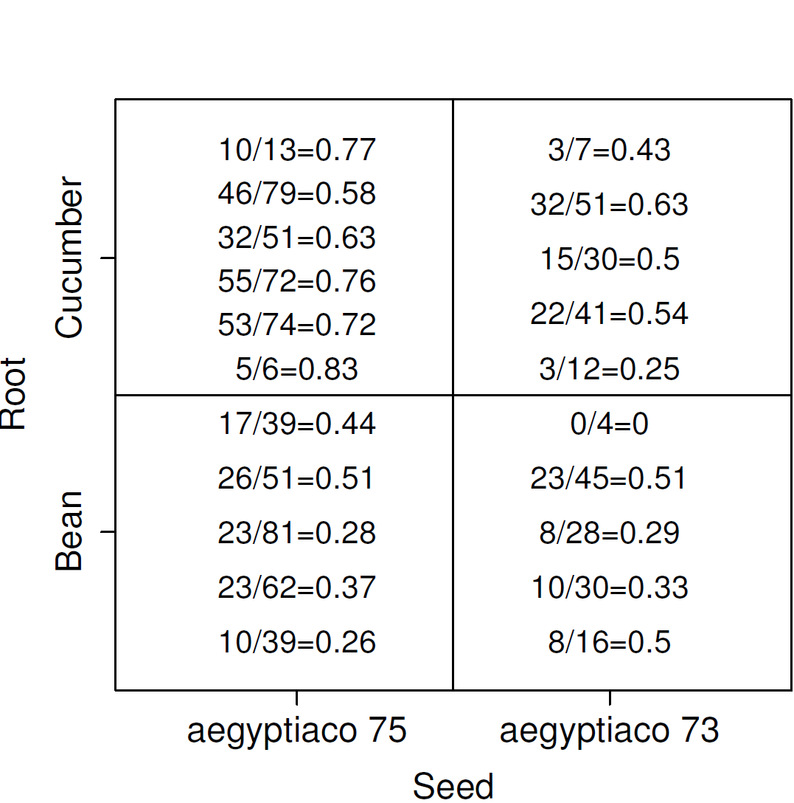

# Bayesian Regression II {#BayesReg2}

::: {.chapterintro data-latex=""}

- Learn how to fit and interpret Bayesian logistic regression
- Learn how to fit and interpret Bayesian poisson and negative binomial regression
- Reviewing hierarchical model: generalized mixed-effect models

:::

<script src="hideOutput.js"></script>

```{r, echo = FALSE, message=FALSE, warning=FALSE}
# Every chapter, we will load all the library we will use at the beginning
# of the chapter. 
library(tidyverse)
library(ggpubr)
library(brms)
library(tidybayes)
library(ggmcmc)
library(MCMCpack)
library(bayesplot)
library(gtsummary)
library(coda)
library(extraDistr)
library(DT)
library(vcd)
options(scipen = 999)
```

</br>


## Models for Binary Data

- For binary outcome Y, we are interested to model the probability of $\pi_i = P(Y_i=1)$, $i=1, \ldots, n$

\[Y_i \mid \pi_i \sim Bern(\pi_i)\]
\[ E(Y_i \mid \pi_i) = \pi_i\]
\[logit( \pi_i) = \beta_0 + \beta_1 X_{i1}\]


- **logistic regression model** featuring logit link that connects binary outcome to a conventional linear regression format, is part of the broader class of **generalized linear models**

- Logit link convert probabilities to log odds.

\[\log(\frac{\pi_i}{1-\pi_i}) = \log(\frac{P(Y_i=1)}{1- P(Y_i=1)})\]

\[\log(\frac{\pi_i}{1-\pi_i}) = \beta_0 + \beta_1 X_{i1}\]

```{r echo=FALSE, fig.align='center', fig.height=4}
p1<-ggplot(data.frame(x = c(0, 1)), aes(x)) + 
  stat_function(fun = qlogis, n = 501) + 
  xlab(expression(pi)) + 
  ylab(expression(logit(pi))) + 
  ggtitle("logit function")+
  theme_bw()
p2<- ggplot(data.frame(x = c(-5, 5)), aes(x)) + 
  stat_function(fun = plogis, n = 501) + 
  ylab(expression(pi)) +
  xlab(expression(logit(pi)))+
  ggtitle("logit function")+
  theme_bw()
ggarrange(p1, p2, nrow = 1)
```


::: {.important data-latex=""}
**Logistic regression model**

- Consider the logistic regression model $Y$ with covariates $X_i, \ldots, X_p$:

\[ \log(\frac{\pi_i}{1-\pi_i}) =  \beta_0 + \beta_1 X_{i1} + \ldots + \beta_p X_{ip} \]

- logistic regression coefficients is interpreted as log odds ratio!

- Furthermore, we can recalculate probability using the inverse logit function (aka, expit function)

\[\pi_i = \frac{\exp(\beta_0 + \beta_1 X_{i1} + \ldots + \beta_1 X_{ip})}{1+\exp(\beta_0 + \beta_1 X_{i1} + \ldots + \beta_p X_{ip})}\]


- Assumptions of logistic regression models
    1. **Independent observations**. This assumption can be modified if working with clustered data.
    2. **Linear relationship between continous covariates and log-odds** We can check this assumption by examining marginal plots comparing the model predicted relationship between outcome (log-odds or logit-probability) and each continuous covariates.
    3. **Multicollinearity** Multicollinearity is the phenomenon when a number of the explanatory variables are strongly correlated.
    4. **Correctly specified regression model** This means that all relevant predictors for the response variable have been included in the model. This is often difficult to verify, but we can use posterior predictive distribution to check for regression fit. We can also use WAIC and LOO to compare different models.

- Comparing to linear regression model we no-longer require the residuals to be normally distributed and homoscedasticity.

:::

**Diagnostic Sensitivity Example**

-  10 studies taken from [@bastos2020diagnostic] on [Diagnostic accuracy of serological tests for covid-19: systematic review and meta-analysis. BMJ. 2020](https://www.bmj.com/content/370/bmj.m2516)

-  Each study reports observed positive chemiluminescent immunoassa (CLIA, $r_i$) and number having positive reference standard reverse transcriptase polymerase chain  reaction (RT-PCR, $n_i$)

-  Interest lies in summarizing this collection of values

```{r echo=FALSE,eval=T}
dat <- read.table("data/COVIDtest.txt", 
                  sep = "",
                  header=T)
dat <- dat %>% 
  mutate(r = TP,
         n = TP + FN,
         age = round(rnorm(10, 70*sqrt(TP/(TP + FN)), 8)))


dat %>% 
  select(Study, r, n, age) %>%
  datatable(
  rownames = T,
  class = "compact",
  options = list(
    dom = 't',
    ordering = FALSE,
    paging = FALSE,
    searching = FALSE,
    columnDefs = list(list(className = 'dt-center', 
                      targets = 0:3))))

      
```
**Unpooled**

-  recall from last week, We can assume a binomial likelihood for each study (unpooled),

\[r_i \sim Bin(p_i, n_i)  \]

-  we can assume that the 10 true sensitivities $p_i$ are independent by fitting different prior to each one:
\[p_i \sim Beta(1,1)\]

-  we will obtain 10 separate posteriors $P(p_i \mid r_i, n_i)$
    -  For example, we do not assume that $p_1$ tells us anything about the value of $p_2$

**Pooled**

-  Suppose we wanted to estimate the overall sensitivity of the CLIA test
    -  We do not want 10 separate estimates but a single estimate
-  If we thought that the studies all had the same true sensitivity p0, we could fit a model like this:

1. Assume a binomial likelihood for each study

\[r_i \sim Bin(p_i, n_i) \]

2. Assume that all studies have the same true sensitivity, $p_0$:
\[ p_i = p_0\]

3. Put a prior on $p_0$: $p_0 \sim Beta(1,1)$


**Different prior on $p_0$**

-  The beta prior is useful for models with little additional structure
    -  e.g., estimating a single proportion; estimating a collection of proportions
    
-  It is difficult to use it to a model, where we want to include predictors of $p_i$

-  For most modelling approaches to binary data, we will use
    - the logit transformation of $p_i$
    - normal priors for parameters on this logit scale (e.g., normal prior for log-odds)


**Logistic models**

-  We still have the same likelihood $r_i \sim Bin(p_i, n_i)$

-  We define a new parameter using the logit transformation function:

\[logit(p_i) = log(\frac{p_i}{1-p_i}) = \alpha_i\]
\[p_i = \frac{\exp(\alpha_i)}{1+\exp(\alpha_i)}\]

-  $0<p_i<1 \Rightarrow -\infty < \alpha_i < \infty$

-  Thus, it's quite reasonable to use normal prior to characterize $\alpha_i$


::: {.guidedexercise data-latex=""}

**1. Pooled model with non-informative prior**

\[r_i \mid p_i, n_i \sim Bin(p_i, n_i)\]
\[log(\frac{p_i}{1-p_i}) = \alpha\]
\[\alpha \sim N(0, \sigma = 5)\]

```{r echo = T, eval=F}
fit1 <- brm(r | trials(n) ~ 1,
  data = dat,
  prior = prior(normal(0,5), class=Intercept),
  family = binomial,
  seed = 123)
```

**2. Unpooled model with non-informative prior**

\[r_i \mid p_i, n_i \sim Bin(p_i, n_i)\]
\[log(\frac{p_i}{1-p_i}) = \alpha + \beta_i \ \text{Study}_i\]
\[\alpha \sim N(0, \sigma = 5)\]
\[\beta_i \sim N(0, \sigma = 5)\]

```{r echo = T, eval=F}
fit2 <- brm(r | trials(n) ~ Study,
  data = dat,
  prior =  c(prior(normal(0, 5), class = Intercept),
             prior(normal(0, 5), class = b)),
  family = binomial,
  seed = 123)
```

:::


**Generalized linear models**

We can specify the type of model by two features
    - Family: type of outcome (binomial, normal, Poisson, gamma)
    - Link: relationship between mean parameter and predictor (identity, logic, log)

- we have models in the form

\[ Y_i \sim Dist(\mu_i, \tau)\]
\[g(\mu_i) = \beta_0 + \beta_1 X_{i1} + \ldots + \beta_1 X_{ip}\]

- $g()$ is called the link function
- Distributions family ([exponential family](https://en.wikipedia.org/wiki/Exponential_family)) can be specified as Normal, Poisson, Binomial, Bernoulli, etc.

-  Usually, we use the logit for binary data and gets odds ratios (logistic model)
    -  If we use the log link, we can estimate relative risks
    
    
::: {.workedexample data-latex=""}

**Sample from priors in brms**

-  We can specify in brms to generate samples from our specified prior as part of the output

-  we can use these prior samples 
    1.  to compare with the posteriors to see how much the prior is updated by the data 
    2.  to check what information is in the prior

-  using the pooled model as an example

\[r_i \mid p_i, n_i \sim Bin(p_i, n_i)\]
\[log(\frac{p_i}{1-p_i}) = \alpha\]
\[\alpha \sim  N(0, \sigma = 5)\]

```{r echo = T, eval=FALSE}
fit1 <- brm(r | trials(n) ~ 1,
  data = dat,
  prior = prior(normal(0,5), class=Intercept),
  family = binomial,
  sample_prior = T, #asking brms to generate prior sample!
  seed = 123)

# saveRDS(fit1, "data/chap8_binary_1")
```

-  checking posterior results
    -  computing posterior predicted probability of event (in this case the sensitivity of the CLIA test)

```{r echo = T, warning=FALSE, message=FALSE}
fit1 <- readRDS("data/chap8_binary_1")
#posterior draws of log-odds estimate - the intercept;
posterior <- posterior_samples(fit1)

#posterior predicted probability of event;
prob.pooled <- exp(posterior$b_Intercept)/(1+exp(posterior$b_Intercept))

mean(prob.pooled)
quantile(prob.pooled, c(0.025, 0.975))
```

-  what does the posterior output look like?

```{r echo = F, message=FALSE, warning=FALSE}
#checking brms posterior output;
head(posterior) %>% 
  datatable(
  rownames = T,
  class = "compact",
  options = list(
    dom = 't',
    ordering = FALSE,
    paging = FALSE,
    searching = FALSE,
    columnDefs = list(list(className = 'dt-center', 
                      targets = 0:2))))
```


-  comparing prior and posterior distribution visually

```{r echo = T, fig.align='center'}
data.frame(Probability = c(inv_logit_scaled(posterior[,"b_Intercept"]),
                inv_logit_scaled(posterior[,"prior_Intercept"])),
           Type=rep(c("Posterior","Prior"),each=nrow(posterior))) %>%
  ggplot(aes(x=Probability,fill=Type))+
  geom_density(size=1,alpha=0.5)+
  labs(title="Prior: alpha ~ N(0,5); probability = exp(alpha)/(1+exp(alpha))")+
  theme_bw()+
  scale_fill_manual(values=c("goldenrod","steelblue"))
```
:::

### Logistic regression with predictor

- Adding one predictor, age, for each study in modelling CLIA sensitivity

- We have the following Bayesian model

\[r_i \mid p_i, n_i \sim Bin(p_i, n_i)\]
\[log(\frac{p_i}{1-p_i}) = \alpha + \beta \ age_i\]
\[\alpha \sim  N(0, \sigma = 5)\]
\[\beta \sim  N(0, \sigma = 5)\]

-  $\beta$ is interpreted as the changes on the log-OR associate 1 unit increase in age.

```{r echo = T, eval=FALSE}
fit3 <- brm(r | trials(n) ~ age,
  data = dat,
  prior = c(prior(normal(0, 5), class = Intercept),
             prior(normal(0, 5), class = b)),
  family = binomial,
  iter = 10000,
  warmup = 8000,
  cores = 4,
  seed = 123)

# saveRDS(fit3, "data/chap8_binary_3")
```


-  checking posterior results
    -  computing posterior predicted probability of event (in this case the sensitivity of the CLIA test)


```{r echo = T, warning=FALSE, message=FALSE}
fit3 <- readRDS("data/chap8_binary_3")

#posterior draws of log-odds estimate - the intercept;
posterior <- posterior_samples(fit3)

# beta posterior summary
exp(mean(posterior$b_age))
exp(quantile(posterior$b_age, c(0.025, 0.975)))

#posterior predicted probability testing positive for each study;
pp<-posterior_predict(fit3)
mean.pp<-colMeans(pp)/dat$n
lci.pp<- apply(pp, 2, function(x) quantile(x, 0.025))/dat$n
uci.pp<- apply(pp, 2, function(x) quantile(x, 0.975))/dat$n

pp.table <- data.frame(Study = dat$Study, 
                       r = dat$r, 
                       n = dat$n,
                       Prob_obs = round(dat$r/dat$n,2),
                       Prob_post = round(mean.pp,2),
                       CI_post = paste0("(",round(lci.pp,2),",",round(uci.pp,2),")"))

pp.table %>% 
  datatable(
  rownames = F,
  class = "compact",
  options = list(
    dom = 't',
    ordering = FALSE,
    paging = FALSE,
    searching = FALSE,
    columnDefs = list(list(className = 'dt-center', 
                      targets = 0:5))))
```

### Centring continous variable

-  our model says that sensitivity is different across studies according to the average age

\[P(\text{test positive}) = \frac{\exp(\alpha + \beta \ age)}{1+ \exp(\alpha + \beta \ age)}\]

-  We could obtain a prediction at the average of the ages `mean(dat$age)` across the studies

\[P(\text{test positive}) = \frac{\exp(\alpha + \beta \times mean( age))}{1+ \exp(\alpha + \beta \times mean( age))}\]


-  We could "centre" age at its average so that the intercept refers to the probability at the average age

\[r_i \mid p_i, n_i \sim Bin(p_i, n_i)\]
\[log(\frac{p_i}{1-p_i}) = \alpha + \beta (\ age_i - mean(age))\]
\[\alpha \sim  N(0, \sigma = 5)\]
\[\beta \sim  N(0, \sigma = 5)\]

-  Using a centred predictor also reduces correlation between intercept and slope. **This can speed up MCMC convergence in some models (computationally more efficient).**

```{r echo=T, eval=FALSE}
#centring variable age;
dat$age.c <- dat$age - mean(dat$age)

fit3c <- brm(r | trials(n) ~ age.c,
            data=dat,
            prior = c(prior(normal(0, 5), class = Intercept),
                      prior(normal(0, 5), class = b)),
            family = binomial,
            iter = 5000,
            warmup = 3000,
            cores = 4,
            seed = 123)

# saveRDS(fit3c, "data/chap8_binary_3c")
```

-  comparing posterior distribution between centred and uncentred models

```{r echo = T, warning=FALSE, message=FALSE}
fit3c <- readRDS("data/chap8_binary_3c")

#posterior draws of log-odds estimate - the intercept;
posteriorc <- posterior_samples(fit3c)

# beta posterior summary
exp(mean(posteriorc$b_age))
exp(quantile(posteriorc$b_age, c(0.025, 0.975)))
```

- posterior predicted probability testing positive for each study comparing between the centred and uncentred models

- we can see the results are almost *identical* and we achieved this with only 5000 iterations for the centred model.

```{r echo = F}
#posterior predicted probability testing positive for each study;
ppc<-posterior_predict(fit3c)

pp.table <- data.frame(pp.table[,c(1,4:6)],
                       c_Prob_post = round(colMeans(ppc)/dat$n,2),
                       c_CI_post = paste0("(",round(apply(ppc, 2, function(x) quantile(x, 0.025))/dat$n,2),",",round(apply(ppc, 2, function(x) quantile(x, 0.975))/dat$n,2),")"))

pp.table %>% 
  datatable(
  rownames = F,
  class = "compact",
  options = list(
    dom = 't',
    ordering = FALSE,
    paging = FALSE,
    searching = FALSE,
    columnDefs = list(list(className = 'dt-center', 
                      targets = 0:5))))
```

- we can investigate the correlation between two posterior regression parameters, $\alpha$ (intercept) and $\beta$ (log-OR for age).

- The two parameters should be uncorrelated by model assumption! If you see visible correlation, you can consider thinning your MCMC or run more iterations.

```{r echo = T, fig.align='center'}
p1 <- ggplot(posterior, 
             aes(b_Intercept, b_age))+
  geom_point(alpha=.1)+
  theme_bw()+
  ggtitle("Uncentred age")

p2 <- ggplot(posteriorc, aes(b_Intercept, b_age.c))+
  geom_point(alpha=0.25)+
  theme_bw()+
  ggtitle("Centred age")

ggarrange(p1,p2, nrow=1)

```

-  Model diagnostics

1. Posterior predictive graphic check for model fit

```{r echo = T, message=FALSE, warning=FALSE, fig.height=5, fig.align='center'}
p1<-pp_check(fit3c, ndraws = 50)
p2<-pp_check(fit3c, type = "stat_2d", stat = c("max", "min"))
ggarrange(p1,p2, nrow = 1)
```

2. Checking for model fitted marginal effect of age on probability of testing positive versus crude observed probability of testing positive

```{r echo = T, message=FALSE, warning=FALSE, fig.width=5, fig.height=5, fig.align='center'}
plot.dat <- fit3c$data
post_mu <- fitted(fit3c, scale = "response")
colnames(post_mu) <- c("mu", "mu_se", "lwr_ci", "upr_ci")
df_plot <- data.frame(plot.dat, post_mu)
df_plot <- df_plot %>%
           mutate(prob_obs = r/n,
                  prob_est = mu/n,
                  prob_lwr_ci = lwr_ci/n,
                  prob_upr_ci = upr_ci/n)
x_sd <- sd(df_plot$age.c)

p <- ggplot(aes_string(x = "age.c",  y = "prob_obs"), data = df_plot) + 
    # Add a layer of predictive intervals
    geom_ribbon(aes(ymin = predict(loess(prob_lwr_ci~age.c, data = df_plot)), 
                    ymax = predict(loess(prob_upr_ci ~age.c, data = df_plot))), fill = "skyblue", alpha = 0.3) + 
    geom_smooth(aes(y = prob_est, col = "Model"), se = FALSE, 
                method = "loess") + 
    geom_smooth(aes(y = prob_obs, col = "Data"), se = FALSE, linetype = "dashed", 
                method = "loess") + 
    theme(legend.position = "bottom") + 
    scale_color_manual(values = c("red", "blue"), name = "")

p + theme_bw()

```


### hierarchical model revisit

- Suppose that we do not believe that the sensitivity values are all the same

- But we also believe that they are related, in the sense that they share a common underlying proportion but with deviations

- Suppose also that our labelling of the studies is arbitrary (we would not worry if we had mixed the labels up)

- Then the outcomes on the studies are exchangeable

- We can treat them the same in the model, even though they are different studies

**Exchangeable proportions**

-  We can assume the following model

\[logit(p_i) = \alpha_i = \alpha_0 + \epsilon_i\]

-  where $\epsilon_i \sim N(0,\sigma^2)$
-  this is equivalent as $\alpha_i \sim N(\alpha_0,\sigma^2)$

-  The logit for study $i$ is near the average, but differs from it by some random amount $\epsilon_i$, where $\epsilon_i$ are restricted to be centred at zero with a normal distribution

-  The logit for study $i$ is near the average, but varies with variance $\sigma^2$

-  $\sigma^2$ can be estimated from the data and the model

-  It answers the question: how much do the logit proportions vary around their average?

**Prior choice**

-  We will often use this sort of prior structure for $\sigma$ 
    1. half-t, $\sigma \sim T_3(0, scale)$
    2. half-normal, $\sigma \sim N(0, scale)$

-  We pick scale to be some smallish number (1,2,3)
    - It favours small values, but allows values that are relatively large
    -  small scale specification of the prior can gain precision
    
    
**Hierarchical model**

-  This is hierarchical random intercept model!
-  Data level, $r_i \mid p_i, n_i \sim Bin(p_i(\alpha_i), n_i)$
-  Structure prior, Parameters directly governing the observed data are one level up, $\alpha_i = \alpha_0 + \epsilon_i$
-  hyperparameter, $\alpha_0 \sim  N(0, 10)$ and $\sigma ~ N(0, \sigma = 2)$

<!-- -  By assuming that the $\alpha_i$ values come from a common distribution, we improve the precision of each estimate -->

**Overall average and individual estimates**

-  Imprecise sample estimates are "shrunk" towards the overall average
    -  This shrinkage reflects the assumption that the estimates share the same overall mean
    
-  When there is less data for an estimate, it "borrows" more information from the overall mean

-  Posterior means of each of the $\alpha_i$ in a random effect model are "shrunk" towards their overall mean $\alpha_0$ at the rate of $\sigma$

-  The overall mean $\alpha_0$ contains information about the values of all the other $\alpha_i$.
    -  The consequence: the posterior means of the $\alpha_i$ are influenced by all the other $\alpha_i$
    -  Because of this correlation, Bayesian estimates are closer to the population mean than the observed sample
    
-  In the COVID testing example, this means that the posterior mean for study 1 depends to some extent on the data from all the other studies.
    
-  The Bayesian estimate can be seen as a compromise between
    -  A fixed effects estimate where all studies estimate share exactly the same common logit proportion $\alpha_0$
    -  A complete independence model, where the studies each estimate completely different logit proportion $\alpha_i$, based entirely on the observed data in that study
    
-  The posterior precision is higher than the sample precision (in other words, the posterior variance is smaller than the sample variance)
    -  The \closer together " the studies (smaller $\sigma$), the more borrowing of strength
    -  The \further apart" the studies (larger $\sigma$), the less borrowing of strength

::: {.guidedexercise data-latex=""}

**Run a random intercept model using brms** 

```{r echo=T, eval=FALSE}

fit4 <- brm(r | trials(n) ~ (1| Study) ,
            data=dat,
            prior = c(prior(normal(0,10), class=Intercept),
                      prior(normal(0,2), class=sd)),
            iter=10000,
            warmup=8000,
            cores = 4,
            seed = 123,
            family=binomial)

# saveRDS(fit4, "data/chap8_binary_4")
```

-  comparing posterior distribution between centred and uncentred models

```{r echo = T, warning=FALSE, message=FALSE}
fit4 <- readRDS("data/chap8_binary_4")

# posterior predicted sensitivity using fixed effect;
s4 <- posterior_samples(fit4)
predict(fit4)[,-2]/dat$n 

# posterior predicted sensitivity including random effect

# How would I predict the sensitivity in a NEW study
# logit(p_i) = b_Intercept + e_i
# e_i ~ N(0, sd_Study__Intercept))

# logit(p_new) = b_Intercept + e_new
# e_new ~ N(0, sd_Study__Intercept)

newlogit <- s4$b_Intercept + rnorm(nrow(s4), 0, sd=s4$sd_Study__Intercept)
averageLogit <- s4$b_Intercept
hist(inv_logit_scaled(newlogit), nclass=50)
quantile(inv_logit_scaled(newlogit), c(0.5, 0.025, 0.975))

data.frame(Sensitivity=c(inv_logit_scaled(newlogit), #mixed effect;
                         inv_logit_scaled(averageLogit)), #fixed effect;
           Type=rep(c("New Study","Pooled Estimate"),each=nrow(s4))) %>%
ggplot(aes(x=Sensitivity, fill=Type))+geom_density(alpha=0.25)+theme_bw()


# Make plots of observed and fitted values
Prob <- mean(inv_logit_scaled(s4[,"b_Intercept"]))
CrI <- quantile(inv_logit_scaled(s4[,"b_Intercept"]), c(0.025, 0.975))
Prob2 <-inv_logit_scaled(mean(s4[,"b_Intercept"]))
data.frame(Size=dat$n, observed=dat$r/dat$n, 
           posteriorCount=predict(fit4)[,1])%>%
  mutate(PosteriorMean=posteriorCount/Size) %>%
  mutate(SamplePrecision=Size/(observed*(1-observed))) %>%
  ggplot(aes(observed, PosteriorMean,size=SamplePrecision))+
  geom_point(alpha=0.5)+
  geom_abline(slope=1, intercept=0,lty=3,col="blue")+
  ylim(c(0.4,1))+
  xlim(c(0.4,1))+
  theme(aspect.ratio = 1)+
  geom_hline(yintercept=Prob,lty=2,col="red",size=1)+
  theme_bw()

```

:::


**Seeds example**

- Concerns the proportion of seeds that germinated on each of 21 plates

- Plates are arranged according to a 2 by 2 factorial layout by seed and type of root extract.

- $r_i$ and $n_i$ are the number of those germinated and the total number of seeds on the $i$th plate, $i=1, \ldots,21$.

```{r echo=FALSE, fig.cap="Seed example data summary", fig.align='center'}

```

-  There are two factors: seed and root extract

-  A fixed effects model would simply be ($i$ index plate)

\[logit(p_i) = \beta_0 + \beta_1 SEED_i + \beta_2 ROOT_i\]
\[r_i \sim Bin(n_i, p_i)\]

-  The mean (probability) depends entirely on the `treatment' received
-  Variation in the $r_i$ are only due to binomial distribution variability

**The table of expected values for logits for each seed/root combination**


|        | ROOT = 0            | ROOT=1                       |
|--------|---------------------|------------------------------|
| SEED=0 | $\beta_0$           | $\beta_0 + \beta_2$          |
| SEED=1 | $\beta_0 + \beta_1$ | $\beta_0 + \beta_1 + \beta_2$|


-  Why might this not be sufficient?
    - There could be additional unmeasured variables
    - e.g., the plates are not identical, growing condition could be different, seeds might be from different parents, etc

-  One solution is to introduce a random intercept $b_i$

-  This is additional 'noise' that is added to each predicted logit(probability)

\[logit(p_i) = \beta_0 + \beta_1 SEED_i + \beta_2 ROOT_i + b_i\]
\[r_i \sim Bin(n_i, p_i)\]
\[b_i \sim N(0, \sigma_b)\]

-  The SEED and ROOT tell you what the expected value of the logit(p) is
-  The random effect accounts for deviations from this expected value
-  Some plates are higher than expected and some are lower

-  The table of expected values for logits for each seed/root combination (remain the same!)

-  We put a prior on the random effect $b_i \sim N(0,\sigma_b)$

-  We put a prior on $\sigma_b$ (hyperparameter), since we do not know what amount of between-plate variation exists

-  We estimate the between-plate variation by finding a posterior distribution for $\sigma_b$


-  We have two levels of variation
    -  Within-plate (binomial variation with parameter $p_i$)
    -  Between-plate (on $logit(p_i)$ scale)
    -  Some of the latter is explained by the predictors
    -  The remaining is modelled by the random effect (normal variation) - random intercept

-  We have a hierarchical logistic regression model!

**Verify fit of random effect model**

-  Assess the degree of extra-binomial variation by looking at the standard deviation

-  Look at the posterior density plot for $\sigma_b$
    -  **Is the density of $\sigma_b$ away from zero?**
    -  **What is the posterior mean of $\sigma_b$**
    
-  More formally to determine if the random effect model fits better than standard fixed effect model: use WAIC and/or loo.


::: {.guidedexercise data-latex=""}

**Fit Seed example using brms**

```{r echo=F}
d <- read.csv("data/roots.csv",header=T)
d$Seed<-as.factor(d$Seed)
d$Root<-as.factor(d$Root)
d$Plate<-as.factor(d$Plate)
d$y<-as.factor(d$y)
summary(d)
head(d)
```


```{r echo=T, message=FALSE, warning=FALSE, eval=FALSE}
fit5.1 <- brm(y ~ Root+Seed ,
            data=d,
            prior = c(prior(normal(0,10),class=Intercept),
                      prior(normal(0,2), class=b)),
            family=bernoulli,
            iter = 10000,
            warmup = 8000,
            chains = 4,
            cores = 5, 
            seed = 123)

fit5.2 <- brm(y ~ Root+Seed+(1|Plate),
            data=d,
            prior = c(prior(normal(0,10),class=Intercept),
                      prior(normal(0,2), class=b),
                      prior(normal(0,2), class = sd)),
            family=bernoulli,
            iter = 20000,
            warmup = 18000,
            chains = 4,
            cores = 5, 
            seed = 123)

# saveRDS(fit5.1, file="data/chap8_binary_5.1")
# saveRDS(fit5.2, file="data/chap8_binary_5.2")
```

1. Quick posterior summary

```{r echo=T, message=FALSE, warning=FALSE}
fit5.1 <- readRDS("data/chap8_binary_5.1")
fit5.2 <- readRDS("data/chap8_binary_5.2")

summary(fit5.1)
summary(fit5.2)


exp(fixef(fit5.1)[,-2])
exp(fixef(fit5.2)[,-2])
```

2. Visualize Parameter Effects

```{r echo = T, message=FALSE, warning=FALSE, fig.align='center', fig.width=7.5, fig.height=10}
p1<-d %>%
  modelr::data_grid(Seed, Root) %>%
  add_fitted_draws(fit5.1) %>%
  ggplot(aes(x = .value, y = interaction(Seed, Root))) +
  stat_pointinterval(.width = c(.68, .95)) +
  coord_flip() +
  xlab("predicted probability") +
  scale_x_continuous(breaks = seq(0, 1, 0.1),limits = c(0, 1))+
  theme_bw()

p2<- d %>%
  modelr::data_grid(Seed, Root, Plate) %>%
  add_fitted_draws(fit5.2) %>%
  ggplot(aes(x = .value, y = interaction(Seed, Root))) +
  stat_pointinterval(.width = c(.68, .95)) +
  coord_flip() +
  xlab("predicted probability") +
  scale_x_continuous(breaks = seq(0, 1, 0.1),limits = c(0, 1))+
  theme_bw()
ggarrange(p1,p2, nrow = 2)
```

3. Compare models
```{r echo = T, fig.align='center', fig.height=3.5}
#checking sd posterior density;
plot(fit5.2, variable = "sd_Plate__Intercept")
```

```{r echo = T, warning=FALSE, message=FALSE, eval=FALSE}
waic1 <- waic(fit5.1)
waic2 <- waic(fit5.2) #smaller wAIC better model!
compare_ic(waic1, waic2)
```

:::

## Models for Count Data

- Example Count Data
    - Number of deaths in cohort followed up for 5 years
    - Number of deaths in subgroups of this cohort
    - Number of episodes of cold or flu experienced by an individual in a year
    - Number of hospitalizations a person experiences in a year


::: {.important data-latex=""}
**Poisson Distribution**

- If we count the number of events that occur over a fixed time period, this random variable Y can take on one of the whole numbers 0, 1, 2,...

- Let $\theta = E(Y)$, then the probability of observing $y$ events (probability mass function) is

\[ P(Y = y \mid \theta) = \frac{\theta^y \exp(-\theta)}{y!}, y = 0,1,2, \ldots\]

- There is only one parameter, the mean (or expected number of events)

- This same parameter is also the variance

\[\theta = E(Y) = Var(Y)\]

- If we know the length of follow-up time is T, then we can write the expected
number $\theta$ as

\[\theta = \lambda \times T\]

where $\lambda$ is the **rate per unit of time**.

- Then we can replace the mean by rate $\times$ time in the Poisson probability mass function:

\[P(Y = y \mid \lambda, T) = \frac{(\lambda T)^y \exp(-\lambda T)}{y!}, y = 0,1,2, \ldots\]

- When to use Poisson Distribution
    1. Time period of observation is known
    2. The event can be counted in whole numbers
    3. Occurrences are independent, so that one occurrence neither diminishes nor increases the chance of another
    4. The rate of occurrence for the time period in question is constant

- For **rare events** (small $p$, large $n$), $Y \sim Bin(p,n)$ has approximately Poisson distribution.

- Not **necessary** to count how many events have not occurred: e.g. we cannot
count how many episodes of flu did not occur


:::


### Modelling Rates

- Usually, it is the rate that we are interested in e.g., consider a study looking at emergency room visits among CHF patients over three years
    - Subject 1: enrolled at 24 months. so T=36 - 12 months
    - Subject 2: enrolled at 12 months, so T=36 - 24 months
    - Subject 1 will have a mean $= 12 \times \lambda_1$
    - Subject 2 will have a mean $= 24 \times \lambda_2$
- We are interested in factors that affect their rates $\lambda_1$ and $\lambda_2$, not their enrolment or follow-up times.


**1. Simple Poisson Model (one-sample)**

- Suppose we have follow up time $T_i$ and number of events $Y_i$ for each subject
- Lets assume that the underlying rate of events is the **same** for everyone
- We are interested in this common underlying rate of events $\lambda$
- We prefer to model $\log(\lambda)$, where 

\[ \lambda > 0 \leftrightarrow - \infty < \log(\lambda) < \infty\] 

and 

\[Y_i \sim Poisson(\theta_i)\]
\[\theta_i = \lambda \times T_i\]
\[\log(\lambda) = \alpha\]

- $\alpha$ is the log rate; $\exp(\alpha)$ is the rate (on its original scale).

**2. Two-sample Poisson Model (treatment vs control groups)**

- Now if we assume the underlying rate of events is **not the same** for everyone and that it's associated with some covariates (e.g., treatment)
    - Interested in the effect of treatment ($TRT_i=0 , 1$)
- Assume a rate $\lambda_i$ that depends on the treatment received by subject $i$, our model updated to

\[Y_i \sim Poisson(\theta_i)\]
\[\theta_i = \lambda_i \times T_i\]
\[\log(\lambda_i) = \alpha + \beta \times TRT_i\]

- Given the model above, we can compare rate between treated (t) and controls (c)
    - Observe $Y_c$ events in 110 person-years in the control group
    
\[Y_c \sim Poisson(\theta_c)\]
\[\theta_c = \lambda_c \times 110 \]
\[\log(\lambda_c) = \alpha\]
    - Observe $Y_t$ events in 100 person-years in the treated group
    
\[Y_t \sim Poisson(\theta_t)\]
\[\theta_t = \lambda_t \times 100 \]
\[\log(\lambda_t) = \alpha + \beta\]

- Comparing the two models we have

\[\log(\lambda_t) - \log(\lambda_c) = \log(\frac{\lambda_t}{\lambda_c}) = \beta\]

- where $\beta$ is interpreted as log *rate ratio*.

**The concept of "offset"**

- In this example, the Observe $Y_c$ events in 110 person-years in the control group

\[\theta_c = \lambda_c \times 110 \]
\[\log(\theta_c) =  \log(\lambda_c) + \log(110) \]

- and more generally we have
    
\[Y_i \sim Poisson(\theta_i)\]
\[\theta_i = \lambda \times T_i\]
\[\log(\theta_i) = \log(\lambda_i) + \log(T_i)\]
\[\log(\lambda_i) = \alpha + \beta \times TRT_i\]

- The natural log of time ($\log (T_i)$) is is passed as the "offset" in brm (Bayesian model), glm and glmer models (frequentist model) for count data in R

- We don't estimate a parameter for the effect of log time - it is treated differently from other predictors (like age, for example)

- **It is the log(rate), not the log(mean) that is modelled linearly by the predictors**
- If the times are all equal to the same value TIME for participants, the offset can be omitted and the effects are for the rate per TIME


```{r echo = T, eval=FALSE}
#example code for Poisson regression in brms;
brm(y ~ 1 + offset(log(Time)),
    data = dat,
    family = "poisson",
    prior = c(prior(normal(0, 100), class = "Intercept")),
    chains = 4,
    iter = 10000,
    warmup = 8000,
    cores = 4)

```

::: {.important data-latex=""}
**Poisson regression model**

- Consider the poisson regression model on $Y$ with covariates $X_1, \ldots, X_p$ and offset $T$ (time), where


\[ Y_i \mid \beta_0, \beta_1, \ldots, \beta_p \sim Pois(\lambda_i T_i)\]

\[ \log(\lambda_i) =  \beta_0 + \beta_1 X_{i1} + \ldots + \beta_p X_{ip}\]

- The regression coefficients can be interpreted as log relative risk.

- Furthermore, we can recalculate expected number of event over a period of time $T$ using the exponential function, 

\[\lambda_i \times T = \exp(\beta_0 + \beta_1 X_{i1} + \ldots + \beta_p X_{ip}) \times T\]

- Assumptions of logistic regression models
    1. **Independent observations**. This assumption can be modified if working with clustered data.
    2. **Linear relationship between continuous covariates and log-rate** 
    3. **No over-dispersion** For Poisson distributed variable, we have its mean equals to its variance. Thus, conditioning on predictors $X$, the expected value of $Y$ should be roughly equivalent to the variability in $Y$. If this assumption is violated, we can consider fitting a negative binomial regression model by allowing the variance to be different (larger) from the mean. We can use waic and loo to determine if the negative binomial model is of better fit than the Poisson model.
    4. **No zero-inflation** When we observe majority of our study subjects with zero number of events over time, we call this data with an excess number of zeroes (zero-inflation). When we have excess zeroes in our count data, we can consider fitting a zero-inflated Poisson or a zero-inflated negative binomial regression model. We can use loo to determine if the zero-inflated models are of better fit than the Poisson model.
        - e.g., the number of hospitalizations a health 20-25 years old person experiences in a year
    5. **Multicollinearity** Multicollinearity is the phenomenon when a number of the explanatory variables are strongly correlated.
    6. **Correctly specified regression model** We can use posterior predictive distribution to check for regression fit between different models and can also use WAIC and LOO to compare them.

:::

**Modelling Falls and Fall-Related Injuries in Older Dialysis Patients in brms** 

- This example is taken from [@cook2006falls]. We included two covariates from the original data for demonstration purpose. 

- This is a dataset looking at the number of episodes of falling over a year
by dialysis patients

- Not all subjects had a full year of follow-up; some dropped out

- We can account for differing follow-up using a Poisson regression model with
follow-up time as an "offset".

- To illustrate, we will use only two predictors: female sex, coded as 0/1, and
history of previous falls, also coded as 0/1
    - Displaying the first 10 observations:

```{r echo=T,eval=T}
dat <- read.table("data/fallsData.txt",header=T, sep="")

dat[1:10,] %>%
  datatable(
  rownames = T,
  class = "compact",
  options = list(
    dom = 't',
    ordering = FALSE,
    paging = FALSE,
    searching = FALSE,
    columnDefs = list(list(className = 'dt-center', 
                      targets = 0:3))))

```

- First let's examine the summary statistics

```{r echo=T, fig.align='center',fig.width=9, fig.height=5, warning=FALSE, message=FALSE}
dat %>% tbl_summary(
    statistic = list(all_continuous() ~ "{mean} ({sd})",
                     all_categorical() ~ "{n} / {N} ({p}%)"),
    digits = all_continuous() ~ 2)

# creating a subject ID;
dat$Subject <- factor(1:nrow(dat))

p1<-ggplot(dat, aes(x = falls)) + 
  geom_histogram(color = "white", breaks = seq(0, 40, by = 1)) +
  ggtitle("Histogram of the number of falls over a year")+
  ylab("frequency")+
  theme_bw()

p2<-ggplot(dat, aes(x = fu)) + 
  geom_histogram(color = "white", bins = 20) +
  ggtitle("Histogram of follow-up times")+
  ylab("frequency")+
  xlab("follow-up times")+
  theme_bw()

ggarrange(p1,p2, nrow=1, ncol = 2)
```

- Now let choose priors using normal distribution. In this example, let's consider informative priors!
    1. It is unlikely that females have a fall rate less than 1/3 times or more than 3 times the rate in males
    
\[P(\frac{1}{3} < RR_{female} < 3) = 95\%\]
\[P(\log(\frac{1}{3}) < log(RR_{female}) < log(3)) = 95\%\]
\[\text{Prior Mean}(\log RR_{female}) = \frac{\log(\frac{1}{3})+log(3)}{2} = 0 \text{ (midpoint)}\]
\[\text{Prior SD}(\log RR_{female}) = \frac{log(3) - \log(\frac{1}{3})}{1.96 \times 2} = 0.56 \]
    2. Previous falls are a known risk factor for current falls, so we use a prior that puts most weight on $RR_{prevfall}>1$

\[P(0.75 < RR_{prevfall} < 4) = 95\%\]
\[P(\log(0.75) < log(RR_{prevfall}) < log(4)) = 95\%\]
\[\text{Prior Mean}(\log RR_{prevfall}) = \frac{\log(0.75)+log(3)}{2} = 0.55 \text{ (midpoint)}\]
\[\text{Prior SD}(\log RR_{prevfall}) = \frac{log(4) - \log(0.75)}{1.96 \times 2} = 0.43 \]

```{r echo = T, message=FALSE, warning=FALSE, fig.align='center',fig.width=9, fig.height=5}
#sex;
s<-(log(3) - log(1/3))/(1.96*2)
m <- (log(3) + log(1/3))/2

p1<-data.frame(RR = seq(0,7,length=501)) %>%
  mutate(p = dlnorm(RR, meanlog = m, sdlog = s)) %>%
  mutate(Region = ifelse(RR<=1, "RR<1","RR>1"))%>%
  ggplot(aes(RR, p))+
  geom_line()+
  geom_area(aes(fill=Region),alpha=0.7)+
  theme_bw()+
  scale_fill_manual(values= c("goldenrod","steelblue"))+
  ggtitle(paste0("Prior RR for sex; P(RR<1)=",
                 round(100*plnorm(1,m,s)),"%"))+
  ylab("p(RR)")+
  scale_x_continuous(breaks=0:7)+
  theme_bw()

#previous falls
s<-(log(4) - log(0.75))/3.92
m <- (log(4) + log(0.75))/2

p2<-data.frame(RR = seq(0,7,length=501)) %>%
  mutate(p = dlnorm(RR, meanlog = m, sdlog = s)) %>%
  mutate(Region = ifelse(RR<=1, "RR<1","RR>1"))%>%
  ggplot(aes(RR, p))+
  geom_line()+
  geom_area(aes(fill=Region),alpha=0.7)+
  theme_bw()+
  scale_fill_manual(values= c("goldenrod","steelblue"))+
  ggtitle(paste0("Prior RR for prevfall; P(RR<1)=",
                 round(100*plnorm(1,m,s)),"%"))+
  ylab("p(RR)")+
  scale_x_continuous(breaks=0:7)+
  theme_bw()

ggarrange(p1,p2,nrow = 1, ncol=2)
```

- **Model 1. Simple Poisson Model**

```{r echo=TRUE,eval=FALSE}
model1 <- brm(falls ~ FemaleSex + PrevFall + offset(log(fu)),
    data = dat, 
    family = "poisson",
    sample_prior=T,
    prior = c(prior(normal(0, 100), class = "Intercept"),
              prior(normal(0, 0.56), class = "b", coef=FemaleSex),
              prior(normal(0.55, 0.43), class = "b", coef=PrevFall)),
    chains = 4, 
    iter = 7500, 
    warmup = 5000, 
    cores = 4,
    seed = 123, 
    silent = 2,
    refresh = 0)

# saveRDS(model1, "data/chap8_poisson_1")
```

- Posterior summary

```{r echo=T, message=FALSE, warning=FALSE,fig.align='center'}
model1 <- readRDS("data/chap8_poisson_1")
plot(model1)
print(model1)
```

- Comparing prior and posterior

```{r echo = T, message=FALSE, warning=FALSE, fig.align='center',fig.width=9, fig.height=5}
s1 <- posterior_samples(model1)
p1 <- data.frame(RR_female = c(exp(s1[,"b_FemaleSex"]),
                         exp(s1[,"prior_b_FemaleSex"])),
           Type=rep(c("Posterior","Prior"),
                    each=nrow(s1))) %>%
  ggplot(aes(x=RR_female,fill=Type))+
  geom_density(size=1,alpha=0.5)+
  xlim(c(0,3))+
  ylim(c(0,5.5))+
  labs(title="Prior: log(RR) ~ N(0,0.56)")+
  theme_bw()+
  scale_fill_manual(values=c("goldenrod","steelblue"))

p2 <-data.frame(RR_PrevFall = c(exp(s1[,"b_PrevFall"]),
                         exp(s1[,"prior_b_PrevFall"])),
           Type=rep(c("Posterior","Prior"),each=nrow(s1))) %>%
  ggplot(aes(x=RR_PrevFall,fill=Type))+
  geom_density(size=1,alpha=0.5)+
  xlim(c(0,5))+
  ylim(c(0,1.5))+
  labs(title="Prior: log(RR) ~ N(0.55,0.43)")+
  theme_bw()+
  scale_fill_manual(values=c("goldenrod","steelblue"))

ggarrange(p1,p2,nrow=1, ncol=2)
```

- We are interested in computing the posterior distributions for the rate ratios

```{r echo = T, message=FALSE, warning=FALSE}
beta <- data.matrix(s1[,c("b_Intercept","b_FemaleSex","b_PrevFall")])

my.summary <- function(x){
  round(c(Mean=mean(x), Median=median(x), low=quantile(x,0.025), high=quantile(x, 0.975)),2)
}

t(apply(exp(beta),2,my.summary))
```

- suppose we are interested in predicting fall rates per year for the four types of subjects defined by sex and previous fall

```{r echo = T, message=FALSE, warning=FALSE}
# design matrix!
X<-cbind(MaleNoFall=c(1,0,0),
         FemaleNoFall=c(1,1,0),
         MalePrevFall=c(1,0,1),
         FemalePrevFall=c(1,1,1))
row.names(X) <- c("Intercept","Female","PrevFall")
X
```

```{r echo = T, message=FALSE, warning=FALSE}
Predictions <- exp(beta %*% X)
t(apply(Predictions,2,my.summary))
```


### Expanding the Poisson Model

- The standard Poisson model says that the only random variation is due to the Poisson sampling
    - i.e. all subjects with the same values of the predictors have the same rate
- The variance is equal to the mean and with more predictors, the same issue holds

\[\log(\lambda_i) = \beta_0 + \sum \beta_j x_{ij}\]
\[ Y_i \sim Pois(\lambda_i T_i)\]

- All variability in the number of falls is either explained by the $x_{ij}$ or Poisson variability (there is no separate variance parameter)

- This may be insufficient:
    - "Extra-Poisson" variability is common - variability in excess of what the Poisson allows.
    - This could result from omission of important and unmeasured predictors of the rate
    - Clustering, by doctor, hospital, practice could induce additional variation
    - There may be real unexplainable random variation: $\lambda_i$ is only the average rate for subjects with characteristics defined by the $x_{ij}$ 
    
**Model 2. Expanding with Random Effect**
    
- As with the hospital mortality, seeds and RP models, we can include a random intercept for each individual

- This allows that, on average, subjects with the same characteristics have the same rate

- It also allows that some individuals have rates higher or lower than this

- This mean that variation in the actual counts can be larger than their mean

- The true log-rate for subject $i$ is somewhere near

\[\log(\lambda_i) \approx \beta_0 + \sum \beta_j x_{ij}\]

- Add normal random effects to the regression

\[\log(\lambda_i) \approx \beta_0 + \sum \beta_j x_{ij} + b_i\]
\[ b_i \sim N(0, \sigma_b)\]
\[ Y_i \sim Pois(\lambda_i T_i)\]

- we can again examine the posterior distribution of $\sigma_b$ to see if the random intercept added to the model is reasonable.

- If $\sigma_b$ is small, the Poisson distribution explains the between subject variability well enough

```{r echo=TRUE,eval=FALSE}
model2 <- brm(falls ~ FemaleSex + PrevFall + offset(log(fu)) + (1| Subject),
    data = dat, 
    family = "poisson",
    sample_prior=T,
    prior = c(prior(normal(0, 100), class = "Intercept"),
              prior(normal(0, 0.56), class = "b", coef=FemaleSex),
              prior(normal(0.55, 0.43), class = "b", coef=PrevFall)),
    chains = 4, 
    iter = 7500, 
    warmup = 5000, 
    cores = 4,
    seed = 123, 
    silent = 2,
    refresh = 0)

# saveRDS(model2, "data/chap8_poisson_2")
```

- Posterior summary

```{r echo=T, message=FALSE, warning=FALSE, fig.height=8, fig.align='center'}
model2 <- readRDS("data/chap8_poisson_2")
plot(model2)
print(model2)
```

- Comparing prior and posterior

```{r echo = F, message=FALSE, warning=FALSE, fig.align='center',fig.width=9, fig.height=5}
s2 <- posterior_samples(model2)
p1 <- data.frame(RR_female = c(exp(s2[,"b_FemaleSex"]),
                         exp(s2[,"prior_b_FemaleSex"])),
           Type=rep(c("Posterior","Prior"),
                    each=nrow(s2))) %>%
  ggplot(aes(x=RR_female,fill=Type))+
  geom_density(size=1,alpha=0.5)+
  xlim(c(0,5))+
  ylim(c(0,5.5))+
  labs(title="Prior: log(RR) ~ N(0,0.56)")+
  theme_bw()+
  scale_fill_manual(values=c("goldenrod","steelblue"))

p2 <-data.frame(RR_PrevFall = c(exp(s2[,"b_PrevFall"]),
                         exp(s2[,"prior_b_PrevFall"])),
           Type=rep(c("Posterior","Prior"),each=nrow(s2))) %>%
  ggplot(aes(x=RR_PrevFall,fill=Type))+
  geom_density(size=1,alpha=0.5)+
  xlim(c(0,6))+
  ylim(c(0,1.5))+
  labs(title="Prior: log(RR) ~ N(0.55,0.43)")+
  theme_bw()+
  scale_fill_manual(values=c("goldenrod","steelblue"))

ggarrange(p1,p2,nrow=1, ncol=2)
```

- We are interested in computing the posterior distributions for the rate ratios

```{r echo = T, message=FALSE, warning=FALSE}
beta <- data.matrix(s2[,c("b_Intercept","b_FemaleSex","b_PrevFall")])
t(apply(exp(beta),2,my.summary))
```

- predicting the expected fall rates per year for the four types of subjects defined by sex and previous fall

```{r echo = T, message=FALSE, warning=FALSE}
# design matrix!
X<-cbind(MaleNoFall=c(1,0,0),
         FemaleNoFall=c(1,1,0),
         MalePrevFall=c(1,0,1),
         FemalePrevFall=c(1,1,1))
row.names(X) <- c("Intercept","Female","PrevFall")
Predictions <- exp(beta %*% X)
t(apply(Predictions,2,my.summary))
```
    
**Model 3. Negative Binomial Model**

- A random variable Y is overdispersed if the observed variability in Y exceeds the variability expected by the assumed probability model of Y
    
- Consider a negative regression model on $Y$ with covariates $X_1, \ldots, X_p$ and offset $T$ (time), we have

\[ Y_i \mid \beta_0, \beta_1, \ldots, \beta_p, \mu_i, \gamma \sim NegBin(\mu_i, r)\]

\[ \log(\mu_i) =  \beta_0 + \beta_1 X_{i1} + \ldots + \beta_p X_{ip}\]

- The mean and variance are not equal!
\[E(Y_i \mid \mu_i, \gamma) = \mu_i \text{ and } Var(Y_i \mid \mu_i, \gamma) = \mu_i + \frac{\mu_i^2}{\gamma}\]

- Comparisons to the Poisson model
    - For a large dispersion parameter $\gamma$, $E(Y)\approx Var(Y)$ and this model will approximate a Poisson model.
    - For a small dispersion parameter $\gamma$, $E(Y) < Var(Y)$ and $Y$ is **overdispersed**.
    
```{r echo=TRUE,eval=FALSE}
model3 <- brm(falls ~ FemaleSex + PrevFall + offset(log(fu)),
    data = dat, 
    family = "negbinomial",
    sample_prior=T,
    prior = c(prior(normal(0, 100), class = "Intercept"),
              prior(normal(0, 0.56), class = "b", coef=FemaleSex),
              prior(normal(0.55, 0.43), class = "b", coef=PrevFall)),
    chains = 4, 
    iter = 7500, 
    warmup = 5000, 
    cores = 4,
    seed = 123, 
    silent = 2,
    refresh = 0)

saveRDS(model3, "data/chap8_poisson_3")
```

- Posterior summary

```{r echo=T, message=FALSE, warning=FALSE, fig.height=8, fig.align='center'}
model3 <- readRDS("data/chap8_poisson_3")
plot(model3)
print(model3)
```

- Comparing prior and posterior

```{r echo = F, message=FALSE, warning=FALSE, fig.align='center',fig.width=9, fig.height=5}
s3 <- posterior_samples(model3)
p1 <- data.frame(RR_female = c(exp(s3[,"b_FemaleSex"]),
                         exp(s3[,"prior_b_FemaleSex"])),
           Type=rep(c("Posterior","Prior"),
                    each=nrow(s3))) %>%
  ggplot(aes(x=RR_female,fill=Type))+
  geom_density(size=1,alpha=0.5)+
  xlim(c(0,5))+
  ylim(c(0,5.5))+
  labs(title="Prior: log(RR) ~ N(0,0.56)")+
  theme_bw()+
  scale_fill_manual(values=c("goldenrod","steelblue"))

p2 <-data.frame(RR_PrevFall = c(exp(s3[,"b_PrevFall"]),
                         exp(s3[,"prior_b_PrevFall"])),
           Type=rep(c("Posterior","Prior"),each=nrow(s3))) %>%
  ggplot(aes(x=RR_PrevFall,fill=Type))+
  geom_density(size=1,alpha=0.5)+
  xlim(c(0,6))+
  ylim(c(0,1.5))+
  labs(title="Prior: log(RR) ~ N(0.55,0.43)")+
  theme_bw()+
  scale_fill_manual(values=c("goldenrod","steelblue"))

ggarrange(p1,p2,nrow=1, ncol=2)
```

- We are interested in computing the posterior distributions for the rate ratios

```{r echo = T, message=FALSE, warning=FALSE}
beta <- data.matrix(s3[,c("b_Intercept","b_FemaleSex","b_PrevFall")])
t(apply(exp(beta),2,my.summary))
```

- suppose we are interested in predicting fall rates per year for the four types of subjects defined by sex and previous fall

```{r echo = T, message=FALSE, warning=FALSE}
Predictions <- exp(beta %*% X)
t(apply(Predictions,2,my.summary))
```

**Model 4. Expanding with zero-inflation**

- Often, excessive numbers of zero counts are a problem (e.g., healthy individuals have no events and less healthy individuals can have many events)
- The Poisson distribution with mean $\theta$ has this probability of zero events:

\[P(Y=0 \mid \theta) = \frac{\theta^0 \exp(-\theta)}{0!} = \exp(-\theta)\]

- e.g., if the mean is 5, $P(Y=0) = 0.67\%$

- In a sample where a lot of people have high counts, so the mean is high, zeroes are unlikely

- One solution is to fit a zero-inflated Poisson
- It has two parts ("mixture model")
    - One regression fits a probability that $\lambda_i = 0$ (explains some of the zeroes)
    - A simultaneous regression fits the observed count (explains some of the zeroes)
    
- The model says that some subjects have a true zero rate - one set of predictors is used for this

- Among subjects with a non-zero rate, the observations are Poisson

- To model this we need a new Bernoulli variable $z$, $z$ tells us which group (reg 1 for $\lambda_i = 0$ or reg 2 for the observed counts) the observation is in: 0 or 1
    1. $z=0 \rightarrow \theta = z \times \lambda \times T = 0$ (never have a fall, *structural zeros*)
    2. $z=1 \rightarrow \theta = z \times \lambda \times T$ (fall with rate $\lambda$)
    
- The probability that $z$ is 0 is governed by a separate logistic model for $z$, which does not have to include all the same predictors for example previous fall in the fall example

\[Zero_i \sim dbern(p_i)\]
\[logit(p_i) = \alpha_0 + \alpha_1 \times PrevFall_i\]

```{r echo=TRUE,eval=FALSE}
model4 <- brm(bf(falls ~ FemaleSex + PrevFall + offset(log(fu)),
                 zi ~ PrevFall), #being a non-faller
    data = dat, 
    family = zero_inflated_poisson(link_zi="logit"),,
    sample_prior=T,
    prior = c(prior(normal(0, 100), class = "Intercept"),
              prior(normal(0, 0.56), class = "b", coef=FemaleSex),
              prior(normal(0.55, 0.43), class = "b", coef=PrevFall)),
    chains = 4, 
    iter = 7500, 
    warmup = 5000, 
    cores = 4,
    seed = 123, 
    silent = 2,
    refresh = 0)

# saveRDS(model4, "data/chap8_poisson_4")
```

- Posterior summary

```{r echo=T, message=FALSE, warning=FALSE, fig.height=8, fig.align='center'}
model4 <- readRDS("data/chap8_poisson_4")
plot(model4)
print(model4)
```

- Comparing prior and posterior

```{r echo = F, message=FALSE, warning=FALSE, fig.align='center',fig.width=9, fig.height=5}
s4 <- posterior_samples(model4)
p1 <- data.frame(RR_female = c(exp(s4[,"b_FemaleSex"]),
                         exp(s4[,"prior_b_FemaleSex"])),
           Type=rep(c("Posterior","Prior"),
                    each=nrow(s4))) %>%
  ggplot(aes(x=RR_female,fill=Type))+
  geom_density(size=1,alpha=0.5)+
  xlim(c(0,5))+
  ylim(c(0,5.5))+
  labs(title="Prior: log(RR) ~ N(0,0.56)")+
  theme_bw()+
  scale_fill_manual(values=c("goldenrod","steelblue"))

p2 <-data.frame(RR_PrevFall = c(exp(s4[,"b_PrevFall"]),
                         exp(s4[,"prior_b_PrevFall"])),
           Type=rep(c("Posterior","Prior"),each=nrow(s4))) %>%
  ggplot(aes(x=RR_PrevFall,fill=Type))+
  geom_density(size=1,alpha=0.5)+
  xlim(c(0,6))+
  ylim(c(0,1.5))+
  labs(title="Prior: log(RR) ~ N(0.55,0.43)")+
  theme_bw()+
  scale_fill_manual(values=c("goldenrod","steelblue"))

ggarrange(p1,p2,nrow=1, ncol=2)
```

- Computing the posterior distributions for the rate ratios

```{r echo = T, message=FALSE, warning=FALSE}
beta4 <- data.matrix(s4[,c("b_Intercept","b_FemaleSex","b_PrevFall","b_zi_PrevFall")])
t(apply(exp(beta4),2,my.summary))
```

- Predicting fall rates per year for the four types of subjects defined by sex and previous fall

```{r echo = T, message=FALSE, warning=FALSE}
Z <- s4[,c("b_zi_Intercept","b_zi_PrevFall" )]
C <- s4[,c("b_Intercept","b_FemaleSex","b_PrevFall")]

# create a dataset with the 4 categories of patient and one year of follow-up
nd <- cbind(expand.grid(PrevFall=0:1,
                        FemaleSex=0:1),
            fu=1,
            Subject=999)

# probabilities of zero counts for the falls and no-falls groups 
# irrespective of sex
Pr0. <- plogis(Z[,"b_zi_Intercept"])
Pr1. <- plogis(Z[,"b_zi_Intercept"] + Z[,"b_zi_PrevFall"])

# (ij) = (prevfall, sex)
C00 <- exp(C[,"b_Intercept"])
C10 <- exp(C[,"b_Intercept"] + C[,"b_PrevFall"])
C01 <- exp(C[,"b_Intercept"] + C[,"b_FemaleSex"])
C11 <- exp(C[,"b_Intercept"] + C[,"b_FemaleSex"] + C[,"b_PrevFall"])

# probability of a fall * mean, if male and a previous non-faller
M00 <- (1-Pr0.) * C00  
# probability of a fall * mean, if male and a previous faller
M10 <- (1-Pr1.) * C10  
# probability of a fall * mean, if female and a previous non-faller
M01 <- (1-Pr0.)*C01 
# probability of a fall * mean, if female and a previous faller
M11 <- (1-Pr1.)*C11

# mean (expected) numbers of falls
round(rbind("No fall/male"=my.summary(M00),
      "Fall/male"=my.summary(M10),
      "No fall female"=my.summary(M01),
      "Fall/female"=my.summary(M11)),2)

```

- Summarizing the observed rates by previous fall and sex from the data

```{r echo=T, message=FALSE,warning=FALSE}
group.by <- list(PrevFall=dat$PrevFall,
                 FemaleSex=dat$FemaleSex)

FU <- aggregate(x = dat$fu, group.by,  sum)
names(FU)[names(FU)=="x"] <- "FU"

FALLS <- aggregate(dat$falls,group.by,sum)
names(FALLS)[names(FALLS)=="x"] <- "Falls"

N <- aggregate(dat$falls,group.by,length)
names(N)[names(N)=="x"] <- "N"

temp <-   merge(FU,FALLS, 
                by=c("PrevFall","FemaleSex"))

falls.aggregate <- merge(temp,
                    N,
                  by=c("PrevFall","FemaleSex"))
falls.aggregate$Obs <- round(falls.aggregate$Falls/falls.aggregate$FU,2)

falls.aggregate %>%
  datatable(
  rownames = F,
  class = "compact",
  options = list(
    dom = 't',
    ordering = FALSE,
    paging = FALSE,
    searching = FALSE,
    columnDefs = list(list(className = 'dt-center', 
                      targets = 0:5))))
```


- Combining results from all four models

1. Posterior summary

| model       | RR                  | mean | 2.5\% | 97.5\% |
|-------------|---------------------|:----:|:-----:|:------:|
| Poisson     | female sex          | 0.59 |  0.45 |   0.76 |
|             | prev fall           | 3.01 |  2.37 |   3.86 |
| Poisson/RE  | female sex          | 0.63 |  0.36 |   1.09 |
|             | prev fall           | 2.53 |  1.52 |   4.20 |
| NB          | female sex          | 0.72 |  0.40 |   1.19 |
|             | prevfall            | 2.56 |  1.53 |   4.02 |
| ZIP         | RR:female sex       | 0.71 |  0.52 |   0.93 |
|             | RR:prev fall        | 2.00 |  1.51 |   2.61 |
|             | OR(zero):prev fall  | 0.42 |  0.18 |   0.83 |

2. Posterior predictive summary

```{r echo=T, message=FALSE,warning=FALSE}
PredictedRates <- cbind(
      Pois=predict(model1, newdata=nd)[,1],
      "P/RE"=predict(model2, newdata=nd, 
                        re_formula = ~1 | Subject, allow_new_levels=T)[,1],
      "NB"=predict(model3, newdata=nd)[,1],
      "ZIP"=predict(model4, newdata=nd)[,1])

PredictedRates <- cbind(nd[,1:2],round(PredictedRates,2))
PredictedRates <-merge(falls.aggregate[,c("N","Obs","PrevFall","FemaleSex")], 
      PredictedRates, by=c("PrevFall","FemaleSex"))

PredictedRates %>%
  datatable(
  rownames = F,
  class = "compact",
  options = list(
    dom = 't',
    ordering = FALSE,
    paging = FALSE,
    searching = FALSE,
    columnDefs = list(list(className = 'dt-center', 
                      targets = 0:7))))


```

**Summary**

- RR are of similar size for each of the models

- CrI are wider for all models that allow for extra-Poisson variation

- In the ZIP model, being previous fall decreases the odds of being a non-faller (having a zero count)(OR=0.42)
    - among the fallers, the effect of a previous fall (RR=2.0) is smaller than for the other models


### Checking and comparing models

- Dose simple Poisson fit the count outcome?

- Tukey Hanging Rootogram 
    - In this visualization the comparison is made easier by ‘hanging’ the observed results from the theoretical curve
    -  As in the rootogram, the vertical axis is scaled to the square-root of the frequencies so as to draw attention to discrepancies in the tails of the distribution
    - installing the `vcd` package in R and using the following command to generate the Tukey Hanging Rootogram
    - **checking the excesses** if it fits well there should be no bar hanging above or below line 0. 
    - In this example, we have a few bars (for small number of falls: 1-5) hanging above and a few bars (number of falls 11+) hanging below. **A single Poisson (intercept only) does not fit well**
    - This also indicates over-dispersion. However, we do not see major issue with excessive zeros (the first bar is not hanging above or below).
    
```{r echo=TRUE, message=FALSE, warning=FALSE, fig.width=9}
library(vcd)
fit1 <- goodfit(dat$falls,"poisson")
plot(fit1,xlab="Number of Falls")
```

- Comparing between the four models using loo

```{r echo=TRUE, message=FALSE, warning=FALSE}
loo1 <- loo(model1)
loo2 <- loo(model2) #best model
loo3 <- loo(model3)
loo4 <- loo(model4)
loo_compare(loo1, loo2, loo3, loo4)
```

- visually checking posterior predictive fits

```{r}
p1<-pp_check(model1, ndraws = 50)
p2<-pp_check(model2, ndraws = 50)
p3<-pp_check(model3, ndraws = 50)
p4<-pp_check(model4, ndraws = 50)

ggarrange(p1,p2,p3,p4, nrow = 2, ncol=2)

```

- Poisson model fits worst and ZIP is the second worst
- Poisson/RE fits the best, by a substantial margin

**Examine dispersion**
- The Poisson random effects and negative binomial models have a parameter that
measures extra-Poisson variability
- In the Poisson/RE model, it is the standard deviation around the log-means
- In the NB model, it is the standard deviation between the rates, based on the
gamma distribution

- Both model tell us over-dispersion exists in this data

```{r echo = T, message=FALSE, warning=FALSE}
#Poisson random effect model
model2
model3
```


**Conclusions**

- The likelihood and starting point for modelling count data is usually the Poisson
- It is often the case that the Poisson is too simple - can't account for all the variability in counts
- Negative binomial and normal random effects models allow additional variation in rates
- ZIP models allow an excess of zeroes, possibly dependent on predictors
- ZI NB models are also possible
- Check model fits (wait, loo - can be technical problems with these)

### R Session information {-}


```{r echo=F}
getS3method("print","sessionInfo")(sessionInfo()[c(1:7)])
```

