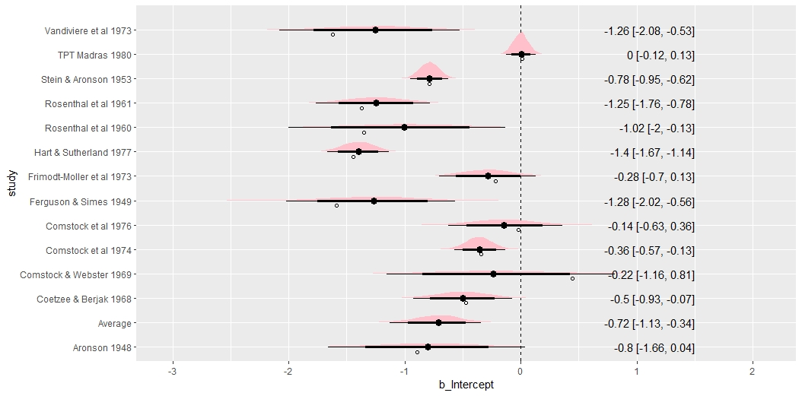

# Bayesian Meta-Analysis {#BayesMeta}

::: {.chapterintro data-latex=""}

- Learn how to fit and interpret Bayesian Meta-Analysis (MA)
- Understand the relationship between generalised linear models and MA

:::

<script src="hideOutput.js"></script>

```{r, echo = FALSE, message=FALSE, warning=FALSE}
# Every chapter, we will load all the library we will use at the beginning
# of the chapter. 
require(tidyverse)
library(DT)
library(brms)
library(magrittr)
library(metafor)
library(tidybayes)
library(ggdist)
library(cmdstanr)
library(bayesplot)
```

</br>

## Introduction

- **Meta-analysis** (MA), the pooling of evidence from independent sources, especially randomised controlled trials (RCTs) is now common in the medical research literature.

- A "fixed-effect" model assumes that a single parameter value is common to all studies, and a "random-effects" model that parameters underlying studies follow some distribution [@higgins2009re].

- Software advances have contributed to the widespread use of meta-analytic techniques.

- In this lecture, we will adopt the framework of generalised linear modelling (GLM) in the context of MA. Moreover, we will we see that every meta-analytic model comes with an inherent hierarchical structure [@dias2011general]. 

- GLM framework can, of course, be applied in either frequentist (maximizing the likelihood) or Bayesian contexts.

::: {.important data-latex=""}
**MA classical methods**

- The inverse variance method leads to two distinct approaches to data synthesis:

    - Fixed-effect: $\hat{\theta}=\frac{\sum Y_i W_i}{\sum W_i}$ = and its estimated variance is $\mathrm{var}(\hat{\theta})=\frac{1}{\sum W_i}=\frac{1}{\sum \frac{1}{V_i}}$
    - Random-effects: Same as before but using $W_i^*=\frac{1}{V_i+\hat{\tau}^2}$. Note that these weights include the between-study variance estimate
    
- When choosing between both model, one view is that if there is heterogeneity, then it does not make sense to compute a pooled esimate.
    - Only combine with fixed effets.
- Another view says that there is always heterogeneity.
    - Always combine with random effects model.
- Not recommended (any more) to test for heterogeneity to make the decision.

:::


## Bayesian inference

- MCMC sampling procedures:
    - Gibbs sampling (see document)
    - Gibbs sampling with slice sampler `JAGS` (see [here](http://www.columbia.edu/~cjd11/charles_dimaggio/DIRE/styled-4/styled-11/code-9/))
    - Hybrid (Hamiltonian) Monte Carlo `Stan`
    
  

## Continuous data

- Usually we will have effect sizes effect sizes $Y_i$ for each study $i$. 

- In a random-effects model, we assume that participants are nested within studies on a second level and that the true effect sizes $\theta_i$ of different studies in our meta-analysis follow their own distribution, where the variance of each study is known. This distribution of true effects has a mean $\mu$ (the pooled “true” effect we want to estimate) and variance $\sigma^2_\theta$, representing the between-study heterogeneity (sometimes denoted as $\tau^2_\theta=1/\sigma^2_\theta$.

- Therefore the generative model can be written as:

$$
\begin{align*} 
Y_{i} &\sim  \mathcal{N}(\theta_{i},\sigma^2_{Y_i}) \\ 
\theta_{i} &\sim  \mathcal{N}(\mu,\sigma^2_\theta) \\
\mu, \sigma^2_\theta &\sim p(.)
\end{align*}
$$

-  The fixed-effect model is simply a special case of this model in which we assume that $\sigma^2_\theta=0$, meaning that there is no between-study heterogeneity, and that all studies share one single true effect size (i.e. that for all studies $i:\quad \theta_i=\mu$).

- To run this model, we have to specify the prior distributions of $\mu$ and $\sigma^2_\theta$. Particularly when the number of studies is small, priors can have a considerable impact on the results.

- We will be using `brms` in this lecture. By default, `brms` use weakly informative priors (see [here](https://github.com/stan-dev/stan/wiki/Prior-Choice-Recommendations)). 

- When we say this prior is "weakly informative", it means that if there's a reasonably large amount of data, the likelihood will dominate. On the other hand, if the data are weak, this prior will stronglu influence the posterior.

### Fitting a MA with brms

- As mentioned previously, it is easy to fit MA models with `brms`.

- Meta-analyses are somewhat special, because we do not have a variable predicting the effect size (unless when we perform a meta-regression). Also, we have mentioned that MA are also special because the variance of the observed effect size is known ($\mathrm{var}(y_i)$). This can be done in `brms` by using `y|se(se_y)` instead of only `y`, where the `se(se_y)` is the standard error of each observed effect size $y_i$ in our data set.

- For the random-effects model, `brms` syntax will look like this: `y|se(se_y) ~ 1 + (1|random)`. **Try to guess how the syntax would be written if a fixed-effects model was used.**

**Example**

- @colditz1994efficacy performed a MA to examine the overall effectiveness of the BCG vaccine for preventing tuberculosis and to examine moderators that may potentially influence the size of the effect. This data is part of the library `metafor`.


```{r echo=FALSE}
dat <- dat.bcg

dat  %>%
  datatable(
  rownames = F,
  class = "compact",
  options = list(
    dom = 't',
    ordering = FALSE,
    paging = FALSE,
    searching = FALSE,
    columnDefs = list(list(className = 'dt-center', 
                      targets = 0:3))))

      
```

- We can calculate the log risk ratios and corresponding sampling variances with:

<div class="fold s">
```{r echo=T, warning=FALSE, message=FALSE}

dat <- escalc(measure="RR", ai=tpos, bi=tneg, ci=cpos, di=cneg, data=dat.bcg)
dat <- dat %>% rename(study=author) %>% mutate(study=paste(study,year))

```
<div>

- We can fit a (frequentist) random-effects model to these data using the library `metafor`.


```{r echo=T, message=FALSE, warning=FALSE, eval=T}
ma_out <- rma(data = dat, yi = yi, vi = vi, slab = dat$study)
summary(ma_out)
forest(ma_out)

```

- We can do the same but know under a Bayesian perspective.

```{r echo=T, message=FALSE, warning=FALSE, eval=FALSE}
fit_ma_random <- brm(data = dat,
             family = gaussian,
             yi | se(sqrt(vi)) ~ 1 + (1 | study), 
             iter = 2000, 
             warmup = 1000, 
             chains = 4, 
             cores = 4, #instructions on MCMC
             seed = 123, # random number seed to make results reproducible
             silent = 2,
             refresh = 0)


# saveRDS(fit_ma_random, "data/chap8_ma_random")
```

- Summarizing posterior results

```{r echo=FALSE, message=FALSE, warning=FALSE}
fit_ma_random <- readRDS("data/chap8_ma_random")
plot(fit_ma_random)
print(fit_ma_random)

```

- We can check the default priors in our model

```{r echo=FALSE, message=FALSE, warning=FALSE}
get_prior(data = dat,
             family = gaussian,
             yi | se(sqrt(vi)) ~ 1 + (1 | study))
```
 - The forest plot displays the entire posterior distribution of each $\theta_i$. The meta-analytic effect size $\mu$ is also displayed in the bottom row.
 
```{r echo=T, fig.align='center', warning=FALSE, message=FALSE, eval=FALSE}

out_r <- spread_draws(fit_ma_random, r_study[study,term], b_Intercept) %>% 
  mutate(b_Intercept = r_study + b_Intercept) 

out_f <- spread_draws(fit_ma_random, b_Intercept) %>% 
  mutate(study = "Average")

out_all <- bind_rows(out_r, out_f) %>% 
  ungroup() %>%
  mutate(study = fct_relevel(study, "Average")) %>% 
  mutate(study = str_replace_all(study, "\\.", " "))

out_all_sum <- group_by(out_all, study) %>% 
  mean_qi(b_Intercept)

out_all %>%   
  ggplot(aes(b_Intercept, study)) +
  geom_vline(xintercept = 0, size = .25, lty = 2) +
  stat_halfeye(.width = c(.8, .95), fill = "pink") +
  geom_text(
    data = mutate_if(out_all_sum, is.numeric, round, 2),
    aes(label = str_glue("{b_Intercept} [{.lower}, {.upper}]"), x = 1.5),
    hjust = "inward"
  ) +
  # Observed as empty points
  geom_point(
    data = dat %>% mutate(study = str_replace_all(study, "\\.", " ")), 
    aes(x=yi), position = position_nudge(y = -.2), shape = 1 
  )
```
```{r echo=FALSE, fig.align='center', fig.width=9, fig.height=5}

```

::: {.guidedexercise data-latex=""}
**Run a fixed-effect model** 
```{r echo=TRUE, eval=FALSE}
fit_ma_fixed <- brm(data = dat,
             family = gaussian,
             yi | se(sqrt(vi)) ~ 1, 
             iter = 2000, 
             warmup = 1000, 
             chains = 4, 
             cores = 4,
             seed = 123
             silent = 2,
             refresh = 0)

```
:::

### Meta-regression

- Meta-regressions are similar in essence to simple regressions, in which an outcome variable is predicted according to the values of one or more explanatory variables. In meta-regression, the outcome variable is the effect estimate. The explanatory variables are characteristics of studies that might influence the size of intervention effect. These are often called ‘potential effect modifiers’ or covariates.

- Using the same dataset (BCG vaccine), we will use the absolute latitude of the study location as a moderator. We first do it with `metafor`.

```{r echo=T, message=FALSE, warning=FALSE, eval=T}
ma_reg <- rma(yi, vi, mods = ~ ablat, data=dat)
summary(ma_reg)

```

- We can do the same with `brms`. 

```{r echo=T, message=FALSE, warning=FALSE, eval=FALSE}
fit_ma_reg <- brm(data = dat,
             family = gaussian,
             yi | se(sqrt(vi)) ~ 1 + ablat+ (1 | study), 
             iter = 2000, 
             warmup = 1000, 
             chains = 4, 
             cores = 4, #instructions on MCMC
             seed = 123, # random number seed to make results reproducible
             silent = 2,
             refresh = 0)


# saveRDS(fit_ma_reg, "data/chap9_ma_reg")
```

- Summarizing posterior results

```{r echo=FALSE, message=FALSE, warning=FALSE}
fit_ma_reg <- readRDS("data/chap9_ma_reg")
plot(fit_ma_reg)
print(fit_ma_reg)
```

- Compare models using loo-cv.

```{r echo=FALSE, message=FALSE, warning=FALSE}
loo_random <- loo(fit_ma_random)
loo_reg <- loo(fit_ma_reg)
loo_compare(loo_random,loo_reg)
```


## Other types of data

- The essential idea is that the basic apparatus of the meta-analysis remains the same, but the *likelihood* and the *link* function can change to reflect the nature of the data (continuous, rate, categorical), and the sampling process that generated it (Normal, Poisson, Multinomial, etc). In GLM theory, a likelihood is defined in terms of some unknown parameters $\gamma$, while a link function $g(·)$, maps the parameters of interest onto the plus/minus infinity range.

- Then, we have:

$$
\begin{align*}
Y_i &\sim P(.) \\
g(\gamma) &=  \theta_{i1}=\mu_i \\
g(\gamma) &=  \theta_{i2}=\mu_i + \delta_{i,12} \\
\delta_{i,12} &\sim \mathcal{N}(d_{12},\sigma^2)
\end{align*}
$$

- Where $P(.)$ denotes the likelihood (GLM), $g$ is an appropriate link function (for example the logit link), and $\theta_i$ is the linear predictor, usually a continuous measure of the treatment effect. $\mu_i$ are the trial-specific baseline effects in a trial $i$, treated as unrelated nuisance parameters. The $\delta_{i,12}$ are the trial-specific treatment effect of the treatment relative to control in that trial. 

- The only missing is the likelihood of the observed effet sizes. As an example, if we have binomial data (number of events and sample size per trial), we can write the MA generative model with this type of data.

$$
\begin{align*}
r_{ik} &\sim  \mathrm{Bin}(n_{ik},p_{ik}) \quad k=1,2\\
\mathrm{logit}(p_{i1}) &=  \mu_i \\
\mathrm{logit}(p_{i2}) &=  \mu_i+\delta_{i,12} \\
\delta_{i,12} &\sim \mathcal{N}(d_{12},\sigma^2) \\
d_{12}, \sigma^2,\mu_i &\sim p(.)
\end{align*}
$$


- As an example, @carlin1992meta consider a MA of 22 trials of beta-blockers to prevent mortality after myocardial infarction.

```{r echo=FALSE,include=T,message=F}

dat <- read.csv("data/blocker.csv")

dat %>%
  datatable(
  rownames = F,
  class = "compact",
  options = list(
    dom = 't',
    ordering = FALSE,
    paging = FALSE,
    searching = FALSE,
    columnDefs = list(list(className = 'dt-center',
                      targets = 0:3))))

```

- We will now fit this model in `Stan` (the PPL behind `brms`).

<div class="fold s">
```{stan output.var="MA_binomial",eval=F}
data {
  int ns;
  int r[ns,2];
  int n[ns,2];
}

parameters{
  real mu[ns];
  real<lower=0> sd_;
  real d_raw;
  real delta_raw[ns];
  
}

transformed parameters {
  matrix[ns,2] p;
  real d;
  real delta[ns];

  d = 5*d_raw;
  
  for(i in 1:ns){
    // implies: delta ~ normal(d, sd_)
    delta[i] = d + sd_*delta_raw[i];
    
    for(k in 1:2){
      if(k == 1){
        p[i,k] = inv_logit(mu[i]);
      } else {
        p[i,k] = inv_logit(mu[i] + delta[i]);
      }
    }
  }
}

model {
  
  target += normal_lpdf(d_raw| 0,1);
  
  for(i in 1:ns){
    target += normal_lpdf(delta_raw[i] | 0, 1);
    
    for(k in 1:2){
      target += binomial_lpmf(r[i,k]| n[i,k],p[i,k]);
    }
  }
}

```
<div>

- Below you will find the syntax to compile the model and run it in `R`.

```{r echo=T, message=FALSE, warning=FALSE, eval=F}
test = read.table("data/testData.txt",header = T)

r = cbind(test[,1],test[,3])
n = cbind(test[,2],test[,4])

data <- list(ns=22,
             r=r,
             n=n)

model=cmdstan_model("stan/model1a.stan")

fit=model$sample(data = data,
                      chains = 3,
                      parallel_chains = 3,
                      #max_treedepth = 15,
                      iter_warmup = 500,
                      iter_sampling = 1500)

#fit$save_object(file = "data/fit_stan.RDS")

```

- Summarizing posterior results

```{r echo=T, message=FALSE, warning=FALSE, eval=F}
# fit <- readRDS("data/fit_stan.RDS")
fit$summary(c("d","sd_","delta")) %>% select(variable,median,q5,q95,rhat) %>% 
  datatable(
  rownames = F,
  class = "compact",
  options = list(
    dom = 't',
    ordering = FALSE,
    paging = FALSE,
    searching = FALSE,
    columnDefs = list(list(className = 'dt-center', 
                      targets = 0:3))))
```

- Plotting baseline risks and the scatterplot of $d_{12}$ and $sigma$.

```{r echo=T, message=FALSE, warning=FALSE, eval=F}
theta = fit$draws(c("mu","d","sd_"))
mcmc_intervals(theta,regex_pars = "mu")
mcmc_pairs(theta,pars = c("d","sd_"))
```

::: {.guidedexercise data-latex=""}
**Run a fixed-effect mode and random-effects model with brms using the binomial data example** 
```{r echo=TRUE, eval=FALSE}
dat <- read.csv("data/blocker.csv")

fit_ma_binomial_random <-
  brm(data = dat,
      family = binomial,
      events | trials(ss) ~ trtid + (trtid|id),
      iter = 2000, warmup = 1000, cores = 4, chains = 4)

fit_ma_binomial_fixed<-
  brm(data = dat,
      family = binomial,
      events | trials(ss) ~ trtid,
      iter = 2000, warmup = 1000, cores = 4, chains = 4)


```
:::


### R Session information {-}


```{r echo=F}
getS3method("print","sessionInfo")(sessionInfo()[c(1:7)])
```

