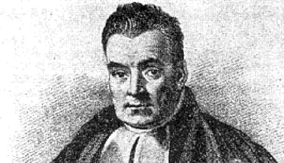
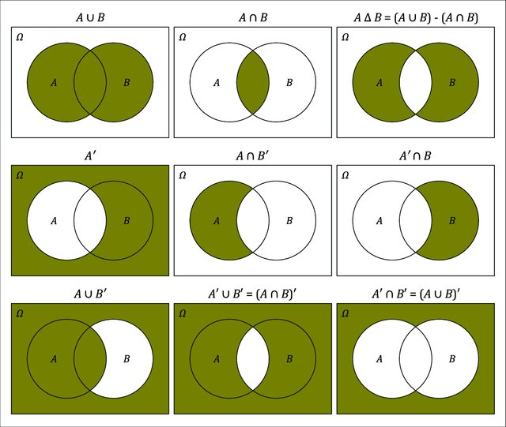
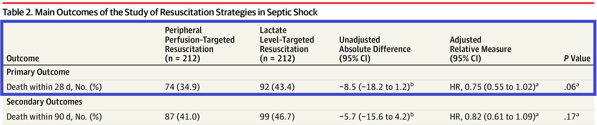

# University of Toronto Statement of Acknowledgment of Traditional Land {.unnumbered}

> "We wish to acknowledge this land on which the University of Toronto operates. For thousands of years it has been the traditional land of the Huron-Wendat, the Seneca, and the Mississaugas of the Credit. Today, this meeting place is still the home to many Indigenous people from across Turtle Island and we are grateful to have the opportunity to work on this land."


</br>


# Course Syllabus {.unnumbered}

## Course Info {.unnumbered}

*Course title*: Applied Bayesian Methods in Clinical Epidemiology and Health Care Research

*Semester*: Winter 2022

*Class hour and location*: Friday, 12pm to 3pm (Two parts: Lecture & Tutorial, with 15 mins break in between). 

**Please see Quercus for other course details.**

| Instructors       | Email     | Office Hour |
|:------------------|:----------|:------------|
| Kuan Liu (Kuan)   | [mailto:kuan.liu\@utoronto.ca](mailto:kuan.liu@utoronto.ca){.uri} |    Thursday, 12pm to 1pm         |
| Juan Pablo Díaz Martínez (Juan Pablo) |      [mailto:juan.diaz.martinez\@mail.utoronto.ca](mailto:juan.diaz.martinez@mail.utoronto.ca){.uri}  |             |

## Course Description {.unnumbered}

This course will introduce students to Bayesian data analysis. After a thorough review of fundamental concepts in statistics and probability, an introduction will be given to the fundamentals of the Bayesian approach. Students will learn how to use the brms package in the R statistical software environment to carry out Bayesian analyses of data commonly seen in health sciences. Bayesian methods will be covered for binary, continuous and count outcomes in one and two samples, for logistic, linear and Poisson regression, and for meta-analysis.

By the end of this course, students will:

1. Understand what is meant by a “Bayesian Analysis” and how it differs from a typical analysis under the frequentist framework
2. Understand how modern Bayesian models are fitted
3. Understand the role of prior(s) in Bayesian analysis and how to use prior(s)
4. Be able to fit Bayesian models to common types of study outcomes
5. know what aspects of the Bayesian analysis are an essential part of a statistical report
6. Have developed expertise in using the brms program within the R environment


*Pre-requisites*

HAD5316H – Biostatistics II: Advanced Techniques in Applied Regression Methods (or CHL5202H Biostatistics II) and basic programming knowledge in R or SAS. HAD5316H or CHL5202H may be taken concurrently with this course.

*Evaluation*

Class participation worth 10% and three individual assignments each worth 30%

## Course Textbook and Structure {.unnumbered}

1.  2nd edition of the book by Richard McElreath: <https://xcelab.net/rm/statistical-rethinking/> [@mcelreath2018statistical]
2.  Bayesian Approaches to Clincial Trials and Health-Care Evaluation by David Spiegelhalter, [free access via UT library](https://onlinelibrary-wiley-com.myaccess.library.utoronto.ca/doi/book/10.1002/0470092602) [@spiegelhalter2003]

The lecture slides will be one main resource for this course. McElreath has a series of lectures on YouTube that are well worth watching: https://www.youtube.com/playlist?list=UUNJK6_DZvcMqNSzQdEkzvzA (Links to an external site.). Additionally, this material, https://bookdown.org/content/4857/ (Links to an external site.) provide R code using brms and tidyverse, two R packages to recreate figures and tables in McElreath (2018).

## Calendar and Outline {.unnumbered}

| Date  | Topics                       | Assignment  |
|:------|:-----------------------------|:---------|
| Jan 7   | Course introduction; Why Bayesian; Bayesian versus Frequentist; Bayesian analysis used in clinical research        |         |
| Jan 14  | Review of probability and other statistics concepts |         |
| Jan 21  | Introduction to Bayesian approach          | Assignment 1: hand out        |
| Jan 28  | Bayesian Inference        |         |
| Feb 4   | Priors (guest lecturer: [Dr. Sindu Johnson](https://ihpme.utoronto.ca/faculty/sindhu-johnson/) )|   **Assignment 1: due Feb 8**      |
| Feb 11  | Bayesian estimation                  |   |
| Feb 18  | Normal Models and Linear Regression                            |   Assignment 2: hand out        |
| Feb 25  |  Reading week - no lecture                           |         |
| Mar 4   | Hierarchical models and convergence                            |         |
| Mar 11  | Models for Binary Data                            |    **Assignment 2: due Mar 15**     |
| Mar 18  | Intro to Bayesian Meta-analysis and Bayesian Network Meta-analysis (guest lecturer: Juan Pablo)                            |    Assignment 3: hand out     |
| Mar 25  | Models for Count Data         |    **Assignment 3: due Apr 5**     |


## Accessibility and Accommodations {.unnumbered}

The University provides academic accommodations for students with disabilities in accordance with the terms of the Ontario Human Rights Code. This occurs through a collaborative process that acknowledges a collective obligation to develop an accessible learning environment that both meets the needs of students and preserves the essential academic requirements of the University's courses and programs. For more information, or to register with Accessibility Services, please visit: <http://studentlife.utoronto.ca/as>.

## Academic Integrity {.unnumbered}

Academic integrity is essential to the pursuit of learning and scholarship in a university, and to ensuring that a degree from the University of Toronto is a strong signal of each student's individual academic achievement. As a result, the University treats cases of cheating and plagiarism very seriously. Help and information is available on the Academic Integrity website. The University of Toronto's Code of Behaviour on Academic Matters (<http://www.governingcouncil.utoronto.ca/policies/behaveac.htm>) outlines the behaviours that constitute academic dishonesty and the processes for addressing academic offences.


## Key Resources and Supports for DSLPH Graduate Students {.unnumbered}

- [U of T Student Mental Health Resources](https://mentalhealth.utoronto.ca/)
- [U of T Graduate Student Union](https://utgsu.ca/)
- [DLSPH Covid Information](http://www.dlsph.utoronto.ca/live-updates-on-covid-19-from-dlsph/)
- [DLSPH Student Resources(Policies, Financial Aid, Health and Wellness, etc.)](http://www.dlsph.utoronto.ca/students/current-students/)
- [DLSPH Student Handbook](https://www.dlsph.utoronto.ca/wp-content/uploads/2020/08/2020-21-Student-Handbook-19Aug.pdf)

## License {.unnumbered}

This work is licensed under a [Creative Commons Attribution-NonCommercial-ShareAlike 4.0 International License](https://creativecommons.org/licenses/by-nc-sa/4.0/).

<!--chapter:end:index.Rmd-->

# Introduction to the course {#into}

::: {.chapterintro data-latex=""}

- Students and instructor introduction
- Going over course syllabus
- A brief history of Bayesian inference
- The Bayesian way of thinking (statistical rethinking?)

:::


## About me

I am an Assistant Professor in Health Services Research (outcomes and evaluation method emphasis) at IHPME. I also hold a cross-appointment at the Division of Biostatistics. I received my PhD in Biostatistics from U of T under the supervision of [Dr. Eleanor Pullenayegum](https://www.sickkids.ca/en/staff/p/eleanor-pullenayegum/). 

My primary research focuses on developing methodology for statistical inference with complex longitudinal data in comparative effectiveness research. My areas of methodological interest include causal inference, **Bayesian statistics**, **longitudinal data analysis**, **bias analysis**, and **semi-parametric/parametric joint modelling**. If you are interested in working with me for your research/thesis projects, free feel to reach me.

Besides academic work and creating fun data visualizations in R ([Covid Dashboard](https://kuan-liu.shinyapps.io/canada_dash/); [3D Christmas Tree](https://github.com/Kuan-Liu/ChristmasTree3D)), I love watercolour painting, taking contemporary dance classes in Toronto, and playing 'piano' as an adult beginner (though I am still waiting for my piano being shipped from Japan).
  
 systematic review paper on the trustworthiness of published Clinical Practice Guidelines for Pharmacologic Treatments of Hospitalized Patients With COVID-19.](images/CoxcombChart.png)

::: {.guidedexercise data-latex=""}
**Please introduce yourselves**
You can share your program, research interest, learning goals, and hobby.
:::

## Syllabus

Detailed course syllabus is posted on Quercus.

::: {.important data-latex=""}
**Some important notes**

- *Course schedule*
   - LECTURE: 12:05pm - 1:45pm on Fridays
   - TUTORIAL: 2:00pm - 3:00pm on Fridays
   - Ratio may change substantially some weeks
   - 15 mins break between lecture and tutorial

- *Zoom office hour*
  - Thursdays between 12:00pm  - 1:00pm
  - Begins on January 13, 2021, ends on March 31, 2021
  - I am happy to arrange for additional virtual office hours
  
- *Course materials*
  - The lecture notes will be one main resource for this course.
      - Online course note is open-access ([GitHub Repository](https://github.com/Kuan-Liu/bayes_bookdown)). It's licensed under a [Creative Commons Attribution-NonCommercial-ShareAlike 4.0 International License](https://creativecommons.org/licenses/by-nc-sa/4.0/). Please do not use this material for commercial purposes.
      - Course notes for latter sessions might not be available for view. I aim to publish the day before the scheduled lecture.
  - Additional reading materials (e.g., articles) will be posted on Quercus
  - Sample R scripts, data and brms code will be uploaded to Quercus.

- *R and RStudio*
  - We will be using R via RStudio for this course. Key packages including tidyverse and brms.
  - You are encouraged to write you assignment using Rmarkdown. 
  <!-- Juan Pablo will provide a short live demo Rmarkdowm in the first tutorial. -->
  
- *'Grading'*
  - Participation under remote learning: **accommodation and written explanations**
  - Assignments will be handed out and submitted on **Quercus**
  - Can I work with peers?
 
- *Auditing the course*
  - Welcome but with caveats (past experience from George)
  - seriously committed (try not to miss classes)
  - expected to have the same level of participation
  
- *Quercus discussion board (Encourage!)*

:::

## Some history

### Bayesian history

Concepts of Bayesian approach first appeared in the famous paper of Reverent Thomas Bayes (1702-1761), "An essay towards solving a problem in the doctrine of chances" [@bayes1763lii].



- Thomas Bayes was a Presbyterian Minister who is thought to have been born in 1701 and died 1761. 
- Bayesian approach were never really practiced in Bayes’ lifetime.
- His work was developed and popularized by Pierre-Simon Laplace (1749–1827) in the early 19th century.


Though Bayes developed his philosophy during the 1740s, it wasn’t until the late twentieth century that this work reached a broad audience. During the more than two centuries in between, the frequentist philosophy dominated statistical research and practice. 

- Frequentist ideas came to predominate in the 20th century as a result of the work of Fisher (1890-1962), Neyman (1894-1981) and Egon Pearson (1984-1980).
- Reasons why the Bayesian approach did not catch on until relatively recently: debate of Bayesian philosophy and computational power.

::: {.important data-latex=""}

**Bayes’ rule by Bayes**

He essentially used probabilistic terms to express arguments about the uncertainty for the parameter of a binomial model

> Given the number of times in which an unknown event has happened and failed: Required the chance that the probability of its happening in a single trial lies somewhere between any two degrees of probability that can be named.

- “unknown event” = e.g., Bernoulli trial
- “probability of its happening in a single trial” $=p$
- We may know ahead of time, or not (e.g. $p=0.5$ for a fair coin)

:::


::: {.workedexample data-latex=""}
**The Monty Hall Problem and the Bayesian solution by Marilyn vos Savant**

> Suppose you're on a game show, and you're given the choice of three doors: Behind one door is a car; behind the others, goats. You pick a door, say No. 1, and the host, who knows what's behind the doors, opens another door, say No. 3, which has a goat. He then says to you, "Do you want to pick door No. 2?" Is it to your advantage to switch your choice?


From [wikipedia](https://en.wikipedia.org/wiki/Monty_Hall_problem), Vos Savant's response was that the contestant should switch to the other door. Many readers of vos Savant's column refused to believe switching is beneficial and rejected her explanation. After the problem appeared in Parade, approximately 10,000 readers, including nearly 1,000 with PhDs, wrote to the magazine, most of them calling vos Savant wrong ([Tierney 1991](https://query.nytimes.com/gst/fullpage.html?res=9D0CEFDD1E3FF932A15754C0A967958260)).

**We will revisit this problem in session 2 on Probability. I provided a short R simulation below to demonstrate why the player should choose to switch door - higher chance of winning the game.**

:::

<script src="hideOutput.js"></script>

--------------------------------------------------

**Monty Hall simulation in R**


```{r echo=T, message=FALSE, warning=FALSE}

set.seed(890123)

monty <- function(switch=F) {
  doors <- sample(c('car', 'goat', 'goat'), size=3, replace = FALSE)
  pick <- sample(1:3, size=1, replace = FALSE) #randomly pick 1 door out of the three doors;
  
  # Using logic true or false to determine a win;
  if (switch==T) {
    # if you chose to switch, you win if the car is not behind the picked door;
    win <- ifelse(doors[pick] != 'car', 1, 0)
  } else {
    # if you chose not to switch, you win if the car is behind the picked door;
    win <- ifelse(doors[pick] == 'car', 1, 0)
  }
  
  return(win) #return the winning outcome for each game;
}

# run the game for 1000 iterations;
# and record a vector of winning status for not switch and switch;
no_switch_win <- sapply(1:1000, FUN=function(i) monty(switch=F))
switch_win <- sapply(1:1000, FUN=function(i) monty(switch=T))
```

<div class="fold o">
```{r echo=T, message=FALSE, warning=FALSE}
print(paste("Chance of winning if we always not switch: ", sum(no_switch_win)/1000))
      
print(paste("Chance of winning if we always switch: ", sum(switch_win)/1000))

```
</div>


::: {.important data-latex=""}
**The recent rise in popularity**

- Advances in computing

- Re-evaluation of "subjectivity" of Bayesian approach due to its use of priors

**Key discussion on subjectivity by Gelman [@gelman2017beyond]**

> In discussions of the foundations of statistics, objectivity and subjectivity are seen as opposites. Objectivity is typically seen as a good thing; many see it as a major requirement for good science. Bayesian statistics is often presented as being subjective because of the choice of a prior distribution. 

> It has been argued that the subjective–objective distinction is meaningless because all statistical methods, Bayesian or otherwise, require subjective choices, but the choice of prior distribution is sometimes held to be particularly subjective because, unlike the data model, it cannot be determined even in the asymptotic limit.  

:::

### History of this course
::: {.important data-latex=""}
**[Prof. George Tomlinson created this course back in 2004](https://ihpme.utoronto.ca/faculty/george-a-tomlinson/)**

- He taught this course from 2004 to 2017 and again from 2020 to 2021. Prof. [Nicholas Mitsakakis](https://www.dlsph.utoronto.ca/faculty-profile/mitsakakis-nicholas/) taught it in 2019. 
- This is my first time teaching this course. We are making history together =)
- I have borrowed a lot of course materials from George. Thank you George!
- [Dr.Sindu Johnson](https://ihpme.utoronto.ca/faculty/sindhu-johnson/) and [Juan Pablo](https://juandiazmart.com/) will be our guest lecturers this year!


<!--  -->

:::


## Thinking like a Bayesian using the concept of probability

### Probability is not unitary

- Mathematically probability is clearly defined (a quantity between 0 and 1 etc., we will talk about this in session 2)
- There are a few ways of interpreting probability, most notably, **long run relative frequency** and **subjective probability**.

::: {.important data-latex=""}

**1. Long run relative frequency**

The classical or frequentist way of interpreting probability is based on the proportion of times an outcome occurs in a large (i.e. approaching infinity) number of repetitions of an experiment.

- This view has various serious problems, including that it requires the outcome to be **observable** and the "experiment" to be indeed **repeatable**!

**2. Subjective probability**

The alternative way (essentially proposed by Bayes, LaPlace, other later prominent Bayesians) is the subjective probability.

- It encompasses one's views, opinions or beliefs about an event or statement.
- This event does not have to be repeatable or the outcome observable.
- It is based on belief.
- Using this approach, we can express the uncertainty around parameters using probability distributions (e.g., beta distribution for the risk $\theta$ of death after an operation)
:::

Example from [@johnsonbayes]

::: {.guidedexercise data-latex=""}
**Different interpretation of probability/uncertainty**

1. When flipping a fair coin, we say that “the probability of flipping Heads is 0.5.” How do you interpret this probability?
    a. If I flip this coin over and over, roughly 50% will be Heads.
    b. Heads and Tails are equally plausible.
    c. Both a and b make sense.

2. An election is coming up and a pollster claims that candidate A has a 0.6 probability of winning. How do you interpret this probability?
    a. If we observe the election over and over, candidate A will win roughly 60% of the time.
    b. Candidate A is much more likely to win than to lose.
    c. The pollster’s calculation is wrong. Candidate A will either win or lose, thus their probability of winning can only be 0 or 1.
:::

In the coin flip example, a Bayesian would conclude that Heads and Tails are equally likely. In contrast, a frequentist would conclude that if we flip the coin over and over and over, roughly 1/2 of these flips will be Heads.


### Bayes' Rule

**Bayes' rule** specifies how a prior probability $P(H)$ of event $H$ is updated in response to the evidence/data $E$ to obtain the posterior probability $P(H|E)$.
\[
P(H|E) = \frac{P(E|H)P(H)}{P(E)} \propto P(E|H)P(H)
\]

- Event $H$ represents a particular hypothesis^[We're using "hypothesis" in the sense of a general scientific hypothesis, not necessarily a statistical null or alternative hypothesis.] (or model or parameter)
- Event $E$ represents observed evidence (or data or information)
- $P(H)$ is the unconditional or **prior probability** of $H$ (prior to observing $E$)
- $P(H|E)$ is the conditional or **posterior probability** of $H$ after observing evidence $E$.
- $P(E|H)$ is the **likelihood** of evidence $E$ given hypothesis (or model or parameter) $H$
- The symbol $\propto$ "proportional to", i.e., the right hand side needs to be divided by a normalizing factor (commonly viewed as a "constant" under Bayesian framework).

The Bayesian approach provides a probability of the hypothesis given the data/evidence, which is something generally highly desirable from a scientific perspective.


### The Scientific Method in steps

1. Define the question or problem
2. Assess the currently available information decide whether it is sufficient or not
    2.1 If yes: conclusions, decisions, actions
    2.2 If no, proceed to step 3.
3. Determine what additional information is needed and design a study or experiment to obtain it
4. Carry out the study designed in step 3.
5. Use the data obtained in step 4 to update what was previously known. Return to
step 2.

**Bayesian Advantages: Bayesian methods are especially good in step 2 and 5**

- They can be used for representing well existing knowledge and also to explicitly update uncertainty using new evidence.
- This is a done in a coherent, natural way.


::: {.workedexample data-latex=""}

The ELISA test for HIV was widely used in the mid-1990s for screening blood donations. As with most medical diagnostic tests, the ELISA test is not perfect.

- If a person actually carries the HIV virus, experts estimate that this test gives a positive result 97.7% of the time.  (This number is called the *sensitivity* of the test.)
- If a person does not carry the HIV virus, ELISA gives a negative (correct) result 92.6% of the time (the *specificity* of the test).
- Assume the estimated HIV prevalence at the time was 0.5% of (the *prior base rate*). 

Given a randomly selected individual tested positive; we are interested in the conditional probability that the person actually carries the virus.

Suppose a randomly selected individual **tested positive**:

 - If we know the **likelihood** of getting a **positive test** if HIV is truly present, $P(T^+ \mid D^+) = 0.977$,
 - and the **likelihood** of getting a **positive test** if HIV is not present, $P(T^+ \mid D^-) = 1 - 0.926 = 0.074$,
 - Using the Bayes' Rule, we can obtain the posterior probability of the disease given the positive test result, 

 $$\begin{aligned}
P(D^+ \mid T^+) & = \frac{P(T^+ \mid D^+)P(D^+)}{P(T^+)} \\
& = P(T^+ \mid D^+) \frac{P(D^+)}{P(T^+)}\\
\Bigg( \begin{matrix}
\text{Probability of}  \\
\text{HIV given} \\
\text{a positive} \\
\text{test} 
\end{matrix} \Bigg) & = \Bigg(\begin{matrix}
\text{Probability of}  \\
\text{a positive} \\
\text{test among} \\
\text{HIV patients} 
\end{matrix} \Bigg) \times \frac{\text{Probability of having HIV}}{\text{Probability of a positive test}} \\
& \propto \Bigg(\begin{matrix}
\text{Probability of}  \\
\text{a positive} \\
\text{test among} \\
\text{HIV patients} 
\end{matrix} \Bigg) \times \text{Probability of having HIV}
\end{aligned}$$

We can see here the posterior probability is an updated belief!
 
:::


::: {.important data-latex=""}

**To summarize conceptually**

- we have some belief about the state of the world, expressed as a mathematical model (such as the linear model used in regression). 
- The Bayesian approach provides an updated belief as a weighted combination of prior beliefs regarding that state and the currently available evidence, with the possibility of the current evidence overwhelming prior beliefs, or prior beliefs remaining largely intact in the face of scant evidence.

\[ 
\text{updated belief} = \text{current evidence} \times \text{prior belief or evidence}
\]

:::


<!--chapter:end:01-intro_to_course.Rmd-->

---
bibliography: [book.bib, packages.bib]
biblio-style: apalike
link-citations: yes
colorlinks: yes
---

# Lab1 Getting started with R & RStudio {-}

::: {.chapterintro data-latex=""}

- Successfully install R and RStudio
- Install tidyverse and brms
- Try out some base R code
- Play with data frame and produce some summary statistics
- Learn about Rmarkdown with live demo by Juan Pablo

:::

## R and RStudio Installation

R is a language and environment for statistical computing and graphics (https://cran.r-project.org/manuals.html). Many users of R like a tool called **RStudio** (https://www.rstudio.com/). This software is what is called an Integrated Development Environment (IDE) for R. It has several nice features, including docked windows for your console and syntax-highlighting editor that supports direct code execution, as well as tools for plotting and workspace management.

### Windows operating system

- install R, https://cran.r-project.org/bin/windows/base/
- install RStudio, https://www.rstudio.com/products/rstudio/download/#download
- [YouTube Instruction](https://www.youtube.com/watch?v=TFGYlKvQEQ4)

### macOS operating system

- install R, https://cran.r-project.org/bin/macosx/
- install RStudio, https://www.rstudio.com/products/rstudio/download/#download (select macOS 10.14+ option)
- [YouTube Instruction](https://www.youtube.com/watch?v=LanBozXJjOk)


## R Packages
Packages are the fundamental units of reproducible R code. They include reusable R functions, the documentation that describes how to use them, and sample data.[@wickham2015r]

To load the functions in a given package, we first have to install the package. We do this using the install.packages() function. Run the line of code that installs the tidyverse package below by removing the # at the start of the second line to ‘uncomment’ the code. R will install the package to a default directory on your computer. If any dialogue box prompts you to ‘set up a personal library instead’, click yes. Once we have the package installed, we must load the functions from this library so we can use them within R.

```{r echo=T, warning=F, message=F}
  # install.packages(“tidyverse”, dependencies = T) #uncomment this line if you haven't installed this package;
  library(ggplot2) # load package library
  library(dplyr)
```

The tidyverse is an opinionated collection of R packages designed for data science. All packages share an underlying design philosophy, grammar, and data structures (https://www.tidyverse.org/). The core packages are ggplot2 (data visualization), dplyr(dataframe manipulation), tidyr(data reshaping), readr(reading datasets), purrr (function and iterations) and tibble(dataframe).


### Bayesian Analysis in R using brms package

The course will mainly use the brms package in R[@burkner2017advanced], which offers a standard R-modelling type interface to the underlying computing engine Stan. Direct use of Stan is not ideal for teaching Bayesian methods.  The brms package automatically writes Stan code that can be viewed and edited, so after learning brms, the enterprising student may want to use this Stan code as a steppingstone toward programming directly in Stan. The brms package can be installed and loaded in the same way as any other R package, in this case by typing the following commands in R:

```{r echo=T, warning=F, message=F}
#uncomment this line if you haven't installed this package;  
# install.packages(“brms”) 
  library(brms)
```

## Working in RStudio

### RStudio layout

When you open RStudio, your interface is made up of four panes as shown below. These can be organised via menu options **View > Panes >**


We can run code in the console at the prompt where R will evaluate it and print the results. However, the best practice is to write your code in a new script file so it can be saved, edited, and reproduced. To open a new script, we select **File > New File > R Script**. 

To run code that was written in the script file, you can highlight the code lines you wish be evaluated and press CTRL-Enter (windows) or Cmd+Return (Mac). Additionally, You can comment or uncomment script lines by pressing Ctrl+Shift+C (windows) or Cmd+Shift+C (Mac). The comment operator in R is `# `. You can find more RStuio default [keyboard shortcuts here](https://support.rstudio.com/hc/en-us/articles/200711853-Keyboard-Shortcuts-in-the-RStudio-IDE).

In our first tutorial, we will also introduce Rmarkdown, a R version of the markdown file editor that can write and output document in html, word, or pdf format that contents not only the programming code but also any evaluation outputs and graphs. To read more about Rmarkdown, please visit https://rmarkdown.rstudio.com/lesson-1.html.

### Customization

You can customize your RStudio session under the Options dialog **Tools > Global Options** menu (or **RStudio > Preferences** on a Mac). A list of customization categories can be found here, https://support.rstudio.com/hc/en-us/articles/200549016-Customizing-RStudio. For example, it's popular to change RStudio appearance and themes (e.g., mordern, sky, dark, and classic).

### Working directory
The working directory is the default location where R will look for files you want to load and where it will put any files you save. You can use function `getwd()` to display your current working directory and use function `setwd()` to set your workding directory to a new folder on your computer. One of the great things about using RStudio Projects is that when you open a project it will automatically set your working directory to the appropriate location. 

```{r echo=T, warning=F, message=F}
getwd() #show my current working directory;
```


### Getting help with R

The help section of R is extremely useful if you need more information about the packages and functions that **you are currently loaded**. You can initiate R help using the help function `help() ` or `?`, the help operator.

```{r echo=T, warning=F, message=F, eval=F}
help(brms)
```


## Basic R (a crash introduction) 

A more comprehensive introduction to base R can be found at https://cran.r-project.org/doc/manuals/r-release/R-intro.html. In this subsection, I will briefly outline some common R functions and commands for arithmetic, creating and working with object, vector, matrix, and data. 

This short introduction is created using the intro to R workshop notes by [Prof. Kevin Thorpe](https://www.dlsph.utoronto.ca/faculty-profile/thorpe-kevin-e/) as well as multiple open-source materials. 

::: {.important data-latex=""}
**Some important notes**

- R is case sensitive.

- Commands are separated by a newline in the console.

- The # character can be used to make comments. R doesn’t execute the rest of the line after the # symbol - it ignores it.

- Previous session commands can be accessed via the up and down arrow keys on the keyboard.

- When naming in R, avoid using spaces and special characters (i.e., !@#$%^&*()_+=;:'"<>?/) and avoid leading names with numbers.
:::


<script src="hideOutput.js"></script>

### Arithmetic 


```{r echo=T, message=FALSE, warning=FALSE, eval=FALSE}
2*3
2^3
2 + (2 + 3) * 2 - 5

log(3)
exp(3)
log(exp(1)) #playing with Euler's number;
sqrt(x)

#Logical operators;
5>6
5<=6
5==6 #equal;
6==6
5!=6 #not equal;

```

::: {.guidedexercise data-latex=""}
**Rounding Issues in R**
Try evaluating `log(0.01^200) ` and `200*log(0.01)` in R. Note that they are mathematically equivalent.
:::

<div class="fold o">
```{r echo=T, message=FALSE, warning=FALSE}
log(0.01^200)
200*log(0.01)
```
</div>


### Vectors

Operator `<- ` is called the assignment operation, we can create a vector (numeric, characteristic, or mixture) using the assignment operation and the `c()` function.


```{r echo=T, warning=F, message=F, eval=FALSE}
# a vector of a single element;
x <- 3
x

# a character vector
x <- c("red", "green", "yellow")
x
length(x)
nchar(x) #number of characters for each element;

# encode a vector as a factor (or category);
y <- factor(c("red", "green", "yellow", "red", "red", "green"))
y
class(y)
as.numeric(y) # we can return factors with numeric labels;

# we can also label numeric vector with factor levels;
z <- factor(c(1,2,3,1,1,2), levels = c(1,2,3), labels = c("red", "green","yellow"))
z
class(z)
mode(z)

#we can use this to create dummy variables for regression;
contrasts(z) 

# a numeric vector;
x <- c(10.4, 5.6, 3.1, 6.4, 21.7, 53.5, 3.6, 2.6, 6.1, 1.7)
x
x[2]
x[1:3]
x[-1]
x[-(1:3)]
length(x) #return number of elements;

# a numeric vector composed of all integers between 1 and 10;
y <- 1:10
y

# a numeric vector composed of all even number integers between 0 and 10;
z <- seq(0,10, by=2)
z

# simple vector based calculations;
x + y
x*y
x/y

# matrix in R;
matrix(1:16, nrow=4)
matrix(1:16, nrow=4, byrow=TRUE)
matrix(1:16, nrow=4)
diag(matrix(1:16, nrow=4))
diag(c(1,-3,7))
diag(3)

# matrix calculation;
X <- matrix(1:16, nrow=4, byrow=T)
X
t(X) #transpose;

Y <- matrix(seq(1,32, by=2), nrow=4, byrow=T)
Y

Y + X
Y - X

3 * X
X * Y
X %*% Y #inner product;

```

### Data frame - The Titanic dataset


```{r echo=T, eval=knitr::is_html_output(), message=FALSE, collapse=TRUE}
Titanic <- read.csv('data/Titanic.csv', header = TRUE, na.strings = "NA")
knitr::kable(rbind(head(Titanic), tail(Titanic)), row.names = FALSE)
```

::: {.guidedexercise data-latex=""}
**Reading data**

- create a local folder, *HAD5314H_Bayesian_2022*, in your PC where you will store the Titan.csv file downloaded from Quercus
- set your working directory to this folder
- import the csv data to your session
:::

```{r echo=TRUE, eval=FALSE, message=FALSE, collapse=TRUE}
dim(Titanic)
str(Titanic)

names(Titanic)
Titanic$Age
Titanic[,c("Age")]
Titanic[2:3, 2:3]


# some quick dplyr data manipulation;

Titanic %>% 
  filter(PClass == "1st") %>% # filter on 1st class; passengers;
  select(Id, Name, Age, Sex, Survived) # select these; columns only;

# looking at the distinct values;
Titanic %>%
  distinct(PClass)

table(Titanic$PClass, useNA = "always")

# counting missing values;
Titanic %>%
  summarise(count = sum(is.na(PClass)))

# quick summary;
mean(Titanic$Age)
sum(is.na(Titanic$Age)) # counting missing values;
mean(Titanic$Age, na.rm = TRUE)
median(Titanic$Age, na.rm = TRUE)
quantile(Titanic$Age, probs =c(0.25,0.75), na.rm = TRUE)

Titanic %>% 
  summarise(mean = mean(Age, na.rm = TRUE),
            na = sum(is.na(Age)),
            med = median(Age, na.rm = TRUE))

# summary by group;
Titanic %>% 
  group_by(PClass) %>%
  summarise(mean = mean(Age, na.rm = TRUE),
            na = sum(is.na(Age)),
            med = median(Age, na.rm = TRUE)) 

```

::: {.guidedexercise data-latex=""}
**Summarize age by survival status**
Using the example code above, please calculate the mean and median age by survival status. Can you figure out how to get IQR with the pipe operator `%>%` in dlypr?
:::

### Simple plots

```{r echo=T, fig.height=5, fig.width=5}
boxplot(Age~PClass, data=Titanic)
```

```{r echo=T, fig.height=5, fig.width=5, warning=FALSE}
p <- ggplot(Titanic, aes(x=as.factor(PClass), y=Age)) + 
  geom_boxplot()
p
```

```{r echo=T, fig.height=5, fig.width=5, warning=FALSE}
ggplot(Titanic, aes(x=as.factor(PClass), y=Age, fill = as.factor(PClass))) + 
  geom_boxplot() + 
  geom_jitter(shape=16, position=position_jitter(0.2)) +
  labs(title="Plot of age by passenger class",x="Passenger Class", y = "Age", fill = "Passenger Class")+
  theme_classic()

```

::: {.guidedexercise data-latex=""}
**Plot age distribution by survival status**
Using the example code above, please generate a boxplot of age by survival status.
:::

### R Session information {-}

```{r echo=F}
getS3method("print","sessionInfo")(sessionInfo()[c(1:7)])
```


<!--chapter:end:02-intro_to_R.Rmd-->

# Probability, random variables and distributions {#prob}

::: {.chapterintro data-latex=""}

- Review of probability terminologies, probability rules, and Venn Diagrams
- Review conditional probability, independence, and Bayes' theorem. 
- Review on random variables and common probability distributions
:::

<script src="hideOutput.js"></script>

```{r, echo = FALSE, message=FALSE, warning=FALSE}
# Every chapter, we will load all the library we will use at the beginning
# of the chapter. 
library(tidyverse)
library(VennDiagram)
library(gganimate)
library(tweenr)
library(ggpubr)
options(scipen = 999)
```


</br>


## Probability

**Probability has a central place in Bayesian analysis**

- we put a prior probability distribution on the unknowns (parameters),
- we model the observed data with a probability distribution (likelihood),
- and we combine the two into a posterior probability distribution


::: {.important data-latex=""}
**Probability Terminology**[@evans2004probability]

- **Sample space** This set of all possible
outcomes of an experiment/trial is known as the sample space of the experiment/trial and is denoted by $S$ or $\Omega$.

- **Experiment/Trial**: each occasion we observe a random phenomenon that we know what outcomes can occur, but we do not know which outcome will occur

- **Event**: Any subset of the sample space $S$ is known as an event, denoted by $A$. Note that, $A$ is also a collection of one or more outcomes. 

- **Probability defined on events**: For each event $A$ of the sample space $S$, $P(A)$, the probability of the event $A$, satisfies the following three conditions:
    a. $0 \leq P(A) \leq 1$
    b. $P(S) = 1$ and $P(\emptyset) = 0$; $\emptyset$ denotes the empty set
    c. $P$ is (countably) additive, meaning that if $A_1, A_2, \ldots$ is a finite or countable sequence of disjoint (also known as mutually exclusive events), then
    \[P(A_1 \cup A_2 \cup \ldots ) = P(A_1)+P(A_2)+\ldots \]
    
- **Union:** Denote the event that either $A$ or $B$ occurs as $A\cup B$.

- **Intersection:** Denote the event that **both** $A$ and $B$ occur as $A\cap B$

- **Complement:** Denote the event that $A$ does not occur as $\bar{A}$ or $A^{C}$ or $A^\prime$ (different people use different notations)

- **Disjoint** (or **mutually exclusive**): Two events $A$ and $B$ are said to be **disjoint** if the occurrence of one event precludes the occurrence of the other. *If two events are mutually exclusive, then* $P(A\cup B)=P(A)+P(B)$


:::

::: {.workedexample data-latex=""}

**Sample Space**

1. If the experiment consists of the flipping of a coin, then \[ S = \{H, T\}\]
2. If the experiment consists of rolling a die, then the sample space is \[ S = \{1, 2, 3, 4, 5, 6\}\]
3. If the experiments consists of flipping two coins, then the sample space consists of the following four points:
\[ S = \{(H,H), (H,T), (T,H), (T,T)\}\]

**Event**

1. In Example (1), if E = {H}, then E is the event that a head appears on the flip of the coin. Similarly, if $E = \{T \}$, then $E$ would be the event that a tail appears
2. In Example (2), if $E = \{1\}$, then $E$ is the event that one appears on the roll of the die. If $E = \{2, 4, 6\}$, then $E$ would be the event that an even number appears on the roll.
3. In Example (3), if $E = \{(H, H), (H, T )\}$, then $E$ is the event that a head appears on the first coin.


**Probability of an event**. Let $R$ be the sum of two standard dice. Suppose we are interested in $P(R \le 4)$. Notice that the pair of dice can fall 36 different ways (6 ways for the first die and six for the second results in 6x6 possible outcomes, and each way has equal probability $1/36$. 
$$\begin{aligned} P(R \le 4 )	
  &=	P(R=2)+P(R=3)+P(R=4) \\
	&=	P(\left\{ 1,1\right\} )+P(\left\{ 1,2\right\} \mathrm{\textrm{ or }}\left\{ 2,1\right\} )+P(\{1,3\}\textrm{ or }\{2,2\}\textrm{ or }\{3,1\}) \\
	&=	\frac{1}{36}+\frac{2}{36}+\frac{3}{36} \\
	&=	\frac{6}{36} \\
	&=	\frac{1}{6} \end{aligned}$$
	
:::

### Venn Diagrams

**Venn diagrams provide a very useful graphical method for depicting the sample space S and subsets of it.** 

Figure taken from [@cardinal2019sets].

```{r echo=FALSE, fig.cap="Venn Diagram for two events", fig.align='center', out.width = '75%'}

```


::: {.guidedexercise data-latex=""}

1. **Venn Diagram for two disjoint events** How would you draw this venn diagram?

2. **Label sub-regions in a Venn Diagram for three events** Using set theory, how would you write out areas *a*, *d*, and *f* ?
:::

<div class="fold s">
```{r, echo=T, fig.height=4, fig.width=4, fig.align = 'center', eval=TRUE}
A <- c("a","b", "d","e")
B <- c("b","c", "d","f")
C <- c("d","e","f","g")
x <- list(A=A , B=B , C=C)
v0 <- venn.diagram( x, filename=NULL, fill = c("red", "blue", "green"),
                    alpha = 0.50, col = "transparent")

overlaps <- calculate.overlap(x)
# extract indexes of overlaps from list names
indx <- as.numeric(substr(names(overlaps),2,2))
# labels start at position 7 in the list for Venn's with 3 circles
for (i in 1:length(overlaps)){
  v0[[6 + indx[i] ]]$label <- paste(overlaps[[i]], collapse = "\n") 
}

grid.draw(v0)
```
<div>

### Probability Rules


**General Addition Rule:** $P(A\cup B)=P(A)+P(B)-P(A\cap B)$

The reason behind this fact is that if there is if $A$ and $B$ are not disjoint, then some area is added twice when we calculate $P\left(A\right)+P\left(B\right)$. To account for this, we simply subtract off the area that was double counted. If $A$ and $B$ are disjoint, $P(A\cup B)=P(A)+P(B)$.


**Complement Rule:** $P(A)+P(A^c)=1$

This rule follows from the partitioning of the set of all events ($S$) into two disjoint sets, $A$ and $A^c$.  We learned above that $A \cup A^c = S$ and that $P(S) = 1$.  Combining those statements, we obtain the complement rule.


**Completeness Rule:** $P(A)=P(A\cap B)+P(A\cap B^c)$

This identity is just breaking the event $A$ into two disjoint pieces.

**Law of total probability (unconditioned version):**  Let $A_1, A_2, \ldots$ be events that form a partition of the sample space $S$, Let $B$ be any event. Then,
\[P(B) = P(A_1 \cap B) + P(A_2 \cap B) + \ldots. \]

This law is key in deriving the marginal event probability in Bayes' rule. Recall the HIV example from session 1, we have $P(T^+) = P(T^+ \cap D^+)+P(T^+ \cap D^-)$.

```{r echo=FALSE, fig.cap="Demonstrate Law of total probabiliy using Venn Diagram", fig.align='center', out.width = '60%'}
knitr::include_graphics("images/law_tot_prob.png")
```


::: {.workedexample data-latex=""}
**Law of Total Probability** Suppose I know that whenever it rains there is 10% chance of being late at work, while the chance is only 1% if it does not rain. Suppose that there is 30% chance of raining tomorrow; what is the chance of being late at work?

Denote with event $A$ as "I will be late to work tomorrow" and event $B$ as "It is going
to rain tomorrow"

$$\begin{aligned}
P(A) &= P(A\mid B)P(B) + P(A \mid B^c) P(B^c) \\
	          &=	0.1\times 0.3+0.01\times 0.7=0.037
\end{aligned}$$

:::


**Conditional Probability**: The probability of even $A$ occurring under the restriction that $B$ is true is called the conditional probability of $A$ given $B$. Denoted as $P(A|B)$.

In general we define conditional probability (assuming $P(B) \ne 0$) as 
$$P(A|B)=\frac{P(A\cap B)}{P(B)}$$
which can also be rearranged to show 
$$\begin{aligned}
P(A\cap B)	&=	P(A\,|\,B)\,P(B) \\
	          &=	P(B\,|\,A)\,P(A)
\end{aligned}$$

- Because the order doesn't matter and $P\left(A\cap B\right)=P\left(B\cap A\right)$.
- $P(A|B) = 1$ means that the event $B$ implies the event $A$.
- $P(A|B) = 0$ means that the event $B$ excludes the possibility of event $A$.

**Independent:** Two events $A$ and $B$ are said to be **independent** if $P(A\cap B)=P(A)P(B)$.
 
What independence is saying that knowing the outcome of event $A$ doesn't give you any information about the outcome of event $B$. *If $A$ and $B$ are independent events, then $P(A|B)	=	P(A)$ and $P(B|A) = P(B)$.*

> In simple random sampling, we assume that any two samples are independent. In cluster sampling, we assume that samples within a cluster are not independent, but clusters are independent of each other.

- Assumptions of independence and non-independence in statistical modelling are
important.

- In linear regression, for example, correct standard error estimates rely on
independence amongst observations.

- In analysis of clustered data, non-independence means that standard regression
techniques are problematic.


**Bayes' Rule:** This arises naturally from the rule on conditional probability. Since the order does not matter in $A \cap B$, we can rewrite the equation: 

$$\begin{aligned} 
P(A\mid B) &=	\frac{P(A \cap B) }{P(B)}\\
 &=	\frac{P(B \cap A)}{P(B)}\\
 &=	\frac{P(B\mid A)P(A) }{P(B)}\\
 &=	\frac{P(B\mid A)P(A) }{P(B \cap A) + P(B \cap A^C)}\\
&=	\frac{P(B\mid A)P(A) }{P(B\mid A)P(A) + P(B\mid A^C)P(A^C)}
\end{aligned}$$ 


 
### How to define and assign probabilities in general?

1. **Frequency-type (Empirical Probability)**: based on the idea of frequency or long-run frequency of an event.
    - Observe sequence of coin tosses (trials)  and the count number of times of event $A=\{H\}$. The relative frequency of $A$ is given as,
\[ P(A) = \frac{\text{Number of times A occurs}}{\text{Total number of trials}}. \]
    - Trials are independent. Relative frequency is unpredictable in short-term, but in long-run it's predicable. Let $n$ be the total number of trials and $m$ be number of heads, then we have \[ P(A) = \lim_{n \rightarrow \infty} \frac{m}{n}.\]
    - **Theoretical Probability**: Sometimes $P(A)$ can be deduced from mathematical model using uniform probability property on finite spaces.
        - If the sample space S is finite, then one possible probability measure on $S$ is the uniform probability measure, which assigns probability $1/|S|$, **equal probability to each outcome**. Here |S| is the number of elements in the sample space $S$. By additivity, it then follows that for any event $A$ we have,
   
    $$ P(A) = \frac{|A|}{|S|} = \frac{\text{Number of outcomes in S that satisfy A}}{\text{Total number of outcomes in S} } $$
    - **Long-term frequency** It is natural to think of large sequences of similar events defining frequency-type probability if we allow the number of trials to be indefinitely large. 


```{r echo=TRUE, fig.cap="Demonstrate law of large number with the coin tossing example", fig.height=4, fig.width=4, fig.align = 'center', eval=TRUE}
n = 1000
pHeads =0.5
set.seed(123)
flipSequence = sample( x=c(0,1),prob = c(1-pHeads,pHeads),size=n,replace=T)
 
r = cumsum(flipSequence)
n= 1:n
runProp = r/n
 
flip_data <- data.frame(run=1:1000,prop=runProp)

ggplot(flip_data,aes(x=run,y=prop,frame=run)) + 
  geom_path()+
  xlim(1,1000)+ylim(0.0,1.0)+
  geom_hline(yintercept = 0.5)+
  ylab("Proportion of Heads")+
  xlab("Number of Flips")+
  theme_bw()
```


2. **Belief-type (Subjective Probability)**: based on the idea of degree of belief (weight of evidence) about an event where the scale is anchored at certain (=1) and impossible (=0).

::: {.workedexample data-latex=""}
**Subjective Probability**
Consider these events

1. We will have more than 100cm of snow this winter.
2. An asteroid is responsible for the extinction of the dinosaurs
3. Mammography reduces the rate of death from breast cancer in women over 50 by more than 10%
4. The 70 year old man in your office, just diagnosed with lung cancer, will live at least 5 years

Can you think of them in terms of long-run frequencies?

- We cannot always think in terms of long-run frequencies
- Also, we may not care about long-run frequencies
- How are they relevant to this patient, this hypothesis?
- Even where long-run frequency could apply, often there is no such data available
- However, opinions are formed and beliefs exist

:::

3. **Which probability to use?**

- For inference, the Bayesian approach relies mainly on the belief interpretation of probability.

- The laws of probability can be derived from some basic axioms that do not rely on long-run frequencies.


::: {.workedexample data-latex=""}
**The Monty Hall Problem Revisit**

> Suppose you're on a game show, and you're given the choice of three doors: Behind one door is a car; behind the others, goats. You pick a door, say No. 1, and the host, who knows what's behind the doors, opens another door, say No. 3, which has a goat. He then says to you, "Do you want to pick door No. 2?" Is it to your advantage to switch your choice?


Before any door is picked, we assume all three doors are equal likely to have a car behind it (prior probability of 1/3). Without loss of generality, let assume we pick door 1 and Monty opens door 2 (goat behind).

- $P( \text{door 1 has car}) = P( \text{door 2 has car}) = P( \text{door 3 has car)} = \frac{1}{3}$

- $P( \text{Monty opens door 2} \mid \text{door 1 has car} ) = \frac{1}{2}$ 

- $P( \text{Monty opens door 2} \mid \text{door 2 has car} ) = 0$ 

- $P( \text{Monty opens door 2} \mid \text{door 3 has car} ) = 1$ 

We want to know these two probabilities: $P( \text{door 1 has car} \mid \text{Monty opens door 2} )$ and $P( \text{door 3 has car} \mid \text{Monty opens door 2} )$. Simplify notations, we have 

$$\begin{aligned} 
& P( D_1 = \text{car} \mid \text{open } D_2 ) \\
& = \frac{P( \text{open } D_2 \mid D_1 = \text{car} )P(D_1 = \text{car})}{P(\text{open } D_2)} \\
& = \frac{P( \text{open } D_2 \mid D_1 = \text{car} )P(D_1 = \text{car})}{P( \text{open } D_2 \mid D_1 = \text{car}  )P(D_1 = \text{car}) + P(\text{open } D_2 \mid D_3 = \text{car})P(D_3 = \text{car})} \\
& = \frac{\frac{1}{2} \times \frac{1}{3}}{\frac{1}{2} \times \frac{1}{3} + 1 \times \frac{1}{3}} = \frac{1}{3}
\end{aligned}$$ 

$$\begin{aligned} 
& P( D_3 = \text{car} \mid \text{open } D_2 ) \\
& = \frac{P( \text{open } D_2 \mid D_3 = \text{car} )P(D_3 = \text{car})}{P(\text{open } D_2)} \\
& = \frac{P( \text{open } D_2 \mid D_3 = \text{car} )P(D_3 = \text{car})}{P( \text{open } D_2 \mid D_3 = \text{car}  )P(D_3 = \text{car}) + P(\text{open } D_2 \mid D_1 = \text{car})P(D_1 = \text{car})} \\
& = \frac{ 1 \times \frac{1}{3}}{ 1 \times \frac{1}{3} + \frac{1}{2} \times \frac{1}{3}} = \frac{2}{3}
\end{aligned}$$ 

Given we pick door 1 and Monty opens door 2 (goat behind), the probability of the car behind door 1 is 1/3 while the probability of the car behind door 3 is 2/3. Therefore, we should switch to door 3 for a better chance of winning.
:::


::: {.guidedexercise data-latex=""}

**The ELISA test Problem Revisit** 
The ELISA test for HIV was widely used in the mid-1990s for screening blood donations. As with most medical diagnostic tests, the ELISA test is not perfect.

- If a person actually carries the HIV virus, experts estimate that this test gives a positive result 97.7% of the time.  (This number is called the *sensitivity* of the test.)
- If a person does not carry the HIV virus, ELISA gives a negative (correct) result 92.6% of the time (the *specificity* of the test).
- Assume the estimated HIV prevalence at the time was 0.5% of (the *prior base rate*). 

Suppose a randomly selected individual **tested positive**, please calculate $P(D^+ \mid T^+)$ and $P(D^- \mid T^-)$. 

$$\begin{aligned}
P(D^+ \mid T^+) & = \frac{P(D^+ \text{and } T^+)}{P(T^+)}\\
& =  \frac{\text{Chance of HIV positive and test positive}}{\text{Chance of test positive}}\\
& = \frac{P(T^+ \mid D^+)P(D^+)}{P(T^+)} \\
& =  \frac{P(T^+ \mid D^+)P(D^+)}{P(T^+ \mid D^+)P(D^+) + P(T^+ \mid D^-)P(D^-)} \\
& = \frac{0.977 \times 0.005}{0.977 \times 0.005 + 0.074 
\times 0.995} = \frac{0.0049}{0.0785} = 0.0622
\end{aligned}$$

:::

**Demonstrate calculation in R**

```{r, echo = T, message=FALSE}
hypothesis = c("Carries HIV", "Does not carry HIV")
prior = c(0.005, 1 - 0.005)
likelihood = c(0.977, 1 - 0.926) # given positive test
product = prior * likelihood
posterior = product / sum(product)
bayes_table = data.frame(hypothesis,
                         prior,
                         likelihood,
                         product,
                         posterior) %>%
  add_row(hypothesis = "Sum",
          prior = sum(prior),
          likelihood = NA,
          product = sum(product),
          posterior = sum(posterior))

knitr::kable(bayes_table, digits = 4, align = 'r')
```


<!-- **Why we should think like a Bayesian: [the Case of Sally Clark ](https://en.wikipedia.org/wiki/Sally_Clark)** [@mcgrayne2011theory] [@hill2004multiple] -->

<!-- Sally was convicted in 1999 for the lost of her two sons. However, the prosecution relied on a flawed statistics analysis. More details on this case can be found on [Wikipedia](https://en.wikipedia.org/wiki/Sally_Clark). -->

<!-- Suppose the chance/probability of one random infant die of sudden infant death syndrome (SIDS) at natural causes is about 1 in 2000 and the probability  of a second infant die of SIDS naturally in the same family was 1 in 500. We assume the shared household environment and genetic increases the chance of another SIDS incidence in the same family (the two events are treated as dependent). -->

<!-- Let $A$ denote the event that two children from the same family naturally died of SIDS. We have is \[ P(A) = \frac{1}{2000} \times \frac{1}{100} = \frac{1}{200,000}. \] This probability can be viewed as small and that $A$ is considered a rare event. A flawed conclusion can raise saying since this is a rare event, if we observe such event, we have to question whether the death is due to natural cause or by human. -->

<!-- Under Bayesian thinking, a rare event should be compared to other highly unlikely events. In this case, the question should be is the death more likely due to natural causes or a crime. Both events, death due to natural causes and death due to crime are rare, with the later even more unlikely. -->

<!-- Suppose the estimated probability of an individual SIDS death is 1 in 8500. The probability of two children dying from a family, treating two events as independent, is 1 in 73 million ($\frac{1}{8,500} \times \frac{1}{8,500} = \frac{1}{72,250,000}$). Giving this calculation, the chance of two SID death is considered extremely rare that can't happen by naturally and hence the month is responsible. -->


## Probability Distributions

**Random variables** are used to describe events and their probability. The formal definition just means that a random variable describes how numbers are attached to each possible elementary outcome. Random variables can be divided into two types:

- Continuous Random Variables: the variable takes on numerical values and could, 
in principle, take any of an uncountable number of values. These typically have values that cannot be counted, e.g. age, height, blood
pressure, etc.

- Discrete Random Variables: the variable takes on one of small set of values (or only a countable number of outcomes).

The value of a particular measurement can be thought of as being determined by chance, even though there may be no true randomness

- a patient's survival time after surgery for prostate cancer
- distance an elderly person walks in 6 minutes
    - known factors may give an expected value and variance
    - unknown (or unknowable factors) lead to uncertainty given this mean
- the component that appears random to the analyst is modelled as being random.

**Probability distributions** 

- The true distribution of most random variables (outcomes) is not known.
- It is convenient to approximate the distribution by a function (probability
distribution) with a small number of parameters.
- We focus our attention on these parameters, rather than the whole distribution.
- Statistical modelling that is based on estimating the parameters of distributions is
called 'parametric' modelling.
- All the Bayesian models we will look at are parametric models.

> "All models are wrong but some are useful."


<div class="fold s">
```{r, echo=T, fig.height=8, fig.width=4, fig.align = 'center', eval=TRUE}
Distance <- 0:600

makePlot <- function(frac=0.3){

  df <- data.frame(Distance=Distance,
                 f1 = dnorm(Distance,240,80),
                 f2 = dnorm(Distance,450,70),
                 p = rep(frac, length(Distance)))
  df$f <- df$p*df$f1 + (1-df$p)*df$f2
  maxH <- max(df$f)*1.05
  p0 <- ggplot(df, aes(Distance,f))+
         geom_line(col="red",lwd=1)+
         ylab("p(Distance)")+
         xlim(c(0,600))+
         theme_bw()
  
  p1 <- p0+annotate("text",
                    x=200,
                    y=maxH,
                    label="D ~ p(theta)",
                    col="red",
                    size=3.5)

  p2 <- p0 + geom_line(data=df, aes(Distance,p*f1),col="blue",lwd=1)+
     geom_line(data=df, aes(Distance,(1-p)*f2),col="orange")+
     annotate("text",x=50,y=maxH*1.05,hjust=0,
              label=paste0(round(100*frac),
                           "%: D | Hospitalized ~ N(mu1, V1)"),
              col="blue",size=3.5)+
    annotate("text",x=50,y=maxH*1.1,hjust=0,
         label=paste0(round(100-100*frac),
                      "%: D | Not Hospitalized ~ N(mu1+delta, V2)"),
                      col="orange",size=3.5)

    ggarrange(p1, p2,  ncol = 1, nrow = 2)

}

makePlot(frac = 0.3)
```
<div>

### Probability density functions

This is a function with two important properties

- The heights of the function at two different x-values indicate relatively how likely those x-values are.

- The area under the curve between any two x-values is the probability that a randomly sampled value will fall in that range

- The area under the whole curve is equal to the total probability, i.e. equal to 1

::: {.workedexample data-latex=""}
**From histograms to PDFs**
```{r, echo=F}
library(truncnorm)
set.seed(345)
x <- round(rtruncnorm(10000, a=50, b=220, mean = 125, sd = 25),0)
dist <- data.frame( x )
ggplot(dist, aes(x=x)) + 
  geom_histogram(color="black", fill="white", binwidth = 5)+
  scale_x_continuous(breaks = seq(50,200,10))+
  ggtitle('Histogram of 10000 blood pressures for health males aged 18-74 years \n (5mm binwidth)') +
  theme_bw()

ggplot(dist, aes(x=x)) + 
  geom_histogram(color="black", fill="white", binwidth = 2)+
  scale_x_continuous(breaks = seq(50,200,10))+
  ggtitle('Histogram of 10000 blood pressures for health males aged 18-74 years \n (2mm binwidth)') +
  theme_bw()

```

- With a large enough sample, and narrow enough intervals, histogram starts to look smooth.

- The relative heights of the histogram at each blood pressure value tell us how likely these values are.

- For example, near 120 mm Hg there are about 800 people in each 5 mm interval.

- As the width of the interval approaches zero, the probability of being in that interval approaches zero. e.g. The event that "BP is exactly 129" has zero probability, with \[P(BP = 129) \approx P(128.99999 < BP < 129.00001) \approx 0.\]

- For a continuous random variable, we describe the shape of the distribution with a smooth curve (pdf) instead of a histogram.

```{r, echo=F}
p<-ggplot(dist, aes(x=x)) + 
  geom_density(color="black")+
  scale_x_continuous(breaks = seq(50,200,10))+
  ggtitle('Density plot of 10000 blood pressures for health males aged 18-74 years') +
  theme_bw()

q5 <- quantile(x,.30)
q95 <- quantile(x,.80)
medx <- median(x)
x.dens <- density(x)
df.dens <- data.frame(x = x.dens$x, y = x.dens$y)
p + geom_area(data = subset(df.dens, x >= q5 & x <= q95), 
              aes(x=x,y=y), fill = 'red', alpha=0.5)

```

- The relative height of the curve at any two points indicates the relative likelihood of the two values. The height is not a probability.

- The area under the curve between any two points is the probability that a randomly sampled value will fall in that range. e.g., the shaded area represent = 0.5. In fact, the probability of a BP from this population being between 112 and 145 is 0.5.

:::


::: {.important data-latex=""}
**Useful Probability Distributions**

- **Discrete random variables and distributions** means that the random variable can take on only a countable number of values. We will describe these distributions using probability mass function. 
    - Binomial
    - Multinomial
    - Poisson
    - Negative binomial
    
- **Continuous random variables and distributions**: We will describe these distributions using probability density function.
    - Uniform
    - Normal
    - Beta
    - Gamma
    
- The expectation for discrete distributions
$$E[X]=	\sum_{x=0}^{n}x\,P(X=x) $$

- and the variance for discrete distributions
$$V[X]=\sum_{x=0}^{n}\left(x-E\left[X\right]\right)^{2}\,P(X=x) $$
- The expectation for continuous distributions
$$E[X]=	\int_{a}^{b}x\,f(x) dx$$

- and the variance for continuous distributions $$V[X]= E[(X-E(X))^2] = E(X^2) - E(X)^2$$ and $$E[X^2]=	\int_{a}^{b}x^2\,f(x) dx$$

:::


### Discrete Distributions

#### Bernoulli Distribution

- A single binary outcome Y can be represented as taking on the values 0 or 1.
- Of course, this could be success/failure, return/did not return, etc.
- There is a single parameter - the probability that the variable takes on the value 1 (probability of success), denoted as $p$.
- $P(Y=1) = p$ and $P(Y=0) = 1 - p$
- The probability mass function is \[P(Y=y) = p^y (1-p)^{1-y}, y \in \{0,1 \}\]

> Daniel Bernoulli FRS (1700-1782) was a Swiss mathematician and physicist and was one of the many prominent mathematicians in the Bernoulli family from Basel.


#### Binomial Distribution

 - One of the most important discrete distribution used in statistics is the *binomial distribution*.
 - This is the distribution which counts the number of heads in $n$ independent coin tosses where each individual coin toss has the probability $p$ of being a head.
  - The same distribution is useful when not just in tossing coins, for example, when taking random samples from a disease cohort and interested in the number of patients in this sample that received surgery.


**A binomial experiment is one that**:
  
1.  Experiment consists of $n$ identical trials.
2.  Each trial results in one of two outcomes (Heads/Tails, presence/absence).
will be labelled a success and the other a failure.
3.  The probability of success on a single trial is equal to $p$ and remains the 
same from trial to trial. 
4.  The trials are independent (this is implied from property 3).
5.  The random variable $Y$ is the number of successes observed during $n$ trials.

**The Binomial Probability Mass Function**

The probability mass function for the binomial distribution is
$$
P(Y=y) = \binom{n}{y} p^y(1-p)^{n-y}, \ \text{for } y=0,\ldots,n
$$
where $n$ is a positive integer and $p$ is a probability between 0 and 1.

This probability mass function uses the expression $\binom{n}{y}$,
called a binomial coefficient
$$
\binom{n}{y} = \frac{n!}{y!(n-y)!}
$$
which counts the number of ways to choose $x$ things from $n$.

The mean of the binomial distribution is $E(Y) = np$ and the variance is $Var(Y) = np(1-p)$.

```{r}
dist <- data.frame( x=0:10 ) %>% 
  mutate(probability = dbinom(x, size=10, prob=0.5))
ggplot(dist, aes(x=x)) +
  geom_point(aes(y=probability)) +
  geom_linerange(aes(ymax=probability, ymin=0)) +
  scale_x_continuous(breaks=seq(0,10,1))+
  ggtitle('Binomial distribution: n=10, p=0.5') +
  theme_bw()
```


```{r echo=FALSE}
dist <- data.frame( x=0:10 ) %>% 
  mutate(probability = dbinom(x, size=10, prob=0.8))
ggplot(dist, aes(x=x)) +
  geom_point(aes(y=probability)) +
  geom_linerange(aes(ymax=probability, ymin=0)) +
  scale_x_continuous(breaks=seq(0,10,1))+
  ggtitle('Binomial distribution: n=10, p=0.8') +
  theme_bw()
```


```{r echo=FALSE}
dist <- data.frame( x=0:100 ) %>% 
  mutate(probability = dbinom(x, size=100, prob=0.8))
ggplot(dist, aes(x=x)) +
  geom_point(aes(y=probability)) +
  geom_linerange(aes(ymax=probability, ymin=0)) +
  scale_x_continuous(breaks=seq(0,100,10))+
  ggtitle('Binomial distribution: n=100, p=0.8') +
  theme_bw()
```

We can use R to calculate binomial probabilities. In general, for any distribution, 
the “d-function” gives the distribution function (pmf or pdf). $P( x = 5 | n=10, p=0.8 ) = 0.02642412$ from `dbinom(5, size=10, prob=0.8)` and $P( x = 8 | n=10, p=0.8 )=0.3019899$ from `dbinom(8, size=10, prob=0.8)`.

#### Multinomial Distribution

- If a random variable $Y$ can take on one of $K$ categories and the probability of each category $k$ is given by the set of probabilities $p_1, p_2, \ldots, p_K$ and $\sum_{k=1}^K p_k = 1$.
- The probability that the single observation $Y$ is in category $k$ is given by $P(Y=k) = p_k$.
- With $n$ observations, we are interested in the number that fall into each of the $k$ categories. The random variable $Y$, thus follows a multinomial distribution.

**The multinomial Probability Mass Function**

The probability mass function for the multinomial distribution is

\[P(y_1, y_2, \ldots, y_K) = \frac{n! }{y_1!, y_2!, \ldots, y_K!} p_1^{y_1} p_2^{y_2} \cdots p_K^{y_K}, y_j= 0, \ldots, K, j = 1, \ldots, K \ and \ \sum y_j = K.  \]

- This is a useful distribution to use as a starting point for modelling categorical data with a relatively small number (> 2) of possible values.

**Example** Suppose our outcome (random variable) is severity level

- This can take on the values (1) none/mild ; (2) moderate; and (3) severe.
- Let the probabilities for the three categories be $p_1$,$p_2$, and $p_3$.
\[P(Y = 1) = p_1; \ P(Y = 2) = p_2;\ P(Y = 3) = p_3 = 1 - (p_1+p_2);\]
- if we observe 100 subjects, with 20, 65 and 15 in the three categories,

\[ P(20,65,15) = \frac{100! }{20! 65!15!} p_1^{20} p_2^{65} p_3^{16}\]

- if we assume $p_1=0.2$, $p_2 = 0.6$, $p_3 = 0.2$, the above probability is 0.004644407 from R with `dmultinom(x=c(20,65,15),prob=c(0.2,0.6,0.2))`.

#### Poisson Distribution

A commonly used distribution for count data is the Poisson. e.g., number of patients arriving at ER over a 12 hr interval.

The following conditions apply:
  
1.  Two or more events do not occur at precisely the same time or in the same space
2.  The occurrence of an event in a given period of time or region of space is independent of the occurrence of the event in a non overlapping period or region.
3.  The expected number of events during one period , $\lambda$, is the same in all periods or regions of the same size.

Assuming that these conditions hold for some count variable $Y$, the the 
probability mass function is given by
$$P(Y=y)=\frac{\lambda^{y}e^{-\lambda}}{y!}, y = 0, 1, \ldots$$
where $\lambda$ is the expected number of events over 1 unit of time or space and $e$ is the euler's number $2.718281828\dots$. 

$$E[Y]	=	\lambda$$
$$Var[Y]	=	\lambda$$
  
  
**Example:** Suppose we are interested in the population size of small mammals in 
a region. Let $Y$ be the number of small mammals caught in a large trap over a 12 
hour period. Finally, suppose that $Y\sim Poisson(\lambda=2.3)$. What is the 
probability of finding exactly 4 critters in our trap?
  $$P(Y=4)	=	\frac{2.3^{4}\,e^{-2.3}}{4!} =	0.1169$$
  What about the probability of finding at most 4?
  $$\begin{aligned} P(Y\le4)	
&=	P(Y=0)+P(Y=1)+P(Y=2)+P(Y=3)+P(Y=4) \\
&=	0.1003+0.2306+0.2652+0.2033+0.1169 \\
&=	0.9163 \end{aligned}$$
  
  What about the probability of finding 5 or more?
  $$P(Y\ge5)	=	1-P(Y\le4) =	1-0.9163 =	0.0837$$
  
These calculations can be done using the distribution function (d-function) for 
the Poisson and the cumulative distribution function (p-function). e.g. $P(Y=4\mid \lambda = 2.3$ can be obtained using `dpois(4, lambda=2.3)` and $P(Y \leq 4\mid \lambda = 2.3$ can be obtained using `ppois(4, lambda=2.3)`.

<!-- <div class="fold s"> -->
```{r echo=F}
dist <- data.frame( NumCaught = 0:10 ) %>%
  mutate( probability = dpois( NumCaught, lambda=2.3 ) )
ggplot(dist, aes(x=NumCaught)) +
  geom_point( aes(y=probability) ) +
  geom_linerange(aes( ymax=probability, ymin=0)) +
  ggtitle(expression(paste('Poisson Distribution with  ', lambda == 2.3))) +
  labs(x='Number Caught') +
  theme_bw()            
```
<!-- <div> -->

#### Negative Binomial Distribution

 - If $Y$ is the count of independent Bernoulli trials required to achieve the $r$th successful trial ($k$ failures) when the probability of success is $p$. 

- $Y \sim NB(r, p)$ and the probability mass function is
 
\[ f(Y = k) = \frac{\Gamma(k+r)}{k! \Gamma(r)} (1-p)^y (p)^{r}, \ \text{for } y=0,1,\ldots \]

- $E(Y) = \frac{pr}{1-p}$ and $V(Y) =  \frac{pr}{(1-p)^2}$

- **Connection between Poisson and Negative Binomial**. 

    - Let $\lambda = E(Y) = \frac{pr}{1-p}$, we thus have $p=\frac{\lambda}{r+\lambda}$ and $V(Y) = \lambda(1 + \frac{\lambda}{r}) > \lambda$.

    - **The variance of the NB is greater than its mean, where as the variance of Poisson equals to its mean!** 
    - When we fit a Poisson regression and encounter over-dispersion - the observed variance of the data is greater than the variance of the Poisson model, we can fit a Negative Binomial regression instead!


```{r echo=F}
dist <- data.frame( x = 0:10 ) %>%
  mutate( probability = dnbinom( x, size = 2, prob = 0.4 ) )
ggplot(dist, aes(x=x)) +
  geom_point( aes(y=probability) ) +
  geom_linerange(aes( ymax=probability, ymin=0)) +
  scale_x_continuous(breaks = seq(0,10,1)) +
  ggtitle(expression(paste('Negative Binomail with  ', size == 2, ' ', prob == 0.4 ))) +
  labs(x='Number of Trials') +
  theme_bw()            
```

### Continous Distributions

#### Uniform Distributions

Suppose you wish to draw a random number number between 0 and 1 and any two 
intervals of equal size should have the same probability of the value being in 
them. This random variable is said to have a Uniform(0,1) distribution.


```{r, echo=F}
data <- data.frame(x = seq(-.2, 1.2, length=1000)) %>%
  mutate( y = dunif(x))
ggplot(data, aes(x=x, y=y)) +
  geom_line() +
  labs(x='X', y='density', title='PDF of Uniform(0,1)') +
  geom_text(x=.5, y=.5, label='Area = 1') +
  theme_bw() 
```


```{r, echo=FALSE, include=FALSE}
data <- data.frame(x = seq(-.2, 1.2, length=1000)) %>%
  mutate( y = dunif(x))
ggplot(data, aes(x=x, y=y)) +
  geom_line() +
  geom_area(data=data %>% filter(x < .4), fill='grey', alpha=.4) +
  labs(x='X', y='density', title='PDF of Uniform(0,1)') +
  geom_text(x=.2, y=.5, label='P(X<=0.4) == 0.4', parse=TRUE) +
  theme_bw() 
```


- The uniform distribution has two parameter, a lower bound (a) and an upper
bound (b)
- The pdf is a constant - no value is any more likely than any other
\[p(x \mid a, b) = \frac{1}{b-a}, b>a, a \leq x \leq b\]
- Mean = $\frac{a+b}{2}$ and variance = $\frac{(b-a)^2}{12}$

#### Normal Distributions

Undoubtedly the most important distribution in statistics is the normal 
distribution. Normal Distributions has two parameters: mean $\mu$ and standard 
deviation $\sigma$. Its probability density function is given by
$$f(x)=\frac{1}{\sqrt{2\pi}\sigma}\exp\left[-\frac{(x-\mu)^{2}}{2\sigma^{2}}\right]$$
where $\exp[y]$ is the exponential function $e^{y}$. We could slightly rearrange 
 the function to

$$f(x)=\frac{1}{\sqrt{2\pi}\sigma}\exp\left[-\frac{1}{2}\left(\frac{x-\mu}{\sigma}\right)^{2}\right]$$
 

and see this distribution is defined by its expectation $E[X]=\mu$ and its 
variance $Var[X]=\sigma^{2}$. 

<div class="fold s">
```{r, echo=F, warning=FALSE, message=FALSE}
data <- rbind(data.frame(x=seq(-5,8,length=2000), grp=1, mu=0, sigma=1),
              data.frame(x=seq(-5,8,length=2000), grp=2, mu=2, sigma=2),
              data.frame(x=seq(-5,8,length=2000), grp=3, mu=-3, sigma=0.6)) %>% mutate(y=dnorm(x, mean=mu, sd=sigma),
         mu = paste('mu == ', mu),
         sigma = paste('sigma ==', sigma))
label.df <- data.frame( grp=rep(1:3, each=2), label=c('mu == 0','sigma == 1', 'mu == 2','sigma == 2', 'mu==-3','sigma == 0.6'),
                        x = c(0,0, 4.8,4.8, -4.15,-4.15), y= c(.46,.43, .16,.13, .56,.53))
ggplot(data, aes(x=x, y=y, color=factor(grp))) +
  geom_line() +
  geom_text(data=label.df, aes(label=label), parse=TRUE) +
  labs(y='density') +
  theme_bw() +
  scale_color_discrete(guide="none")
```
<div>

**Example:**  It is known that the heights of adult males in the US is 
approximately normal with a mean of 5 feet 10 inches ($\mu=70$ inches) and a 
standard deviation of $\sigma=3$ inches. I am 5 feet 4 inches (64 inches). What proportion of the adult male population is shorter than me?

```{r, echo=FALSE}
distr <- data.frame(x=seq(57, 82, length=1000)) %>%
  mutate( density = dnorm(x, mean=70, sd=3),
          group = ifelse(x<=64, 'Shorter','Taller') )
ggplot(distr, aes(x=x, y=density, fill=group)) +
  geom_line() +
  geom_area() +
  theme_bw()
```

Using R you can easily find this probability is 0.02275013 using `pnorm(64, mean=70, sd=3)`.


#### Beta Distributions

- Beta distribution is denoted as $Beta(\alpha, \beta)$, with $\alpha>0$ (shape parameter 1) and $\beta>0$ (shape parameter 2)
- We can interpret $\alpha$ as the number of pseudo events and $\beta$ as the number of pseudo
non-events, so that $\alpha + \beta$ is the pseudo sample size
- If the random variable follows a beta distribution, its value is bounded between 0 and 1, making this distribution a candidate distribution to model proportion. e.g. proportion of patients received surgery. 
- mean = $\frac{\alpha}{\alpha+\beta} = \frac{\text(events)}{\text(sample size)} = p$
- variance = \[ \frac{\alpha\beta}{(\alpha+\beta)^2(\alpha+\beta+1)} = \frac{\alpha}{\alpha+\beta} \times \frac{\beta}{\alpha+\beta} \times \frac{1}{\alpha+\beta+1} = p(1-p)\frac{1}{\text(sample size)+1} \]

The probability density function
$$ f(x) = \frac{\Gamma(\alpha + \beta)}{\Gamma(\alpha)\Gamma(\beta)} x^{\alpha - 1} (1-x)^{\beta - 1}, 0 \leq x \leq 1.$$ 
where $$ B(\alpha, \beta) = \frac{\Gamma(\alpha)\Gamma(\beta)}{\Gamma(\alpha + \beta)}$$ and $\Gamma()$ is called [the gamma function](https://en.wikipedia.org/wiki/Gamma_function).

```{r echo=F, fig.height=8, fig.align = 'center'}
p1 <- data.frame(x = seq(0, 1, length=100) , prob = dbeta(x = seq(0, 1, length=100) , shape1 = 1, shape2 = 1)) %>%
    ggplot(aes(x = x, y = prob)) +
    geom_area(fill = "blue", alpha = 0.5)+
    labs(title = "X ~ Beta(alpha = 1, beta = 1)",
         x = "Interval (x)",
         y = "Probability Density Function") +
    theme_bw()

p2 <- data.frame(x = seq(0, 1, length=100) , prob = dbeta(x = seq(0, 1, length=100) , shape1 = 1, shape2 = 5)) %>%
    ggplot(aes(x = x, y = prob)) +
    geom_area(fill = "red", alpha = 0.5)+
    labs(title = "X ~ Beta(alpha = 1, beta = 5)",
         x = "Interval (x)",
         y = "Probability Density Function") +
    theme_bw()

p3 <- data.frame(x = seq(0, 1, length=100) , prob = dbeta(x = seq(0, 1, length=100) , shape1 = 5, shape2 = 1)) %>%
    ggplot(aes(x = x, y = prob)) +
    geom_area(fill = "green", alpha = 0.5)+
    labs(title = "X ~ Beta(alpha = 5, beta = 1)",
         x = "Interval (x)",
         y = "Probability Density Function") +
    theme_bw()

p4 <- data.frame(x =seq(0, 1, length=100), prob = dbeta(x = seq(0, 1, length=100), shape1 = 10, shape2 = 5)) %>%
    ggplot(aes(x = x, y = prob)) +
    geom_area(fill = "yellow", alpha = 0.5)+
    labs(title = "X ~ Beta(alpha = 10, beta = 5)",
         x = "Interval (x)",
         y = "Probability Density Function") +
    theme_bw()

p5 <- data.frame(x =seq(0, 1, length=100), prob = dbeta(x = seq(0, 1, length=100), shape1 = 10, shape2 = 10)) %>%
    ggplot(aes(x = x, y = prob)) +
    geom_area(fill = "grey", alpha = 0.5)+
    labs(title = "X ~ Beta(alpha = 10, beta = 10)",
         x = "Interval (x)",
         y = "Probability Density Function") +
    theme_bw()

```


```{r echo=F, fig.height=8, fig.align = 'center'}
ggarrange(p1, p5, p2, p3, p4, 
                  ncol = 2, nrow = 3)
```

#### Gamma Distributions

- Gamma distribution is denoted as $Gamma(\alpha, \beta)$, with $\alpha>0$ (shape parameter) and $\beta>0$ (rate parameter)
- If the random variable follows a Gamma distribution, it can have values larger than 0
- mean = $\frac{\alpha}{\beta}$ and variance = $\frac{\alpha}{\beta^2}$

The probability density function
$$f(x) = \frac{\beta^\alpha}{\Gamma(\alpha)} x^{\alpha - 1} e^{-\beta x},x \geq 0.$$ 

<div class="fold s">
```{r echo=F, fig.align = 'center'}
p1 <- data.frame(x = 0:100, prob = dgamma(x = 0:100, shape = 10, rate = 0.25)) %>%
    ggplot(aes(x = x, y = prob)) +
    geom_area(fill = "blue", alpha = 0.5)+
    labs(title = "X ~ Gamma(alpha = 10, beta = .25)",
         x = "Interval (x)",
         y = "Probability Density Function") +
    theme_bw()

p2 <- data.frame(x = 0:100, prob = dgamma(x = 0:100, shape = 10, rate = 1)) %>%
    ggplot(aes(x = x, y = prob)) +
    geom_area(fill = "red", alpha = 0.5)+
    labs(title = "X ~ Gamma(alpha = 10, beta = 1)",
         x = "Interval (x)",
         y = "Probability Density Function") +
    theme_bw()

p3 <- data.frame(x = 0:100, prob = dgamma(x = 0:100, shape = 20, rate = 1)) %>%
    ggplot(aes(x = x, y = prob)) +
    geom_area(fill = "green", alpha = 0.5)+
    labs(title = "X ~ Gamma(alpha = 20, beta = 1)",
         x = "Interval (x)",
         y = "Probability Density Function") +
    theme_bw()

p4 <- data.frame(x = 0:100, prob = dgamma(x = 0:100, shape = 20, rate = 10)) %>%
    ggplot(aes(x = x, y = prob)) +
    geom_area(fill = "yellow", alpha = 0.5)+
    labs(title = "X ~ Gamma(alpha = 20, beta = 10)",
         x = "Interval (x)",
         y = "Probability Density Function") +
    theme_bw()

ggarrange(p1, p2, p3, p4,
                  ncol = 2, nrow = 2)

```
<div>


::: {.important data-latex=""}
**Role of these distributions**

- All of them are potentially distributions for observed outcomes. Similar choices as in non-Bayesian modelling

- A select group of continuous distributions are frequently used to represent prior
distributions for parameters
    - Normal - for regression parameters
    - Beta - for proportions, other bounded parameters
    - Uniform - for proportions, standard deviations
     - Gamma - for rates, variances

:::


### R Session information {-}


```{r echo=F}
getS3method("print","sessionInfo")(sessionInfo()[c(1:7)])
```


<!--chapter:end:03-probability.Rmd-->

# Introduction to Bayesian inference {#bayes}

::: {.chapterintro data-latex=""}

- Review of frequentist inferential approaches
- Introduce Bayesian inference
- Learn two simple Bayesian models (Beta-binomial & normal-normal)
- Discuss practical advantages and disadvantages of Bayesian approach

:::

<script src="hideOutput.js"></script>

```{r, echo = FALSE, message=FALSE, warning=FALSE}
# Every chapter, we will load all the library we will use at the beginning
# of the chapter. 
library(tidyverse)
library(ggpubr)
library(brms)
library(ggmcmc)
library(bayesplot)
options(scipen = 999)
```

</br>

## Classical frequentist approach

- The classical (frequentist) statistical approach takes many forms, but the most wide-ranging is the likelihood-based approach

- This approach specifies a distributional form for data and considers the
parameters of the distributions to be fixed constants to be estimated.

- The parameters are estimated by finding the values that maximize the
likelihood (hence the name)

> i.e. given the observed data, and assuming they come from specific distributions, what are the parameter values for these distributions that maximize the likelihood of these data?


::: {.important data-latex=""}
**Review of likelihood function**

- Given a statistical model with some parameters (let's call them $\theta$), and given a set of observed data of size $n$, $D = \{x_1, x_2, \ldots, x_n \}$, the likelihood function, $L(\theta, D)$ is a \textbf{mathematical} function that for every value of $\theta$ is equal to the probability (mass or density) of observing $D$ given $\theta$
- i.e. $L(\theta, D) = L_D(\theta) = P(Data | \theta)$
- if we assume $x_1, x_2, \ldots, x_n$ are independent and identically distributed, we can express the likelihood function as

\[ L(\theta, D) = P(x_1 \mid \theta)\times P(x_2 \mid \theta) \ldots \times P(x_n \mid \theta) = \prod_{i=1}^n P(x_i\mid \theta).\]


**Example - Bernoulli trials** Suppose we want to estimate the risk of death $\theta$ after a surgery

- We assume that every patient has the same risk $\theta$
- We collect data from 10 surgeries and we find that 3 patients died and 7 survived,
- What is the likelihood function for $\theta$ in this example?


The distribution for each patient is $Bernoulli(\theta)$ \textbf{Since they are independent} the probability of the number of those who died out of $n$ (here $n$=10) is $Binomial(\theta, 10)$

The probability mass function of the binomial is \[p(x|\theta, n) = {n \choose x} \theta^x (1-\theta)^{n-x}\]

The likelihood function of the observed data (3 deaths out of 10) given $\theta$ is \[ L_D(\theta) = p(x=3| \theta) = {10 \choose 3} \theta^3 (1-\theta)^{10-3} \propto \theta^3 (1-\theta)^{10-3}\]

**Maximum Likelihood Estimator**

- The value that maximizes the likelihood function is called the maximum likelihood estimator or MLE
- It is the "most likely" value for $\theta$ given the observed data
- In this example it is equal to $\hat{\theta}_{mle} = \frac{x}{n} = \frac{3}{10}=0.3$ (the observed proportion of event), which can be obtained by taking the first derivative of the loglikelihood and calculate the value of $\theta$ that yields

$$\begin{aligned}
LogL(\theta, D) &= log({10 \choose 3}) + 3\ log(\theta) + (10-3)\ log(1- \theta) \\
\frac{\partial}{\partial \theta}LogL(\theta, D) & = \frac{3}{\theta} - \frac{10-3}{1-p} = 0 \\
\hat{\theta}_{mle} & = \frac{3}{10}=0.3
\end{aligned}$$

- It is the most commonly method to estimate a parameter in frequentist statistics

:::


```{r echo=T, fig.width=8, fig.align = 'center', eval=TRUE}
#simulating a sequence of probability representing parameter \theta;
#\theta, probability of success, value between 0 and 1;
theta <- seq(0, 1, length=1000) 
#coding Binomial likelihood given x = 3 and n = 10;
L <- choose(10,3)*theta^3*(1-theta)^(10-3)
#coding log Binomial likelihood given x = 3 and n = 10;
logL <- log(choose(10,3)) + 3*log(theta)+ (10-3)*log((1-theta))
# Ploting likelihood function
d <- tibble(theta=theta, L=L)
p1<-ggplot(data=d, aes(theta,L)) +
    geom_line()+
    ggtitle("Binomial likelihood x = 3 and n=10") + 
    theme_bw()
# Ploting likelihood function
d2 <- tibble(theta=theta, logL=logL)
p2<-ggplot(data=d, aes(theta,logL)) +
    geom_line()+
    ggtitle("Log Binomial likelihood x = 3 and n=10") + 
    theme_bw()

ggarrange(p1, p2,  ncol = 2, nrow = 1)

```


```{r echo=T, eval=T}
#negative loglikelihood function of binomial;
neglogL <- function(theta){-sum(dbinom(x=3, size = 10, theta, log = TRUE))}
#optimize:
optim(par = 0.5, fn=neglogL, method = "Brent", lower = 0, upper = 1, hessian = TRUE)
```


::: {.important data-latex=""}


**Maximum Likelihood confidence interval**

MLE satisfies the following two properties called **consistency** and **asymptotic normality**.

1. **Consistency.** We say that an estimate $\hat{\theta}$ is consistent if $\hat{\theta} \rightarrow \theta_0$ as $n \rightarrow \infty$, where $\theta_0$ is the true unknown parameter and $n$ is sample size.

2. **Asymptotic normality** $\hat{\theta}$ is asymptotic normality if

\[ \sqrt{n} (\hat{\theta} - \theta_0) \rightarrow^d N(0, \sigma_{\theta_0}^2) \]
where $\sigma_{\theta_0}^2)$ is the asymptotic variance of the estimate $\hat{\theta}$. Asymptotic normality says that the estimator not only converges to the unknown parameter, but it converges fast enough, at a rate $1/\sqrt{n}$.

Given this properties, we can use **Fisher information** to estimate the variance of MLE and subsequently obtaining confidence intervals.
- MLE Asymptotic normality with Fisher information, $I(\theta_0)$

\[ \sqrt{n} (\hat{\theta}_{mle} - \theta_0) \rightarrow^d N(0, \frac{1}{I(\theta_0)}) \]
 
- Fisher information is defined using the second derivative of the loglikelihood. 
\[ I(\theta) = - E[\frac{\partial^2}{\partial \theta^2} logL(x_1,\ldots, x_n \mid \theta)]\]

    - e.g., for binomail distribution, $I(\theta)=\frac{n}{\theta(1-\theta)}$, thus the 95% CI for $\hat{\theta}_{mle}$ is 
    \[ \hat{\theta}_{mle} \pm 1.96 \sqrt{\frac{\hat{\theta}_{mle}(1-\hat{\theta}_{mle})}{n}} \]
    
    which gives us $0.3 \pm 1.96 \times \sqrt{\frac{0.3 \times 0.7}{10}}$, [0.016, 0.584].

:::

How to calculate variance of MLE in R?

```{r echo=T, eval=T}
mle<-optim(par = 0.5, fn=neglogL, method = "Brent", lower = 0, upper = 1, hessian = TRUE)

# solve(mle$hessian) # to compute the inverse of hessian which is the approximate the variance of theta;
upperbound<-0.3 + 1.96*sqrt(solve(mle$hessian))
lowerbound<-0.3 - 1.96*sqrt(solve(mle$hessian))

print(paste("95% CI for theta is:",round(lowerbound,3),"-", round(upperbound,3)))

```


::: {.guidedexercise data-latex=""}

**Practice MLE estimation in R (Tutorial Practice)** 

Suppose we want to estimate the risk of death \theta after a surgery and We assume that every patient has the same risk \theta. We collect data from 100 surgeries and we find that 30 patients died and 70 survived, 

- What is the likelihood function for \theta in this example?
- What is the MLE estimator given the observed data?
- Can you construct the 95% CI confidence interval of the MLE estimator?
- What is you conclusion comparing this estimator to the MLE obtain from the smaller dataset (10 surgeries, 3 patients died and 7 survived)?
  

:::


## Introduction to Bayesian approach

### Review from session 1

- In the Bayesian approach, everything that is not data is considered as a parameter
- Uncertainty about these parameters is expressed using probability distributions
and probabilistic statements
- A prior distribution expresses what is known or believed independently of the data
- This prior is updated as data or new evidence is presented
- The posterior distribution expresses the updated belief


::: {.important data-latex=""}
**Recall Bayes theorem**

Let $D = \text{patient has disease}$ and $Y = \text{patient has a positive diagnostic test}$,

$$\begin{aligned}
P(D \mid T) & = \frac{P(T \mid D)P(D)}{P(T)} \\
& = \frac{P(T \mid D)P(D)}{P(T \mid D)P(D) + P(T \mid D^c)P(D^c)}
\end{aligned}$$

 - $P(T\mid D)$ is the **likelihood** of the outcome (positive test) given the unknown parameter (disease state)
 - $P(D)$ is **pre-test probability** (prior probability) of disease
 - $P(D\mid T)$ is the post-test probability of disease which can be obtained by multiplying the **likelihood** and the **pre-test probabiltiy**.
 - Here, to calculate $P(D\mid T)$ we need $P(D)$!
 - A very sensitive test (e.g., P(T\mid D) = 0.99) can still result in a small post-test probability if the prior probability of disease, $P(D)$, is low!

:::

**The Bayesian approach to estimating parameters stems from Bayes' theorem for continuous variables:**

Let $\theta$ be the parameter of interest and $y$ be the observed data,

$$\begin{aligned}
P(\theta \mid y) & = \frac{P(y \mid \theta)P(\theta)}{P(y)} \\
& = \frac{\text{likelihood of data given parameter} \times \text{prior}}{\text{marginal distribution of data free of the parameter}} \\
& \propto \text{likelihood}(y \mid \theta ) \times \text{prior}(\theta)
\end{aligned}$$

- $P(y)$ is called a normalizing factor, it's in place to ensure that $\int P(\theta \mid y) d\theta = 1$, that is the posterior distribution of $\theta$ is a proper probability distribution with area under the density curve equals to 1.

- Its value is not of interest, unless we are comparing between data models.

- The essence of Bayes theorem only concerns the terms involving the parameter, $\theta$, hence $P(\theta \mid y) \propto P(y\mid \theta)P(\theta)$.


::: {.workedexample data-latex=""}
**Estimating a Proportion**

Suppose you have observed 6 patients in a Phase I RCT on a given dose of drug,
- 0 out of 6 patients have had an adverse event
- decision to escalate to a higher dose if it's unlikely that the current dosing results in a true proportion of adverse events above 20% (i.e., given the current data, is there sufficient evidence to infer the true proportion of adverse event is less than 20%, if so we can increase the dose level)

- This is a classic phase I estimate, under frequentist test (Exact Binomial Test) we have

```{r }
binom.test(x=0, n=6, p = 0.2,
           alternative = c("less"),
           conf.level = 0.95)
```

 - The observed proportion $\hat{\theta}=0$ with 95% CI: 0 - 0.39.
 - How much evidence we have that AE rate is < 20%?
 
```{r }
#suppose we observe 0 adverse event out of 14 patients; 
#the test results below suggest we would reject the null hypothesis;
#at 0.05 alpha level and conclude the true AE rate is < 20%;

binom.test(x=0, n=14, p = 0.2,
           alternative = c("less"),
           conf.level = 0.95)
```


:::


**What would a Bayesian do?**

To make probability statements about $\theta$ after observing data $y$, we need a probability distribution for $\theta$ given $y$ (the posterior distribution).

1.First, we need to specify a prior distribution for $\theta$, $P(\theta)$.

- Example 1: We might have no idea about $\theta$ other than that it lies in the interval [0,1] and thus specify a unif(0,1). Let $\theta \sim U(0,1)$, the prior probability distribution (p.d.f) is
\[ P(\theta) = \frac{1}{1-0} = 1.\]

- Example 2: We might have some knowledge about the range of $\theta$, say, we are believe $0.05<\theta<0.5$. We can have
\[ \theta \sim U(0.05, 0.5)\]
\[P(\theta) = \frac{1}{0.5-0.05} = 2.22.\]


2. We assume the $P(y \mid \theta)$ follows a binomial distribution, thus the likelihood of the observed data given $\theta$ is 
\[ P(y = 0 \mid \theta) = {6 \choose 0} \theta^0 (1-\theta)^6 = (1-\theta)^6\]


3. The posterior then becomes (given example prior 1)

$$\begin{align}
P(\theta \mid y = 0) &= \frac{P(y = 0 \mid \theta) \times P(\theta)}{P(y=0)} \\
& = \frac{(1-\theta)^6 \times 1}{P(y=0)} \\
& = \text{Constant} \times (1-\theta)^6 \\
 & \propto (1-\theta)^6 
\end{align}$$

```{r fig.height=3, fig.cap="Approximate posterior distribution obtained using Bayes' rule with UNIF(0,1) prior. In this example, the normalizaing term P(y=0) is not considered."}
d <- tibble(p_grid = seq(from = 0, to = 1, length.out = 1000),
         y      = 0, 
         n      = 6) %>% 
    mutate(prior      = dunif(p_grid, 0, 1),
         likelihood = dbinom(y, n, p_grid)) %>% 
    mutate(posterior = likelihood * prior )

d %>% pivot_longer(prior:posterior) %>% 
  # this line allows us to dictate the order in which the panels will appear
    mutate(name = factor(name, levels = c("prior", "likelihood", "posterior"))) %>% 
    ggplot(aes(x = p_grid, y = value, fill = name)) +
    geom_area(show.legend = FALSE) +
    scale_fill_manual(values = c("grey", "red", "blue")) +
    facet_wrap(~ name, scales = "free")+
    theme_bw()

```

```{r echo=F, fig.height=3, fig.cap="Approximate posterior distribution obtained using Bayes' rule with UNIF(0.05,0.5) prior. In this example, the normalizaing term P(y=0) is not considered."}
d2 <- tibble(p_grid = seq(from = 0, to = 1, length.out = 1000),
         y      = 0, 
         n      = 6) %>% 
    mutate(prior      = dunif(p_grid, 0.05, 0.5),
         likelihood = dbinom(y, n, p_grid)) %>% 
    mutate(posterior = likelihood * prior )

d2 %>% pivot_longer(prior:posterior) %>% 
  # this line allows us to dictate the order in which the panels will appear
    mutate(name = factor(name, levels = c("prior", "likelihood", "posterior"))) %>% 
    ggplot(aes(x = p_grid, y = value, fill = name)) +
    geom_area(show.legend = FALSE) +
    scale_fill_manual(values = c("grey", "red", "blue")) +
    facet_wrap(~ name, scales = "free")+
    theme_bw()

```

**Why is P(y=0) free of $\theta$?**

- The **law of total probability** for discrete parameter values can be used
- Suppose there are two possible values of parameter $\theta$, 0.5 and 0.1. 
- Suppose we know the prior distribution of $\theta$: $P(\theta = 0.5) = 0.8$ and
$P(\theta = 0.1) = 0.2$
- Likelihood values are calculated given a known $\theta$, so then don't include the parameter $\theta$.
- Call these $P_{0.5} = P(Y = 0 \mid \theta = 0.5)$ and $P_{0.1} = P(Y = 0 \mid \theta = 0.1)$, 
- Putting all components together using law of total probability, $P(Y = 0)$ does not involved the unknown $\theta$
\[P(Y = 0) = P(Y = 0 \mid \theta = 0.5)P(\theta = 0.5) + P(Y = 0 \mid \theta = 0.1)P(\theta = 0.1)\]

\[ P(Y = 0) = P_{0.5} \times 0.8 + P_{0.1} \times 0.2 \]


- In case of a continuous parameter value, we can obtain $P(y=0)$ by integrating over the space of $\theta$ as following
\[P(y=0) = \int_{\theta=0}^{\theta=1} P(y=0 \mid \theta) P(\theta) \ d \theta\]
- Integrating over $\theta$ is analogous to summing over a set of discrete values of $\theta$.
- After integration over $\theta$, $\theta$ is no longer featured in $P(y=0)$.

- In this example, we have

\[P(y=0) = \int_{\theta=0}^{\theta=1} P(y=0 \mid \theta) \times \frac{1}{1-0} \ d \theta \]
\[P(y=0) = \int_{\theta=0}^{\theta=1} P(y=0 \mid \theta) \times \frac{1}{0.5-0.05} \ d \theta \]


```{r echo=T}
#Integration in R with one variable;
#Unif(0,1);
integrand <- function(theta) {(1-theta)^6}
normalizing_constant<-integrate(integrand, lower = 0, upper = 1)
normalizing_constant

#Unif(0.05,0.5);
integrand2 <- function(theta) {((1-theta)^6)/(0.5-0.05)}
normalizing_constant2<-integrate(integrand2, lower = 0, upper = 1)
normalizing_constant2
```

<div class="fold s">
```{r echo=T, warning=F, fig.height=3, fig.cap="Posterior distribution obtained using Bayes' rule with UNIF(0,1) and UNIF(0.05,0.5) priors"}

d <- tibble(p_grid = seq(from = 0, to = 1, length.out = 1000),
         y      = 0, 
         n      = 6) %>% 
    mutate(prior1 = dunif(p_grid, 0, 1),
           prior2 = dunif(p_grid, 0.05, 0.5),
           likelihood = dbinom(y, n, p_grid)) %>% 
    mutate(posterior1 = likelihood * prior1 / normalizing_constant$value,
           posterior2 = likelihood * prior2 / normalizing_constant2$value)

d %>% pivot_longer(posterior1:posterior2) %>% 
    ggplot(aes(x = p_grid, y = value, group = as.factor(name))) +
    geom_area(aes(fill = name),position="identity") +
    scale_fill_manual(name = "Prior", labels = c("UNIF(0,1)","UNIF(0.05,0.5)"),values = c("#d8b365",  "#5ab4ac")) +
    geom_vline(xintercept = 0.2, size=1) +
    annotate("text", x=0.3, y=6, label= expression(paste(theta, "=0.2")), size = 5) + 
    labs(x = expression(theta), y = "posterior probability density", title="Posterior distribution given uniform priors and binary data")+
    theme_bw()

```
<div>

::: {.guidedexercise data-latex=""}

**Practice posterior estimation with brms package in R (Tutorial Practice)**  

> we will introduce MCMC in later sessions.

```{r echo=T, eval=F}
dat1<-data.frame(y=rep(0,6))
fit1 <- brm(data = dat1, 
      family = bernoulli(link = "identity"),
      y ~ 1,
      prior = c(prior(uniform(0, 1), class = Intercept)),
      iter = 1000 + 2500, warmup = 1000, chains = 2, cores = 2,
      seed = 123)

fit2 <- brm(data = dat1, 
      family = bernoulli(link = "identity"),
      y ~ 1,
      prior = c(prior(uniform(0.05, 0.5), class = Intercept)),
      iter = 1000 + 2500, warmup = 1000, chains = 2, cores = 2,
      seed = 123)

summary(fit1)
summary(fit2)
  
plot(fit1)
plot(fit2)

mcmc_areas(
  fit1, 
  pars = c("b_Intercept"),
  prob = 0.80, # 80% inner intervals;
  prob_outer = 0.95, # 99% outter intervals;
  point_est = "mean"
)

mcmc_areas(
  fit2, 
  pars = c("b_Intercept"),
  prob = 0.80, # 80% inner intervals;
  prob_outer = 0.95, # 99% outter intervals;
  point_est = "mean"
)

hypothesis(fit1, 'Intercept < 0.2')
hypothesis(fit2, 'Intercept < 0.2')

```
:::


### The Beta-binomial model


- With a single sample of $n$ binary outcomes, we have one unknown parameter: $\theta$ and $0 \leq \theta \leq 1$.
- We need a prior distribution for $\theta$ (e.g., proportion, risk, probability of event etc): $P(\theta)$
    - To express indifference between all values of $\theta$, we can use a uniform distribution on $\theta$, as we did in the previous example
    - To express belief (e.g. based on external evidence) that some values of $\theta$ are more likely that others, it is convenient to use a **beta distribution**
    - This has two parameters, often labelled as $\alpha$ (also written as a) and $\beta$ (also written as b), which we can choose to represent the strength of the external evidence
    - If a parameter has a Beta(a,b) distribution, then the prior mean is
    \[\frac{a}{a+b}\]
    - The beta distribution prior for the binomial is useful for illustrating how the Bayesian approach combines prior information and new data


::: {.important data-latex=""}
**Beta-binomial model**

- Recall the likelihood for a binomial outcome of x successes in n trials,

\[ P(x \mid \theta) \propto \theta^x (1-\theta)^{n-x}\]

- The $Beta(\alpha,\beta)$ prior has the same functional form for $\theta$,

\[ P( \theta) \propto \theta^{\alpha-1} (1-\theta)^{\beta-1}\]

- We find the posterior as

$$\begin{align}
P(\theta \mid x) & \propto P(x \mid \theta) \times P( \theta) \\
& \propto \theta^x (1-\theta)^{n-x} \times \theta^{\alpha-1} (1-\theta)^{\beta-1} \\
&  \propto \theta^{x+\alpha-1}  (1-\theta)^{n-x+\beta-1}
\end{align}$$

- Thus, comparing to the $Beta(\alpha,\beta)$ prior, the posterior just changes the exponents by adding **x and n-x**, respectively.

    - Comparing to the prior, make two changes to get the posterior:
        1. $a \rightarrow a+x$, [a + number of events]
        2. $b \rightarrow b+(n-x)$, [b + number of non-events]
    - Quite simply, when $x$ events have been observed in n subjects, the prior 
    
    \[ \theta \sim Beta(\alpha, \beta) \]
    
    - gives the posterior
    
    \[ \theta \mid x \sim Beta(\alpha+x, \beta+n-x) \]

- The prior and posterior are both **beta distributions!**

:::


**Interpretation of Beta Prior**

- Suppose we start with a beta prior with small parameters

\[ \theta \sim Beta(0.001, 0.001) \]

- Observe x events in n trials, the posterior

 \[ \theta \mid x \sim Beta(0.001+x, 0.001+n-x) \approx Beta(x,n-x)\]
 
- Posterior mean of $\theta \approx \frac{x}{n}$, the equivalent to the MLE based only on the data

- Interpretation of the $Beta(\alpha,\beta)$ prior.
    - Like having seen $\alpha$ events and $\beta$ non events in a sample size of $\alpha + \beta$
    - Strength of prior information equivalent to prior "sample size" $\alpha + \beta$
    - Prior mean = $\frac{\alpha}{\alpha + \beta}$

::: {.workedexample data-latex=""}

Consider Beta(3,7)and Beta(12,28) priors

- Gold line: prior belief that assumes approximately 3 events in 10 subjects
- Blue line: prior belief that assumes approximately 12 events in 40(=12+28) subjects

```{r echo=F}
d <- tibble(theta = seq(from = 0, to = 1, length.out = 101)) %>% 
  expand(theta, a = c(3, 12), b = c(7,28)) %>% 
  mutate(PriorSet = paste0("Beta(",format(a), "," , format(b),")")) %>%
  mutate(priorDensity = dbeta(theta, shape1 = a,shape2 = b))%>%
  filter(a/(a+b)==0.3)
  

ggplot(d, aes(theta, priorDensity,colour=PriorSet))+
  geom_line(size=1)+
  xlab(expression(theta))+
  ylab(expression(p(theta)))+
  theme(legend.position = "bottom")+
  scale_colour_manual(values=c("goldenrod","steelblue"))+theme_bw()

```
:::

::: {.guidedexercise data-latex=""}

**Plot Beta densities in R (Tutorial Practice)** Try plotting Beta(2,8), Beta(8,2), and Beta(8,8). Example R code provided below.

```{r echo=T, eval=F}
a<-2
b<-2
d <- tibble(theta = seq(from = 0, to = 1, length.out = 101)) %>% 
  mutate(priorDensity = dbeta(theta, shape1 = a,shape2 = b))

ggplot(d, aes(theta, priorDensity))+
  geom_line()+
  xlab(expression(theta))+
  ylab(expression(p(theta)))+
  ggtitle(paste0("Beta distribution with ", "a = ",a,"; b = ",b))+
  theme_bw()
```

:::

**Summarizing Posterior Distribution**

- Since we know the form of the posterior distribution, we can easily calculate functions such as:
    1. Posterior mean $E(\theta) = \frac{\alpha+x}{\alpha + \beta+n}$
    2. 95% Credible intervals (we will talk more about them next week)
    3. $P(\theta < 0.2)$, $P(\theta < 0.5)$, $P(0.4< \theta < 0.6)$, etc, which can be directly used to make probabilistic statement about the $\theta$. E.g., the probability of the posterior adverse event rate < 0.2 is about 0.95.  
    
- Generate informative plots for assessing priors and posteriors. All this can easily be done using R.
    
::: {.guidedexercise data-latex=""}

**Beta densities posterior summary in R (Tutorial Practice)** Suppose we observe 1 adverse events among 10 patients and we assume the prior distribution of adverse event proportion $\theta \sim Beta(1,1)$.

- What is the posterior Beta distribution of $\theta$?
- What is the posterior mean Beta distribution of $\theta$?
- What is the posterior probability $P(\theta<0.2)$?

:::

**Data overwhelming the prior**

- The posterior for the beta-binomial model after seeing x events in n trials is $\theta \mid x ~ Beta(\alpha + x, \beta + n - x)$ with posterior mean as

\[E(\theta \mid x) = \frac{\alpha + x}{\alpha + \beta + n}\]

- In $n \gg \alpha + \beta$ and $x \gg \alpha$ (sample size and number of events is large), recall when using prior $Beta(0.001, 0.001)$,
\[ E(\theta \mid x) = \frac{\alpha + x}{\alpha + \beta + n} \approx \frac{x}{n}\]

- Here, prior is of little importance!

```{r echo=F, fig.height=3, fig.width=8}

L <- 200

data <- tibble(Observed=c(" 3/10","11/20","21/40","40/80"),
               x=c(3, 11, 21, 40),
               n=c(10, 20, 40, 80),
               row=1)
d <-tibble(theta = seq(from = 0, to = 1, length.out = L),
         a=rep(2, L),
         b=rep(6, L),
         row=1) %>%
  inner_join(data, by="row") %>%
  mutate(a2 = a+x, b2=b+n-x) %>%
  mutate(priorDensity = dbeta(theta, shape1 = a,shape2 = b))%>%
  mutate(likelihood.0 = dbinom(x, prob=theta,size=n))%>%
  mutate(posteriorDensity = dbeta(theta, shape1 = a2,shape2 = b2)) %>%
  group_by(Observed) %>%
  mutate(likelihood = likelihood.0/sum(diff(theta)*likelihood.0[-1])) %>%
  pivot_longer(cols=c(priorDensity,likelihood,posteriorDensity),names_to="Function",values_to="p")
  
d$Function <- factor(d$Function, 
                     levels=c("priorDensity","likelihood","posteriorDensity"),
                     labels=c("Prior","Likelihood","Posterior"))

ggplot(d, aes(theta, p,colour=Function))+
  geom_line(size=1)+
  xlab(expression(theta))+
  ylab(expression(p(theta)))+
  theme(legend.position = "bottom")+
  facet_wrap(~Observed, labeller=label_both,nrow=1)+
  scale_colour_manual(values=c("goldenrod","steelblue","black"))+
  theme_bw()

```


**A Beta(1,1) is Unif(0,1)**

- When $\alpha = \beta = 1$, $P(\theta) \propto \theta^{1-1}(1-\theta)^{1-1} = 1$, which is the probability density of a unif(0,1).

**Posterior mean as a weighted average**

- The posterior mean is

$$\begin{align}
E(\theta \mid x) & = \frac{\alpha + x}{\alpha + \beta + n} \\
& = \frac{\alpha }{\alpha + \beta + n} + \frac{x }{\alpha + \beta + n}\\
& = \Big( \frac{\alpha+ \beta }{\alpha + \beta + n} \Big) \times \Big( \frac{\alpha }{\alpha + \beta} \Big) + \Big( \frac{n }{\alpha + \beta + n} \Big) \times \Big( \frac{x }{n} \Big) \\
& = w \times \Big( \frac{\alpha }{\alpha + \beta} \Big) + (1-w) \times \Big( \frac{x }{n} \Big) \\
& = w \times (\text{prior mean}) + (1-w) \times (\text{sample estimate})
\end{align}$$

- Where $w$ is the ratio of the "prior sample size" to the "total sample size" \[ w = \frac{\alpha+ \beta }{\alpha + \beta + n}.\]

- This is a common theme in Bayesian models with actual prior information
- The posterior distribution will lie between the prior and likelihood
- The posterior mean is a weighted average of the prior mean and data-based estimate
- **As the sample size increases, the contribution of the prior diminishes**


::: {.guidedexercise data-latex=""}

**Revisit the adverse event example, now using the beta-binomial model**

- Suppose you have observed 0 adverse events in 6 patients in a phase I clinical trial
on a given dose of a drug
- Assume a prior: $\theta \sim Beta(1,1)$ ; What is the posterior distribution? 
- How much evidence that the AE rate is < 20%? Find $P(\theta < 0.2)$ using the posterior distribution?
- What is the AE rate at a lower dose was 1/6? Can we use this external evidence?
    - New prior for the lower dose, $\theta \sim Beta(1,5)$
    - New Posterior is given 0 adverse events in 6 patients: $\theta \sim Beta(1,11)$
    - Find $P(\theta < 0.2)$.
:::


### The Normal-normal model


**Parameters with normal priors and likelihoods**

- Continuing with a single parameter model

- The likelihood of the parameter given some data is that of a normal distribution with known variance $\sigma^2$

\[ y \mid \theta \sim N(\theta, \sigma^2) \]

- suppose the prior for $\theta$, the mean, follows a normal distribution

\[ \theta \sim N(\mu_0, V_0)\]

- We want to make inference about $\theta$ given the data y, what is the posterior distribution $P(\theta \mid y)$?


::: {.important data-latex=""}
**Normal-normal model**

**1. The normal model (likelihood) of one data point**

- Consider a single observation $y$ from a normal distribution parameterized by a mean $\theta$ and variance $\sigma^2$, we assume that $\sigma^2$ is known.

- The normal likelihood for $y$ given $\theta$ is
\[ P(y\mid \theta) = \frac{1}{\sqrt{2\pi\sigma^2}} e^{-\frac{(y-\theta)^2}{2\sigma^2}}, y \in (-\infty, \infty)\]

- The $E(y) = \theta$ and $V(y) = \sigma^2$ and $SD(y) = \sigma$.

- Given $y \mid \theta \sim N(\theta,\sigma^2 )$, $z = \frac{y-\theta}{\sigma} \sim N(0,1)$. Thus, if we rescale $y$ by $\sigma$, we have

    - 95%CI of y: $\theta \pm 1.96 \times \sigma$


**2. Prior**

We can often use a normal prior to represent $\theta \sim N(\mu_0, V_0)$

- $\mu_0$ is the prior mean
    
- $V_0$ is the prior variance, which expresses the uncertainty around the mean $\mu_0$
    
- $\tau_0 = \frac{1}{V_0}$ is called precision, it can also be used to express the uncertainty around the mean, e.g. $\theta \sim N(\mu_0, \tau_0)$
    
- High precision = low variance, in other words, the distribution of the normal random variable $\theta$ is closely centered around its mean.


**3. Posterior**

 - With a normal prior and a normal likelihood of the data given parameter $\theta$, (here we use precision to express the normal distributions)
 
\[ \theta \sim N(\mu_0,\tau_0 ) \text{ and } y \mid \theta \sim N(\theta,\tau_y )\]

- where $\tau_y = \frac{1}{\sigma^2}$ is the precision of the observed data

- It can be proven mathematically using the Bayes' rule that the posterior distribution given a normal prior and normal likelihood is also normal,

\[ \theta \mid y \sim  N(\mu_1, \tau_1)\]

- The posterior mean $\mu_1$ is

\[ \frac{\tau_0 \times \mu_0 + \tau_y \times y}{\tau_0+ \tau_y} \]

- The posterior precision is

\[ \tau_1 = \tau_0 + \tau_y\]

- Again, **the prior and posterior are both normal distributions!**

:::

**Posterior mean as a weighted average of the prior mean and data-based estimate**


- Using the precision parameters

\[ \tau_y = \frac{1}{\sigma^2_y} \text{ and } \tau_0 = \frac{1}{V_0}\]

- The posterior distribution of $\theta$ is then

\[\theta \mid y \sim N(\mu_1, \tau_1)\]

- where the mean and precision are

$$\begin{align}
& \mu_1 = \Big(\frac{\tau_0}{\tau_0 + \tau_y}\Big) \times \mu_0 + \Big(\frac{\tau_y}{\tau_0 + \tau_y}\Big) \times y \\
& \tau_1 = \tau_0 + \tau_y
\end{align}$$

- The posterior mean is a weighted sum of the prior mean and the observed value.
- The weights are the relative precisions of the prior and the likelihood
\[\mu_1 = w_0 \times \mu_0 + w_y \times y\]
\[w_0 = \frac{\tau_0}{\tau_0 + \tau_y}\] 
and

\[w_y = 1-w_0 = \frac{\tau_y}{\tau_0 + \tau_y}\] 


**Data overwhelming the prior and vice versa**

- With relatively low prior precision (imprecise prior and substantial data), i.e., $\tau_0 \ll \tau_y$ and $0 \approx w_0 \ll w_y \approx 1$,

\[ \mu_1 = w_0 \times \mu_0 + w_y \times y \approx y\]

- With relative little data and aprior that is not too diffuse, i.e., $\tau_y \ll \tau_0$ and $0 \approx w_y \ll w_0 \approx 1$,

\[ \mu_1 = w_0 \times \mu_0 + w_y \times y \approx \mu_0\]

- In most cases, the posterior mean is a compromise between what we believed before and what we observed in the data.


**Normal model with multiple observations**

 - Consider a set of $n$ observations $y = (y_1, \ldots, y_n)$ sample from a $N(\theta, \sigma^2)$, where $y_1,\ldots, y_n$ are identically, independently distributed and $y_i \sim N(\theta, \sigma^2)$, $i = 1, \ldots, n$. 
 
 - The normal likelihood of the joint distribution $y = (y_1, \ldots, y_n)$ is
 
$$\begin{align}
P((y_1, \ldots, y_n \mid \theta) &= \prod_{i=1}^n P(y_i \mid \theta) \\
& = \prod_{i=1}^n \frac{1}{\sqrt{2\pi\sigma^2}} e^{-\frac{(y_i-\theta)^2}{2\sigma^2}}, y \in (-\infty, \infty)
\end{align}$$

- Given prior $\theta \sim N(\mu_0, \tau_0)$, the posterior of $\theta \mid y$ is

\[P(\theta \mid y_1, \ldots, y_n) = N(\mu_n, \tau_n)\]

- where the posterior mean $\mu_n$ is

\[\mu_n = \frac{\tau_0 \times \mu_0 + n\tau_y \times \bar{y}}{\tau_0+ n\tau_y} = \Big( \frac{\tau_0}{\tau_0+ n\tau_y} \Big) \times \mu_0 + \Big( \frac{n\tau_y}{\tau_0+ n\tau_y} \Big) \times \bar{y}\]

- and the posterior precision is

\[ \tau_n = \tau_0 + n\tau_y\]

- $\bar{y} = \frac{\sum_{i=1}^2y_i}{n}$ is the sample mean and $\tau_y = \frac{1}{\sigma^2}$

- Again, the posterior mean is a weighted sum between prior and data. As sample size $n \rightarrow \infty$, $\Big( \frac{\tau_0}{\tau_0+ n\tau_y} \Big) \rightarrow 0$ and $\Big( \frac{n\tau_y}{\tau_0+ n\tau_y} \Big) \rightarrow 1$, **data will overwhelm the prior and dominate the posterior distribution**.  


**The use of normal-normal model in clinical applications**

- Consider estimating a parameter $\theta$, e.g. mean, log-hazard ratio, log-odds-ratio, log-relative-risk

- Suppose we have an estimate of $\theta$; We will call it $y$ and let $\hat{\sigma}^2_y$ be the estimated variance

- This estimate $y$ can be viewed as a single data observation of $\theta$! 

- In large samples, it is approximately true that $y \sim N(\theta, \sigma^2_y)$, where $\theta$ is the true value and $\sigma^2_y$ is the true variance (sample size dependent) and the 95%CI of $y$ is $\theta \pm 1.96 \times \sigma$.

-  We can construct a normal likelihood of data for the parameter $\theta$ as 
\[y \mid N(\theta, \hat{\sigma}^2_y)\]


::: {.workedexample data-latex=""}

**Treatment effect estimate on the mean**

- For this example, we will simulate data for a small study of n=100 subjects and randomized 50% to treat=0 and 50% to treat=1 (mimicking an RCT). We will then generate the outcome Y from a normal distribution depending on the treatment indicator.

- Suppose we have the following table of results from a linear regression estimating treatment effect $\theta$ on the outcome

```{r}
n <- 100
set.seed(1234)
treat <- 1*(runif(n, min = 0, max = 1)<0.5)
y <- 5*treat+rnorm(n, mean = 0, sd =10)
fit<-lm(y~treat)
summary(fit)
round(confint.default(fit, 'treat', level=0.95),3) # based on asymptotic normality
```

- We are interested in using this published results to make Bayesian inference on $\theta$

- Our observed data (estimate) of $\theta$, denoted as $y$ is 4.08 with standard error 1.918. Here, $y$ plays the role of data! We call $y$ the observed datum.

- Relying on the large sample approximation, we assume that the estimate y arose from a normal distribution with true mean $\theta$, **We treat the observed standard error $\hat{\sigma}_y = 1.918$ as the true standard deviation of $y$**

    - Recall, the standard deviation of the sampling distribution of a parameter estimate is called its standard error

- This gives us the likelihood 
\[y \mid \theta \sim N(\theta, 1.918^2)\]

- The width of the 95% CI is approximately equal to $2 \times 1.96 \times \sigma_y$

- Suppose we are not provided with $\sigma_y$ from the table of results, but know the 95% CI of y is (1.568,0.064), we can calculate $\sigma_y$ with 

\[\sigma_y = \frac{7.84- 0.321}{2\times 1.96}=1.918\]

- The normal likelihood is this example is $y \sim N(4.08, 1.918^2)$, if we assume a prior $\theta \sim N(0, 2 \times 1.918^2)$, we have a posterior

\begin{align}
& \theta \mid y \sim N(\mu_1, \tau_1) \\
\mu_1  &= \frac{ \frac{1}{prior.sd^2} }{\frac{1}{prior.sd^2} + \frac{1}{se.obs^2} } \times prior.mean + \frac{\frac{1}{se.obs^2}}{\frac{1}{prior.sd^2} + \frac{1}{se.obs^2}} \times y.obs \\
 & = \frac{ \frac{1}{2 \times 1.918^2} }{\frac{1}{2 \times 1.918^2} + \frac{1}{1.918^2} } \times 0 + \frac{\frac{1}{1.918^2}}{\frac{1}{2 \times 1.918^2} + \frac{1}{1.918^2}} \times 4.08 = 2.72 \\
 
 \tau_1 & = \tau_0 + \tau_y \\
        & = \frac{1}{prior.sd^2} + \frac{1}{se.obs^2} \\
        & = \frac{1}{2 \times 1.918^2} + \frac{1}{1.918^2} = 0.408
\end{align}

```{r}
d <- tibble(theta = seq(from = -10, to = 15, length.out = 200),
         y.obs=4.08,
         se.obs=1.918,
         prior.mean=0,
         prior.sd=sqrt(2)*1.918) %>% 
  mutate(priorDensity = dnorm(theta, prior.mean, prior.sd)) %>%
  mutate(likelihood.0 = dnorm(theta, y.obs, se.obs)) %>%
  mutate(w = (1/se.obs^2)/(1/se.obs^2 + 1/prior.sd^2)) %>%
  mutate(post.prec = 1/se.obs^2 + 1/prior.sd^2) %>%
  mutate(posteriorDensity = dnorm(theta, w*y.obs+(1-w)*prior.mean, sqrt(1/post.prec))) %>%
  mutate(likelihood = likelihood.0/sum(diff(theta)*likelihood.0[-1])) %>%
  pivot_longer(cols=c(priorDensity,likelihood,posteriorDensity),names_to="Function",values_to="p")
  
d$Function <- factor(d$Function, 
                     levels=c("priorDensity","likelihood","posteriorDensity"),
                     labels=c("Prior","Likelihood","Posterior"))

p<-ggplot(d, aes(theta, p,colour=Function))+
  geom_line(size=1)+
  xlab(expression(theta))+
  ylab(expression(p(theta)))+
  theme(legend.position = "bottom")+
  scale_colour_manual(values=c("goldenrod","steelblue","black")) +theme_bw()

p
```


:::


::: {.workedexample data-latex=""}

**Hazard Ratio on time-to-event from Cox proportional hazard model**

> [In memory of Sir David Cox, 1925-2022](https://rss.org.uk/news-publication/news-publications/2022/general-news/sir-david-cox-1924-2022/)
 
- Effect of a Resuscitation Strategy Targeting Peripheral Perfusion Status vs Serum Lactate Levels on 28-Day Mortality Among Patients With Septic Shock
The ANDROMEDA-SHOCK Randomized Clinical Trial [@hernandez2019effect]

- Open-access link: https://jamanetwork.com/journals/jama/fullarticle/2724361

- We are interested to make inference on the hazard ratio of peripheral perfusion versus Lactate level on 28-Day mortality among patients with septic shock.

- We obtain a point estimate of HR and it's 95%CI from Table 2 of [@hernandez2019effect].

```{r echo=FALSE, fig.cap="HR estimates of the effectiveness of peripheral perfusion on primary outcome - Death within 28 days", fig.align='center'}

```


**1. The normal likelihood on log(HR)**

- The estimated adjusted (HR) on 28-day mortality, 0.75 (0.55 to 1.02), is called the **observed datum** (viewed as a single data observation on $\theta$, denoted as $y$)  

- It's known that **log of the parameter estimate, such as HR, RR and OR, follow a normal distribution around its true log value**. Thus, We need to use the reported output information in order to specify the likelihood
for on the log scale. 

- Let $\theta$ denote the random variable representing log(HR)

- Let $y$ denote an observed data point of $\theta$, we have $y \sim N(\theta, \sigma_y^2)$, where $\theta$ is log(HR) and $sigma_y$ is the standard error of the log(HR)

- In order to get $\sigma_y^2$ from the result table, we will use the reported 95% CI of the **log of HR**!

- The limits of the CI for the log value are obtained by taking the logs of the reported CI, i.e., 95% CI on the log(HR) in this example is [log(0.55)=-0.598, log(1.02)=0.02].

- Take the width of the 95% CI and divided by $2\times 1.96$, we have

\[\hat{\sigma}_y = \frac{log(1.02) - log(0.55)}{2\times 1.96} = 0.158\]

- We use $\hat{\sigma}_y$ to approximate $\sigma_y$, therefore, the data likelihood $y \mid \theta \sim (\theta,0.158^2)$ where we have observed $y=log(0.75)=-0.287$

**2. The prior for log(HR)**

Suppose we consider a neutral prior for log(HR), such that 95% of the prior for probability for the HR is in the range 0.8 to 1.25 and the median of HR is 1 (indicating the intervention is neither beneficial or harmful)

- The prior of $log(HR) \sim N(log(1), \sigma_0^2)$, where 
\[ \sigma_0 = \frac{\log(1.25) - \log(0.8)}{2 \times 1.96} = 0.11\]

- We can express the prior normal distribution on log(HR) as
\[\theta \sim N(\mu_0 = 0, \sigma_0^2=0.11^2)\]

- **We specify normal prior for log(HR)!**. In probability theory, a lognormal distribution is a continuous probability distribution of a random variable whose logarithm is normally distributed. In this case, HR follows a lognormal distribution!


**3. The posterior of log(HR)**

- Given prior $\theta \sim N(0, 0.11^2)$ and likelihood $y \mid \theta \sim (\theta,0.158^2)$ where $y=log(0.75)=-0.287$

- Prior precision is $\frac{1}{0.11^2} = 82.6$ and the likelihood precision is $\frac{1}{0.158^2} = 40.1$, we can see that the prior has more information than the likelihood!

- The posterior precision on log(HR) is
$\tau_1 = 82.6 + 40.1=122.7$ 

- The posterior mean is

\[ \frac{82.6}{82.6 + 40.1} \times log(1) + \frac{40.1}{82.6 + 40.1} \times log(0.75) = -0.094\]

- The posterior variance of $\log(HR) = \frac{1}{122.7}$ and the posterior standard deviation is $\sqrt{\frac{1}{122.7}} = 0.09$, thus

\[\theta \mid y \sim N(\mu_1 = -0.094, \sigma_1^2 = 0.09^2\]

- The posterior median HR = exp(-0.094) = 0.91 and the posterior 95% Credible Interval for HR is 
\[\exp(-0.094 \pm 1.96\times 0.09) \rightarrow (0.763, 1.086) \]


```{r}
#prior on log(HR);
mu0<- 0
sd0<- 0.11
prec0 <- 1/sd0^2

#likelihood on log(HR);
ybar<- -0.287
sd.ybar<- 0.158 
prec.y <- 1/sd.ybar^2

#posterior on log(HR)
prec1 <- prec0 + prec.y
mu1 <- (prec0 * mu0 + prec.y*ybar)/prec1
sigma1 <- 1/sqrt(prec1)


mu.plot <- seq(ybar-1,ybar+1,
               length.out=200)

lik <- dnorm(ybar, mu.plot, sd.ybar)
prior <- dnorm(mu.plot, mu0, sd0)
posterior<- dnorm(mu.plot, mu1,sigma1)

d<-data.frame(mu.plot=rep(mu.plot, 3),
              p =c(lik,prior,posterior),
              Function=rep(c("likelihood","prior","posterior"),each=length(mu.plot)))

p1<- ggplot(d, aes(mu.plot, p,colour=Function))+
    geom_line(size = 1)+
     xlab("log(HR)")+
     ylab("Probability Density")+
    scale_colour_manual(values=c("goldenrod","steelblue","black"))+
     theme_bw()+
     ggtitle("Neural prior on log(HR): plot on log(HR) scale")


p2<- ggplot(d, aes(exp(mu.plot), p,colour=Function))+
    geom_line(size = 1)+
     xlab("HR")+
     ylab("Probability Density")+
    scale_colour_manual(values=c("goldenrod","steelblue","black"))+
     theme_bw()+
     ggtitle("Neural prior on log(HR): plot on HR scale")

ggarrange(p1,p2, nrow=2)
```

**Posterior summary statistics from R**

```{r}
thresholds<-c(1,0.8)
res <-exp( qnorm(c(0.5, 0.025, 0.975), mu1, sigma1))
  res <- c(res, pnorm(log(thresholds), mu1, sigma1))
  names(res) <- c("median","q2.5","q97.5",paste0("Pr(OR < ",thresholds,")"))
  res
```

:::

## Summary of Conjugate priors & models

- There are a small number of prior-likelihood pairs where the prior and the posterior are in the same family (e.g., both beta, both normal): these are called conjugate models


- These posterior distributions can be computed without specialized software

- These examples are useful for illustrating how Bayesian methods combine prior information with data

- They have only limited practical usefulness - limits on types priors, limits on number of parameters

- They are useful teaching tools, soon we will see how we can extend beyond these simple models

## Why Bayesian: Statistical Estimation Revisit

### Classic Frequentist Inference

- Many common intuitive data-based estimators are maximum likelihood estimators
    - sample mean, $\bar{x}$
    - sample proportion, $\hat{p}$
    - rate of an event, $\hat{\lambda} = \frac{\text{Number Events}}{\text{Follow-up Time}}$
    - least square estimators from linear regression model
    - OR & RR
    - HR, cox regression uses partial-likelihood approach


- Likelihood-based inference does two things
    - Finds the MLE, the parameter value that is most likely, given the observed data.
    - Finds how much curvature there is near this maximum. This leads to estimates of standard errors and CIs.

- The 95% CI refers to the frequency with which hypothetical future random intervals from repeated sampling constructed in the same way will include the true value
    - A particular interval will either include the value or not.
    - **It does not mean that the interval contains the true value with 0.95 probability**, i.e. we do not have $P(\theta \mid data)$
    
    
**Hypothesis Testing in a nutshell**    

Hypothesis testing is a procedure for determining whether a hypothesis is valid or not, based on sample evidence 

1. Set up two hypotheses: Null ($H_0$) & Αlternative ($H_A$)
    - $H_0$, Specifies population parameter of interest & proposes baseline value for it. Null presumed true unless disproved
    - $H_A$, Contains value of parameter different from H0; typically what you want to show
    
2. Specify appropriate model (find test statistic)
    - Z test, T test, chi-square test etc
    - under the assumption that the model is correct
    
3. Mechanics (calculate p-value)
    - We want to compare data to what we would expect to see if $H_0$ was true and ask how likely it is to get these data, if $H_0$ was true
    - P-value is used to quantify evidence against $H_0$; The probability of getting equally or more extreme data (i.e. test statistic) under repeated sampling if $H_0$ is true
    
    \[ P_{-value} = P\Bigg( \begin{matrix}
\text{observed or more}  \\
\text{extreme test statistics} 
\end{matrix} \mid H_0 \ is \ true \Bigg) \]

    - P-value tells how “surprising” are data you observed under $H_0$

4. Arrive at conclusion: Reject $H_0$ or not
  - Decisions about rejecting H0 or not are usually done by computing a p-value and comparing to $\alpha$, significance level
  - significance level, an arbitrary threshold for P-value to define "rare/extreme event". If P-value falls below this level, we conclude results are statistically significance and we reject the null


**Hypothesis Tests Errors**

- Type I error ($\alpha$): $H_0$ is true, but we reject it $\alpha = P(Reject \ H_0 | H_0 \ is \ true)$
    - We commonly control for Type I error - "innocent until proven guilty"

- Type II error ($\beta$): $H_0$ is false, but we fail reject it $\beta = P(Fail \ to \ Reject \ H_0 | H_0 \ is \ false)$
    - A test’s ability to detect a false null hypothesis is called the power of the test, $1-\beta$

- For any test, there is trade-off between $\alpha$ and $\beta$ (e.g., for fixed n, decreasing$\alpha$ increases $\beta$, vice-versa )


::: {.workedexample data-latex=""}
**Revisit Estimating a Proportion**

Suppose you have observed 6 patients in a Phase I RCT on a given dose of drug,
- 0 out of 6 patients have had an adverse event
- decision to escalate to a higher dose if it's unlikely that the current dosing results in a true proportion of adverse events above 20% 

Let $\theta$ be the true adverse event proportion, we want to test the following hypothesis

\[H_0: \theta = 0.2\]
\[H_a: \theta \leq 0.2\]

- We implement an exact binomial test

```{r }
binom.test(x=0, n=6, p = 0.2,
           alternative = c("less"),
           conf.level = 0.95)
```

- P-value = P(0 or more extreme: $X \leq 0 \mid \theta = 0.2$) = P( 0 adverse event among 6 patients $\mid$ a binomial model with $\theta = 0.2$) = `dbinom(x=0,size=6,prob=0.2)` = 0.262144.

- Using significance level/type I error at 5%, 0.262144 > 0.05, thus, we fail to reject $H_0$.

:::


**More about p-value** [@wasserstein2016asa]

- By its definition, **P-values do not measure the probability that the studied hypothesis is true, or the probability that the data were produced by random chance alone.**

- **Scientific conclusions and business or policy decisions should not be based only on whether a p-value passes a specific threshold.**
    - "A conclusion does not immediately become “true” on one side of the divide and “false” on the other."

- **A p-value, or statistical significance, does not measure the size of an effect or the importance of a result.**

- "By itself, a p-value does not provide a good measure of evidence regarding a model or hypothesis."
    - "For example, a p-value near 0.05 taken by itself offers only weak evidence against the null hypothesis."
    - absence of evidence is not evidence of absence
    
- Inference is performed based on data that have not been observed, under an assumption that is almost certain not to be true
    - Would you be willing to bet that the true probability a coin comes up heads is exactly P(head)=0.5, or that the exact true adverse rate is fixed at 0.2?


### Bayesian Inference

- In Bayesian statistics, inference is done using the posterior distribution

- Given a posterior distribution, we can calculate any summary of it we like
    - $P(0.008 < \theta < 0.012)$,  $P( \theta < 0.1)$, interval with 95% probability of containing $\theta$
    - We can use quantities to summarize the posterior distribution (mean, median, sd, IQR)
    - We can plot the density function and shade areas of interest
    
**Posterior uncertainty**

- Posterior variance is used to characterize the posterior uncertainty
    - In most cases, it is smaller than the prior variance
    - In some cases, for some models, the opposite is true, when prior is in direct conflict with the data

- **Credible intervals** play the role of the confidence intervals
    - For the 95% credible interval $[\alpha, \beta]$, $P(\alpha< \theta <\beta \mid y)$ = 0.95


**Hypothesis testing**

- For a continuous parameter $\theta$, the hypothesis that $\theta$ is exactly some fix value (e.g., 1 for OR) is rarely reasonable and it's more of interest to estimate a posterior distribution or a corresponding interval estimate of $\theta$

    - The question 'Dose $\theta$ equal 1' can be rephrased as 'what is the posterior distribution for $\theta$'
    
    
::: {.important data-latex=""}
**Bayesian Factor for one-sided test**

The **Bayes Factor (BF)** compares the posterior odds to the prior odds, and provides insight into just how much our updated belief about the parameter evolved upon observing sample data

In a hypothesis test of two competing hypotheses, $H_0$ vs $H_a$, 

\[\text{Bayes Factor} = \frac{\text{Posterior odds}}{\text{Prior odds}} = \frac{\frac{P(H_0 \mid y)}{P(H_1 \mid y)}}{\frac{P(H_0)}{P(H_a)}}\]

Example: (Beta-binomial model) Data
- Data: 0 out of 6 patients have had an adverse event
- Prior: $\theta \sim Beta(1,1)$
- Posterior: $\theta \mid y \sim Beta(1,7)$

Let $\theta$ be the true adverse event proportion, we are interested in testing the following hypothesis
    - $H_0: \theta \geq 0.2$
    - $H_a: \theta \leq 0.2$

\[BF = \frac{\frac{P(\theta \geq 0.2 \mid y)}{P(\theta \leq 0.2 \mid y)}}{\frac{P(\theta \geq 0.2)}{P(\theta \leq 0.2)}} = \frac{\frac{qbeta(0.2, 1, 7)}{1-qbeta(0.2, 1, 7)}}{\frac{qbeta(0.2, 1, 1)}{1- qbeta(0.2, 1, 1)}} = \frac{0.032}{0.25} = 0.1295647\]


Bayes factor calibration table from [@spiegelhalter2003]

```{r echo=FALSE, fig.cap="Calibration of Bayes factor (likelihood ratio) provided by Jeffreys from Spiegelhalter 2003 ", fig.align='center'}

```

- Our BF estimate, 1/10 < 0.1295647 < 1/3.2, based on the calibration table, we would conclude substantial evidence against $H_0: \theta \geq 0.2$ and in favour of $H_0: \theta \leq 0.2$.

:::

**Posterior predictive distributions**

- Often we are interested in extending our (Bayesian) analysis using priors and data, and predicting outcomes in data observed in the future
    - e.g., predicting number of successes in a future trial , where $n* = 25$, 25 new observations
    
- Essentially we want the probability density $P(y^* \mid y), where with $y^*$ we denote the new data
    - This probability is not always possible to compute directly, it does not correspond to some known distribution
    - We will see that these kinds of questions can be answered using Markov Chain Monte Carlo method and brms (coming up in a couple of weeks)

::: {.important data-latex=""}
**Posterior predictive distribution**

Let $y^*$ denote a new data, the posterior predictive distribution for $y^*$ is

\[P(y^* \mid y)  = \int P(y^* \mid \theta) P(\theta \mid y) \ d \theta\]

- The posterior predictive distribution as an average of conditional predictions over the posterior distribution of $\theta$

- We assume conditional independence of $y^*$ and $y$ given $\theta$

:::

In the beta-binomial adverse event example, let $y^*$ denote the result of a new trial of 6 patients given posterior $\theta \mid y \sim Beta(1,7)$,

\[P(y^* \mid y)  = \int_0^1 {6 \choose y^*} \theta^{y^*} (1- \theta)^{6-y^*} P(\theta \mid y) \ d \theta, y^* \in \{0,1,2,3,4,5,6\}\]
\[P(\theta \mid y) = \frac{\Gamma(8)}{\Gamma(1)\Gamma(7)} \theta^{0}(1-theta)^{6}\]

<div class="fold s">
```{r}
likelihood<-length(7)
for (i in 1:7) {

integrand_pred <- function(theta) {
  (choose(6, i-1)*theta^(i-1)*(1-theta)^(6-i+1))*((gamma(8)/gamma(1)/gamma(7))*(1-theta)^6)}

likelihood[i] <- integrate(integrand_pred,lower = 0, upper = 1)$value   
    }
  
posterior_pred<-data.frame(y_star=0:6, likelihood = likelihood)
knitr::kable(posterior_pred, caption = "Posterior predictive distribution for a new trial of 6 patients")
sum(posterior_pred$likelihood)
```
<div>


**Why Bayesian? Practical Reasons**

- Apart from making more sense to use then P-value, the modern Bayesian approach offers some practical advantages to data analysis
    - Prior information
    - Direct probability statements
    - Subjectivity acknowledged and formally represented
    
**Prior information**

- Science rarely proceeds in the absence of any prior information or opinion
- Bayesian reasoning allows the formal incorporation of this opinion
- The classical approach introduces prior information and opinion in study planning
and, informally, at the \discussion" stage of results - high risk of inconsistency
- In Bayesian approach:
    - For small sample sizes, a prior will "rein in" imprecise data-based estimates
    - For large sample sizes, most priors are overwhelmed by the likelihood (data)

**Probability Statements**

- A result of a Bayesian analysis is a posterior distribution, $P(\theta \mid data)$, for an
unknown parameter (e.g. an odds ratio $\theta$) given the data

- We can compute probabilities directly from the posterior distribution

\[P(\theta < 1 \mid data) = \int_0^1 P(\theta \mid data) d\theta\]

- this is the area under the posterior density $P(\theta \mid data)$ between the value of 0 and 1 for $\theta$
- this is what we prefer p-value to be!
- we can define $P(\theta  < 0.9 )$ as a clincically important effect, then we calculate the probability of $P(\theta  < 0.9 \mid data )$. No need to choose a "significance" level, we can directly use this probably to make clinical decision!
    
- We can also ask which is more likely - an important effect ($H_a$) or an unimportant effect ($H_0$), e.g., $P(\theta < 0.9)$ or $P(0.95 < \theta < 1.05)$

- We can compute probabilities for statements combining more than one parameter (e.g. regression parameters), e.g., $P(\beta_1 <0 \cap \beta_2 <0)$, gives the probability that two slopes are both negative.

    - Statements about compound events can facilitate direct group comparisons 
    
  \[ E(Y_i \mid stage_i) = \beta_1 + \beta_2 \times I(stage_i=II) + \beta_3 \times I(stage_i=III) + \beta_4 \times I(stage_i=IV)\]

    - The probability that mean of outcome under stage II is greater than mean under stage I: $P(\beta_2 > 0 )$
    - The probability that mean of outcome under stage IV is greater than mean under stage II: $P(\beta_4 > \beta_2 )$


**Summary**

Practical advantages of Bayesian approach

- Direct probability statements

- Incorporation of external evidence

- Complex models can be built step-by-step

- Makes you understand the analysis better

Disadvantages including

- Learning how to code

- Need to know more about distributions

- Require good probability and statistical model knowledge

- More time consuming (computationally more expensive with complex model and multiple parameters)


### R Session information {-}


```{r echo=F}
getS3method("print","sessionInfo")(sessionInfo()[c(1:7)])
```


<!--chapter:end:04-intro_to_bayes.Rmd-->

# Prior Distributions {#Prior}

::: {.chapterintro data-latex=""}

- Learn different ways of selecting and constructing priors
- Prior distributions used in clinical studies
- Introduction to hierarchical priors for random effects
- Introduction to sparsity promoting prior for Bayesian regression variable selection
:::

<script src="hideOutput.js"></script>

```{r, echo = FALSE, message=FALSE, warning=FALSE}
# Every chapter, we will load all the library we will use at the beginning
# of the chapter. 
library(tidyverse)
library(ggpubr)
library(SHELF)
library(MCMCpack)
library(extraDistr)

options(scipen = 999)
```

</br>

## Choosing priors

**Types of prior**

Generally speaking, there are two types of priors: informative and noninformative.

- Priors with information on values of parameters, informative priors

    - Priors that charaterize personal/expert opinion
    - Prior elicitation
    - Historical data or past evidence
    - Default priors in clincial studies
    - Informative priors used for computational efficiency and variable selection
    
- "objective" and non-informative priors

    - Flat prior, vague prior, and weakly-informative priors


**Important consideration before choosing a prior**

- Choice of prior does affect the posterior, however, prior is only one part of Bayesian modelling.
    - Prior is not unique and there is no one "correct" prior distribution!
    - In many situations with large sample sizes, the posterior distribution is not too sensitive to reasonable changes in prior.
    - When working with rare outcomes (e.g., small disease cohort), changes in prior distribution can influence posterior distribution

- One criticism of Bayesian inference is in its incorporation of priors, which is considered as a subjective modelling choice. 
    - However, any statistical analysis is inherently subjective, frequentist or Bayesian.
    - "Subjective" choice of prior can often be **beneficial**
        - Sensitivity analysis is crucial in assessing the impact of particular distributions on the conclusions.
        - when we are working with small samples, informative prior allows us to explicitly incorporate past evidence and expert knowledge
        - we can also use sparsity promoting prior (i.e., shrinkage prior) to reduce the number of parameters to be estimated to improve estimation efficiency and avoid over-fitting
        
### Eliciting priors from experts

Elicitation is the process of

- representing the knowledge of one or more experts - expert knowledge is useful!
- concerning an uncertain quantity as a probability distribution for that quantity (i.e. as a random variable with some distribution)
    
Good elicitation methods are formal, statistically rigorous, and use carefully considered probabilistic judgement techniques

- in practice, elicitation follows pre-developed elicitation protocol

- elicitation process often involve training and discussion between experts and statisticians to eliminate bias, mis-interpretation, over-optimistic thinking ...


**Aggregating expert judgement**

There are two general approaches to summarizing the estimates from the experts.

- Aggregate the distributions
    - Elicit a distribution from each expert separately
    - Combine these multiple distribution using mathematical aggregation, also called "pooling"
    
- Aggregate the experts
    - gather expert belief and elicit a single distribution, also called behavioural aggregation. 

       
        
**Three protocols**

- **Most popular.** Sheffield Elicitation Framework (SHELF). The SHELF protocol is a behavioral aggregation method that uses two rounds of judgments. [@o2006uncertain]
    - In the first round, individuals make private judgements
    - In the second round, those judgments are reviewed before the group agrees on consensus judgement. 

- Cooke protocol. A mathematical aggregation approach weights expert responses by their likely accuracy. [@cooke1991experts]
    - The likely accuracy is calculated using a "seed" value.
    - Expert who more accurately predict the seed value are weighted more.
    
- [Delphi Method](https://www.rand.org/topics/delphi-method.html) The Delphi is similar to SHELF as it is a behavioral aggregation method with two or more rounds except that anonymity is maintained in terms of who gave which answers. 
    - unlike SHELF, experts provide their judgments individually with no interaction and a pooling rule is required across expert final distributions.


Reference reading on expert elicitation: 

- [Methods to elicit beliefs for Bayesian priors: a systematic review (2010), by johnson et al.](https://www.sciencedirect.com/science/article/pii/S0895435609001759?casa_token=hejHbiF8uv4AAAAA:wfJlHvZYsIkhyGIrPooRQuO8Bz57fPoe_wYhUvW4xA02hio_LDCZF8KzGykdotVcPCQSVQchDSs#bib24) [@johnson2010methods] 
    - Reviewed on measurement properties including validity,
reliability, responsiveness, and feasibility (lacking in exisiting work).
    - A valid and reliable method [@johnson2010valid] 

- [Uncertain judgements: eliciting experts' probabilities (2006) by O'Hagan et al.](https://librarysearch.library.utoronto.ca/permalink/01UTORONTO_INST/fedca1/cdi_crossref_primary_10_1007_s11336_007_9036_x) [@o2006uncertain]
    - SHELF documentation and software: http://www.jeremy-oakley.staff.shef.ac.uk/shelf/software/
    - Dr. Anthony O'Hagan's talk on elicitation and SHELF: https://www.youtube.com/embed/cU4Cd8CGiaM


::: {.workedexample data-latex=""}
**Tutorial example on SHELF framework** - Elicitation workshop for Bronchiolitis in Infants Placebo Versus Epinephrine and Dexamethasone (BIPED) study (project manuscript under review)

Principal Investigator for the Elicitation Study: Dr. [Anna Heath](https://www.sickkids.ca/en/staff/h/anna-heath/), PhD, MMath, The Hospital for Sick Children, Toronto

Research Assistant and ShinyApp Developer: [Jingxian (Phebe) Lan](https://www.linkedin.com/in/phebelan/), M.Sc

:::


## Default clincial priors

Section 5.5 Default Priors of [@spiegelhalter2003]

### "Non-informative" or "reference" priors

- (Pros) It is attractive to seek a “noninformative”
prior to use as a baseline analysis
    - "such analyses have been suggested as a way of making probability statements about parameters without being explicitly Bayesian" [@spiegelhalter2004incorporating]
    
- (Cons) However, nonninformative priors are nonsensical and can lead to inference problems, especially in smaller samples
    - can have a strong impact particularly when events are rare.
    
- Prior Choice Recommendations and Wiki developed by the stan team, https://github.com/stan-dev/stan/wiki/Prior-Choice-Recommendations
     - this guide is written by statisticians, thus, recommendations are primary for non-informative, vague, and weakly informative priors
     - General principle on this guide provides a start

::: {.workedexample data-latex=""}

**1. Noninformative Prior on Proportion**

Suppose you are estimating the 30-day mortality after elective non-cardiac surgery, what is an uninformative prior for the proportion dying?

- An "off the shelf" uninformative priors for binomial model are
    1. $\theta \sim U(0,1) \equiv Beta(1,1)$
    2. Jeffreys prior, $\theta \sim Beta(0.5,0.5)$

```{r echo=FALSE, fig.height=3}

plot.beta <- function(a, b){
  d <- tibble(theta=seq(0,1, length=1001),
              density=dbeta(theta, shape1 =a, shape2=b))
  p <- ggplot(data=d, aes(theta, density))+
      geom_line(col="black")+
      geom_segment(aes(x = qbeta(0.025,a,b), 
                       y = 0, 
                       xend = qbeta(0.025,a,b), 
                       yend = density[theta == round(qbeta(0.025,a,b),3)],colour = "segment"), data=d)+
      geom_segment(aes(x = qbeta(0.5,a,b), 
                       y = 0, 
                       xend = qbeta(0.5,a,b), 
                       yend = density[theta == round(qbeta(0.5,a,b),3)], colour = "segment"), data=d)+
      geom_segment(aes(x = qbeta(0.975,a,b), 
                       y = 0, 
                       xend = qbeta(0.975,a,b), 
                       yend = density[theta == round(qbeta(0.975,a,b),3)],colour = "segment"), data=d)+
      xlab(expression(theta))+
      ylab(expression(p(theta)))+
        ggtitle(paste0("Beta(",a,",",b,") density"))+
      expand_limits(y=0)+
      theme_bw()
p

}

ggarrange(plot.beta(1,1), 
          plot.beta(0.5,0.5), 
          nrow = 1, legend = "none")

cutoff <- c(0.25,0.5,0.75)

res <- c("Beta(1,1)",round(qbeta(c(0.5, 0.025, 0.975), 1, 1),3), round(pbeta(cutoff, 1, 1),3))
res <- rbind(res, c("Beta(0.5,0.5)", round(qbeta(c(0.5, 0.025, 0.975), 0.5, 0.5),3), round(pbeta(cutoff, 0.5, 0.5),3)))


knitr::kable(res, row.names = F,
             col.names = c("Prior","median","q2.5","q97.5",paste0("Pr(", "$\\theta$", "< ",cutoff,")")))
```


**2. Noninformative Prior on log-relative risk**

- Suppose you want to estimate the relative risk for death in a clinical trial
- Relative risk modelling works with the log-relative risk (as it has an approximately normal likelihood)
- An "off the shelf" uninformative prior with a large variance might be
\[\log(RR) = \theta \sim N(0, \sigma^2 = 10^2)\]

- Prior 95% Credible Interval for log(RR) is -19.6 to 19.6
- Prior 95% Credible Interval for RR is $3 \times 10^{-9}$ to $3 \times 10^{9}$
- A more sensible choice, $N(0,5^2)$, for log scale OR, RR, and HR.


```{r echo=FALSE, fig.height=7}

plot.norm <- function(mu, sd){
  d <- tibble(mu.plot=seq(-25,25, by=0.01),
              density=dnorm(mu.plot, mu,sd))
  p <- ggplot(data=d, aes(mu.plot, density))+
      geom_line(col="black")+
      geom_segment(aes(x = qnorm(0.025,mu,sd), 
                       y = 0, 
                       xend = qnorm(0.025,mu,sd), 
                       yend = dnorm(qnorm(0.025,mu,sd), mu,sd),colour = "segment"))+
      geom_segment(aes(x = qnorm(0.5,mu,sd), 
                       y = 0, 
                       xend = qnorm(0.5,mu,sd), 
                       yend = dnorm(qnorm(0.5,mu,sd), mu,sd),colour = "segment"))+
      geom_segment(aes(x = qnorm(0.975,mu,sd), 
                       y = 0, 
                       xend = qnorm(0.975,mu,sd), 
                       yend = dnorm(qnorm(0.975,mu,sd), mu,sd),colour = "segment"))+
      xlab(expression(mu))+
      ylab(expression(p(mu)))+
        ggtitle(paste0("N(",mu,",",sd^2,") density"))+
      expand_limits(y=c(0,0.15))+
      theme_bw()
p

}

ggarrange(plot.norm(0,10), 
          plot.norm(0,5),
          plot.norm(0,4),
          plot.norm(0,3),
          nrow = 2,ncol=2, legend = "none")

res <- c("N(0,100)",
         round(qnorm(c(0.5, 0.025, 0.975), 0, 10),3), 
         round(exp(qnorm(0.025, 0, 10)),10),
         round(exp(qnorm(0.975, 0, 10)),2))

res <- rbind(res, c("N(0,25)", 
                  round(qnorm(c(0.5, 0.025, 0.975), 0, 5),3), 
                  round(exp(qnorm(0.025, 0, 5)),10),
                  round(exp(qnorm(0.975, 0, 5)),2))
             )

res <- rbind(res, c("N(0,16)", 
                  round(qnorm(c(0.5, 0.025, 0.975), 0, 4),3), 
                  round(exp(qnorm(0.025, 0, 4)),10),
                  round(exp(qnorm(0.975, 0, 4)),2))
             )

res <- rbind(res, c("N(0,9)", 
                  round(qnorm(c(0.5, 0.025, 0.975), 0, 3),3), 
                  round(exp(qnorm(0.025, 0, 3)),10),
                  round(exp(qnorm(0.975, 0, 3)),2))
             )

res <- rbind(res, c("N(0,4)", 
                  round(qnorm(c(0.5, 0.025, 0.975), 0, 2),3), 
                  round(exp(qnorm(0.025, 0, 2)),10),
                  round(exp(qnorm(0.975, 0, 2)),2))
             )

res <- rbind(res, c("N(0,1)", 
                  round(qnorm(c(0.5, 0.025, 0.975), 0, 1),3), 
                  round(exp(qnorm(0.025, 0, 1)),10),
                  round(exp(qnorm(0.975, 0, 1)),2))
             )

knitr::kable(res, row.names = F,
             col.names = c("Prior log(RR)","median log(RR)","q2.5 log(RR)","q97.5 log(RR)","q2.5 RR","q97. RR"))
```

:::

**Quick Summary**

- Posterior could land on implausible values with small numbers of deaths in one group or other. 
- These issues resolve somewhat with larger data sets
- With a precise likelihood (e.g., large sample size or large number of events), data rescues you from allowing implausible values.

    
    

::: {.guidedexercise data-latex=""}

**1. ISSUE with Uniform Priors** uniform priors on one scale are not uniform on a transformed scale
  
Suppose we set prior $\theta \sim U(0,1)$ as an uninformative prior on the parameter quantifying risk of adverse event, probability $\theta$

- Prior distribution on log($\frac{\theta}{1-\theta}$), which is also called the logit of $\theta$ is no longer uniformly distributed

```{r echo=FALSE, fig.height=3}

d <- tibble(theta=rbeta(10000,1,1),
            logit.theta = log(theta/(1-theta)))

p1<- ggplot(data=d, aes(theta))+
      geom_histogram(col="black", fill="white", bins = 50)+
      xlab(expression(theta))+
        ggtitle("Distribution of theta")+
      ylab("Frequency")+
      expand_limits(y=c(0,1000))+
      theme_bw()

p2<- ggplot(data=d, aes(logit.theta))+
      geom_histogram(col="black", fill="white", bins = 50)+
      xlab(expression(logit(theta)))+
        ggtitle("Distribution of log-odds")+
      expand_limits(y=c(0,1000))+
      ylab("Frequency")+
      theme_bw()

ggarrange(p1,p2,nrow=1)

```


**2. Using large variance normal distribution as non-informative prior**

- How is a normal distribution N(0,$100^2$), with its bell-shape, uninformative?
- It does not put equal density on all points, as the density drops off from zero in each direction
- The key is that it is locally uniform
- In the region where a parameter is likely to lie, the normal distribution is flat.

```{r echo=FALSE, fig.height=3, warning=FALSE}

d <- tibble(mu.plot=seq(-500,500, by=0.01),
              density=dnorm(mu.plot, 0,100))
p1 <- ggplot(data=d, aes(mu.plot, density))+
      geom_line(col="black")+
      xlab(expression(mu))+
      ylab(expression(p(mu)))+
        ggtitle("Bell shape")+
      theme_bw()

p2 <- ggplot(data=d, aes(mu.plot, density))+
      geom_line(col="black")+
      xlab(expression(mu))+
      ylab(expression(p(mu)))+
        ggtitle("Approximate Flat")+
      xlim(x=c(-10,10))+
      theme_bw()

ggarrange(p1,p2,nrow=1)
      
```


:::

### Minimally informative prior

- Use substantive knowledge to put most prior weight on possible values, without being too restrictive
    - From example, a RR for mortality in a trial, a prior with most weight on values of 0.66 to 1.5, a N(0,1) prior would be considered suitable.

    - For the between-person standard deviation of a 0-40 quality of life instrument, a prior with most weight on values under 10, a possible prior would be Gamma(0.1,0.1) on the precision.

### Skeptical Prior

- priors that express doubts about large effects

- Mathematically speaking, a sceptical prior about a treatment effect will have a mean of zero and a shape chosen to include plausible treatment differences which determines the degree of scepticism.
    - This is centred at no effect and a 95% CR extends to a minimally clinically important difference (MCID)
    
- Skeptical prior will "shrink" back observed results towards the null effect
- If under the skeptical prior, the posterior results support conclusion of effectiveness (results suggest departure from null), the skeptic is convinced!


- Spiegelhater suggested a reasonable degree of scepticism maybe feeling that the study has been designed around an alternative hypothesis that is optimistic,
     - formalized by a prior with only a small probability say 5% that the effect is as large as the optimistic alternative

::: {.workedexample data-latex=""}

**Example from EOLIA trial**[@goligher2018extracorporeal]

- MCID for 60-day mortality in RR comparing between ECMO and Rescue Lung Injury in Severe ARDS is 0.67, log(0.4/0.6) = -0.405.
- 0 (null, RR=1) will be the mean of the skeptical prior!
- Let P(RR<0.67) = P(log(RR)< -0.405) = 0.05, that is saying the probability of the ECOMO being effective beyond MCID is only 5%.
- Employee z transformation on normal distribution, we have

\[ P(log(RR)< -0.405) = P(\frac{log(RR)-0}{\sigma} < \frac{(-0.405) - 0}{\sigma}) = P(z < \frac{-0.405}{\sigma}) =0.05\]


\[ qnorm(0.05,0,1) \times \sigma = -0.405 \]
\[\sigma = \frac{0.405}{qnorm(0.05,0,1)} = 0.246\]

- yielding a candidate skeptical prior on log(RR) ~ $N(0,0.246^2)$

:::


### Optimistic/enthusiastic Prior

- This is centred at the MCID and a 95% CR extends to no effect
- Optimistic Prior will move observed results towards the MCID
- If a optimist is convinced that there is no effect, the evidence for no effect is strong

<!-- - For the reanalysis of the EOLIA trial, the strongly enthusiastic prior is defined as log(RR) ~ $N(0.67, 0.25^2)$. -->

- Spiegelhater suggested an "enthusiastic" prior centred on the althernative hypothesis (meeting MCID) and with a low chance (say 5% probability) that the true treatment benefit is negative!
     
::: {.workedexample data-latex=""}

**Example from EOLIA trial**[@goligher2018extracorporeal]

- MCID for 60-day mortality in RR comparing between ECOMO and Rescue Lung Injury in Severe ARDS is 0.67, log(0.4/0.6) = -0.405. 
- -0.405 will be the mean of the enthusiastic prior!

- Let P(RR>1) = P(log(RR)> 0) = 0.05, that is saying the probability of the ECMO not being effective is 5%.

- Employee z transformation on normal distribution, we have

\[ P(log(RR)> 0) = P(\frac{log(RR)-(-0.405)}{\sigma}> \frac{0-(-0.405)}{\sigma}) = P(z > \frac{0.405}{\sigma}) =0.05\]
\[P(z < \frac{0.405}{\sigma}) = 1- 0.05 = 0.95\]
\[qnorm(0.95,0,1) \times \sigma = 0.405\]
\[\sigma = \frac{0.405}{qnorm(0.95,0,1)} = 0.246\]

- yielding a candidate enthusiastic prior on log(RR) ~ $N(-0.405,0.246^2)$

:::


### Evaluating Priors?

1. Section 5.8 [@spiegelhalter2003] introduced a Box approach to comparing priors with subsequent data in assessing the ability of the chosen subjective prior to predict the true benefit of intervention
    - The prior is used to derive a predictive distribution for future observations, and thus to calculate the chance of a result with lower predictive ordinate than that actually observed: 
    - when the predictive distribution is symmetric and unimodal, this is analagous to a traditional two-sided P-value in measuring the predictive probability of getting a result at least as extreme as that observed.
    - this assessment can be used to evaluate prior distributions parameter values

2. When we have several candidate prior distributions (e.g. lognormal, beta, normal, etc), we can use goodness-of-fit statistics like Kolmogorov-Smirnov, Cramer-von Mises, and Anderson-Darl to evaluate which distribution best fit the prior belief density.
    - [fitdistrplus:  An R Package for Fitting Distributions](https://cran.r-project.org/web/packages/fitdistrplus/vignettes/paper2JSS.pdf)
    
    

## Historical data (meta-analysis)

- Incorporating historical data in Bayesian analysis
    - these can be formalized as a means of using past evidence as a basis for a prior distribution for a parameter of interest
    - Additional reading: Section 5.4 Summary of External Evidence of [@spiegelhalter2003]
    

- Meta-analysis is a very useful tool for evidence synthesis in clinical research
    - **Juan Pablo** will give us a guest lecture on Bayesian meta-analysis after reading week!
    - We can directly use published meta-analysis results to construct priors
    - if not available, one can also complete a meta-analysis to synthesis evidence for prior construction
- These types of prior are called data-derived priors. 
    - For example, in the Bayesian reanalysis of the EOLIA trial, data-derived priors are constructed from a Bayesian meta-analysis of published relevant studies.
    - The posterior distribution (updated belief) of treatment effect is produced by combining data-derived prior with data from the current study.
    
**Downweighting**: 

To reflect concerns about possible differences between the current and previous studies, the **variance** of the past studies can be inflated to receive less weight in the analysis on the pooled estimate of effect.


**Data-derived prior from the Bayesian reanalysis of the EOLIA trial**[@goligher2018extracorporeal]

- Data-derived prior was developed based on three relevant studies from a meta-analysis of ECMO for ARDS [@munshi2014extracorporeal]
- Three studies are:[@peek2009efficacy], [@pham2013extracorporeal], and [@noah2011referral]

```{r echo=FALSE, fig.cap="In-hospital mortality. Forest plot showing pooled analysis of four randomized controlled trials and six observational studies comparing extracorporeal life support (ECLS) to conventional mechanical ventilation (MV) from Munshi et al 2014.", fig.align='center'}
knitr::include_graphics("images/ecmo_meta.JPG")
```


- After fitting a random effect model, the pooled RR is estimated as 0.64 with 95% CI (0.38 - 1.06).
- We now express this prior as a normal likelihood on the log(RR) scale and consider three scenarios of "downweighting" (10%, 50% and 100%).

<div class="fold s">
```{r fig.height=3, fig.width=5,fig.align='center', warning=FALSE}
CI.normal <- log(c(0.38, 1.06))
sigma <- (CI.normal[2] - CI.normal[1])/(2*1.96)
mu <- log(0.64)

xlabs <- c(0.2, 0.4, 0.6, 0.8, 1, 3)

noweight <- dnorm(log(seq(0.1,3, length=201)), mu, sigma)
weight50 <- dnorm(log(seq(0.1,3, length=201)), mu, sigma/sqrt(0.5))
weight10 <- dnorm(log(seq(0.1,3, length=201)), mu, sigma/sqrt(0.1))

d <- data.frame(logrr.range = rep(log(seq(0.1,3, length=201)),3),
                plog.rr = c(noweight, weight50, weight10),
                Weighting = rep(c("100% weight","50% weight","10% weight"),each=201)) 

ggplot(d, aes(logrr.range, plog.rr,colour=Weighting))+
  geom_line(size = 1)+
     xlab("RR")+
     ylab("probability density")+
     ylim(c(0,2))+
     scale_x_continuous(breaks = log(xlabs),labels=xlabs, limits=c(log(0.1), log(3)))+
     scale_colour_manual(values=c("goldenrod","steelblue","black"))+
  theme_bw()+
  ggtitle("Data-derived priors")

```
<div>


```{r echo=FALSE, include=FALSE}


# dmeta <- tibble(
#   study = c("Peek 2009", "Noah 2011", "Pham 2013"),
#   event.e = c(25,18,35),
#   n.e = c(68,75,98),
#   event.c = c(44,38,54),
#   n.c = c(90,75,98)
# )
# 
# library(meta)
# m.bin <- metabin(event.e = event.e,
#                  n.e = n.e,
#                  event.c = event.c,
#                  n.c = n.c,
#                  studlab = study,
#                  data = dmeta,
#                  sm = "RR",
#                  method = "MH",
#                  MH.exact = TRUE,
#                  fixed = FALSE,
#                  random = TRUE,
#                  method.tau = "PM",
#                  hakn = TRUE,
#                  title = "Mortality")
# summary(m.bin)
#                          RR           95%-CI     t p-value
# Random effects model 0.6323 [0.3732; 1.0711] -3.74  0.0646

# m.bin_update <- update.meta(m.bin, method.tau = "REML")
# summary(m.bin_update)
# 
#                          RR           95%-CI     t p-value
# Random effects model 0.6353 [0.3805; 1.0607] -3.81  0.0626

# # Peek 2009;
# y <- c(rep(1, 25), rep(0, 68 - 25), rep(1, 44), rep(0, 90 - 44))
# trt <- c(rep(1, 68), rep(0, 90))
# study <- rep("Peek 2009", length(trt))
# 
# # Noah 2011;
# y <- c(y, rep(1, 18), rep(0, 75-18), rep(1, 38), rep(1, 75-38))
# trt <- c(trt, rep(1, 75), rep(0, 75))
# study <- c(study, rep("Noah 2011", length(trt) - length(study)))
# 
# # Pham 2013;
# y <- c(y, rep(1, 35), rep(0, 98 - 35), rep(1, 54), rep(0, 98 - 54))
# trt <- c(trt, rep(1, 98), rep(0, 98))
# study <- c(study, rep("Pham 2013", length(trt) - length(study)))
# 
# dmeta2<-tibble(y, trt, study)


```


## Hierarchical priors and shrinkage priors

- Don't necessarily have information about the value of a parameter
- Expresses knowledge, for example, that a several of parameters, $\mu_1, \ldots, \mu_k$ have a common mean, without saying what that mean is

\[\mu_i \sim N(\mu_0, \sigma^2) \]

- The Bayesian posterior means for $\mu_i$ will be "shrunk" towards the overall mean $\mu_0$ - (this is called formally as exchangeability)
- By sharing information this way, individual estimates have smaller variances - A way of avoiding overfitting

- These are priors on higher level parameters (variances and random effects are the most common)

**Example prior distribution for variance - Gamma Distribution**

```{r echo=FALSE}
# plot.invgamma <- function(a, b){
#   d <- tibble(theta=seq(0,0.5, length=201),
#               density=dinvgamma(theta, alpha =a, beta=b))
#   p <- ggplot(data=d, aes(theta, density))+
#       geom_line(col="orange")+
#         xlab("Variance")+
#       ylab("Probability Density")+
#         ggtitle(paste0("IG(",a,",",b,")"))+
#       expand_limits(y=0)+
#       theme_bw()
# p
# }

# ggarrange(plot.invgamma(1,0.1),
#           plot.invgamma(0.1,0.1), 
#           plot.invgamma(0.01,0.01), 
#           plot.invgamma(0.001,0.001), 
#           nrow = 2,
#           ncol = 2)

plot.gamma <- function(a, b){
     d <- tibble(theta=seq(0,0.5, length=201),
                 density=dgamma(theta, shape =a, scale=b))
     p <- ggplot(data=d, aes(theta, density))+
         geom_line(col="orange")+
         xlab("Precision")+
         ylab("Density")+
         ggtitle(paste0("Gamma(",a,",",b,")"))+
         expand_limits(y=0)+
         theme_bw()
     p
 }

ggarrange(plot.gamma(0.1,0.1), 
           plot.gamma(0.01,0.01), 
           plot.gamma(0.001,0.001), 
           plot.gamma(1,0.1),
           nrow = 2,
           ncol = 2)


```


- Shrinkage priors in Bayesian penalization aim to shrink small effects to zero while maintaining true large effects.

- The horseshoe prior is a member of the family of multivariate scale mixtures of normals, and is therefore closely related to widely used approaches for sparse Bayesian learning, including, among others, Laplace priors (e.g. the LASSO) and Student-t priors.

**Example horseshoe prior**

- Consider a linear regression model with covariates $X = (x_1, \ldots, x_p)$. $\beta$ is a $1\times p$ vector of regression coefficient and i index number of subject.

\[y_i = \beta^TX_i + \epsilon_i, \ e_i \sim N(0,\sigma^2), \ i = 1, \ldots, n\]

- The horseshoe prior (hierarchical) is given as:
\[\beta_j \mid \lambda_j, \tau, \sim N(0, \lambda_j^2 \tau^2)\]
\[\lambda_j \sim halfCauchy(0,1), j = 1, \ldots, p.\]
\[\tau \sim halfCauchy(0,\tau_0)\]

- $\lambda_j$ is called local shrinkage parameter - enable some $\beta$ to escape the shrinkage
- $\tau$ is the global shrinkage parameter - shrink all $\beta$ towards zero, thus removing the corresponding covariate from the regression model.

```{r}
# Visually compare normal, student_t, cauchy, laplace, and product_normal
compare_priors <- function(scale = 1, df_t = 2, xlim = c(-10, 10)) {
  dt_loc_scale <- function(x, df, location, scale) {
    1/scale * dt((x - location)/scale, df)
  }
  dlaplace <- function(x, location, scale) {
    0.5 / scale * exp(-abs(x - location) / scale)
  }
  dproduct_normal <- function(x, scale) {
    besselK(abs(x) / scale ^ 2, nu = 0) / (scale ^ 2 * pi)
  }
  stat_dist <- function(dist, ...) {
    ggplot2::stat_function(ggplot2::aes_(color = dist), ...)
  }
  ggplot2::ggplot(data.frame(x = xlim), ggplot2::aes(x)) +
    stat_dist("normal", size = .75, fun = dnorm,
              args = list(mean = 0, sd = scale)) +
    stat_dist("student_t", size = .75, fun = dt_loc_scale,
              args = list(df = df_t, location = 0, scale = scale)) +
    stat_dist("cauchy", size = .75, linetype = 2, fun = dcauchy,
              args = list(location = 0, scale = scale)) +
    stat_dist("laplace", size = .75, linetype = 2, fun = dlaplace,
              args = list(location = 0, scale = scale)) +
    stat_dist("product_normal", size = .75, linetype = 2, fun = dproduct_normal,args = list(scale = 1))+theme_bw()
}
# Cauchy has fattest tails, followed by student_t, laplace, and normal
compare_priors()


```


### R Session information {-}


```{r echo=F}
getS3method("print","sessionInfo")(sessionInfo()[c(1:7)])
```

<!--chapter:end:05-prior.Rmd-->

# Bayesian estimation with MCMC {#BayesMCMC}

::: {.chapterintro data-latex=""}

- Introduction to MCMC and two common MCMC algorithm
- MCMC in action with brms on Bayesian modelling
- Learn about Markov chain diagnostics

:::

<script src="hideOutput.js"></script>

```{r, echo = FALSE, message=FALSE, warning=FALSE}
# Every chapter, we will load all the library we will use at the beginning
# of the chapter. 
library(tidyverse)
library(ggpubr)
library(brms)
library(ggmcmc)
library(MCMCpack)
library(bayesplot)
library(invgamma)
options(scipen = 999)
```

</br>


## Introduction to Markov Chain Monte Carlo Methods

- Oftentimes, the posterior distribution might not be easily determined (as in the case of conjugate models), especially when we are modelling multiple parameters

- We need numerical ways to compute posterior distribution

- Recall the posterior distribution takes form

\[P(\theta \mid y) = \frac{P(y \mid \theta) \times P(\theta)}{ P(y)} = \frac{P(y \mid \theta) \ P(\theta)}{ \int P(y \mid \theta) \ P(\theta) \ d\theta}\]
    - The denominator $\int P(y \mid \theta) \ P(\theta) \ d\theta$ is the challenging part to be determined numerically.

- Markov chain simulation is used when it is not possible or not computationally efficient to sample $\theta$ directly from $P(\theta \mid y)$

- instead we sample iteratively to draw from a distribution that becomes closer to $P(\theta \mid y)$

- Markov Chain simulation methods comprise a class of algorithms for sampling from a (complex) probability distribution and have application outside Bayesian statistics as well, especially in statistical optimization 
    - Markov chain is named after Russian mathematician [Andrey Markov (1856-1922)](https://en.wikipedia.org/wiki/Andrey_Markov).
    - A Markov chain or Markov process is a stochastic model describing a sequence of possible events in which the probability of each event depends only on the state attained in the previous event.


**Monte Carlo sampling**

- Notation: 
    - Let $\theta = (\theta_1, \ldots, \theta_p)$ be the collection of $p$ number of parameters in a Bayesian model
    - Let $Y = (Y_1, \ldots, Y_n)$ be the observed data of $n$ subjects
    - The posterior $P(\theta \mid Y)$ is a probability distribution
    - If $\theta^{(1)}, \ldots, \theta^{(s)}$ are $s$ samples from $P(\theta \mid Y)$, then the mean of the $s$ samples approximate the posterior mean!
    - This posterior draws provides approximations of the posterior summaries of interest (e.g., posterior mean, posterior medium, P(theta < 0.9), etc)
- How to draw samples from some arbitrary distribution $P(\theta \mid Y)$?
    - There are many algorithms and software options for performing MC sampling
    - Software: 
        - OpenBUGS, WinBUGS, JAGS; 
        - STAN; 
        - INLA (Iteratively Nested Laplace Approximation, this is not MC)
        - PyMC (via Python)

        
- In this session, we will introduce two MCMC algorithms: Metropolis algorithm and Gibbs sampler.
    - brms package uses stan which samples following Hamiltonian Monte Carlo (HMC) algorithm and No-U-Turn Sampler (NUTS)
    - HMC is a bit more complex, we will not cover the algorithm in this session, for those who are interested see http://www.mcmchandbook.net/HandbookChapter5.pdf and [@hoffman2014no]
    - HMC is documented to be more efficient then Gibbs and Metropolis algorithm (less iterations are needed).


- Online interactive MCMC demonstration app, https://chi-feng.github.io/mcmc-demo/

### Gibbs sampling

As a simple example, suppose we want to estimate mean $\mu$ and precision $\tau = 1/\sigma^2$ of a normal distribution. We place the priors $\mu \sim N(0,1)$ and $\tau \sim Gamma(1,1)$. 

\[ Y \mid \mu, \tau \sim N(\mu, \frac{1}{\tau})\]
\[\mu \sim N(0,1)\]
\[\tau \sim Gamma(1,1)\]

Then the conditional posterior distributions for $\mu$ and $\tau$ are

\[ P( \mu \mid \tau, Y) \propto N(\frac{\tau \sum_{i=1}^n y_i}{1 + n \tau},\frac{1}{1+n\tau})\]

\[ P( \tau \mid \mu, Y) \propto Gamma(1 + \frac{n}{2}, 1+\frac{\sum_{i=1}^n (y_i-\mu)^2}{2})\]

We want to alternate between sampling from these two conditional posteriors.

- Let's simulate $n=100$ data, $Y$,  from N(10,1). The true data mean $\mu = 10$ and $\tau = 1$, our posterior distribution of $\mu$ and $\tau$ should approximate the true value

- First, let's complete Gibbs sampling with 10 draws
    1. we specify an initial value of $(\mu^{(1)}, \tau^{(1)}) = (1,1)$ to start our chain
    2. Given $\tau^{(1)} = 1$, plug in this value to $P( \mu \mid \tau, Y) \propto N(\frac{ \sum_{i=1}^{100} y_i}{1 + 100 },\frac{1}{1+100})$, now **we draw 1 sample of $\mu$, $\mu^{(2)}$ from $P( \mu \mid \tau, Y)$**
    3. Given $\mu^{(1)} = 1$ plug in this value to $P( \tau \mid \mu, Y) \propto Gamma(1 + \frac{100}{2}, 1+\frac{\sum_{i=1}^{100} (y_i-1)^2}{2})$, now **we draw 1 sample of $\tau$, $\tau{(2)}$ from $P( \tau \mid \mu, Y)$**
    4. we repeat sample 2 and 3 and construct a posterior set of $(\mu^{(1)}, \tau^{(1)}, \ldots, (\mu^{(10)}, \tau^{(10)}))$
    
<div class="fold s">
```{r echo = T, fig.align='center', message=FALSE, warning=FALSE}
set.seed(123)

# Prior distribution for mu and tau;
prior_mean <- 0       # the prior on mu;
prior_precision <- 1  # the prior on mu;
prior_shape <- 1      # alpha in prior for precision;
prior_rate <- 1       # beta in prior for precision;

# data likelihood - simulated from N(10,1)
num_obs <- 100         # size of our data
true_mean <- 10        
true_precision <- 1
Y <- rnorm(num_obs, true_mean, 1/sqrt(true_precision))

# number of Gibbs samples of posterior draws;
num_sample <- 10    

# posterior sample vector initiated with NULL value;
mu <- rep(NA, num_sample)
tau <- rep(NA, num_sample)

#initialize values on mu and tau
mu[1] <- 1 
tau[1] <- 1

for(i in 2:num_sample){
  # i %% 2 means for i mod 2 == 0, that is for i with even value;
  if(i %% 2){
    mu[i] <- rnorm(
      1, 
      mean = (prior_precision * prior_mean + tau[i-1] * sum(Y)) / 
        (prior_precision + num_obs * tau[i-1]),
      sd = sqrt(1 / (prior_precision + num_obs * tau[i-1]))
    )
    tau[i] <- tau[i-1]
  } else{
    mu[i] <- mu[i-1]
    tau[i] <- rgamma(
      1,
      shape = prior_shape + num_obs / 2,
      rate = prior_rate + sum((Y - mu[i])^2) / 2
    )
  }
}

posterior <- data.frame(order = 1:num_sample, mu, tau)

ggplot(posterior, aes(x = mu, y = tau, label = order)) +
  geom_point() +
  geom_text(hjust=0, vjust=0) + 
  geom_path(aes(x = mu, y = tau), alpha = 0.3) +
  ggtitle(paste0('Path plot of Gibbs sampling with ', num_sample, ' draws') )+
  xlab(expression(mu)) +
  ylab(expression(tau)) +
  theme_bw()

```
<div>

- Now, let's complete Gibbs sampling with 2000 draws
    - we also consider discarding the first 1000 draws (burn-in) and making posterior inference using only the last 900 draws!

```{r echo=F, fig.align='center', message=FALSE, warning=FALSE, fig.width=8}
# number of Gibbs samples of posterior draws;
num_sample <- 2000    

# posterior sample vector initiated with NULL value;
mu <- rep(NA, num_sample)
tau <- rep(NA, num_sample)

#initialize values on mu and tau
mu[1] <- 1 
tau[1] <- 1

for(i in 2:num_sample){
  if(i %% 2){
    mu[i] <- rnorm(
      1, 
      mean = (prior_precision * prior_mean + tau[i-1] * sum(Y)) / 
        (prior_precision + num_obs * tau[i-1]),
      sd = sqrt(1 / (prior_precision + num_obs * tau[i-1]))
    )
    tau[i] <- tau[i-1]
  } else{
    mu[i] <- mu[i-1]
    tau[i] <- rgamma(
      1,
      shape = prior_shape + num_obs / 2,
      rate = prior_rate + sum((Y - mu[i])^2) / 2
    )
  }
}

posterior <- data.frame(order = 1:num_sample, mu, tau)
burnin <- 1000

p1<- ggplot(posterior, aes(x = mu, y = tau)) +
  geom_point() +
  geom_path(aes(x = mu, y = tau), alpha = 0.3) +
  ggtitle(paste0('Path plot of Gibbs sampling with ', num_sample, ' draws') )+
  xlab(expression(mu)) +
  ylab(expression(tau)) +
  theme_bw()

p2<- ggplot(posterior[(burnin+1):num_sample,], aes(x = mu, y = tau)) +
  geom_point() +
  geom_path(aes(x = mu, y = tau), alpha = 0.3) +
  ggtitle(paste0('Path plot of Gibbs sampling with ', num_sample, ' draws and ', burnin, ' burn-in') )+
  xlab(expression(mu)) +
  ylab(expression(tau)) +
  theme_bw()

p1
p2

```


```{r echo=T, fig.align='center', message=FALSE, warning=FALSE, fig.width=8}
p3 <- ggplot(posterior[(burnin+1):num_sample,]) +
  geom_histogram(
    aes(x = mu, y = stat(count) / sum(count)),
    alpha = 0.5) +
  geom_vline(
    aes(xintercept = quantile(posterior[(burnin+1):num_sample,2], 0.025)), 
    color = 'red') +
  geom_vline(
    aes(xintercept = 10), 
    color = 'red') +
  geom_vline(
    aes(xintercept = quantile(posterior[(burnin+1):num_sample,2], 0.975)), 
    color = 'red') +
  ylab('Posterior distribution - Relative frequency') +
  xlab(expression(mu)) +
  ggtitle(bquote('With burn-in, 95% credible interval of ' ~ mu))

p4 <- ggplot(posterior[(burnin+1):num_sample,]) +
  geom_histogram(
    aes(x = tau, y = stat(count) / sum(count)), 
    alpha = 0.5) +
  geom_vline(
    aes(xintercept = quantile(posterior[(burnin+1):num_sample,3], 0.025)), 
    color = 'red') +
  geom_vline(
    aes(xintercept = 1), 
    color = 'red') +
  geom_vline(
    aes(xintercept = quantile(posterior[(burnin+1):num_sample,3], 0.975)), 
    color = 'red') +
  ylab('Posterior distribution - Relative frequency') +
  xlab(expression(tau)) +
  ggtitle(bquote('With burn-in, 95% credible interval of ' ~ tau))

ggarrange(p3, p4, nrow = 1)
```


```{r echo=T, fig.align='center', message=FALSE, warning=FALSE, fig.width=8}
p5 <- ggplot(posterior[(burnin+1):num_sample,]) +
  geom_line(
    aes(x = order, y = mu)) +
  geom_hline(
    aes(yintercept = 10), 
    color = 'red') +
  ylab(expression(mu)) +
  xlab('posterior draws') +
  ggtitle(bquote('Trace plot with burn-in of' ~ mu))

p6 <- ggplot(posterior[(burnin+1):num_sample,]) +
  geom_line(
    aes(x = order, y = tau)) +
  geom_hline(
    aes(yintercept = 1), 
    color = 'red') +
  ylab(expression(tau)) +
  xlab('posterior draws') +
  ggtitle(bquote('Trace plot with burn-in of' ~ tau))

ggarrange(p5, p6, nrow = 2)
```


**Summary**

- OpenBUGS, WinBUGS, and JAGS use Gibbs sampling
- Gibbs sampling relies on **conditional distributions** as proposal distributions to sample each dimension the posterior distributions.
- Gibbs sampling generates a **Markov chain** of samples, each of which is correlated with nearby samples.
    - in the example here, the next draw is sampled from posterior calculated using the previous draw!
- Generally, samples from the beginning of the chain (the burn-in period) may not accurately represent the desired distribution and are usually discarded

### Metropolis algorithm

- Metropolis algorithm is an adaptation of a random walk with an acceptance/rejection rule to converge to a specified distribution

- The algorithm generally follows the following steps (following the Gibbs' example):

1. We specify an initial value of $(\mu^{(1)}, \tau^{(1)}) = (1,1)$ to start our chain

2. Sample from a proposal joint distribution values for $(\mu^{(propose)}, \tau^{(propose)})$

3. Calculate the ratio (r) of the densities

\[r = \frac{P(\mu^{(propose)}, \tau^{(propose)} \mid y)}{P(\mu^{(1)}, \tau^{(1)} \mid y)} = \frac{P(y \mid \mu^{(propose)}, \tau^{(propose)}) P(\mu^{(propose)}) P(\tau^{(propose)})}{P(y \mid \mu^{(1)}, \tau^{(1)}) P(\mu^{(1)}) P(\tau^{(1)})}\]
    - for this step, we can format the ratio in its log scale for easy calculation, log(r)! 
    
4. Sample “u” from an uniform distribution, $u \sim Unif(0,1)$

5. accept the proposed values, $(\mu^{(2)}, \tau^{(2)}) = (\mu^{(propose)}, \tau^{(propose)})$ if $u < \min(1,r)$, otherwise reject the proposed values, keep $(\mu^{(2)}, \tau^{(2)}) = (\mu^{(1)}, \tau^{(1)})$

6. repeat step 2 to 5 for multiple iterations, forming our posterior draws!


- For this demonstration, we complete 10,000 iterations with first 5000 draws as burn-in

```{r echo = T, warning=FALSE, message=FALSE}
############################
##Joint distribution of mu and tau
###########################

loglikelihood<-function(data,mu,sigma){
  
  loglikelihoodValue=0
  loglikelihoodValue=sum(dnorm(data,mean=mu,sd=sigma,log=TRUE))
  
  return(loglikelihoodValue)
  
}

priormu <- function(mu){
  return(dnorm(mu,0,1,log=TRUE))
}

priorsigma2 <- function(sigma2){
  
  return(dunif(sigma2,min=0,max=100,log=TRUE))
  
}

joint <- function(mu,sigma){
  data=Y
  return (loglikelihood(data,mu,sigma) + priormu(mu)+priorsigma2(sigma^2))
}


#Defining the Metropolis Algorithm as a function
#the arguments of the functions are the initial values for mu and sigma passed as a vector (startvalue) and the total number of iterations.
run_Metropolis <- function(startvalue, iterations){
  
#Matrix to save the 2 parameters of the chain 
#Number of rows= number of iterations +1 and number of columns equals to the number of parameters.(2)
chain = array(dim = c(iterations+1,2))
  
#Initialize the first row of the chain matrix with the initial values for the parameters.
chain[1,] = startvalue
  
#variables that save the number of accepted and rejected values
naceito=0
nrejeitado=0
  
#Loop with Metropolis Algorithm
for (i in 1:iterations){
    
#Proposal value for mu. This is a sample from a normal distribution with mean equals to the mu value of the previous step of the chain and standard deviation equals to 1.
proposalmu=rnorm(1,mean= chain[i,1],sd=0.1)
  
#Proposal value for sigma. This is a sample from an uniform distribution with tuning adjustment;
proposalsigma=chain[i,2]+runif(1,min=-0.5,max=0.5)

#Log of the Acceptance ratio for Metropolis Algorithm
razao=joint(proposalmu,proposalsigma)-joint(chain[i,1],chain[i,2])
    
#Error treatment. If for some reason the ratio results in a not a number value then we keep the same value of the current step for the next step of the chain.
if (exp(razao) == "NaN"){
      chain[i+1,]=chain[i,]
      nrejeitado=nrejeitado+1
    }
    
    else
# Draw a number between 0 and 1 and compare it with the calculated ratio of acceptance. Once we used the log of the ratio, we need to power it to "e" exponent to recover the correct scale of the real ratio.      
      
      if(runif(1,0,1)<min(1,exp(razao))){
        
        chain[i+1,]=c(proposalmu,proposalsigma)
        
        #counting acceptance
        naceito=naceito+1
      }
    
    else{
      
#Rejecting the proposal value and keeping the current parameters value to the next step of the chain.
      chain[i+1,] = chain[i,]
      nrejeitado=nrejeitado+1
      
    }
  }
 #Creates and returns a list with the chain with all parameters values, the number of accepted and rejected values
  lista=list(chain,naceito,nrejeitado)
  
  return(lista)
}

#Running the model
#Setting the number of iterations
iterations=10000
#Setting the initial values for mu and sigma
startvalue=c(1,1)

#Calling Metropolis function and saving the output in resultsM variable
resultsM=run_Metropolis(startvalue,iterations)

#Computing the acceptance rate
acptRate=resultsM[[2]]/(resultsM[[3]])
print(paste("acceptance rate:", round(acptRate,2))) 

#Recording the chain for mu and sigma
chainM=data.frame(order = 1:(iterations+1),
                  mu = resultsM[[1]][,1],
                  sigma = resultsM[[1]][,2])

```

```{r echo=F, fig.align='center', message=FALSE, warning=FALSE, fig.width=8}

burnin <- 5000

p1 <- ggplot(chainM[(burnin+1):(iterations+1),]) +
  geom_line(
    aes(x = order, y = mu)) +
  geom_hline(
    aes(yintercept = 10), 
    color = 'red') +
  ylab(expression(mu)) +
  xlab('posterior draws') +
  ggtitle(bquote('Trace plot with 5000 burn-in of' ~ mu))

p2 <- ggplot(chainM[(burnin+1):(iterations+1),]) +
  geom_line(
    aes(x = order, y = sigma)) +
  geom_hline(
    aes(yintercept = 1), 
    color = 'red') +
  ylab(expression(sigma)) +
  xlab('posterior draws') +
  ggtitle(bquote('Trace plot with 5000 burn-in of' ~ sigma))

ggarrange(p1, p2, nrow = 2)


p3 <- ggplot(chainM[(burnin+1):(iterations+1),]) +
  geom_histogram(
    aes(x = mu, y = stat(count) / sum(count)),
    alpha = 0.5) +
  geom_vline(
    aes(xintercept = quantile(chainM[(burnin+1):(iterations+1),2], 0.025)), 
    color = 'red') +
  geom_vline(
    aes(xintercept = 10), 
    color = 'red') +
  geom_vline(
    aes(xintercept = quantile(chainM[(burnin+1):(iterations+1),2], 0.975)), 
    color = 'red') +
  ylab('Posterior distribution - Relative frequency') +
  xlab(expression(mu)) +
  ggtitle(bquote('With burn-in, 95% credible interval of ' ~ mu))

p4 <- ggplot(chainM[(burnin+1):(iterations+1),]) +
  geom_histogram(
    aes(x = sigma, y = stat(count) / sum(count)), 
    alpha = 0.5) +
  geom_vline(
    aes(xintercept = quantile(chainM[(burnin+1):(iterations+1),3], 0.025)), 
    color = 'red') +
  geom_vline(
    aes(xintercept = 1), 
    color = 'red') +
  geom_vline(
    aes(xintercept = quantile(chainM[(burnin+1):(iterations+1),3], 0.975)), 
    color = 'red') +
  ylab('Posterior distribution - Relative frequency') +
  xlab(expression(sigma)) +
  ggtitle(bquote('With burn-in, 95% credible interval of ' ~ sigma))

ggarrange(p3, p4, nrow = 1)

```
**Summary**

- Metropolis-Hastings (MH) generalizes Metropolis algorithm to non-symmetric proposal distributions while maintaining detailed balance. 

- Metropolis algorithm requires us to specify a proposal distribution involving some tuning, this can be tricky to set-up. A "bad" tuning parameter can result in lower acceptance rate (i.e., proposed value keeps getting rejected).

- Metropolis algorithm generates a Markov chain of samples, each of which is correlated with nearby samples.
    - in the example here, the next proposed value for $\mu$ and $\sigma$ is sampled from the proposal distribution using the previous draw!

- Again, it's a good practice to discard beginning of the chain!


## MCMC diganostics - assess convergence

- What does a good Markov chain look like?
- How can we tell if our Markov chain sample produces a reasonable approximation of the posterior?
- How big should our Markov chain sample size be? How many iterations to run?

- In this section, we provide a few diagnostic rules and principles

- A good reference paper on Bayesian workflow: https://arxiv.org/pdf/2011.01808.pdf, [@gelman2020bayesian]

```{r echo=FALSE, fig.cap="Bayesian workflow - Figure 1 from Gelman at al 2020", fig.align='center', fig.width=9}
knitr::include_graphics("images/bayes_workflow.JPG")
```


**1. Choose good initial values and discard early iterations**

**2. Assessing convergence in long-run**

- A commonly used numerical index in diagnosing convergence is $\hat{R}$, also
called the potential scale reduction factor, proposed by Gelman and Rubin (1992)
and later an extension for multivariate distributions by Brooks and Gelman
(1997).

- $\hat{R}$ measures the ratio of the total variability combining multiple
chains to the within-chain variability. 
    - recall in ANOVA, the $F$-ratio is a measure of
    
\[F = \frac{\text{Between-group difference} + \text{error}}{\text{error}}\]

- $\hat{R}$ has a very similar meaning conceptually, with `error` meaning the
within-chain variance. 
    - after the  chains converge, there should be no differences between the chains, and so$\hat{R}$ should be very close to 1.0. 
- It's recommended an $\hat{R}$ less than 1.1 for acceptable convergence of the Markov chains, but more recently a more stringent cutoff of 1.01 is proposed.

 
 
**Good Mixing - trace plot and auto-correlation plot**

- One thing you should look at to diagnose the convergence of a Markov chain is the trace plot. 

- Good mixing behaviour as it explores the region with most of the density smoothly and bounces from one point to another quickly. 

- Bad mixing: 
    - although in every iteration a jump is made to a new value, the jump to the new value is relatively small, so it gonna takes a long time to get from one end of the distribution to another end, 
    - and it rarely explores all regions, therefore, if you stop the chain "early", you can get a biased representation of the posterior distribution.


**Dependence of the iterations**

- Autocorrelation provides another metric by which to evaluate whether our Markov chain sufficiently mimics the behaviour of an independent sample.

- **Strong autocorrelation** or dependence is a bad thing – it goes hand in hand with small effective sample size ratios, and thus provides a warning sign that our resulting posterior approximations might be unreliable.

- Autocorrelation
    - Lag 1 autocorrelation measures the correlation between pairs of Markov chain values that are one “step” apart 
    - Lag k autocorrelation measures the correlation between pairs of Markov chain values that are k “steps” apart 
    - we can look at ACF plot for diagnostics, in R this can be examined using acf() function!

<div class="fold s">
```{r echo=T, warning=FALSE, message=FALSE}
# Gibbs example;
acf(posterior[(1000+1):length(posterior$mu),2], main=expression(paste("Gibbs example ",mu)))
acf(posterior[(1000+1):length(posterior$tau),3], main=expression(paste("Gibbs example ",tau)))


```
<div>

**Thinning**

- we can perform thinning to achieve faster convergence!
    - thinning the MCMC by keeping every kth simulation draw and discarding the rest
    - for example, thin = 5, referring to keeping the 5th, 10th, ..., draws only! If the total MCMC iteration is 2000, for thin = 5, we will end-up with a posterior sample distribution of size = 2000/5 = 400.
    
    
### Acceptance Rate

- If you're using the Metropolis/MH algorithm, you want to monitor the acceptance
rate and make sure it is within optimal range. 

- If you accept almost every time, that tells you that each time the chain only jumps a very small step (so that the acceptance ratio is close to 1 every time), which will make the algorithm slow in converging to the stationary distribution. 

- If the acceptance rate is very low, then that says that the chain got stuck to just a few locations and it takes hundreds of iterations for it to make one jump. 

- For the Metropolis/MH algorithm, an optimal acceptance rate would be something between 10% to 60%. 

### Diagnostics Using Multiple Chains

- Another important thing to check is to see the convergence with multiple chains.

- So far we've been just talking about one chain, but it is common practice to use
two or more chains (and 4 chains are generally recommended nowadays), 
    - each starting at a different, preferably more extreme, place, and see whether they explore a similar region.


## Example Bayesian modelling with brms

### Example Bayesian logistic regression model

In this example, we will conduct an analysis using a Bayesian logistic regression model. 

- Data come from a cross-sectional study of 1,225 smokers over the age of 40.

- Each participant was assessed for chronic obstructive pulmonary disease (COPD), and characteristics of the type of cigarette they most frequently smoke were recorded. 

- The objective of the study was to identify associations between COPD diagnosis and cigarette characteristics

We will use the following variables from this data set:

- TYPE: Type of cigarette, 1 = Menthol, 0 = Regular

- NIC: Nicotine content, in mg

- TAR: Tar content, in mg

- LEN: Length of cigarette, in mm

- FLTR: 1 = Filter, 0 = No Vlter

- copd: 1 = COPD diagnosis, 0 = no COPD diagnosis


```{r echo=F}
copd <- read.csv("data/copd.csv", header = T)
knitr::kable(head(copd))
```

- We fit a simple logistic regression, predicting the risk of Copd by Type of cigarette, Nicotine content, and Filter status.

- We specify uninformative prior on log.odds, $N(0,10)$

```{r echo=T, message=FALSE, warning=FALSE, eval=FALSE}
m1_bern <- brm(copd ~ TYPE + NIC + FLTR, 
               data = copd, 
               family = bernoulli(link = "logit"), 
               prior = c(prior(normal(0,10), class = "b"), 
                         prior(normal(0,10), class = "Intercept")),
               seed = 123, silent = 2, refresh = 0)

saveRDS(m1_bern, file="data/chp6_logistic")
```

```{r echo=T, message=FALSE, warning=FALSE}
m1_bern <- readRDS("data/chp6_logistic")
summary(m1_bern)

# Directly from the posterior of exp(beta):
draws_beta_TYPE <- as.matrix(m1_bern, pars = "b_TYPE")
exp_beta_TYPE <- exp(draws_beta_TYPE)
quantile(exp_beta_TYPE, probs = c(.025, 0.5, .975))
```

```{r echo = T, fig.cap="Posterior Distribution + Trace plot combining all chains", fig.align='center'}
plot(m1_bern)
```

- Good mixing from trace plot
- Rhats' are all less then 1.01, convergence!
- Other diagnostic plots below

```{r echo = T, fig.cap="Posterior density plot by chain", fig.align='center'}
mcmc_dens_overlay(m1_bern, pars = c("b_Intercept", "b_TYPE", "b_NIC", "b_FLTR"))
```

```{r echo = T, fig.cap="Rank plot of multiple chains", fig.align='center'}
mcmc_rank_hist(m1_bern, pars = c("b_Intercept", "b_TYPE", "b_NIC", "b_FLTR"))
```

```{r echo = T, fig.cap="Autocorrelation plot by chain", fig.align='center'}
mcmc_acf_bar(m1_bern, pars = c("b_Intercept", "b_TYPE", "b_NIC", "b_FLTR"))
```


### R Session information {-}

```{r echo=F}
getS3method("print","sessionInfo")(sessionInfo()[c(1:7)])
```


<!--chapter:end:06-mcmc.Rmd-->

# Bayesian Regression I {#BayesReg1}

::: {.chapterintro data-latex=""}

- Learn how to fit linear regression model with brms
- Understand how to interpret and report regression posterior results
- Learn how to fit clustered data with brms
- Learn how to conduct model diagnostics, model comparison, and variable selection

:::

<script src="hideOutput.js"></script>

```{r, echo = FALSE, message=FALSE, warning=FALSE}
# Every chapter, we will load all the library we will use at the beginning
# of the chapter. 
library(tidyverse)
library(ggpubr)
library(brms)
library(ggmcmc)
library(MCMCpack)
library(bayesplot)
library(gtsummary)
library(coda)
library(extraDistr)
library(DT)
options(scipen = 999)
```

</br>

**What is regression?** [@mcelreath2018statistical]

- using one or more predictor variables to model the distribution of one or more outcome variables

- For a continuous outcome, we typically fit a linear regression model. 
    - Of course the relationship between outcome and predictors can be non-linear, in this case, we would consider fitting polynomial regression models or splines.
    
- For a categorical outcome, we will fit a generalized linear regression. We will cover this topic in future sessions.

- For a repeatedly measured outcome, we can fit a linear mixed-effect model (continuous outcome) or a generalized linear mixed-effect model (categorical outcome).


## Normal Models and Linear Regression

::: {.important data-latex=""}
**Conditional normal model**

- Given its mean and variance, an observation has a normal distribution

\[ Y_i \mid \mu_i, \sigma^2_i \sim N( \mu_i, \sigma^2_i) \]

- This is equivalent to the following statements

\[ Y_i = \mu_i + e_i , \ e_i \sim N(0, \sigma^2)\]

- We do not assume the collection of $Y_i, i=1, \ldots, n$ have a normal distribution
- Instead we assume the error term is normally distributed - a lesser assumption!

- In case of multiple predictors, $\mu_i$ becomes a weighted average of the $\beta_j$ values, the regression coefficient with $x_{ij}$ denoting the predictors. For example, for two covariates we have

\[ E(y_i) = \mu_i = \beta_0 + \beta_1 x_{i1} + \beta_2 x_{i2} \]

- A polynomial regression model of 2 degrees on $x_{i1}$

\[ \mu_i = \beta_0 + \beta_1 x_{i1} +  \beta_2 x_{i2} + \beta_3 x_{i1}^2 \]

- Assumptions of linear regression models
    1. **Independent observations** 
    2. **Linear relationship** We can check this assumption by examining marginal plots comparing the model predicted relationship between outcome and each continuous predictor and by examining the residual plot.
    3. **Normality of the residuals**
    4. **Homoscedasticity** Homoscedasticity in a model means that the residual is constant along the values of the dependent variable.
    5. **Multicollinearity** Multicollinearity is the phenomenon when a number of the explanatory variables are strongly correlated.
    6. **Correctly specified regression model** This means that all relevant predictors for the response variable have been included in the model. This is often difficult to verify, but we can use posterior predictive distribution to check for regression fit.
    
:::

### One-sample and two-sample normal regression

**1. One-sample**

- If all observations have the same mean and variance, the likelihood is

\[ Y_i \mid \mu, \sigma^2 \sim N(\mu, \sigma^2)\]

- Good candidate priors for $mu$ and $\sigma$ are
    - $\mu \sim N(\text{sample mean}, \text{sample sd})$ or Student-T distributions (to handle heavy tails)
    - $\sigma \sim \text{half-t}(mean = 0, sd = \text{sample sd}, df = 3)$

**Modelling height - Textbook example on the Howell data** 

Suppose we want to fit a one-sample model on height using a dataset of anthropological measurements on a foraging people taken in the 1960s.

- First let's examine the summary statistics of variable height

<div class="fold s">
```{r echo=T, fig.align='center',fig.height=9, warning=FALSE, message=FALSE}

dat <- read.table("data/Howell.txt",header=T, sep=";")

dat %>% tbl_summary(
    statistic = list(all_continuous() ~ "{mean} ({sd})",
                     all_categorical() ~ "{n} / {N} ({p}%)"),
    digits = all_continuous() ~ 2)

dat %>% pivot_longer(everything()) %>% 
  mutate(name = factor(name, levels = c("height", "weight", "age", "male"))) %>% ggplot(aes(x = value)) +
  geom_histogram(bins = 10,fill="#008BB0",colour="#002A5C") +
  facet_wrap(~name, scales = "free", ncol = 1) +
  theme_bw()

```
<div>

- We specify our model with the following priors 
\[ heights_i \sim N (\mu, \sigma)\]
\[\mu \sim N(138, 28)\]
\[\sigma \sim \text{half-t}(0, 28, df = 3)\]

```{r echo=F, fig.cap="Prior distributions", fig.align='center', message=FALSE, warning=FALSE, fig.height=3, fig.width=5}

p1 <- tibble(x = seq(from = 60, to = 220, by = .1)) %>% 
  ggplot(aes(x = x, y = dnorm(x, mean = 138, sd = 28))) +
  geom_line() +
  scale_x_continuous(breaks = seq(from = 60, to = 220, by = 40)) +
  labs(title = "mu ~ dnorm(138, 28)",
       y = "density",
       x = "height")

p2 <- tibble(x = seq(from = 0, to = 100, by = .1)) %>% 
  ggplot(aes(x = x, y = dht(x, nu=3, sigma = 28))) +
  geom_line() +
  scale_x_continuous(breaks = seq(from = 0, to = 100, by = 10)) +
  labs(title = "sigma ~ dht(3, 28)",
       y = "density",
       x = "sigma")

ggarrange(p1,p2, nrow = 1)
```

- we now fit this model in brms

```{r echo=T, message=FALSE, warning=FALSE, eval=FALSE}
fit0 <- brm(data = dat,
             family = gaussian,
             height ~ 1, 
             prior = c(prior(normal(138, 28), class = Intercept),
                       prior(student_t(3, 0, 28), class = sigma)),
             iter = 10000, 
             warmup = 5000, 
             chains = 4, 
             cores = 4, #instructions on MCMC
             seed = 123, # random number seed to make results reproducible
             silent = 2,
             refresh = 0)

# saveRDS(fit0, "data/chap7_onesample_example")
```

- Summarizing posterior results

```{r echo=FALSE, message=FALSE, warning=FALSE}
fit0 <- readRDS("data/chap7_onesample_example")
plot(fit0)
print(fit0)
```

- Geweke index and R-hat [@geweke1991evaluating] to check for MCMC convergence

```{r echo=TRUE, message=FALSE, warning=FALSE}
# modelposterior <- as.mcmc(fit0)
# geweke.plot(modelposterior)
modelposterior <- posterior_samples(fit0)
geweke.diag(modelposterior)
```

- Posterior predictive graphic check for model fit
    - we can see here there is some skewness not captured in the model, this model is not a good fit to the data.
    - we will revisit the height model in the linear regression section where we add covariates to the model to improve the fit.

```{r echo=0, message=FALSE, warning=FALSE, fig.align='center', fig.height=3, fig.width=4.5}
pp_check(fit0, nsamples = 100)
```

::: {.guidedexercise data-latex=""}
**What is the posterior evidence that mean height is greater than 140cm?** 
```{r echo=TRUE, eval=FALSE}
hypothesis(fit0, 'Intercept > 140' , alpha = 0.025)

# proportion of posterior samples on the mean (intercept) 
# with value > 140, combining 4 chains;
modelposterior2<- posterior_samples(fit0)
sum(modelposterior2[,1]>140)/length(modelposterior2[,1])
```
:::


**2. Two-sample**

-  Simple extension of the one-sample problem
-  Observations within the each group have the same mean and variance, yielding the following likelihood
\[ Y_{ji} \mid \mu_j, \sigma^2_j \sim N(\mu_j, \sigma^2_j)\]
-  Similar candidate prior as in one-sample model
    - using normal or student-t dist and observed summary statistics
    - within-group variance should be smaller than the variance when we ignore groups
    
- We can assume equal variance $\sigma_1^2 = \sigma_2^2$ or allow them to be estimated seperately
- These two approaches are analogous to the equal-variance and unequal-variance t-tests
- In brms, this is easy to specify

**Modelling hours of sleep comparing between two drugs**

- Data which show the effect of two medication (within-patient increase in
hours of sleep) on groups consisting of 10 patients each.
- Source: [Student (1908)](https://www.jstor.org/stable/2331554?seq=1#metadata_info_tab_contents) The probable error of a mean. [@student1908probable]

- First examine the summary statistics by group

```{r echo=TRUE}
sleep <- data.frame(extra = c(0.7, -1.6, -0.2, -1.2, -0.1, 3.4, 3.7, 0.8, 0, 2, 1.9, 0.8, 1.1, 0.1, -0.1, 4.4, 5.5, 1.6, 4.6, 3.4), 
                group = c(1, 1, 1, 1, 1, 1, 1, 1, 1, 1, 2, 2, 2, 2, 2, 2, 2, 2, 2, 2))

sleep %>% 
  mutate(group = recode_factor(group,  '1'="Drug A", '2'="Drug B")) %>%
  tbl_summary(
    by = group,
    statistic = all_continuous() ~ "{mean} ({sd})",
    digits = all_continuous() ~ 2) %>%
  add_overall()
```

- Fitting two-sample model in brms using default brms prior
    - student_t(3, 1, 2.5) for mean (same for each group)
    - student_t(3, 0, 2.5) for sigma (same for each group for unequal variance model)

```{r echo=T, message=FALSE, warning=FALSE, eval=FALSE}

fit_eq <- brm(data = sleep,
             family = gaussian,
             extra ~ group, #mean depends on group and one sigma
             prior = c(prior(normal(0, 10), class = Intercept),
                       prior(normal(0,10), class = b),
                       prior(student_t(3, 0, 2), class = sigma)),
             iter = 10000, 
             warmup = 5000, 
             chains = 4, 
             cores = 4, #instructions on MCMC
             seed = 123, # random number seed to make results reproducible
             silent = 2,
             refresh = 0)

prior_summary(fit_eq)

fit_uneq <- brm(data = sleep,
             family = gaussian,
             bf(extra ~ group, #mean depends on group
             sigma ~ group), #sigma differ by group
             prior = c(prior(normal(0, 10), class = Intercept), #prior for intercept of the extra ~ group model;
                       prior(normal(0, 10), class = b), #prior for coefficients of the extra ~ group model;
                       prior(student_t(3, 0, 2), class = Intercept, dpar = "sigma"), #prior for intercept of the sigma ~ group model;
                       prior(student_t(3, 0, 2), class = b, dpar = "sigma")), #prior for coefficients of the sigma ~ group model;
             iter = 10000, 
             warmup = 5000, 
             chains = 4, 
             cores = 4, #instructions on MCMC
             seed = 123, # random number seed to make results reproducible
             silent = 2,
             refresh = 0)

prior_summary(fit_uneq)

# saveRDS(fit_eq, "data/chap7_twosample_eq")
# saveRDS(fit_uneq, "data/chap7_twosample_uneq")
```

- Summarizing posterior results from equal variance model

```{r echo=FALSE, message=FALSE, warning=FALSE}
fit_eq <- readRDS("data/chap7_twosample_eq")
summary(fit_eq)
```

- Question: What is the probability that there is more increase in sleep with
drug A? (under equal-variance model)

```{r echo=TRUE, warning=FALSE, message=FALSE}
samples <- posterior_samples(fit_eq)
difference <- samples[,"b_group2"]
#summarize the difference
c(Prob = mean(difference > 0), Mean = mean(difference), lowCrI = quantile(difference, 0.025), highCrI = quantile(difference, 1-0.025))

#we can also use hypothesis function to evaluate this
hypothesis(fit_eq, "group2 > 0", alpha = 0.025)
```

- Summarizing posterior results from unequal variance model and evaluate the same hypothesis

```{r echo=TRUE, message=FALSE, warning=FALSE}
fit_uneq <- readRDS("data/chap7_twosample_uneq")
summary(fit_uneq)
hypothesis(fit_uneq, "group2 > 0", alpha = 0.025)
```

**How to determine equal variance or not?**

-  Approach 1, visually examine the conditional mean by group.
-  Approach 2, comparing models using information criteria (WAIC) or leave-one-out cross validation (LOO) [@vehtari2017practical]
-  **Both approaches confirm the equal variance model is the best model!**

```{r, echo = T, fig.align='center', fig.height=3, fig.width=3, message=FALSE, warning=FALSE}
plot(conditional_effects(fit_uneq), points = TRUE)

waic1 <- waic(fit_eq)
waic2 <- waic(fit_uneq)
compare_ic(waic1, waic2) #equal var best model;

loo1 <- loo(fit_eq)
loo2 <- loo(fit_uneq)
loo_compare(loo1, loo2) #equal var best model;
```

### Linear regression

-  The two-sample model is a special case of regression

\[\mu_i = \beta_0 + \beta_1 x_i\]

-  Where $x_i = 0$ for group 1 and $x_i = 1$ for group 2
    - For group 1, $\mu_i = \beta_0$, the intercept
    - For group 2, $\mu_i = \beta_0 + \beta_1$

-  brms takes care of creating dummy variables!
-  but be aware of what the reference group is and what the coefficients mean
-  levels will be by default in alphabetical order - use the factor() statement to make a variable with the desired order

::: {.guidedexercise data-latex=""}

**Try fitting the two-sample sleep data without the intercept** 

```{r echo=TRUE, eval=FALSE}
fit_eq2 <- brm(data = sleep,
             family = gaussian,
             extra ~ -1 + group, #mean depends on group and one sigma
             iter = 10000, 
             warmup = 5000, 
             chains = 4, 
             cores = 4, #instructions on MCMC
             seed = 123, # random number seed to make results reproducible
             silent = 2,
             refresh = 0)
summary(fit_eq2)
```
:::

-  In general, for a regression model

\[ y_i \mid \mu_i, \sigma^2_i \sim N(\mu_i, \sigma^2_i)\]
\[ \mu_i = \beta_0 + \beta_1 x_{i1} + \ldots + \beta_p x_{ip}\]
    -  where the $x_{ij}$ can be continuous variables or "dummy" variables
    -  the usual assumption on the variance is $\sigma_i^2 = \sigma^2$ for all subjects (Homoscedasticity - equal variance assumption)
    -  **We can seen that is technically easier to relax this assumption in a Bayesian model!** (two-sample unequal variance example)

-  Predictions
    -  We can get the predictions fro the mean value at a given value of the predictors. For example, in simple linear regression model we have
    
    \[E(Y\mid X=x) = \beta_0 + \beta_1 x\]
    - but recall that both $\beta_0$ and $\beta_1$ have posterior distributions
    - For each posterior draws of $(\beta_0, \beta_1)^s, s= 1, \ldots, S$, we have a different predicted mean
    
    \[E(Y\mid X=x, S=s) = \beta_0^s + \beta_1^s x\]
    - The set of values of these predictions across all sampled values give the posterior for the predicted mean
    
**Modelling height - Howell data revisit** 

- Let's descriptively examine the height distribution by weight, age, and sex
    - We can see that the relationship between age and height is not linear
    - we consider the following model
    
    \[heights_i \sim N(\mu_i, \sigma)\]
    \[\mu_i = \beta_0 + \beta_1 \ weight_i + \beta_2 \ age_i + \beta_3 \ age_i^2 +\beta_4 \ \text{I(sex=male)}\]

```{r echo=FALSE, fig.align='center',fig.height=3, warning=FALSE, message=FALSE}
p1 <- ggplot(aes(x = weight, y = height), data = dat) + 
  geom_point(size = 0.7) +  # add a layer with the points
  geom_smooth()

p2 <- ggplot(aes(x = age, y = height), data = dat) + 
  geom_point(size = 0.7) +  # add a layer with the points
  geom_smooth()

p3 <- ggplot(aes(x = factor(male), y = height), data = dat) + 
  geom_boxplot()  # add a layer with a boxplot

ggarrange(p1, p2, p3, nrow = 1)

```

- we consider the following prior distributions (diffuse normal on regression parameter and exponential distribution for $\sigma$)
    \[\beta_0 \sim N(0, 100) \]
    \[\beta_1 \sim N(0, 10) \]
    \[\beta_2 \sim N(0, 10) \]
    \[\beta_3 \sim N(0, 10) \]
    \[\beta_4 \sim N(0, 10) \]
    \[ \sigma \sim Gamma(1, 0.01) \]
    
```{r echo=F, fig.cap="Prior distributions", fig.align='center', message=FALSE, warning=FALSE, fig.height=3, fig.width=8}

p1 <- tibble(x = seq(from = -350, to = 350, by = .2)) %>% 
  ggplot(aes(x = x, y = dnorm(x, mean = 0, sd = 100))) +
  geom_line() +
  scale_x_continuous(breaks = seq(from = -300, to = 300, by = 100)) +
  labs(title = "N(0, 100)",
       y = "density",
       x = "Intercept")

p3 <- tibble(x = seq(from = -35, to = 35, by = .1)) %>% 
  ggplot(aes(x = x, y = dnorm(x, mean = 0, sd = 10))) +
  geom_line() +
  scale_x_continuous(breaks = seq(from = -35, to = 35, by = 5)) +
  labs(title = "N(0, 10)",
       y = "density",
       x = expression(beta))

p2 <- tibble(x = seq(from = 0, to = 1000, by = 0.2)) %>% 
  ggplot(aes(x = x, y = dgamma(x, shape = 1, rate = 0.01))) +
  geom_line() +
  scale_x_continuous(breaks = seq(from = 0, to = 1000, by = 200)) +
  labs(title = "Gamma(1, 0.01)",
       y = "density",
       x = "sigma")

ggarrange(p1,p2,p3, nrow = 1)

```
    

- we now fit this model in brms

```{r echo=T, message=FALSE, warning=FALSE, eval=FALSE}
dat <- dat %>% 
  mutate(male = factor(male, labels = c("female", "male")))

fit1 <- brm(data = dat,
             family = gaussian,
             height ~ weight + age + I(age^2) + male,
             prior = c(prior(normal(0, 100), class = Intercept),
                       # set for all "b" coefficients
                       prior(normal(0, 10), class = b),
                       prior(gamma(1, 0.01), class = sigma)),
             iter = 20000,
             warmup = 18000,
             chains = 4,
             cores = 4, #instructions on MCMC
             seed = 123, # random number seed to make results reproducible
             silent = 2,
             refresh = 0)

# saveRDS(fit1, "data/chap7_reg_example")
```

- Summarizing posterior results

```{r echo=FALSE, message=FALSE, warning=FALSE}
fit1 <- readRDS("data/chap7_reg_example")
print(fit1)
```

- Using the posterior mean, we have the following regression line

\[\hat{height}_i =  75.53 + 1.26 \ weight_i + 1.06 \ age_i -0.01 \ age_i^2 + 1.86 \ \text{I(sex=male)}\]

- Comparing between male and female of the same weight and age, the expected difference on height is estimated at 1.86cm with 95% CI[0.33, 3.41].

- What is the posterior evidence that there’s a positive association between height and sex?

```{r}
hypothesis(fit1, 'malemale > 0' , alpha = 0.025)
```


- we can visualize conditional effect of each continuous covariates on the response variable 
    - one might consider fitting $weight^2$!

```{r echo=TRUE, fig.height=3, fig.width=3}
plot(conditional_effects(fit1, "weight"),points = TRUE, point_args = list(size = 0.5))
plot(conditional_effects(fit1, "age"),points = TRUE, point_args = list(size = 0.5))
plot(conditional_effects(fit1, "male"))
```


- Coefficient of determination $R^2$ is the proportion of the variation in the dependent variable that is predictable from the independent variable(s).
    - The estimated $R^2$ is about 0.9. Really good! About 90% of the variance on height is explained by our model.

```{r echo=T}
bayes_R2(fit1)
```


- predictive intervals
    - predicting height for a female, 33 years of age and weighting 60kg

```{r echo = T}
ind_predic <- posterior_predict(fit1, newdata = data.frame(weight = 60, age = 33, male = "female"))
# mean of the predicted heights
mean(ind_predic)
# Construct a 95% posterior credible interval
posterior_interval(ind_predic, prob = 0.95)
# Posterior predictive probability of height > 164
sum(ind_predic>164)/length(ind_predic)
```


### Model diagnostics

- Geweke index and R-hat [@geweke1991evaluating] to check for MCMC convergence

```{r echo=TRUE, message=FALSE, warning=FALSE}
modelposterior<- as_draws_matrix(fit1)
geweke.diag(modelposterior)
```

- Posterior predictive graphic check for model fit
- A "good" Bayesian model produces posterior predicted sets of response values with features similar to the original data.
    - It appears our model can be improved! One suggestion is to fit a non-linear term for weight variable.
    - sometime, people also consider data transformation, e.g., log(height)
    - we can also try using student-t distribution not normal distribution to fit the mean!
    - the observed min and max height is not covered in our posterior predictive samples...
 

```{r echo=T, message=FALSE, warning=FALSE, fig.align='center', fig.height=3, fig.width=4.5}
pp_check(fit1, ndraws = 50)
pp_check(fit1, type = "stat_2d", stat = c("max", "min"))
```

- Residual plot by continuous variables - checking for linearity assumption
    
```{r echo=T, message=FALSE, warning=FALSE, fig.align='center',fig.height=3, fig.width=3}
res_df <- fit1$data %>% 
  mutate(predict_y = predict(fit1)[ , "Estimate"], 
         std_resid = residuals(fit1, type = "pearson")[ , "Estimate"])
ggplot(res_df, 
       aes(predict_y, std_resid)) + 
  labs(y="Standardized residuals") +
  geom_point(size = 0.8) + stat_smooth(se = FALSE) + theme_bw()
```

-  multicollinearity
    - If some coefficients are particularly strongly correlated, you may need to think about using a stronger prior or combining some predictors.

```{r echo=T, message=FALSE, warning=FALSE, fig.align='center'}
pairs(fit1, pars = "b", 
      off_diag_args =  # arguments of the scatterplots
        list(size = 0.5,  # point size
             alpha = 0.25))  # transparency
```


### Model comparision

::: {.important data-latex=""}

**Watanabe-Akaike Information Criteria (WAIC)**

-  WAIC [@watanabe2010asymptotic]  is an alternative approach to DIC in estimating the expected log point-wise predictive density
-  The smaller the better!
-  WAIC incorporates prior information, and the use of point-wise likelihood makes it more robust when the posterior distributions deviate from normality.
-  In general, WAIC is a better estimate of the out-of-sample deviance than AIC and DIC.
-  In R under brms package we can use `waic()` function to obtain WAIC.

**Bayesian Leave-one-out cross-validation**

-  The idea of cross-validation is to split the sample so that it imitates the scenario of estimating the parameters in part of the data and predicting the remaining part.
    -  data that are used for estimation is called the training set, and data that are used for prediction is called the validation set.

-  Leave-one-out information criteria (LOO-IC) based on posterior predictive distribution
    -  means that one uses $n-1$ observations as the training set and 1 observation as the validation sample, repeat the process $n$ times so that each time a different observation is being predicted

-  LOO-IC requires fitting the model $n$ times, it is generally very computational intensive

- WAIC can be treated as a fast approximation of LOO-IC, although LOO-IC is more robust and will be a better estimate of out-of-sample deviance

-  In R under brms package we can use `loo()` function to obtain LOO-IC.

:::

::: {.guidedexercise data-latex=""}

**Comparing model with $weight^2$ ** 

- fitting the new model on height, adjusting for age, sex, weight, $age^2$ and $weight^2$
- comparing this model to the regression model adjusted for age, $age^2$,  sex, and weight using WAIC and LOO.

```{r echo=TRUE, eval=FALSE}
fit2 <- brm(data = dat,
             family = gaussian,
             height ~ weight + I(weight^2) + age + I(age^2) + male, 
             prior = c(prior(normal(0, 100), class = Intercept),
                       prior(normal(0, 10), class = b),
                       prior(gamma(1, 0.01), class = sigma)),
             iter = 20000, 
             warmup = 18000, 
             chains = 4, 
             cores = 4, #instructions on MCMC
             seed = 123, # random number seed to make results reproducible
             silent = 2,
             refresh = 0)
saveRDS(fit2, "data/chp7_height2")

waic1 <- waic(fit1)
waic2 <- waic(fit2)
compare_ic(waic1, waic2) 

loo1 <- loo(fit1)
loo2 <- loo(fit2)
loo_compare(loo1, loo2)
```

```{r echo=TRUE, fig.height=3, fig.width=4.5}
fit2<-readRDS("data/chp7_height2")
pp_check(fit2, ndraws = 50)
```

:::


## Hierarchical models

-  Often models have more complex structures than the ones described by likelihood
and priors and simple relationships between data and parameters

-  In these models data and parameters participate in relationships of hierarchical
fashion
    -  e.g., Correlated and clustering data structures, such as measures within patients, patients within clinics etc.
    
-  Bayesian models deal with hierarchical models in a natural and intuitive way [@burkner2017advanced]

-  Source of correlation in clustered (or longitudinal) data
    - between-individual heterogeneity on i) mean and ii) velocity (rate of change; slop)
    - Within-individual/cluster homogeneity  

::: {.important data-latex=""}
**Bayesian Hierarchical Models**

-  Often Bayesian models can we written in the following layers of
the hierarchy
    1. **Data Layer** $Y \mid \theta$, the likelihood for the observed data $Y$ given model parameters $\theta$.
    2. **Adaptive/Structural Priors** $\theta \mid \alpha, \beta$, the model for parameter $\theta$ that defined by the latent data generating process governed by the hyperparameters $\alpha$ and $\beta$
    3. **Hyper Priors** $\alpha$ and $\beta$ as hyper parameters.
    
:::

Let's look at a hospital mortality study as an example. This data capture hospital mortality for a specific condition at 20 different hospitals. There is also a variable that describes the average severity of patients at each hospital.

-  First let's examine the data

```{r echo=T, message=FALSE, warning=FALSE}
dat <- read.table("data/HospitalMortality.csv",sep=",", header=T)

dat <- dat %>% 
  mutate(Hospital = factor(Hospital),
         Prop.Dead = round(Deaths/N,3))

dat %>% datatable(
  rownames = FALSE,
  options = list(
    columnDefs = list(list(className = 'dt-center', 
                      targets = 0:4))))

dat %>% select(Severity, Prop.Dead) %>% tbl_summary()
```

**1. First model - considering independent between hospital mortality**

-  We are modelling \[Deaths_i \sim Bin(p_i, n_i)\], where $i = 1, \ldots, 25$ and $p_i$ represent the risk of death for the $i$ hospital with a beta(1,1) prior on all $p_i$s
-  This model is saying that there is nothing to link mortality in hospital 1 to mortality in any other hospital
    -  We are essentially estimating the risk of mortality for each hospital

```{r echo=T, message=FALSE, warning=FALSE, eval=FALSE}
fit1 <- brm(data = dat,
            family= binomial,
            Deaths | trials(N) ~ 0 + Hospital,  
            iter = 10000,
            warmup = 8000,
            chains = 4,
            cores = 4, 
            seed = 123, 
            silent = 2,
            refresh = 0)
# saveRDS(fit1, "data/chap7_h_example1")
```

- Summarizing posterior results

```{r echo=T, message=FALSE, warning=FALSE}
fit1 <- readRDS("data/chap7_h_example1")
#posterior summary of risk (table);
round(exp(fixef(fit1)),3)
#posterior summary of risk (visual);
mcmc_intervals(fit1, transformations = "plogis")
```

**2. Second model - shared parameters on hospital mortality (complete pooling)**

-  Suppose that these were 25 hospitals in the same city
    -  Similar practices, populations, shared staff in some cases
-  How can we treat them as one big hospital with exactly the same mortality?
    -  Easy - specify in the model that they share the same probability $p$

-  Parameterizing using odds
    -  Odds are the basis for logistic regression, where we model log(odds)
    -  $0 \leq p \leq 1 \Rightarrow - \infty \leq \log(Odds) \leq \infty$ 
    -  Suggests an normal uninformative prior on log odds with a sufficient variance (ie sd = 10) 
    
    \[ \log(Odds) \sim N(0,\sigma^2)\]

-  Assume a common odds between all 25 hospitals, we run a pooled model such that \[Deaths_i \sim Bin(p, n_i)\]. This is a complete pooling model.

-  We are essentially modelling the average population risk of mortality pooling information from all 25 hospitals.

```{r echo=T, message=FALSE, warning=FALSE, eval=FALSE}
fit1.p <- brm(data = dat,
            family= binomial,
            Deaths | trials(N) ~ 1,  
            iter = 10000,
            warmup = 8000,
            chains = 4,
            cores = 4, 
            seed = 123, 
            silent = 2,
            refresh = 0)
# saveRDS(fit1.p, "data/chap7_h_example1p")
```

- Summarizing posterior results

```{r echo=F, message=FALSE, warning=FALSE}
fit1.p <- readRDS("data/chap7_h_example1p")
#posterior summary of risk overall;
round(exp(fixef(fit1.p)),3)
```

-  Drawbacks of a complete pooling approach

There are two main drawbacks to taking a complete pooling approach to analyze group structured data:

-  in case of clustered and correlated data, we violate the assumption of independence
-  misleading conclusions about the relationship between and across subjects

**3. third model - shared parameters on hospital mortality (partial pooling)**

-  Suppose that these were 25 hospitals in the same city
    -  Similar (but **not same**) practices and patient populations; partly shared staff
-  How can we treat them as similar
    -  with a common underlying true mortality
    -  with **random variation** from hospital to hospital in the true mortality!
    
-  Need to introduce two parameters representing
    -  Common mortality (mean log odds)
    -  Hospital-to-hospital variation (sd of log odds)
    
-  This introduces an **hierarchical structure** in the model!

-  Specifically, we have
    1. **Data Layer** $y_i \mid p_i \sim P(y_i \mid p_i)$
    2. **Adaptive/Structural Priors** $logit(p_i) \mid \theta, \sigma^2 \sim P(logit(p_i) \mid \theta, \sigma^2)$
    3. **Hyper Priors** $\theta \sim P(\theta)$ and $\sigma^2 ~ P(\sigma^2)$ as hyper parameters.

-  A Bayesian random intercept model!

```{r echo=T, message=FALSE, warning=FALSE, eval=FALSE}
fit1.ri <- brm(data = dat,
            family= binomial,
            Deaths | trials(N) ~ 1 + (1|Hospital),  
            iter = 10000,
            warmup = 8000,
            chains = 4,
            cores = 4, 
            seed = 123, 
            silent = 2,
            refresh = 0)
# saveRDS(fit1.ri, "data/chap7_h_example1ri")
```

- Summarizing posterior results on risk and between-hospital standard deviation of the intercept

```{r echo=T, message=FALSE, warning=FALSE}
fit1.ri <- readRDS("data/chap7_h_example1ri")
summary(fit1.ri)

#posterior summary of risk overall (table);
round(exp(fixef(fit1.ri)),3)

s1 <- posterior_samples(fit1.ri)
sigma <- s1[,"sd_Hospital__Intercept"]
qs <- quantile(sigma,c(0.025, 0.975))

temp <- density(sigma,n = 1024)
dp1 <- data.frame(sigma=temp$x, density=temp$y, area=cut(temp$x, c(0,qs,10), include.lowest = T))

ggplot(dp1, aes(x=sigma, y=density))+geom_area(aes(fill=area), show.legend=FALSE)+
    theme_bw()+
    geom_line(color="orange")+
    ggtitle(paste0("Mean sigma= ", round(mean(sigma),2),"; 95% CrI: ", round(qs[1],1),
                   " to ",round(qs[2],2)))+
    scale_fill_manual(values=c("orange","white","orange"))

```


-  Hospitals, ranked best to worst by posterior odds of mortality (median ranking on mortality, along with a 95% CrI)

```{r echo = T}
h <- s1[,grep(",Intercept",names(s1))]
r <- apply(h,1,rank)
rankings <- t(apply(r,1,quantile, c(0.5, c(0.025, 0.975))))
row.names(rankings) <- paste("Hospital",1:25)
colnames(rankings)[1] <- "Median"
rankings <- data.frame(rankings, ObservedProportion=round(dat$Deaths/dat$N,3), n=dat$N)
rankings <- rankings[order(rankings[,1]),]
knitr::kable(rankings, caption="Hospitals, ranked best to worst by posterior odds of mortality")
```


### Clustered data (Multi-level)

-  Example: Developmental toxicity study of ethylene glycol (EG) [@price1985developmental]

-  The data are from a development toxicity study of ethylene glycol (EG). 

-  Ethylene glycol is a high-volume industrial chemical used in many applications. 

-  In a study of laboratory mice conducted through the National Toxicology Program (NTP), EG  was administered  at doses of 0, 750, 1500, or 3000 mg/kg/day to 94 pregnant mice (dams) over the period of major organogenesis, beginning just after implantation. 

- Following sacrifice, fetal weight and evidence of malformations were recorded 

-  Let's first read in the data
    -  This data set is in a long format
    -  we can see each row represents a mouse.
    -  Mice are nested within the litter. **We have a two-level data!**
    
<div class="fold s">
```{r echo = T}
ntp <- read.table("data/ntp-data.txt", header = TRUE)
colnames(ntp) <- c("Litter", "Dose", "Weight", "Malformation")
ntp <- ntp %>%
  group_by(Litter) %>%
  mutate(Litid = row_number()) %>% # seq id for each litter
  mutate(FetalID = paste0(Litter, ".", Litid)) %>% # FetalID = LitID.tempid
  select(-Litid) # remove tempid from toxic2
knitr::kable(head(ntp), row.names = F)
```
<div>

-  Number of doses in each group and number of fetuses in each litter

```{r echo = T}
cluster <- ntp %>% group_by(Dose) %>%
  summarize(nlitter = n_distinct(Litter), nfetal = n_distinct(FetalID))
cluster %>% datatable(
  rownames = FALSE,
  options = list(
    columnDefs = list(list(className = 'dt-center', 
                      targets = 0:2))))

clustersize <- ntp %>% group_by(Litter) %>% summarise(csize = n_distinct(FetalID))
# clustersize %>% datatable(
#   rownames = FALSE,
#   options = list(
#     columnDefs = list(list(className = 'dt-center', 
#                       targets = 0:1))))

clustersize %>%
ggplot(aes(x = Litter, y = csize)) +
geom_bar(stat = "identity", fill = "black", color = "snow1")+
  theme_bw()

```

-  Visualize relationship between fetal malformation and dose
```{r message=FALSE, warning=FALSE}
ntp %>%
  group_by(Dose, Litter) %>%
  summarise(fmalprop = mean(Malformation)) %>%
  ggplot(aes(x = Litter, y = fmalprop)) +
  geom_bar(stat = "identity", fill = "steelblue") +
  ylab("Proportion of Malformation")+
  facet_wrap(~Dose)+
  theme_bw()
```


-  Visualize relationship between fetal weight and dose
```{r message=FALSE, warning=FALSE}
ntp %>%
  ggplot(aes(x = Litter, y = Weight)) +
  geom_boxplot(aes(group = Litter), color = "steelblue") +
  facet_wrap(~Dose)+
  theme_bw()

ntp <- ntp %>% 
  mutate(Dose = factor(Dose, levels = c("0","750","1500","3000")))
```

-  Suppose we are interested to assess the effect of dose on fetal weight.
-  The data on fetal weight from this experiment are clustered, with observations on the fetuses nested within litters.

-  **First model - Normal hierarchical model with random intercept**

-  data structure: model of fetal weight within each litter (index by j)
\[ Y_{ij} \mid \mu_j, \sigma_y \sim N(\mu_j, \sigma_y^2)\]

-  adaptive priors on litter-level mean

\[\mu_j \mid \mu, \sigma_\mu \sim N(\mu, \sigma_u^2)\]

-  hyperparameter priors on $\mu$, $\sigma_u$ as well as global prior for $\sigma_y$


-  Variability within litter by dose
    -  in this model, only $\beta_{0j}$ depends on litter 
    -  $\beta_{1}$ is shared across all litter $j$, the expected change in fetal weight comparing between various dosage to reference level (dose = 0)
    -  $\sigma_y$ measures **Within-group variability** around the mean regression model $\beta_{0j} + \beta_{1} \ dose_{ij}$

\[\mu_{ij} = \beta_{0j} + \beta_{1} \ dose_{ij}\]

-  specifying our hierarchical random intercepts model (update with $\beta$):

\[ Y_{ij} \mid \beta_{0j}, \beta_{1}, \sigma_y \sim N(\beta_{0j} + \beta_{1} \ dose_{ij}, \sigma_y^2) \]

\[\beta_{0j} \mid \beta_{0}, \sigma_0^2\]

\[\beta_{0} \sim N(0,10)\]
\[\beta_{1} \sim N(0,10)\]
\[\sigma_y \sim HalfCauchy(10)\]
\[\sigma_0 \sim HalfCauchy(10)\]


```{r echo=TRUE, eval=FALSE}
fit2 <- brm(data = ntp,
            family= gaussian(),
            Weight ~ Dose + (1|Litter),  
            prior = c(prior(normal(0, 10), class = Intercept),
                      prior(normal(0, 10), class = b),
                      prior(cauchy(0, 10), class = sd),
                      prior(cauchy(0, 10), class = sigma)),
            iter = 10000,
            warmup = 8000,
            chains = 4,
            cores = 4, 
            seed = 123, 
            silent = 2,
            refresh = 0)
# saveRDS(fit2, "data/chap7_h_example2")
```


```{r echo = T, fig.align='center', fig.height=9}
fit2 <- readRDS("data/chap7_h_example2")
summary(fit2)
# checking traceplot
# fit2 %>% plot( combo = c("hist", "trace"), widths = c(1, 1.5),
#       theme = theme_bw(base_size = 10))
conditional_effects(fit2)
```


-  The adjusted ICC represents the proportion of variance of the outcome that are due to between-level (e.g., between-group, between-person) differences
    -  **Does not consider fixed effect!** In this case, adjusted ICC does not feature variation caused by dose.

\[\rho_{adj} = \frac{\sigma_0^2}{\sigma_0^2 + \sigma^2}\]

-  where $\sigma_0^2$ is the between-level SD, which is the SD of cluster means (i.e., variability between litters) and $\sigma$ is the observation-specific SD (i.e., variability within a litter)

-  The conditional ICC considers variation with fixed effect, in this case dose.

\[\rho_{c} = \frac{\sigma_0^2}{\sigma_0^2 + \sigma^2 + \sigma_f^2}\]

\[\sigma_f^2 = var(\sum_{m=1}^p \beta_m x_{mij}), p \text{ # of coefficients exclude } \beta_0\]

-  reference: [@nakagawa2017coefficient] [doi: 10.1098/rsif.2017.0213](https://royalsocietypublishing.org/doi/10.1098/rsif.2017.0213)

-  We can use the posterior draws of the two SD to compute the posterior for the adjusted ICC:

```{r echo=TRUE, warning=FALSE, message=FALSE}
# Computing ICC
# 1. Obtain posterior draws of tau and sigma
sd_m2 <- VarCorr(fit2, summary = FALSE)
draws_tau <- sd_m2$Litter$sd[ , "Intercept"]  # tau
draws_sigma <- sd_m2$residual__$sd[ , 1]  #sigma
# 2. Compute draws for adjusted ICC
draws_icc <- draws_tau^2 / (draws_tau^2 + draws_sigma^2)
# quantile of posterior adjusted ICC
quantile(draws_icc, p=c(0.5, 0.025,0.975))   

# Plot the adjusted ICC
qplot(draws_icc, geom = "density", xlab = "ICC adjust", bw = "SJ")
```

-  It was estimated that 56%, 95% CI [48%, 65%] of the variations in fetal weight was attributed to between-litter differences.


-  We can use the posterior draws of b_Dose750, b_Dose1500, and b_Dose3000 (fix effects) to compute the posterior for the conditional ICC:

```{r echo=TRUE, warning=FALSE, message=FALSE}
# sjstats::icc(fit2) point estimate of adjusted and conditional ICC;
# Intraclass Correlation Coefficient
# 
#      Adjusted ICC: 0.565
#   Conditional ICC: 0.317

# calculating conditional ICC
post_par <- colMeans(posterior_samples(fit2, pars = c("b_Dose750","b_Dose1500","b_Dose3000")))
dummy <- with(ntp, outer(Dose, levels(Dose), `==`)*1)[,-1] #dummy matrix removing dose0 level;
sigma_f2 <- var(dummy%*%post_par)
draws_icc_conditional <- (draws_tau^2) / (draws_tau^2 + sigma_f2+ draws_sigma^2)
# quantile of posterior conditional ICC
quantile(draws_icc_conditional, p=c(0.5, 0.025,0.975)) 
# Plot the adjusted ICC
qplot(draws_icc_conditional, geom = "density", xlab = "ICC conditional", bw = "SJ")
```


-  It was estimated that 31%, 95% CI [25%, 40%] of the variations in fetal weight was attributed to between-litter differences given fix effects.


-  **Second model - Normal hierarchical model with varying intercept and slope**

-  Variability in "velocity" between individual, dose the effect of dose on weight also vary by litter?

-  We want to build a model which recognizes that in the relationship between feta weight and dose, 
    -  where the intercept (i.e., baseline weight) 
    -  and slope (i.e., rate at which weight changes with dose) might vary from mouse to mouse.
-  A random intercept and slope model!

-  Variability within litter by dose
    -  in this model, $\beta_{0j}$ and $\beta_{1j}$ depend on litter 
  
-  specifying our hierarchical random intercept and slope model :

\[ Y_{ij} \mid \beta_{0j}, \beta_{1j}, \sigma_y \sim N(\beta_{0j} + \beta_{1j} \ dose_{ij}, \sigma_y^2) \]

\[\beta_{0j} \mid \beta_{0}, \sigma_0^2\]
\[\beta_{1j} \mid \beta_{1}, \sigma_1^2\]

-  In this model $\beta_{0j}$ and $\beta_{1j}$ working together to describe the model for litter $j$, and thus are **correlated**!

-  Let $\rho \in [-1,1]$ represents the correlation between $\beta_{0j}$ and $\beta_{1j}$. We can assign a **joint Normal model** of $\beta_{0j}$ and $\beta_{1j}$ where

\[
\begin{pmatrix}
\beta_{0j}\\
\beta_{1j}
\end{pmatrix} \mid \beta_{0}, \beta_{1}, \sigma_0, \sigma_1 \sim N(\begin{pmatrix}
\beta_{0}\\
\beta_{1}
\end{pmatrix}, \begin{pmatrix}
\sigma_0^2 & \rho \sigma_0\sigma_1 \\
\rho \sigma_0\sigma_1 & \sigma_1^2 
\end{pmatrix}).
\]

\[\beta_{0} \sim N(0,10)\]
\[\beta_{1} \sim N(0,10)\]
\[\sigma_y \sim HalfCauchy(10)\]
\[\sigma_0 \sim HalfCauchy(10)\]
\[\sigma_1 \sim HalfCauchy(10)\]
\[\mathbf{R} \sim LKJcorr(2)\]

-  where $\mathbf{R}$ is the correlation matrix $$\begin{pmatrix}
1 & \rho  \\
\rho  & 1 
\end{pmatrix}$$

-  LKJ-correlation prior [@lewandowski2009generating] with one parameter ($\zeta$) that controls the strength of the correlation.

```{r echo=T, fig.cap="LKJ prior for different values of the shape paramete", fig.align='center', fig.width=9, warning=FALSE, message=FALSE}
dlkjcorr2 <- function(rho, eta = 1, log = FALSE) {
  # Function to compute the LKJ density given a correlation
  out <- (eta - 1) * log(1 - rho^2) - 
    1 / 2 * log(pi) - lgamma(eta) + lgamma(eta + 1 / 2)
  if (!log) out <- exp(out)
  out
}
ggplot(tibble(rho = c(-1, 1)), aes(x = rho)) + 
  stat_function(fun = dlkjcorr2, args = list(eta = 0.1), 
                aes(col = "0.1"), n = 501) + 
  stat_function(fun = dlkjcorr2, args = list(eta = 0.5), 
                aes(col = "0.5"), n = 501) + 
  stat_function(fun = dlkjcorr2, args = list(eta = 1), 
                aes(col = "1"), n = 501) + 
  stat_function(fun = dlkjcorr2, args = list(eta = 2), 
                aes(col = "2"), n = 501) + 
  stat_function(fun = dlkjcorr2, args = list(eta = 10), 
                aes(col = "10"), n = 501) + 
  stat_function(fun = dlkjcorr2, args = list(eta = 100), 
                aes(col = "100"), n = 501) + 
  labs(col = expression(eta), x = expression(rho), y = "Density")+
  theme_bw()
```


```{r echo=TRUE, eval=FALSE}
fit3 <- brm(data = ntp,
            family= gaussian(),
            Weight ~ Dose + (Dose|Litter),  
            prior = c(prior(normal(0, 10), class = Intercept),
                      prior(normal(0, 10), class = b),
                      prior(cauchy(0, 10), class = sd),
                      prior(cauchy(0, 10), class = sigma),
                      prior(lkj(2), class = cor)),
            iter = 11000,
            warmup = 10000,
            chains = 3,
            cores = 4, 
            control = list(adapt_delta = .9), 
            seed = 123, 
            silent = 2,
            refresh = 0)
# saveRDS(fit3, "data/chap7_h_example3")
```

-  Posterior summary

```{r echo = T, warning=FALSE, message = FALSE, fig.align='center', fig.height=9}
fit3 <- readRDS("data/chap7_h_example3")
summary(fit3)
fit3 %>% plot( combo = c("hist", "trace"), widths = c(1, 1.5),
      theme = theme_bw(base_size = 10))
conditional_effects(fit3)
```

-  Interpretations

```{r}
round(VarCorr(fit3)$Litter$sd, 3)
```


-  Comparing between the two models (both models are really similar)

```{r message=FALSE, warning=FALSE}
loo(fit2, fit3)

waic1 <- waic(fit2)
waic2 <- waic(fit3)
compare_ic(waic1, waic2) 

```


## Regression regularization

### Shrinkage Priors in action

-  When the number of parameters to be estimated is large relative to sample size, estimation using non-informative or weakly informative priors tend to overfit.

-  One way to avoid overfitting is to perform regularization, that is, to shrink some of the parameters to closer to zero. This makes the model fit less well to the existing data, but will be much more generalizable to an independent data set.

-  Sparsity-Inducing Priors

-  The horseshoe prior is a type of hierarchical prior for regression models by introducing a global scale and local scale parameters on the priors for the regression coefficients. 

-  Specifically, with $p$ predictors

\[Y_i \sim N(\mu_i, \sigma^2)\]
\[\mu_i = \beta_0 + \sum_{m=1}^p\beta_m X_m\]
\[\beta_0 \sim N(0,10)\]
\[\beta_m \sim N(0,\tau\lambda_m)\]
\[\lambda_m \sim Cauchy(10)\]
\[\tau \sim Cauchy(\tau_0)\]

-  local scale $\lambda_m$ can flexibly shrink the coefficient to close to zero.

```{r warning=FALSE,message=FALSE, fig.align='center'}
dhs <- Vectorize(
  function(y, df = 1) {
  ff <- function(lam) dnorm(y, 0, sd = lam) * dt(lam, df) * 2
  if (y != 0) integrate(ff, lower = 0, upper = Inf)$value
  else Inf
  }
)
ggplot(data.frame(x = c(-6, 6)), aes(x = x)) +
  stat_function(fun = dhs, args = list(df = 1), n = 501,
                aes(col = "HS"), linetype = 1) +
  stat_function(fun = dnorm, n = 501, 
                aes(col = "norm"), linetype = 2) +
  scale_color_manual("", values = c("steelblue", "black"),
                     labels = c("horseshoe(1)", "N(0, 1)")) +
    xlab("y") + ylab("density") + ylim(0, 0.75)+
  theme_bw()
```


### Bayesian logistic regression model (COPE example revisit)

- Data come from a cross-sectional study of 1,225 smokers over the age of 40.

- Each participant was assessed for chronic obstructive pulmonary disease (COPD), and characteristics of the type of cigarette they most frequently smoke were recorded. 

- The objective of the study was to identify associations between COPD diagnosis and cigarette characteristics

We will use the following variables from this data set:

- NIC: Nicotine content, in mg

- TAR: Tar content, in mg

- LEN: Length of cigarette, in mm

- copd: 1 = COPD diagnosis, 0 = no COPD diagnosis

```{r echo=F}
copd <- read.csv("data/copd.csv", header = T)
copd <- copd %>% select("NIC","TAR","LEN","copd")
knitr::kable(head(copd))
```

- We fit a simple logistic regression, predicting the risk of copd by all covariates as well as all interaction effects

```{r echo=T, message=FALSE, warning=FALSE, eval=FALSE}
fit4.1 <- brm(copd ~ (.)^2, 
               data = copd, 
               family = bernoulli(link = "logit"), 
               prior = c(
                 prior(normal(0,10), class = "Intercept"),
                 # Prior guess of 25% of the terms are non-zero
                 prior(horseshoe(par_ratio = 2 / 8), class = "b")),
            iter = 7500,
            warmup = 5000,
            chains = 4,
            cores = 5, 
            seed = 123, 
            silent = 2, 
            refresh = 0)

fit4.2 <- brm(copd ~ (.)^2, 
               data = copd, 
               family = bernoulli(link = "logit"), 
               prior = c(
                 prior(normal(0,10), class = "Intercept"),
                 prior(normal(0,10), class = "b")),
            iter = 7500,
            warmup = 5000,
            chains = 4,
            cores = 5, 
            seed = 123, 
            silent = 2, 
            refresh = 0)
# saveRDS(fit4.1, file="data/chap7_h_example4.1")
# saveRDS(fit4.2, file="data/chap7_h_example4.2")
```

```{r echo=T, message=FALSE, warning=FALSE}
fit4.1 <- readRDS("data/chap7_h_example4.1")
fit4.2 <- readRDS("data/chap7_h_example4.2")

summary(fit4.2)
summary(fit4.1)
```


-  An arbitrary cutoff is to select only coefficients with posterior means larger than .02, in which case only NIC and TAR and their interaction were supported by the data.

### R Session information {-}

```{r echo=F}
getS3method("print","sessionInfo")(sessionInfo()[c(1:7)])
```


<!--chapter:end:07-regression.Rmd-->

# Bayesian Regression II {#BayesReg2}

::: {.chapterintro data-latex=""}

- Learn how to fit and interpret Bayesian logistic regression
- Learn how to fit and interpret Bayesian poisson and negative binomial regression
- Reviewing hierarchical model: generalized mixed-effect models

:::

<script src="hideOutput.js"></script>

```{r, echo = FALSE, message=FALSE, warning=FALSE}
# Every chapter, we will load all the library we will use at the beginning
# of the chapter. 
library(tidyverse)
library(ggpubr)
library(brms)
library(tidybayes)
library(ggmcmc)
library(MCMCpack)
library(bayesplot)
library(gtsummary)
library(coda)
library(extraDistr)
library(DT)
library(vcd)
options(scipen = 999)
```

</br>


## Models for Binary Data

- For binary outcome Y, we are interested to model the probability of $\pi_i = P(Y_i=1)$, $i=1, \ldots, n$

\[Y_i \mid \pi_i \sim Bern(\pi_i)\]
\[ E(Y_i \mid \pi_i) = \pi_i\]
\[logit( \pi_i) = \beta_0 + \beta_1 X_{i1}\]


- **logistic regression model** featuring logit link that connects binary outcome to a conventional linear regression format, is part of the broader class of **generalized linear models**

- Logit link convert probabilities to log odds.

\[\log(\frac{\pi_i}{1-\pi_i}) = \log(\frac{P(Y_i=1)}{1- P(Y_i=1)})\]

\[\log(\frac{\pi_i}{1-\pi_i}) = \beta_0 + \beta_1 X_{i1}\]

```{r echo=FALSE, fig.align='center', fig.height=4}
p1<-ggplot(data.frame(x = c(0, 1)), aes(x)) + 
  stat_function(fun = qlogis, n = 501) + 
  xlab(expression(pi)) + 
  ylab(expression(logit(pi))) + 
  ggtitle("logit function")+
  theme_bw()
p2<- ggplot(data.frame(x = c(-5, 5)), aes(x)) + 
  stat_function(fun = plogis, n = 501) + 
  ylab(expression(pi)) +
  xlab(expression(logit(pi)))+
  ggtitle("logit function")+
  theme_bw()
ggarrange(p1, p2, nrow = 1)
```


::: {.important data-latex=""}
**Logistic regression model**

- Consider the logistic regression model $Y$ with covariates $X_i, \ldots, X_p$:

\[ \log(\frac{\pi_i}{1-\pi_i}) =  \beta_0 + \beta_1 X_{i1} + \ldots + \beta_p X_{ip} \]

- logistic regression coefficients is interpreted as log odds ratio!

- Furthermore, we can recalculate probability using the inverse logit function (aka, expit function)

\[\pi_i = \frac{\exp(\beta_0 + \beta_1 X_{i1} + \ldots + \beta_1 X_{ip})}{1+\exp(\beta_0 + \beta_1 X_{i1} + \ldots + \beta_p X_{ip})}\]


- Assumptions of logistic regression models
    1. **Independent observations**. This assumption can be modified if working with clustered data.
    2. **Linear relationship between continous covariates and log-odds** We can check this assumption by examining marginal plots comparing the model predicted relationship between outcome (log-odds or logit-probability) and each continuous covariates.
    3. **Multicollinearity** Multicollinearity is the phenomenon when a number of the explanatory variables are strongly correlated.
    4. **Correctly specified regression model** This means that all relevant predictors for the response variable have been included in the model. This is often difficult to verify, but we can use posterior predictive distribution to check for regression fit. We can also use WAIC and LOO to compare different models.

- Comparing to linear regression model we no-longer require the residuals to be normally distributed and homoscedasticity.

:::

**Diagnostic Sensitivity Example**

-  10 studies taken from [@bastos2020diagnostic] on [Diagnostic accuracy of serological tests for covid-19: systematic review and meta-analysis. BMJ. 2020](https://www.bmj.com/content/370/bmj.m2516)

-  Each study reports observed positive chemiluminescent immunoassa (CLIA, $r_i$) and number having positive reference standard reverse transcriptase polymerase chain  reaction (RT-PCR, $n_i$)

-  Interest lies in summarizing this collection of values

```{r echo=FALSE,eval=T}
dat <- read.table("data/COVIDtest.txt", 
                  sep = "",
                  header=T)
dat <- dat %>% 
  mutate(r = TP,
         n = TP + FN,
         age = round(rnorm(10, 70*sqrt(TP/(TP + FN)), 8)))


dat %>% 
  select(Study, r, n, age) %>%
  datatable(
  rownames = T,
  class = "compact",
  options = list(
    dom = 't',
    ordering = FALSE,
    paging = FALSE,
    searching = FALSE,
    columnDefs = list(list(className = 'dt-center', 
                      targets = 0:3))))

      
```
**Unpooled**

-  recall from last week, We can assume a binomial likelihood for each study (unpooled),

\[r_i \sim Bin(p_i, n_i)  \]

-  we can assume that the 10 true sensitivities $p_i$ are independent by fitting different prior to each one:
\[p_i \sim Beta(1,1)\]

-  we will obtain 10 separate posteriors $P(p_i \mid r_i, n_i)$
    -  For example, we do not assume that $p_1$ tells us anything about the value of $p_2$

**Pooled**

-  Suppose we wanted to estimate the overall sensitivity of the CLIA test
    -  We do not want 10 separate estimates but a single estimate
-  If we thought that the studies all had the same true sensitivity p0, we could fit a model like this:

1. Assume a binomial likelihood for each study

\[r_i \sim Bin(p_i, n_i) \]

2. Assume that all studies have the same true sensitivity, $p_0$:
\[ p_i = p_0\]

3. Put a prior on $p_0$: $p_0 \sim Beta(1,1)$


**Different prior on $p_0$**

-  The beta prior is useful for models with little additional structure
    -  e.g., estimating a single proportion; estimating a collection of proportions
    
-  It is difficult to use it to a model, where we want to include predictors of $p_i$

-  For most modelling approaches to binary data, we will use
    - the logit transformation of $p_i$
    - normal priors for parameters on this logit scale (e.g., normal prior for log-odds)


**Logistic models**

-  We still have the same likelihood $r_i \sim Bin(p_i, n_i)$

-  We define a new parameter using the logit transformation function:

\[logit(p_i) = log(\frac{p_i}{1-p_i}) = \alpha_i\]
\[p_i = \frac{\exp(\alpha_i)}{1+\exp(\alpha_i)}\]

-  $0<p_i<1 \Rightarrow -\infty < \alpha_i < \infty$

-  Thus, it's quite reasonable to use normal prior to characterize $\alpha_i$


::: {.guidedexercise data-latex=""}

**1. Pooled model with non-informative prior**

\[r_i \mid p_i, n_i \sim Bin(p_i, n_i)\]
\[log(\frac{p_i}{1-p_i}) = \alpha\]
\[\alpha \sim N(0, \sigma = 5)\]

```{r echo = T, eval=F}
fit1 <- brm(r | trials(n) ~ 1,
  data = dat,
  prior = prior(normal(0,5), class=Intercept),
  family = binomial,
  seed = 123)
```

**2. Unpooled model with non-informative prior**

\[r_i \mid p_i, n_i \sim Bin(p_i, n_i)\]
\[log(\frac{p_i}{1-p_i}) = \alpha + \beta_i \ \text{Study}_i\]
\[\alpha \sim N(0, \sigma = 5)\]
\[\beta_i \sim N(0, \sigma = 5)\]

```{r echo = T, eval=F}
fit2 <- brm(r | trials(n) ~ Study,
  data = dat,
  prior =  c(prior(normal(0, 5), class = Intercept),
             prior(normal(0, 5), class = b)),
  family = binomial,
  seed = 123)
```

:::


**Generalized linear models**

We can specify the type of model by two features
    - Family: type of outcome (binomial, normal, Poisson, gamma)
    - Link: relationship between mean parameter and predictor (identity, logic, log)

- we have models in the form

\[ Y_i \sim Dist(\mu_i, \tau)\]
\[g(\mu_i) = \beta_0 + \beta_1 X_{i1} + \ldots + \beta_1 X_{ip}\]

- $g()$ is called the link function
- Distributions family ([exponential family](https://en.wikipedia.org/wiki/Exponential_family)) can be specified as Normal, Poisson, Binomial, Bernoulli, etc.

-  Usually, we use the logit for binary data and gets odds ratios (logistic model)
    -  If we use the log link, we can estimate relative risks
    
    
::: {.workedexample data-latex=""}

**Sample from priors in brms**

-  We can specify in brms to generate samples from our specified prior as part of the output

-  we can use these prior samples 
    1.  to compare with the posteriors to see how much the prior is updated by the data 
    2.  to check what information is in the prior

-  using the pooled model as an example

\[r_i \mid p_i, n_i \sim Bin(p_i, n_i)\]
\[log(\frac{p_i}{1-p_i}) = \alpha\]
\[\alpha \sim  N(0, \sigma = 5)\]

```{r echo = T, eval=FALSE}
fit1 <- brm(r | trials(n) ~ 1,
  data = dat,
  prior = prior(normal(0,5), class=Intercept),
  family = binomial,
  sample_prior = T, #asking brms to generate prior sample!
  seed = 123)

# saveRDS(fit1, "data/chap8_binary_1")
```

-  checking posterior results
    -  computing posterior predicted probability of event (in this case the sensitivity of the CLIA test)

```{r echo = T, warning=FALSE, message=FALSE}
fit1 <- readRDS("data/chap8_binary_1")
#posterior draws of log-odds estimate - the intercept;
posterior <- posterior_samples(fit1)

#posterior predicted probability of event;
prob.pooled <- exp(posterior$b_Intercept)/(1+exp(posterior$b_Intercept))

mean(prob.pooled)
quantile(prob.pooled, c(0.025, 0.975))
```

-  what does the posterior output look like?

```{r echo = F, message=FALSE, warning=FALSE}
#checking brms posterior output;
head(posterior) %>% 
  datatable(
  rownames = T,
  class = "compact",
  options = list(
    dom = 't',
    ordering = FALSE,
    paging = FALSE,
    searching = FALSE,
    columnDefs = list(list(className = 'dt-center', 
                      targets = 0:2))))
```


-  comparing prior and posterior distribution visually

```{r echo = T, fig.align='center'}
data.frame(Probability = c(inv_logit_scaled(posterior[,"b_Intercept"]),
                inv_logit_scaled(posterior[,"prior_Intercept"])),
           Type=rep(c("Posterior","Prior"),each=nrow(posterior))) %>%
  ggplot(aes(x=Probability,fill=Type))+
  geom_density(size=1,alpha=0.5)+
  labs(title="Prior: alpha ~ N(0,5); probability = exp(alpha)/(1+exp(alpha))")+
  theme_bw()+
  scale_fill_manual(values=c("goldenrod","steelblue"))
```
:::

### Logistic regression with predictor

- Adding one predictor, age, for each study in modelling CLIA sensitivity

- We have the following Bayesian model

\[r_i \mid p_i, n_i \sim Bin(p_i, n_i)\]
\[log(\frac{p_i}{1-p_i}) = \alpha + \beta \ age_i\]
\[\alpha \sim  N(0, \sigma = 5)\]
\[\beta \sim  N(0, \sigma = 5)\]

-  $\beta$ is interpreted as the changes on the log-OR associate 1 unit increase in age.

```{r echo = T, eval=FALSE}
fit3 <- brm(r | trials(n) ~ age,
  data = dat,
  prior = c(prior(normal(0, 5), class = Intercept),
             prior(normal(0, 5), class = b)),
  family = binomial,
  iter = 10000,
  warmup = 8000,
  cores = 4,
  seed = 123)

# saveRDS(fit3, "data/chap8_binary_3")
```


-  checking posterior results
    -  computing posterior predicted probability of event (in this case the sensitivity of the CLIA test)


```{r echo = T, warning=FALSE, message=FALSE}
fit3 <- readRDS("data/chap8_binary_3")

#posterior draws of log-odds estimate - the intercept;
posterior <- posterior_samples(fit3)

# beta posterior summary
exp(mean(posterior$b_age))
exp(quantile(posterior$b_age, c(0.025, 0.975)))

#posterior predicted probability testing positive for each study;
pp<-posterior_predict(fit3)
mean.pp<-colMeans(pp)/dat$n
lci.pp<- apply(pp, 2, function(x) quantile(x, 0.025))/dat$n
uci.pp<- apply(pp, 2, function(x) quantile(x, 0.975))/dat$n

pp.table <- data.frame(Study = dat$Study, 
                       r = dat$r, 
                       n = dat$n,
                       Prob_obs = round(dat$r/dat$n,2),
                       Prob_post = round(mean.pp,2),
                       CI_post = paste0("(",round(lci.pp,2),",",round(uci.pp,2),")"))

pp.table %>% 
  datatable(
  rownames = F,
  class = "compact",
  options = list(
    dom = 't',
    ordering = FALSE,
    paging = FALSE,
    searching = FALSE,
    columnDefs = list(list(className = 'dt-center', 
                      targets = 0:5))))
```

### Centring continous variable

-  our model says that sensitivity is different across studies according to the average age

\[P(\text{test positive}) = \frac{\exp(\alpha + \beta \ age)}{1+ \exp(\alpha + \beta \ age)}\]

-  We could obtain a prediction at the average of the ages `mean(dat$age)` across the studies

\[P(\text{test positive}) = \frac{\exp(\alpha + \beta \times mean( age))}{1+ \exp(\alpha + \beta \times mean( age))}\]


-  We could "centre" age at its average so that the intercept refers to the probability at the average age

\[r_i \mid p_i, n_i \sim Bin(p_i, n_i)\]
\[log(\frac{p_i}{1-p_i}) = \alpha + \beta (\ age_i - mean(age))\]
\[\alpha \sim  N(0, \sigma = 5)\]
\[\beta \sim  N(0, \sigma = 5)\]

-  Using a centred predictor also reduces correlation between intercept and slope. **This can speed up MCMC convergence in some models (computationally more efficient).**

```{r echo=T, eval=FALSE}
#centring variable age;
dat$age.c <- dat$age - mean(dat$age)

fit3c <- brm(r | trials(n) ~ age.c,
            data=dat,
            prior = c(prior(normal(0, 5), class = Intercept),
                      prior(normal(0, 5), class = b)),
            family = binomial,
            iter = 5000,
            warmup = 3000,
            cores = 4,
            seed = 123)

# saveRDS(fit3c, "data/chap8_binary_3c")
```

-  comparing posterior distribution between centred and uncentred models

```{r echo = T, warning=FALSE, message=FALSE}
fit3c <- readRDS("data/chap8_binary_3c")

#posterior draws of log-odds estimate - the intercept;
posteriorc <- posterior_samples(fit3c)

# beta posterior summary
exp(mean(posteriorc$b_age))
exp(quantile(posteriorc$b_age, c(0.025, 0.975)))
```

- posterior predicted probability testing positive for each study comparing between the centred and uncentred models

- we can see the results are almost *identical* and we achieved this with only 5000 iterations for the centred model.

```{r echo = F}
#posterior predicted probability testing positive for each study;
ppc<-posterior_predict(fit3c)

pp.table <- data.frame(pp.table[,c(1,4:6)],
                       c_Prob_post = round(colMeans(ppc)/dat$n,2),
                       c_CI_post = paste0("(",round(apply(ppc, 2, function(x) quantile(x, 0.025))/dat$n,2),",",round(apply(ppc, 2, function(x) quantile(x, 0.975))/dat$n,2),")"))

pp.table %>% 
  datatable(
  rownames = F,
  class = "compact",
  options = list(
    dom = 't',
    ordering = FALSE,
    paging = FALSE,
    searching = FALSE,
    columnDefs = list(list(className = 'dt-center', 
                      targets = 0:5))))
```

- we can investigate the correlation between two posterior regression parameters, $\alpha$ (intercept) and $\beta$ (log-OR for age).

- The two parameters should be uncorrelated by model assumption! If you see visible correlation, you can consider thinning your MCMC or run more iterations.

```{r echo = T, fig.align='center'}
p1 <- ggplot(posterior, 
             aes(b_Intercept, b_age))+
  geom_point(alpha=.1)+
  theme_bw()+
  ggtitle("Uncentred age")

p2 <- ggplot(posteriorc, aes(b_Intercept, b_age.c))+
  geom_point(alpha=0.25)+
  theme_bw()+
  ggtitle("Centred age")

ggarrange(p1,p2, nrow=1)

```

-  Model diagnostics

1. Posterior predictive graphic check for model fit

```{r echo = T, message=FALSE, warning=FALSE, fig.height=5, fig.align='center'}
p1<-pp_check(fit3c, ndraws = 50)
p2<-pp_check(fit3c, type = "stat_2d", stat = c("max", "min"))
ggarrange(p1,p2, nrow = 1)
```

2. Checking for model fitted marginal effect of age on probability of testing positive versus crude observed probability of testing positive

```{r echo = T, message=FALSE, warning=FALSE, fig.width=5, fig.height=5, fig.align='center'}
plot.dat <- fit3c$data
post_mu <- fitted(fit3c, scale = "response")
colnames(post_mu) <- c("mu", "mu_se", "lwr_ci", "upr_ci")
df_plot <- data.frame(plot.dat, post_mu)
df_plot <- df_plot %>%
           mutate(prob_obs = r/n,
                  prob_est = mu/n,
                  prob_lwr_ci = lwr_ci/n,
                  prob_upr_ci = upr_ci/n)
x_sd <- sd(df_plot$age.c)

p <- ggplot(aes_string(x = "age.c",  y = "prob_obs"), data = df_plot) + 
    # Add a layer of predictive intervals
    geom_ribbon(aes(ymin = predict(loess(prob_lwr_ci~age.c, data = df_plot)), 
                    ymax = predict(loess(prob_upr_ci ~age.c, data = df_plot))), fill = "skyblue", alpha = 0.3) + 
    geom_smooth(aes(y = prob_est, col = "Model"), se = FALSE, 
                method = "loess") + 
    geom_smooth(aes(y = prob_obs, col = "Data"), se = FALSE, linetype = "dashed", 
                method = "loess") + 
    theme(legend.position = "bottom") + 
    scale_color_manual(values = c("red", "blue"), name = "")

p + theme_bw()

```


### hierarchical model revisit

- Suppose that we do not believe that the sensitivity values are all the same

- But we also believe that they are related, in the sense that they share a common underlying proportion but with deviations

- Suppose also that our labelling of the studies is arbitrary (we would not worry if we had mixed the labels up)

- Then the outcomes on the studies are exchangeable

- We can treat them the same in the model, even though they are different studies

**Exchangeable proportions**

-  We can assume the following model

\[logit(p_i) = \alpha_i = \alpha_0 + \epsilon_i\]

-  where $\epsilon_i \sim N(0,\sigma^2)$
-  this is equivalent as $\alpha_i \sim N(\alpha_0,\sigma^2)$

-  The logit for study $i$ is near the average, but differs from it by some random amount $\epsilon_i$, where $\epsilon_i$ are restricted to be centred at zero with a normal distribution

-  The logit for study $i$ is near the average, but varies with variance $\sigma^2$

-  $\sigma^2$ can be estimated from the data and the model

-  It answers the question: how much do the logit proportions vary around their average?

**Prior choice**

-  We will often use this sort of prior structure for $\sigma$ 
    1. half-t, $\sigma \sim T_3(0, scale)$
    2. half-normal, $\sigma \sim N(0, scale)$

-  We pick scale to be some smallish number (1,2,3)
    - It favours small values, but allows values that are relatively large
    -  small scale specification of the prior can gain precision
    
    
**Hierarchical model**

-  This is hierarchical random intercept model!
-  Data level, $r_i \mid p_i, n_i \sim Bin(p_i(\alpha_i), n_i)$
-  Structure prior, Parameters directly governing the observed data are one level up, $\alpha_i = \alpha_0 + \epsilon_i$
-  hyperparameter, $\alpha_0 \sim  N(0, 10)$ and $\sigma ~ N(0, \sigma = 2)$

<!-- -  By assuming that the $\alpha_i$ values come from a common distribution, we improve the precision of each estimate -->

**Overall average and individual estimates**

-  Imprecise sample estimates are "shrunk" towards the overall average
    -  This shrinkage reflects the assumption that the estimates share the same overall mean
    
-  When there is less data for an estimate, it "borrows" more information from the overall mean

-  Posterior means of each of the $\alpha_i$ in a random effect model are "shrunk" towards their overall mean $\alpha_0$ at the rate of $\sigma$

-  The overall mean $\alpha_0$ contains information about the values of all the other $\alpha_i$.
    -  The consequence: the posterior means of the $\alpha_i$ are influenced by all the other $\alpha_i$
    -  Because of this correlation, Bayesian estimates are closer to the population mean than the observed sample
    
-  In the COVID testing example, this means that the posterior mean for study 1 depends to some extent on the data from all the other studies.
    
-  The Bayesian estimate can be seen as a compromise between
    -  A fixed effects estimate where all studies estimate share exactly the same common logit proportion $\alpha_0$
    -  A complete independence model, where the studies each estimate completely different logit proportion $\alpha_i$, based entirely on the observed data in that study
    
-  The posterior precision is higher than the sample precision (in other words, the posterior variance is smaller than the sample variance)
    -  The \closer together " the studies (smaller $\sigma$), the more borrowing of strength
    -  The \further apart" the studies (larger $\sigma$), the less borrowing of strength

::: {.guidedexercise data-latex=""}

**Run a random intercept model using brms** 

```{r echo=T, eval=FALSE}

fit4 <- brm(r | trials(n) ~ (1| Study) ,
            data=dat,
            prior = c(prior(normal(0,10), class=Intercept),
                      prior(normal(0,2), class=sd)),
            iter=10000,
            warmup=8000,
            cores = 4,
            seed = 123,
            family=binomial)

# saveRDS(fit4, "data/chap8_binary_4")
```

-  comparing posterior distribution between centred and uncentred models

```{r echo = T, warning=FALSE, message=FALSE}
fit4 <- readRDS("data/chap8_binary_4")

# posterior predicted sensitivity using fixed effect;
s4 <- posterior_samples(fit4)
predict(fit4)[,-2]/dat$n 

# posterior predicted sensitivity including random effect

# How would I predict the sensitivity in a NEW study
# logit(p_i) = b_Intercept + e_i
# e_i ~ N(0, sd_Study__Intercept))

# logit(p_new) = b_Intercept + e_new
# e_new ~ N(0, sd_Study__Intercept)

newlogit <- s4$b_Intercept + rnorm(nrow(s4), 0, sd=s4$sd_Study__Intercept)
averageLogit <- s4$b_Intercept
hist(inv_logit_scaled(newlogit), nclass=50)
quantile(inv_logit_scaled(newlogit), c(0.5, 0.025, 0.975))

data.frame(Sensitivity=c(inv_logit_scaled(newlogit), #mixed effect;
                         inv_logit_scaled(averageLogit)), #fixed effect;
           Type=rep(c("New Study","Pooled Estimate"),each=nrow(s4))) %>%
ggplot(aes(x=Sensitivity, fill=Type))+geom_density(alpha=0.25)+theme_bw()


# Make plots of observed and fitted values
Prob <- mean(inv_logit_scaled(s4[,"b_Intercept"]))
CrI <- quantile(inv_logit_scaled(s4[,"b_Intercept"]), c(0.025, 0.975))
Prob2 <-inv_logit_scaled(mean(s4[,"b_Intercept"]))
data.frame(Size=dat$n, observed=dat$r/dat$n, 
           posteriorCount=predict(fit4)[,1])%>%
  mutate(PosteriorMean=posteriorCount/Size) %>%
  mutate(SamplePrecision=Size/(observed*(1-observed))) %>%
  ggplot(aes(observed, PosteriorMean,size=SamplePrecision))+
  geom_point(alpha=0.5)+
  geom_abline(slope=1, intercept=0,lty=3,col="blue")+
  ylim(c(0.4,1))+
  xlim(c(0.4,1))+
  theme(aspect.ratio = 1)+
  geom_hline(yintercept=Prob,lty=2,col="red",size=1)+
  theme_bw()

```

:::


**Seeds example**

- Concerns the proportion of seeds that germinated on each of 21 plates

- Plates are arranged according to a 2 by 2 factorial layout by seed and type of root extract.

- $r_i$ and $n_i$ are the number of those germinated and the total number of seeds on the $i$th plate, $i=1, \ldots,21$.

```{r echo=FALSE, fig.cap="Seed example data summary", fig.align='center'}
knitr::include_graphics("images/seed_data.PNG")
```

-  There are two factors: seed and root extract

-  A fixed effects model would simply be ($i$ index plate)

\[logit(p_i) = \beta_0 + \beta_1 SEED_i + \beta_2 ROOT_i\]
\[r_i \sim Bin(n_i, p_i)\]

-  The mean (probability) depends entirely on the `treatment' received
-  Variation in the $r_i$ are only due to binomial distribution variability

**The table of expected values for logits for each seed/root combination**


|        | ROOT = 0            | ROOT=1                       |
|--------|---------------------|------------------------------|
| SEED=0 | $\beta_0$           | $\beta_0 + \beta_2$          |
| SEED=1 | $\beta_0 + \beta_1$ | $\beta_0 + \beta_1 + \beta_2$|


-  Why might this not be sufficient?
    - There could be additional unmeasured variables
    - e.g., the plates are not identical, growing condition could be different, seeds might be from different parents, etc

-  One solution is to introduce a random intercept $b_i$

-  This is additional 'noise' that is added to each predicted logit(probability)

\[logit(p_i) = \beta_0 + \beta_1 SEED_i + \beta_2 ROOT_i + b_i\]
\[r_i \sim Bin(n_i, p_i)\]
\[b_i \sim N(0, \sigma_b)\]

-  The SEED and ROOT tell you what the expected value of the logit(p) is
-  The random effect accounts for deviations from this expected value
-  Some plates are higher than expected and some are lower

-  The table of expected values for logits for each seed/root combination (remain the same!)

-  We put a prior on the random effect $b_i \sim N(0,\sigma_b)$

-  We put a prior on $\sigma_b$ (hyperparameter), since we do not know what amount of between-plate variation exists

-  We estimate the between-plate variation by finding a posterior distribution for $\sigma_b$


-  We have two levels of variation
    -  Within-plate (binomial variation with parameter $p_i$)
    -  Between-plate (on $logit(p_i)$ scale)
    -  Some of the latter is explained by the predictors
    -  The remaining is modelled by the random effect (normal variation) - random intercept

-  We have a hierarchical logistic regression model!

**Verify fit of random effect model**

-  Assess the degree of extra-binomial variation by looking at the standard deviation

-  Look at the posterior density plot for $\sigma_b$
    -  **Is the density of $\sigma_b$ away from zero?**
    -  **What is the posterior mean of $\sigma_b$**
    
-  More formally to determine if the random effect model fits better than standard fixed effect model: use WAIC and/or loo.


::: {.guidedexercise data-latex=""}

**Fit Seed example using brms**

```{r echo=F}
d <- read.csv("data/roots.csv",header=T)
d$Seed<-as.factor(d$Seed)
d$Root<-as.factor(d$Root)
d$Plate<-as.factor(d$Plate)
d$y<-as.factor(d$y)
summary(d)
head(d)
```


```{r echo=T, message=FALSE, warning=FALSE, eval=FALSE}
fit5.1 <- brm(y ~ Root+Seed ,
            data=d,
            prior = c(prior(normal(0,10),class=Intercept),
                      prior(normal(0,2), class=b)),
            family=bernoulli,
            iter = 10000,
            warmup = 8000,
            chains = 4,
            cores = 5, 
            seed = 123)

fit5.2 <- brm(y ~ Root+Seed+(1|Plate),
            data=d,
            prior = c(prior(normal(0,10),class=Intercept),
                      prior(normal(0,2), class=b),
                      prior(normal(0,2), class = sd)),
            family=bernoulli,
            iter = 20000,
            warmup = 18000,
            chains = 4,
            cores = 5, 
            seed = 123)

# saveRDS(fit5.1, file="data/chap8_binary_5.1")
# saveRDS(fit5.2, file="data/chap8_binary_5.2")
```

1. Quick posterior summary

```{r echo=T, message=FALSE, warning=FALSE}
fit5.1 <- readRDS("data/chap8_binary_5.1")
fit5.2 <- readRDS("data/chap8_binary_5.2")

summary(fit5.1)
summary(fit5.2)


exp(fixef(fit5.1)[,-2])
exp(fixef(fit5.2)[,-2])
```

2. Visualize Parameter Effects

```{r echo = T, message=FALSE, warning=FALSE, fig.align='center', fig.width=7.5, fig.height=10}
p1<-d %>%
  modelr::data_grid(Seed, Root) %>%
  add_fitted_draws(fit5.1) %>%
  ggplot(aes(x = .value, y = interaction(Seed, Root))) +
  stat_pointinterval(.width = c(.68, .95)) +
  coord_flip() +
  xlab("predicted probability") +
  scale_x_continuous(breaks = seq(0, 1, 0.1),limits = c(0, 1))+
  theme_bw()

p2<- d %>%
  modelr::data_grid(Seed, Root, Plate) %>%
  add_fitted_draws(fit5.2) %>%
  ggplot(aes(x = .value, y = interaction(Seed, Root))) +
  stat_pointinterval(.width = c(.68, .95)) +
  coord_flip() +
  xlab("predicted probability") +
  scale_x_continuous(breaks = seq(0, 1, 0.1),limits = c(0, 1))+
  theme_bw()
ggarrange(p1,p2, nrow = 2)
```

3. Compare models
```{r echo = T, fig.align='center', fig.height=3.5}
#checking sd posterior density;
plot(fit5.2, variable = "sd_Plate__Intercept")
```

```{r echo = T, warning=FALSE, message=FALSE, eval=FALSE}
waic1 <- waic(fit5.1)
waic2 <- waic(fit5.2) #smaller wAIC better model!
compare_ic(waic1, waic2)
```

:::

## Models for Count Data

- Example Count Data
    - Number of deaths in cohort followed up for 5 years
    - Number of deaths in subgroups of this cohort
    - Number of episodes of cold or flu experienced by an individual in a year
    - Number of hospitalizations a person experiences in a year


::: {.important data-latex=""}
**Poisson Distribution**

- If we count the number of events that occur over a fixed time period, this random variable Y can take on one of the whole numbers 0, 1, 2,...

- Let $\theta = E(Y)$, then the probability of observing $y$ events (probability mass function) is

\[ P(Y = y \mid \theta) = \frac{\theta^y \exp(-\theta)}{y!}, y = 0,1,2, \ldots\]

- There is only one parameter, the mean (or expected number of events)

- This same parameter is also the variance

\[\theta = E(Y) = Var(Y)\]

- If we know the length of follow-up time is T, then we can write the expected
number $\theta$ as

\[\theta = \lambda \times T\]

where $\lambda$ is the **rate per unit of time**.

- Then we can replace the mean by rate $\times$ time in the Poisson probability mass function:

\[P(Y = y \mid \lambda, T) = \frac{(\lambda T)^y \exp(-\lambda T)}{y!}, y = 0,1,2, \ldots\]

- When to use Poisson Distribution
    1. Time period of observation is known
    2. The event can be counted in whole numbers
    3. Occurrences are independent, so that one occurrence neither diminishes nor increases the chance of another
    4. The rate of occurrence for the time period in question is constant

- For **rare events** (small $p$, large $n$), $Y \sim Bin(p,n)$ has approximately Poisson distribution.

- Not **necessary** to count how many events have not occurred: e.g. we cannot
count how many episodes of flu did not occur


:::


### Modelling Rates

- Usually, it is the rate that we are interested in e.g., consider a study looking at emergency room visits among CHF patients over three years
    - Subject 1: enrolled at 24 months. so T=36 - 12 months
    - Subject 2: enrolled at 12 months, so T=36 - 24 months
    - Subject 1 will have a mean $= 12 \times \lambda_1$
    - Subject 2 will have a mean $= 24 \times \lambda_2$
- We are interested in factors that affect their rates $\lambda_1$ and $\lambda_2$, not their enrolment or follow-up times.


**1. Simple Poisson Model (one-sample)**

- Suppose we have follow up time $T_i$ and number of events $Y_i$ for each subject
- Lets assume that the underlying rate of events is the **same** for everyone
- We are interested in this common underlying rate of events $\lambda$
- We prefer to model $\log(\lambda)$, where $ \lambda > 0 \leftrightarrow - \infty < \log(\lambda) < \infty$ and 

\[Y_i \sim Poisson(\theta_i)\]
\[\theta_i = \lambda \times T_i\]
\[\log(\lambda) = \alpha\]

- $\alpha$ is the log rate; $\exp(\alpha)$ is the rate (on its original scale).

**2. Two-sample Poisson Model (treatment vs control groups)**

- Now if we assume the underlying rate of events is **not the same** for everyone and that it's associated with some covariates (e.g., treatment)
    - Interested in the effect of treatment ($TRT_i=0 , 1$)
- Assume a rate $\lambda_i$ that depends on the treatment received by subject $i$, our model updated to

\[Y_i \sim Poisson(\theta_i)\]
\[\theta_i = \lambda \times T_i\]
\[\log(\lambda) = \alpha + \beta \times TRT_i\]

- Given the model above, we can compare rate between treated (t) and controls (c)
    - Observe $Y_c$ events in 110 person-years in the control group
    
\[Y_c \sim Poisson(\theta_c)\]
\[\theta_c = \lambda_c \times 110 \]
\[\log(\lambda_c) = \alpha\]
    - Observe $Y_t$ events in 100 person-years in the treated group
    
\[Y_t \sim Poisson(\theta_t)\]
\[\theta_t = \lambda_t \times 100 \]
\[\log(\lambda_t) = \alpha + \beta\]

- Comparing the two models we have

\[\log(\lambda_t) - \log(\lambda_c) = \log(\frac{\lambda_t}{\lambda_c}) = \beta\]

- where $\beta$ is interpreted as log *rate ratio*.

**The concept of "offset"**

- In this example, the Observe $Y_c$ events in 110 person-years in the control group

\[\theta_c = \lambda_c \times 110 \]
\[\log(\theta_c) =  \log(\lambda_c) + \log(110) \]

- and more generally we have
    
\[Y_i \sim Poisson(\theta_i)\]
\[\theta_i = \lambda \times T_i\]
\[\log(\theta_i) = \log(\lambda_i) + \log(T_i)\]
\[\log(\lambda_i) = \alpha + \beta \times TRT_i\]

- The natural log of time ($\log (T_i)$) is is passed as the "offset" in brm (Bayesian model), glm and glmer models (frequentist model) for count data in R

- We don't estimate a parameter for the effect of log time - it is treated differently from other predictors (like age, for example)

- **It is the log(rate), not the log(mean) that is modelled linearly by the predictors**
- If the times are all equal to the same value TIME for participants, the offset can be omitted and the effects are for the rate per TIME


```{r echo = T, eval=FALSE}
#example code for Poisson regression in brms;
brm(y ~ 1 + offset(log(Time)),
    data = dat,
    family = "poisson",
    prior = c(prior(normal(0, 100), class = "Intercept")),
    chains = 4,
    iter = 10000,
    warmup = 8000,
    cores = 4)

```

::: {.important data-latex=""}
**Poisson regression model**

- Consider the poisson regression model on $Y$ with covariates $X_1, \ldots, X_p$ and offset $T$ (time), where


\[ Y_i \mid \beta_0, \beta_1, \ldots, \beta_p \sim Pois(\lambda_i T_i)\]

\[ \log(\lambda_i) =  \beta_0 + \beta_1 X_{i1} + \ldots + \beta_p X_{ip}\]

- The regression coefficients can be interpreted as log relative risk.

- Furthermore, we can recalculate expected number of event over a period of time $T$ using the exponential function, 

\[\lambda_i \times T = \exp(\beta_0 + \beta_1 X_{i1} + \ldots + \beta_p X_{ip}) \times T\]

- Assumptions of logistic regression models
    1. **Independent observations**. This assumption can be modified if working with clustered data.
    2. **Linear relationship between continuous covariates and log-rate** 
    3. **No over-dispersion** For Poisson distributed variable, we have its mean equals to its variance. Thus, conditioning on predictors $X$, the expected value of $Y$ should be roughly equivalent to the variability in $Y$. If this assumption is violated, we can consider fitting a negative binomial regression model by allowing the variance to be different (larger) from the mean. We can use waic and loo to determine if the negative binomial model is of better fit than the Poisson model.
    4. **No zero-inflation** When we observe majority of our study subjects with zero number of events over time, we call this data with an excess number of zeroes (zero-inflation). When we have excess zeroes in our count data, we can consider fitting a zero-inflated Poisson or a zero-inflated negative binomial regression model. We can use waic and loo to determine if the zero-inflated models are of better fit than the Poisson model.
        - e.g., the number of hospitalizations a health 20-25 years old person experiences in a year
    5. **Multicollinearity** Multicollinearity is the phenomenon when a number of the explanatory variables are strongly correlated.
    6. **Correctly specified regression model** We can use posterior predictive distribution to check for regression fit between different models and can also use WAIC and LOO to compare them.

:::

**Modelling Falls and Fall-Related Injuries in Older Dialysis Patients in brms** 

- This example is taken from [@cook2006falls]. We included two covariates from the original data for demonstration purpose. 

- This is a dataset looking at the number of episodes of falling over a year
by dialysis patients

- Not all subjects had a full year of follow-up; some dropped out

- We can account for differing follow-up using a Poisson regression model with
follow-up time as an "offset".

- To illustrate, we will use only two predictors: female sex, coded as 0/1, and
history of previous falls, also coded as 0/1
    - Displaying the first 10 observations:

```{r echo=T,eval=T}
dat <- read.table("data/fallsData.txt",header=T, sep="")

dat[1:10,] %>%
  datatable(
  rownames = T,
  class = "compact",
  options = list(
    dom = 't',
    ordering = FALSE,
    paging = FALSE,
    searching = FALSE,
    columnDefs = list(list(className = 'dt-center', 
                      targets = 0:3))))

```

- First let's examine the summary statistics

```{r echo=T, fig.align='center',fig.width=9, fig.height=5, warning=FALSE, message=FALSE}
dat %>% tbl_summary(
    statistic = list(all_continuous() ~ "{mean} ({sd})",
                     all_categorical() ~ "{n} / {N} ({p}%)"),
    digits = all_continuous() ~ 2)

# creating a subject ID;
dat$Subject <- factor(1:nrow(dat))

p1<-ggplot(dat, aes(x = falls)) + 
  geom_histogram(color = "white", breaks = seq(0, 40, by = 1)) +
  ggtitle("Histogram of the number of falls over a year")+
  ylab("frequency")+
  theme_bw()

p2<-ggplot(dat, aes(x = fu)) + 
  geom_histogram(color = "white", bins = 20) +
  ggtitle("Histogram of follow-up times")+
  ylab("frequency")+
  xlab("follow-up times")+
  theme_bw()

ggarrange(p1,p2, nrow=1, ncol = 2)
```

- Now let choose priors using normal distribution. In this example, let's consider informative priors!
    1. It is unlikely that females have a fall rate less than 1/3 times or more than 3 times the rate in males
    
\[P(\frac{1}{3} < RR_{female} < 3) = 95\%\]
\[P(\log(\frac{1}{3}) < log(RR_{female}) < log(3)) = 95\%\]
\[\text{Prior Mean}(\log RR_{female}) = \frac{\log(\frac{1}{3})+log(3)}{2} = 0 \text{ (midpoint)}\]
\[\text{Prior SD}(\log RR_{female}) = \frac{log(3) - \log(\frac{1}{3})}{1.96 \times 2} = 0.56 \]
    2. Previous falls are a known risk factor for current falls, so we use a prior that puts most weight on $RR_{prevfall}>1$

\[P(0.75 < RR_{prevfall} < 4) = 95\%\]
\[P(\log(0.75) < log(RR_{prevfall}) < log(4)) = 95\%\]
\[\text{Prior Mean}(\log RR_{prevfall}) = \frac{\log(0.75)+log(3)}{2} = 0.55 \text{ (midpoint)}\]
\[\text{Prior SD}(\log RR_{prevfall}) = \frac{log(4) - \log(0.75)}{1.96 \times 2} = 0.43 \]

```{r echo = T, message=FALSE, warning=FALSE, fig.align='center',fig.width=9, fig.height=5}
#sex;
s<-(log(3) - log(1/3))/(1.96*2)
m <- (log(3) + log(1/3))/2

p1<-data.frame(RR = seq(0,7,length=501)) %>%
  mutate(p = dlnorm(RR, meanlog = m, sdlog = s)) %>%
  mutate(Region = ifelse(RR<=1, "RR<1","RR>1"))%>%
  ggplot(aes(RR, p))+
  geom_line()+
  geom_area(aes(fill=Region),alpha=0.7)+
  theme_bw()+
  scale_fill_manual(values= c("goldenrod","steelblue"))+
  ggtitle(paste0("Prior RR for sex; P(RR<1)=",
                 round(100*plnorm(1,m,s)),"%"))+
  ylab("p(RR)")+
  scale_x_continuous(breaks=0:7)+
  theme_bw()

#previous falls
s<-(log(4) - log(0.75))/3.92
m <- (log(4) + log(0.75))/2

p2<-data.frame(RR = seq(0,7,length=501)) %>%
  mutate(p = dlnorm(RR, meanlog = m, sdlog = s)) %>%
  mutate(Region = ifelse(RR<=1, "RR<1","RR>1"))%>%
  ggplot(aes(RR, p))+
  geom_line()+
  geom_area(aes(fill=Region),alpha=0.7)+
  theme_bw()+
  scale_fill_manual(values= c("goldenrod","steelblue"))+
  ggtitle(paste0("Prior RR for prevfall; P(RR<1)=",
                 round(100*plnorm(1,m,s)),"%"))+
  ylab("p(RR)")+
  scale_x_continuous(breaks=0:7)+
  theme_bw()

ggarrange(p1,p2,nrow = 1, ncol=2)
```

- **Model 1. Simple Poisson Model**

```{r echo=TRUE,eval=FALSE}
model1 <- brm(falls ~ FemaleSex + PrevFall + offset(log(fu)),
    data = dat, 
    family = "poisson",
    sample_prior=T,
    prior = c(prior(normal(0, 100), class = "Intercept"),
              prior(normal(0, 0.56), class = "b", coef=FemaleSex),
              prior(normal(0.55, 0.43), class = "b", coef=PrevFall)),
    chains = 4, 
    iter = 7500, 
    warmup = 5000, 
    cores = 4,
    seed = 123, 
    silent = 2,
    refresh = 0)

# saveRDS(model1, "data/chap8_poisson_1")
```

- Posterior summary

```{r echo=T, message=FALSE, warning=FALSE,fig.align='center'}
model1 <- readRDS("data/chap8_poisson_1")
plot(model1)
print(model1)
```

- Comparing prior and posterior

```{r echo = T, message=FALSE, warning=FALSE, fig.align='center',fig.width=9, fig.height=5}
s1 <- posterior_samples(model1)
p1 <- data.frame(RR_female = c(exp(s1[,"b_FemaleSex"]),
                         exp(s1[,"prior_b_FemaleSex"])),
           Type=rep(c("Posterior","Prior"),
                    each=nrow(s1))) %>%
  ggplot(aes(x=RR_female,fill=Type))+
  geom_density(size=1,alpha=0.5)+
  xlim(c(0,3))+
  ylim(c(0,5.5))+
  labs(title="Prior: log(RR) ~ N(0,0.56)")+
  theme_bw()+
  scale_fill_manual(values=c("goldenrod","steelblue"))

p2 <-data.frame(RR_PrevFall = c(exp(s1[,"b_PrevFall"]),
                         exp(s1[,"prior_b_PrevFall"])),
           Type=rep(c("Posterior","Prior"),each=nrow(s1))) %>%
  ggplot(aes(x=RR_PrevFall,fill=Type))+
  geom_density(size=1,alpha=0.5)+
  xlim(c(0,5))+
  ylim(c(0,1.5))+
  labs(title="Prior: log(RR) ~ N(0.55,0.43)")+
  theme_bw()+
  scale_fill_manual(values=c("goldenrod","steelblue"))

ggarrange(p1,p2,nrow=1, ncol=2)
```

- We are interested in computing the posterior distributions for the rate ratios

```{r echo = T, message=FALSE, warning=FALSE}
beta <- data.matrix(s1[,c("b_Intercept","b_FemaleSex","b_PrevFall")])

my.summary <- function(x){
  round(c(Mean=mean(x), Median=median(x), low=quantile(x,0.025), high=quantile(x, 0.975)),2)
}

t(apply(exp(beta),2,my.summary))
```

- suppose we are interested in predicting fall rates per year for the four types of subjects defined by sex and previous fall

```{r echo = T, message=FALSE, warning=FALSE}
# design matrix!
X<-cbind(MaleNoFall=c(1,0,0),
         FemaleNoFall=c(1,1,0),
         MalePrevFall=c(1,0,1),
         FemalePrevFall=c(1,1,1))
row.names(X) <- c("Intercept","Female","PrevFall")
X
```

```{r echo = T, message=FALSE, warning=FALSE}
Predictions <- exp(beta %*% X)
t(apply(Predictions,2,my.summary))
```


### Expanding the Poisson Model

- The standard Poisson model says that the only random variation is due to the Poisson sampling
    - i.e. all subjects with the same values of the predictors have the same rate
- The variance is equal to the mean and with more predictors, the same issue holds

\[\log(\lambda_i) = \beta_0 + \sum \beta_j x_{ij}\]
\[ Y_i \sim Pois(\lambda_i T_i)\]

- All variability in the number of falls is either explained by the $x_{ij}$ or Poisson variability (there is no separate variance parameter)

- This may be insufficient:
    - "Extra-Poisson" variability is common - variability in excess of what the Poisson allows.
    - This could result from omission of important and unmeasured predictors of the rate
    - Clustering, by doctor, hospital, practice could induce additional variation
    - There may be real unexplainable random variation: $\lambda_i$ is only the average rate for subjects with characteristics defined by the $x_{ij}$ 
    
**Model 2. Expanding with Random Effect**
    
- As with the hospital mortality, seeds and RP models, we can include a random intercept for each individual

- This allows that, on average, subjects with the same characteristics have the same rate

- It also allows that some individuals have rates higher or lower than this

- This mean that variation in the actual counts can be larger than their mean

- The true log-rate for subject $i$ is somewhere near

\[\log(\lambda_i) \approx \beta_0 + \sum \beta_j x_{ij}\]

- Add normal random effects to the regression

\[\log(\lambda_i) \approx \beta_0 + \sum \beta_j x_{ij} + b_i\]
\[ b_i \sim N(0, \sigma_b)\]
\[ Y_i \sim Pois(\lambda_i T_i)\]

- we can again examine the posterior distribution of $\sigma_b$ to see if the random intercept added to the model is reasonable.

- If $\sigma_b$ is small, the Poisson distribution explains the between subject variability well enough

```{r echo=TRUE,eval=FALSE}
model2 <- brm(falls ~ FemaleSex + PrevFall + offset(log(fu)) + (1| Subject),
    data = dat, 
    family = "poisson",
    sample_prior=T,
    prior = c(prior(normal(0, 100), class = "Intercept"),
              prior(normal(0, 0.56), class = "b", coef=FemaleSex),
              prior(normal(0.55, 0.43), class = "b", coef=PrevFall)),
    chains = 4, 
    iter = 7500, 
    warmup = 5000, 
    cores = 4,
    seed = 123, 
    silent = 2,
    refresh = 0)

# saveRDS(model2, "data/chap8_poisson_2")
```

- Posterior summary

```{r echo=T, message=FALSE, warning=FALSE, fig.height=8, fig.align='center'}
model2 <- readRDS("data/chap8_poisson_2")
plot(model2)
print(model2)
```

- Comparing prior and posterior

```{r echo = F, message=FALSE, warning=FALSE, fig.align='center',fig.width=9, fig.height=5}
s2 <- posterior_samples(model2)
p1 <- data.frame(RR_female = c(exp(s2[,"b_FemaleSex"]),
                         exp(s2[,"prior_b_FemaleSex"])),
           Type=rep(c("Posterior","Prior"),
                    each=nrow(s2))) %>%
  ggplot(aes(x=RR_female,fill=Type))+
  geom_density(size=1,alpha=0.5)+
  xlim(c(0,5))+
  ylim(c(0,5.5))+
  labs(title="Prior: log(RR) ~ N(0,0.56)")+
  theme_bw()+
  scale_fill_manual(values=c("goldenrod","steelblue"))

p2 <-data.frame(RR_PrevFall = c(exp(s2[,"b_PrevFall"]),
                         exp(s2[,"prior_b_PrevFall"])),
           Type=rep(c("Posterior","Prior"),each=nrow(s2))) %>%
  ggplot(aes(x=RR_PrevFall,fill=Type))+
  geom_density(size=1,alpha=0.5)+
  xlim(c(0,6))+
  ylim(c(0,1.5))+
  labs(title="Prior: log(RR) ~ N(0.55,0.43)")+
  theme_bw()+
  scale_fill_manual(values=c("goldenrod","steelblue"))

ggarrange(p1,p2,nrow=1, ncol=2)
```

- We are interested in computing the posterior distributions for the rate ratios

```{r echo = T, message=FALSE, warning=FALSE}
beta <- data.matrix(s2[,c("b_Intercept","b_FemaleSex","b_PrevFall")])
t(apply(exp(beta),2,my.summary))
```

- predicting the expected fall rates per year for the four types of subjects defined by sex and previous fall

```{r echo = T, message=FALSE, warning=FALSE}
# design matrix!
X<-cbind(MaleNoFall=c(1,0,0),
         FemaleNoFall=c(1,1,0),
         MalePrevFall=c(1,0,1),
         FemalePrevFall=c(1,1,1))
row.names(X) <- c("Intercept","Female","PrevFall")
Predictions <- exp(beta %*% X)
t(apply(Predictions,2,my.summary))
```
    
**Model 3. Negative Binomial Model**

- A random variable Y is overdispersed if the observed variability in Y exceeds the variability expected by the assumed probability model of Y
    
- Consider a negative regression model on $Y$ with covariates $X_1, \ldots, X_p$ and offset $T$ (time), we have

\[ Y_i \mid \beta_0, \beta_1, \ldots, \beta_p, \mu_i, \gamma \sim NegBin(\mu_i, r)\]

\[ \log(\mu_i) =  \beta_0 + \beta_1 X_{i1} + \ldots + \beta_p X_{ip}\]

- The mean and variance are not equal!
\[E(Y_i \mid \mu_i, \gamma) = \mu_i \text{ and } Var(Y_i \mid \mu_i, \gamma) = \mu_i + \frac{\mu_i^2}{\gamma}\]

- Comparisons to the Poisson model
    - For a large dispersion parameter $\gamma$, $E(Y)\approx Var(Y)$ and this model will approximate a Poisson model.
    - For a small dispersion parameter $\gamma$, $E(Y) < Var(Y)$ and $Y$ is **overdispersed**.
    
```{r echo=TRUE,eval=FALSE}
model3 <- brm(falls ~ FemaleSex + PrevFall + offset(log(fu)),
    data = dat, 
    family = "negbinomial",
    sample_prior=T,
    prior = c(prior(normal(0, 100), class = "Intercept"),
              prior(normal(0, 0.56), class = "b", coef=FemaleSex),
              prior(normal(0.55, 0.43), class = "b", coef=PrevFall)),
    chains = 4, 
    iter = 7500, 
    warmup = 5000, 
    cores = 4,
    seed = 123, 
    silent = 2,
    refresh = 0)

saveRDS(model3, "data/chap8_poisson_3")
```

- Posterior summary

```{r echo=T, message=FALSE, warning=FALSE, fig.height=8, fig.align='center'}
model3 <- readRDS("data/chap8_poisson_3")
plot(model3)
print(model3)
```

- Comparing prior and posterior

```{r echo = F, message=FALSE, warning=FALSE, fig.align='center',fig.width=9, fig.height=5}
s3 <- posterior_samples(model3)
p1 <- data.frame(RR_female = c(exp(s3[,"b_FemaleSex"]),
                         exp(s3[,"prior_b_FemaleSex"])),
           Type=rep(c("Posterior","Prior"),
                    each=nrow(s3))) %>%
  ggplot(aes(x=RR_female,fill=Type))+
  geom_density(size=1,alpha=0.5)+
  xlim(c(0,5))+
  ylim(c(0,5.5))+
  labs(title="Prior: log(RR) ~ N(0,0.56)")+
  theme_bw()+
  scale_fill_manual(values=c("goldenrod","steelblue"))

p2 <-data.frame(RR_PrevFall = c(exp(s3[,"b_PrevFall"]),
                         exp(s3[,"prior_b_PrevFall"])),
           Type=rep(c("Posterior","Prior"),each=nrow(s3))) %>%
  ggplot(aes(x=RR_PrevFall,fill=Type))+
  geom_density(size=1,alpha=0.5)+
  xlim(c(0,6))+
  ylim(c(0,1.5))+
  labs(title="Prior: log(RR) ~ N(0.55,0.43)")+
  theme_bw()+
  scale_fill_manual(values=c("goldenrod","steelblue"))

ggarrange(p1,p2,nrow=1, ncol=2)
```

- We are interested in computing the posterior distributions for the rate ratios

```{r echo = T, message=FALSE, warning=FALSE}
beta <- data.matrix(s3[,c("b_Intercept","b_FemaleSex","b_PrevFall")])
t(apply(exp(beta),2,my.summary))
```

- suppose we are interested in predicting fall rates per year for the four types of subjects defined by sex and previous fall

```{r echo = T, message=FALSE, warning=FALSE}
Predictions <- exp(beta %*% X)
t(apply(Predictions,2,my.summary))
```

**Model 4. Expanding with zero-inflation**

- Often, excessive numbers of zero counts are a problem (e.g., healthy individuals have no events and less healthy individuals can have many events)
- The Poisson distribution with mean $\mu$ has this probability of zero events:

\[P(Y=0 \mid \mu) = \frac{\mu^0 \exp(-\mu)}{0!} = \exp(-\mu)\]

- e.g., if the mean is 5, $P(Y=0) = 0.67\%$

- In a sample where a lot of people have high counts, so the mean is high, zeroes are unlikely

- One solution is to fit a zero-inflated Poisson
- It has two parts ("mixure model")
    - One regression fits a probability that $\lambda_i = 0$ (explains some of the zeroes)
    - A simultaneous regression fits the observed count (explains some of the zeroes)
    
- The model says that some subjects have a true zero rate - one set of predictors is used for this

- Among subjects with a non-zero rate, the observations are Poisson

- To model this we need a new Bernoulli variable $z$, $z$ tells us which group (reg 1 for $\lambda_i = 0$ or reg 2 for the observed counts) the observation is in: 0 or 1
    1. $z=0 \rightarrow \theta = z \times \lambda \times T = 0$ (never have a fall, *strctural zeros*)
    2. $z=1 \rightarrow \theta = z \times \lambda \times T$ (fall with rate $\lambda$)
    
- The probability that $z$ is 0 is governed by a separate logistic model for $z$, which does not have to include all the same predictors for example previous fall in the fall example

\[Zero_i \sim dbern(p_i)\]
\[logit(p_i) = \alpha_0 + \alpha_1 \times PrevFall_i\]

```{r echo=TRUE,eval=FALSE}
model4 <- brm(bf(falls ~ FemaleSex + PrevFall + offset(log(fu)),
                 zi ~ PrevFall), #being a non-faller
    data = dat, 
    family = zero_inflated_poisson(link_zi="logit"),,
    sample_prior=T,
    prior = c(prior(normal(0, 100), class = "Intercept"),
              prior(normal(0, 0.56), class = "b", coef=FemaleSex),
              prior(normal(0.55, 0.43), class = "b", coef=PrevFall)),
    chains = 4, 
    iter = 7500, 
    warmup = 5000, 
    cores = 4,
    seed = 123, 
    silent = 2,
    refresh = 0)

# saveRDS(model4, "data/chap8_poisson_4")
```

- Posterior summary

```{r echo=T, message=FALSE, warning=FALSE, fig.height=8, fig.align='center'}
model4 <- readRDS("data/chap8_poisson_4")
plot(model4)
print(model4)
```

- Comparing prior and posterior

```{r echo = F, message=FALSE, warning=FALSE, fig.align='center',fig.width=9, fig.height=5}
s4 <- posterior_samples(model4)
p1 <- data.frame(RR_female = c(exp(s4[,"b_FemaleSex"]),
                         exp(s4[,"prior_b_FemaleSex"])),
           Type=rep(c("Posterior","Prior"),
                    each=nrow(s4))) %>%
  ggplot(aes(x=RR_female,fill=Type))+
  geom_density(size=1,alpha=0.5)+
  xlim(c(0,5))+
  ylim(c(0,5.5))+
  labs(title="Prior: log(RR) ~ N(0,0.56)")+
  theme_bw()+
  scale_fill_manual(values=c("goldenrod","steelblue"))

p2 <-data.frame(RR_PrevFall = c(exp(s4[,"b_PrevFall"]),
                         exp(s4[,"prior_b_PrevFall"])),
           Type=rep(c("Posterior","Prior"),each=nrow(s4))) %>%
  ggplot(aes(x=RR_PrevFall,fill=Type))+
  geom_density(size=1,alpha=0.5)+
  xlim(c(0,6))+
  ylim(c(0,1.5))+
  labs(title="Prior: log(RR) ~ N(0.55,0.43)")+
  theme_bw()+
  scale_fill_manual(values=c("goldenrod","steelblue"))

ggarrange(p1,p2,nrow=1, ncol=2)
```

- Computing the posterior distributions for the rate ratios

```{r echo = T, message=FALSE, warning=FALSE}
beta4 <- data.matrix(s4[,c("b_Intercept","b_FemaleSex","b_PrevFall","b_zi_PrevFall")])
t(apply(exp(beta4),2,my.summary))
```

- Predicting fall rates per year for the four types of subjects defined by sex and previous fall

```{r echo = T, message=FALSE, warning=FALSE}
Z <- s4[,c("b_zi_Intercept","b_zi_PrevFall" )]
C <- s4[,c("b_Intercept","b_FemaleSex","b_PrevFall")]

# create a dataset with the 4 categories of patient and one year of follow-up
nd <- cbind(expand.grid(PrevFall=0:1,
                        FemaleSex=0:1),
            fu=1,
            Subject=999)

# probabilities of zero counts for the falls and no-falls groups 
# irrespective of sex
Pr0. <- plogis(Z[,"b_zi_Intercept"])
Pr1. <- plogis(Z[,"b_zi_Intercept"] + Z[,"b_zi_PrevFall"])

# (ij) = (prevfall, sex)
C00 <- exp(C[,"b_Intercept"])
C10 <- exp(C[,"b_Intercept"] + C[,"b_PrevFall"])
C01 <- exp(C[,"b_Intercept"] + C[,"b_FemaleSex"])
C11 <- exp(C[,"b_Intercept"] + C[,"b_FemaleSex"] + C[,"b_PrevFall"])

# probability of a fall * mean, if male and a previous non-faller
M00 <- (1-Pr0.) * C00  
# probability of a fall * mean, if male and a previous faller
M10 <- (1-Pr1.) * C10  
# probability of a fall * mean, if female and a previous non-faller
M01 <- (1-Pr0.)*C01 
# probability of a fall * mean, if female and a previous faller
M11 <- (1-Pr1.)*C11

# mean (expected) numbers of falls
round(rbind("No fall/male"=my.summary(M00),
      "Fall/male"=my.summary(M10),
      "No fall female"=my.summary(M01),
      "Fall/female"=my.summary(M11)),2)

```

- Summarizing the observed rates by previous fall and sex from the data

```{r echo=T, message=FALSE,warning=FALSE}
group.by <- list(PrevFall=dat$PrevFall,
                 FemaleSex=dat$FemaleSex)

FU <- aggregate(x = dat$fu, group.by,  sum)
names(FU)[names(FU)=="x"] <- "FU"

FALLS <- aggregate(dat$falls,group.by,sum)
names(FALLS)[names(FALLS)=="x"] <- "Falls"

N <- aggregate(dat$falls,group.by,length)
names(N)[names(N)=="x"] <- "N"

temp <-   merge(FU,FALLS, 
                by=c("PrevFall","FemaleSex"))

falls.aggregate <- merge(temp,
                    N,
                  by=c("PrevFall","FemaleSex"))
falls.aggregate$Obs <- round(falls.aggregate$Falls/falls.aggregate$FU,2)

falls.aggregate %>%
  datatable(
  rownames = F,
  class = "compact",
  options = list(
    dom = 't',
    ordering = FALSE,
    paging = FALSE,
    searching = FALSE,
    columnDefs = list(list(className = 'dt-center', 
                      targets = 0:5))))
```


- Combining results from all four models

1. Posterior summary

| model       | RR                  | mean | 2.5\% | 97.5\% |
|-------------|---------------------|:----:|:-----:|:------:|
| Poisson     | female sex          | 0.59 |  0.45 |   0.76 |
|             | prev fall           | 3.01 |  2.37 |   3.86 |
| Poisson/RE  | female sex          | 0.63 |  0.36 |   1.09 |
|             | prev fall           | 2.53 |  1.52 |   4.20 |
| Poisson/Gam | female sex          | 0.72 |  0.40 |   1.19 |
|             | prevfall            | 2.56 |  1.53 |   4.02 |
| ZIP         | RR:female sex       | 0.71 |  0.52 |   0.93 |
|             | RR:prev fall        | 2.00 |  1.51 |   2.61 |
|             | OR(zero):prev fall  | 0.42 |  0.18 |   0.83 |

2. Posterior predictive summary

```{r echo=T, message=FALSE,warning=FALSE}
PredictedRates <- cbind(
      Pois=predict(model1, newdata=nd)[,1],
      "P/RE"=predict(model2, newdata=nd, 
                        re_formula = ~1 | Subject, allow_new_levels=T)[,1],
      "NB"=predict(model3, newdata=nd)[,1],
      "ZIP"=predict(model4, newdata=nd)[,1])

PredictedRates <- cbind(nd[,1:2],round(PredictedRates,2))
PredictedRates <-merge(falls.aggregate[,c("N","Obs","PrevFall","FemaleSex")], 
      PredictedRates, by=c("PrevFall","FemaleSex"))

PredictedRates %>%
  datatable(
  rownames = F,
  class = "compact",
  options = list(
    dom = 't',
    ordering = FALSE,
    paging = FALSE,
    searching = FALSE,
    columnDefs = list(list(className = 'dt-center', 
                      targets = 0:7))))


```

**Summary**

- RR are of similar size for each of the models

- CrI are wider for all models that allow for extra-Poisson variation

- In the ZIP model, being previous fall decreases the odds of being a non-faller (having a zero count)(OR=0.42)
    - among the fallers, the effect of a previous fall (RR=2.0) is smaller than for the other models


### Checking and comparing models

- Dose simple Poisson fit the count outcome?

- Tukey Hanging Rootogram 
    - In this visualization the comparison is made easier by ‘hanging’ the observed results from the theoretical curve
    -  As in the rootogram, the vertical axis is scaled to the square-root of the frequencies so as to draw attention to discrepancies in the tails of the distribution
    - installing the `vcd` package in R and using the following command to generate the Tukey Hanging Rootogram
    - **checking the excesses** if it fits well there should be no bar hanging above or below line 0. 
    - In this example, we have a few bars (for small number of falls: 1-5) hanging above and a few bars (number of falls 11+) hanging below. **A single Poisson (intercept only) does not fit well**
    - This also indicates over-dispersion. However, we do not see major issue with excessive zeros (the first bar is not hanging above or below).
    
```{r echo=TRUE, message=FALSE, warning=FALSE, fig.width=9}
library(vcd)
fit1 <- goodfit(dat$falls,"poisson")
plot(fit1,xlab="Number of Falls")
```

- Comparing between the four models using loo

```{r echo=TRUE, message=FALSE, warning=FALSE}
loo1 <- loo(model1)
loo2 <- loo(model2) #best model
loo3 <- loo(model3)
loo4 <- loo(model4)
loo_compare(loo1, loo2, loo3, loo4)
```

- visually checking posterior predictive fits

```{r}
p1<-pp_check(model1, ndraws = 50)
p2<-pp_check(model2, ndraws = 50)
p3<-pp_check(model3, ndraws = 50)
p4<-pp_check(model4, ndraws = 50)

ggarrange(p1,p2,p3,p4, nrow = 2, ncol=2)

```

- Poisson model fits worst and ZIP is the second worst
- Poisson/RE fits the best, by a substantial margin

**Examine dispersion**
- The Poisson random effects and negative binomial models have a parameter that
measures extra-Poisson variability
- In the Poisson/RE model, it is the standard deviation around the log-means
- In the NB model, it is the standard deviation between the rates, based on the
gamma distribution

- Both model tell us over-dispersion exists in this data

```{r echo = T, message=FALSE, warning=FALSE}
#Poisson random effect model
model2
model3
```


**Conclusions**

- The likelihood and starting point for modelling count data is usually the Poisson
- It is often the case that the Poisson is too simple - can't account for all the variability in counts
- Negative binomial and normal random effects models allow additional variation in rates
- ZIP models allow an excess of zeroes, possibly dependent on predictors
- ZI NB models are also possible
- Check model fits (wait, loo - can be technical problems with these)

### R Session information {-}


```{r echo=F}
getS3method("print","sessionInfo")(sessionInfo()[c(1:7)])
```


<!--chapter:end:08-regression2.Rmd-->

# Bayesian Meta-Analysis {#BayesMeta}

::: {.chapterintro data-latex=""}

- Learn how to fit and interpret Bayesian Meta-Analysis (MA)
- Understand the relationship between generalised linear models and MA

:::

<script src="hideOutput.js"></script>

```{r, echo = FALSE, message=FALSE, warning=FALSE}
# Every chapter, we will load all the library we will use at the beginning
# of the chapter. 
library(tidyverse)
library(DT)
library(brms)
library(magrittr)
library(metafor)
library(tidybayes)
library(ggdist)
library(cmdstanr)
library(bayesplot)
```

</br>

## Introduction

- **Meta-analysis** (MA), the pooling of evidence from independent sources, especially randomised controlled trials (RCTs) is now common in the medical research literature.

- A "fixed-effect" model assumes that a single parameter value is common to all studies, and a "random-effects" model that parameters underlying studies follow some distribution [@higgins2009re].

- Software advances have contributed to the widespread use of meta-analytic techniques.

- In this lecture, we will adopt the framework of generalised linear modelling (GLM) in the context of MA. Moreover, we will we see that every meta-analytic model comes with an inherent hierarchical structure [@dias2011general]. 

- GLM framework can, of course, be applied in either frequentist (maximizing the likelihood) or Bayesian contexts.

::: {.important data-latex=""}
**MA classical methods**

- The inverse variance method leads to two distinct approaches to data synthesis:

    - Fixed-effect: $\hat{\theta}=\frac{\sum Y_i W_i}{\sum W_i}$ = and its estimated variance is $\mathrm{var}(\hat{\theta})=\frac{1}{\sum W_i}=\frac{1}{\sum \frac{1}{V_i}}$
    - Random-effects: Same as before but using $W_i^*=\frac{1}{V_i+\hat{\tau}^2}$. Note that these weights include the between-study variance estimate
    
- When choosing between both model, one view is that if there is heterogeneity, then it does not make sense to compute a pooled esimate.
    - Only combine with fixed effets.
- Another view says that there is always heterogeneity.
    - Always combine with random effects model.
- Not recommended (any more) to test for heterogeneity to make the decision.

:::


## Bayesian inference

- MCMC sampling procedures:
    - Gibbs sampling (see document)
    - Gibbs sampling with slice sampler `JAGS` (see [here](http://www.columbia.edu/~cjd11/charles_dimaggio/DIRE/styled-4/styled-11/code-9/))
    - Hybrid (Hamiltonian) Monte Carlo `Stan`
    
  

## Continuous data

- Usually we will have effect sizes effect sizes $Y_i$ for each study $i$. 

- In a random-effects model, we assume that participants are nested within studies on a second level and that the true effect sizes $\theta_i$ of different studies in our meta-analysis follow their own distribution, where the variance of each study is known. This distribution of true effects has a mean $\mu$ (the pooled “true” effect we want to estimate) and variance $\sigma^2_\theta$, representing the between-study heterogeneity (sometimes denoted as $\tau^2_\theta=1/\sigma^2_\theta$.

- Therefore the generative model can be written as:

$$
\begin{align*} 
Y_{i} &\sim  \mathcal{N}(\theta_{i},\sigma^2_{Y_i}) \\ 
\theta_{i} &\sim  \mathcal{N}(\mu,\sigma^2_\theta) \\
\mu, \sigma^2_\theta &\sim p(.)
\end{align*}
$$

-  The fixed-effect model is simply a special case of this model in which we assume that $\sigma^2_\theta=0$, meaning that there is no between-study heterogeneity, and that all studies share one single true effect size (i.e. that for all studies $i:\quad \theta_i=\mu$).

- To run this model, we have to specify the prior distributions of $\mu$ and $\sigma^2_\theta$. Particularly when the number of studies is small, priors can have a considerable impact on the results.

- We will be using `brms` in this lecture. By default, `brms` use weakly informative priors (see [here](https://github.com/stan-dev/stan/wiki/Prior-Choice-Recommendations)). 

- When we say this prior is "weakly informative", it means that if there's a reasonably large amount of data, the likelihood will dominate. On the other hand, if the data are weak, this prior will stronglu influence the posterior.

### Fitting a MA with brms

- As mentioned previously, it is easy to fit MA models with `brms`.

- Meta-analyses are somewhat special, because we do not have a variable predicting the effect size (unless when we perform a meta-regression). Also, we have mentioned that MA are also special because the variance of the observed effect size is known ($\mathrm{var}(y_i)$). This can be done in `brms` by using `y|se(se_y)` instead of only `y`, where the `se(se_y)` is the standard error of each observed effect size $y_i$ in our data set.

- For the random-effects model, `brms` syntax will look like this: `y|se(se_y) ~ 1 + (1|random)`. **Try to guess how the syntax would be written if a fixed-effects model was used.**

**Example**

- @colditz1994efficacy performed a MA to examine the overall effectiveness of the BCG vaccine for preventing tuberculosis and to examine moderators that may potentially influence the size of the effect. This data is part of the library `metafor`.


```{r echo=FALSE}
dat <- dat.bcg

dat  %>%
  datatable(
  rownames = F,
  class = "compact",
  options = list(
    dom = 't',
    ordering = FALSE,
    paging = FALSE,
    searching = FALSE,
    columnDefs = list(list(className = 'dt-center', 
                      targets = 0:3))))

      
```

- We can calculate the log risk ratios and corresponding sampling variances with:

<div class="fold s">
```{r echo=T, warning=FALSE, message=FALSE}

dat <- escalc(measure="RR", ai=tpos, bi=tneg, ci=cpos, di=cneg, data=dat.bcg)
dat <- dat %>% rename(study=author) %>% mutate(study=paste(study,year))

```
<div>

- We can fit a (frequentist) random-effects model to these data using the library `metafor`.


```{r echo=T, message=FALSE, warning=FALSE, eval=T}
ma_out <- rma(data = dat, yi = yi, vi = vi, slab = dat$study)
summary(ma_out)
forest(ma_out)

```

- We can do the same but know under a Bayesian perspective.

```{r echo=T, message=FALSE, warning=FALSE, eval=FALSE}
fit_ma_random <- brm(data = dat,
             family = gaussian,
             yi | se(sqrt(vi)) ~ 1 + (1 | study), 
             iter = 2000, 
             warmup = 1000, 
             chains = 4, 
             cores = 4, #instructions on MCMC
             seed = 123, # random number seed to make results reproducible
             silent = 2,
             refresh = 0)


#saveRDS(fit_ma_random, "data/chap8_ma_random")
```

- Summarizing posterior results

```{r echo=FALSE, message=FALSE, warning=FALSE}
fit_ma_random <- readRDS("data/chap8_ma_random")
plot(fit_ma_random)
print(fit_ma_random)
```

- We can check the default priors in our model

```{r echo=FALSE, message=FALSE, warning=FALSE}
get_prior(data = dat,
             family = gaussian,
             yi | se(sqrt(vi)) ~ 1 + (1 | study))
```
 - The forest plot displays the entire posterior distribution of each $\theta_i$. The meta-analytic effect size $\mu$ is also displayed in the bottom row.
 
```{r echo=T, fig.align='center', warning=FALSE, message=FALSE}


out_r <- spread_draws(fit_ma_random, r_study[study,term], b_Intercept) %>% 
  mutate(b_Intercept = r_study + b_Intercept) 

out_f <- spread_draws(fit_ma_random, b_Intercept) %>% 
  mutate(study = "Average")

out_all <- bind_rows(out_r, out_f) %>% 
  ungroup() %>%
  
  mutate(study = fct_relevel(study, "Average")) %>% 

  mutate(study = str_replace_all(study, "\\.", " "))

out_all_sum <- group_by(out_all, study) %>% 
  mean_qi(b_Intercept)

out_all %>%   
  ggplot(aes(b_Intercept, study)) +
  
  geom_vline(xintercept = 0, size = .25, lty = 2) +
  stat_halfeye(.width = c(.8, .95), fill = "pink") +
 
  geom_text(
    data = mutate_if(out_all_sum, is.numeric, round, 2),
    aes(label = str_glue("{b_Intercept} [{.lower}, {.upper}]"), x = 1.5),
    hjust = "inward"
  ) +
  # Observed as empty points
  geom_point(
    data = dat %>% mutate(study = str_replace_all(study, "\\.", " ")), 
    aes(x=yi), position = position_nudge(y = -.2), shape = 1 
  )
```


::: {.guidedexercise data-latex=""}
**Run a fixed-effect model** 
```{r echo=TRUE, eval=FALSE}
fit_ma_fixed <- brm(data = dat,
             family = gaussian,
             yi | se(sqrt(vi)) ~ 1, 
             iter = 2000, 
             warmup = 1000, 
             chains = 4, 
             cores = 4,
             seed = 123
             silent = 2,
             refresh = 0)

```
:::

### Meta-regression

- Meta-regressions are similar in essence to simple regressions, in which an outcome variable is predicted according to the values of one or more explanatory variables. In meta-regression, the outcome variable is the effect estimate. The explanatory variables are characteristics of studies that might influence the size of intervention effect. These are often called ‘potential effect modifiers’ or covariates.

- Using the same dataset (BCG vaccine), we will use the absolute latitude of the study location as a moderator. We first do it with `metafor`.

```{r echo=T, message=FALSE, warning=FALSE, eval=T}
ma_reg <- rma(yi, vi, mods = ~ ablat, data=dat)
summary(ma_reg)

```

- We can do the same with `brms`. 

```{r echo=T, message=FALSE, warning=FALSE, eval=FALSE}
fit_ma_reg <- brm(data = dat,
             family = gaussian,
             yi | se(sqrt(vi)) ~ 1 + ablat+ (1 | study), 
             iter = 2000, 
             warmup = 1000, 
             chains = 4, 
             cores = 4, #instructions on MCMC
             seed = 123, # random number seed to make results reproducible
             silent = 2,
             refresh = 0)


#saveRDS(fit_ma_reg, "data/chap9_ma_reg")
```

- Summarizing posterior results

```{r echo=FALSE, message=FALSE, warning=FALSE}
fit_ma_reg <- readRDS("data/chap9_ma_reg")
plot(fit_ma_reg)
print(fit_ma_reg)
```

- Compare models using loo-cv.

```{r echo=FALSE, message=FALSE, warning=FALSE}
loo_random <- loo(fit_ma_random)
loo_reg <- loo(fit_ma_reg)
loo_compare(loo_random,loo_reg)
```


## Other types of data

- The essential idea is that the basic apparatus of the meta-analysis remains the same, but the *likelihood* and the *link* function can change to reflect the nature of the data (continuous, rate, categorical), and the sampling process that generated it (Normal, Poisson, Multinomial, etc). In GLM theory, a likelihood is defined in terms of some unknown parameters $\gamma$, while a link function $g(·)$, maps the parameters of interest onto the plus/minus infinity range.

- Then, we have:

$$
\begin{align*}
Y_i &\sim P(.) \\
g(\gamma) &=  \theta_{i1}=\mu_i \\
g(\gamma) &=  \theta_{i2}=\mu_i + \delta_{i,12} \\
\delta_{i,12} &\sim \mathcal{N}(d_{12},\sigma^2)
\end{align*}
$$

- Where $P(.)$ denotes the likelihood (GLM), $g$ is an appropriate link function (for example the logit link), and $\theta_i$ is the linear predictor, usually a continuous measure of the treatment effect. $\mu_i$ are the trial-specific baseline effects in a trial $i$, treated as unrelated nuisance parameters. The $\delta_{i,12}$ are the trial-specific treatment effect of the treatment relative to control in that trial. 

- The only missing is the likelihood of the observed effet sizes. As an example, if we have binomial data (number of events and sample size per trial), we can write the MA generative model with this type of data.

$$
\begin{align*}
r_{ik} &\sim  \mathrm{Bin}(n_{ik},p_{ik}) \quad k=1,2\\
\mathrm{logit}(p_{i1}) &=  \mu_i \\
\mathrm{logit}(p_{i2}) &=  \mu_i+\delta_{i,12} \\
\delta_{i,12} &\sim \mathcal{N}(d_{12},\sigma^2) \\
d_{12}, \sigma^2,\mu_i &\sim p(.)
\end{align*}
$$


- As an example, @carlin1992meta consider a MA of 22 trials of beta-blockers to prevent mortality after myocardial infarction.

```{r echo=FALSE,include=T,message=F}

dat <- read_csv("data/blocker.csv")

dat %>%
  datatable(
  rownames = F,
  class = "compact",
  options = list(
    dom = 't',
    ordering = FALSE,
    paging = FALSE,
    searching = FALSE,
    columnDefs = list(list(className = 'dt-center',
                      targets = 0:3))))

```

- We will now fit this model in `Stan` (the PPL behind `brms`).

<div class="fold s">
```{stan output.var="MA_binomial",eval=F}
data {
  int ns;
  int r[ns,2];
  int n[ns,2];
}

parameters{
  real mu[ns];
  real<lower=0> sd_;
  real d_raw;
  real delta_raw[ns];
  
}

transformed parameters {
  matrix[ns,2] p;
  real d;
  real delta[ns];

  d = 5*d_raw;
  
  for(i in 1:ns){
    // implies: delta ~ normal(d, sd_)
    delta[i] = d + sd_*delta_raw[i];
    
    for(k in 1:2){
      if(k == 1){
        p[i,k] = inv_logit(mu[i]);
      } else {
        p[i,k] = inv_logit(mu[i] + delta[i]);
      }
    }
  }
}

model {
  
  target += normal_lpdf(d_raw| 0,1);
  
  for(i in 1:ns){
    target += normal_lpdf(delta_raw[i] | 0, 1);
    
    for(k in 1:2){
      target += binomial_lpmf(r[i,k]| n[i,k],p[i,k]);
    }
  }
}

```
<div>

- Below you will find the syntax to compile the model and run it in `R`.

```{r echo=T, message=FALSE, warning=FALSE, eval=F}
test = read.csv("data/testData.txt",header = T)

r = cbind(test[,1],test[,3])
n = cbind(test[,2],test[,4])

data <- list(ns=22,
             r=r,
             n=n)

model=cmdstan_model("stan/model1a.stan")

fit=model$sample(data = data,
                      chains = 3,
                      parallel_chains = 3,
                      #max_treedepth = 15,
                      iter_warmup = 500,
                      iter_sampling = 1500)

#fit$save_object(file = "data/fit_stan.RDS")

```

- Summarizing posterior results

```{r echo=F, message=FALSE, warning=FALSE}
fit <- readRDS("data/fit_stan.RDS")
fit$summary(c("d","sd_","delta")) %>% select(variable,median,q5,q95,rhat) %>% 
  datatable(
  rownames = F,
  class = "compact",
  options = list(
    dom = 't',
    ordering = FALSE,
    paging = FALSE,
    searching = FALSE,
    columnDefs = list(list(className = 'dt-center', 
                      targets = 0:3))))
```

- Plotting baseline risks and the scatterplot of $d_{12}$ and $sigma$.

```{r echo=T, message=FALSE, warning=FALSE, eval=T}
theta = fit$draws(c("mu","d","sd_"))
mcmc_intervals(theta,regex_pars = "mu")
mcmc_pairs(theta,pars = c("d","sd_"))
```

::: {.guidedexercise data-latex=""}
**Run a fixed-effect mode and random-effects model with brms using the binomial data example** 
```{r echo=TRUE, eval=FALSE}
dat <- read_csv("data/blocker.csv")

fit_ma_binomial_random <-
  brm(data = dat,
      family = binomial,
      events | trials(ss) ~ trtid + (trtid|id),
      iter = 2000, warmup = 1000, cores = 4, chains = 4)

fit_ma_binomial_fixed<-
  brm(data = dat,
      family = binomial,
      events | trials(ss) ~ trtid,
      iter = 2000, warmup = 1000, cores = 4, chains = 4)


```
:::

<!--chapter:end:09-additional.Rmd-->

\backmatter

`r if (knitr::is_html_output()) '
# References {-}
'`

```{r include=FALSE}
knitr::write_bib(c(
  .packages(), 'bookdown', 'knitr', 'rmarkdown', 'htmlwidgets', 'webshot', 'DT',
  'miniUI', 'tufte', 'servr', 'citr', 'rticles'
), 'packages.bib')
```

<!--chapter:end:10-reference.Rmd-->

